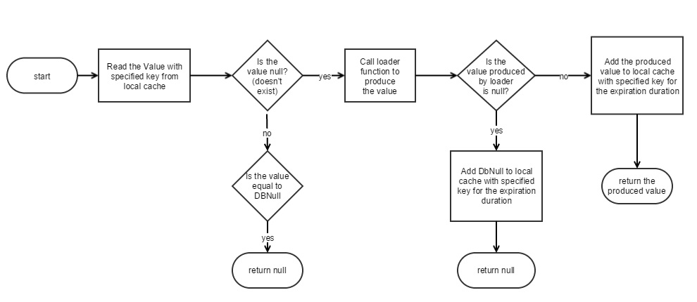

# LocalCache Static Class

[**namespace**: *Serenity*] - [**assembly**: *Serenity.Core*]

A static class that contains shortcuts to work easier with the registered ILocalCache provider.

```cs
public static class LocalCache
{
    public static void Add(string key, object value, TimeSpan expiration);
    public static TItem Get<TItem>(string key, TimeSpan expiration,
        Func<TItem> loader) where TItem : class;
    public static void Remove(string key);
    public static void RemoveAll();
}
```

Add, Remove, and RemoveAll methods are simply shortcuts to corresponding methods in ILocalCache interface, but Get method is a bit different than ILocalCache.Get.

## LocalCache.Get`<TItem>` Method

Gets the value corresponding to the specified key in local cache.

If there is no such key in cache, uses the loader function to produce value, and adds it to cache with the specified key.



* If the value that exists in cache is DBNull.Value, than null is returned. (This way, if for example a user with an ID doesn't exist in database, repeated querying of database for that ID is prevented)

* If the value exists, but of not type TItem an exception is thrown, otherwise value is returned.

* If the value didn't exist in cache, loader function is called to produce the value (e.g. from database) and...
	* If the value produced by loader function is null, it is stored as DBNull.Value in cache.
	* Otherwise the produced value is added to cache with the specified expiration duration.
