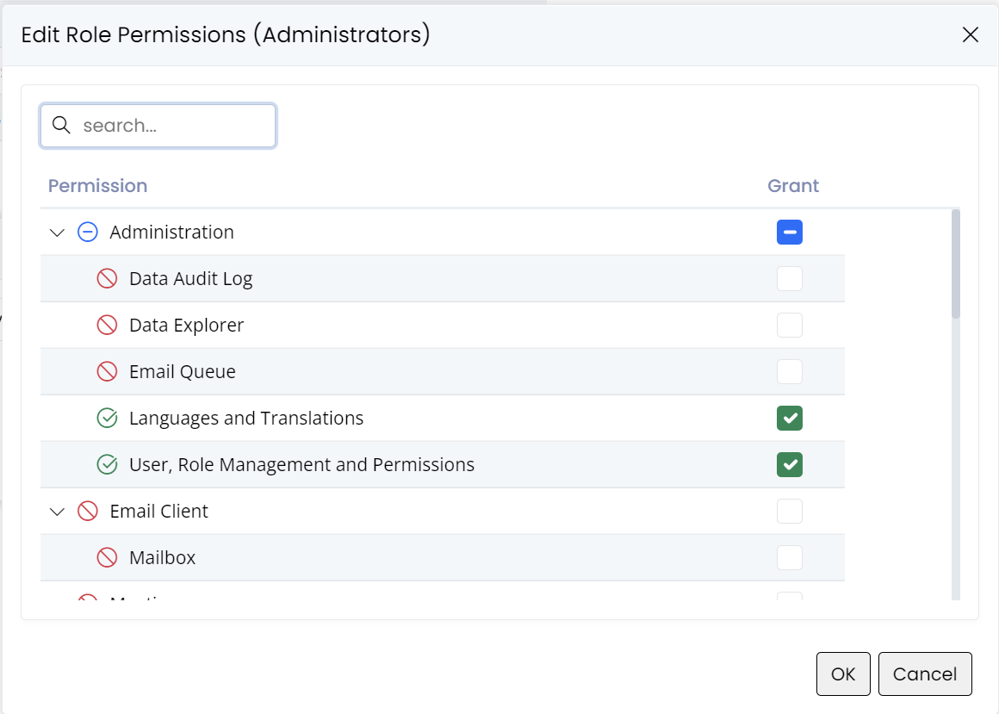
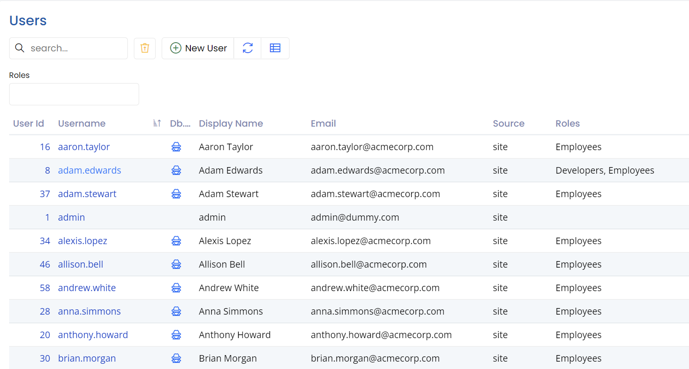
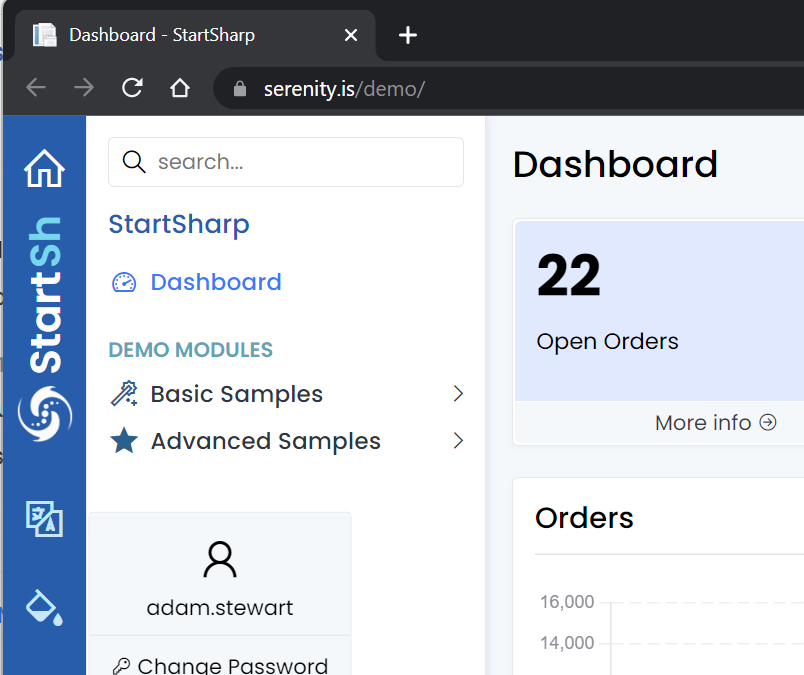

# Authentication &amp; Authorization

Serenity uses integrated authentication and authorization systems in the ASP.NET Core and provides some additional abstractions and helper classes to make it possible to:

- Work in environments other than web applications, 
- Free-form permission keys for fine-grained access to resources
- Declarative permissions for data manipulation and querying
- User impersonation
- Transiently granting permissions

See the following document for more information about ASP.NET Core security:

[ASP.NET Core Security Topics - Microsoft Docs](https://learn.microsoft.com/en-us/aspnet/core/security/?view=aspnetcore-7.0)

## IUserAccessor Interface

The current user in ASP.NET Core applications can be retrieved through `HttpContext.User` but accessing it directly would tie Serenity to web applications only. 

To abstract this, and make Serenity also useful for console, desktop, and other types of applications, we provide an [IUserAccessor](../api/dotnet/Serenity.Net.Core/Serenity.Abstractions/IUserAccessor.md) interface. 

The default implementation for this interface uses HttpContext.User in web applications but can be implemented differently for other kinds of applications/tests.

## IPermissionService and IUserRetrieveService Abstractions

We also provide the following abstractions for permission checking (authorization) and user detail retrieval.

* [IPermissionService](../api/dotnet/Serenity.Net.Core/Serenity.Abstractions/IPermissionService.md)
* [IUserRetrieveService](../api/dotnet/Serenity.Net.Core/Serenity.Abstractions/IUserRetrieveService.md)

As the framework itself doesn't have a default implementation for these abstractions, they should be provided in the application itself through dependency injection.

Serene / StartSharp applications have custom implementations and register them in `Startup.cs`:

```cs
services.AddSingleton<IUserRetrieveService, 
    Administration.UserRetrieveService>();
services.AddSingleton<IPermissionService,
    Administration.PermissionService>();
```

You may have a look at these sample implementations before trying to write your own.

## Permission Keys

Serenity has a fine-grained user access control system that is based on free-form permission keys that are assigned to resources like navigation, pages, and service calls.

Permissions can be assigned directly to users or indirectly through assigned roles which can also have a set of permissions.

These permissions can be granted to users directly, or indirectly via their role assignments.



In the screen above we see the textual representations of the permission keys we talk about, but internally they correspond to following free-form strings:

- `Administration:DataAuditLog`
- `Administration:DataExplorer`
- `Administration:EmailQueue`
- `Administration:Translation`
- `Administration:Security`

## Declarative Permission Attributes

Serenity has several permission attributes which declaratively determine the required permission key to perform particular actions:

- [DeletePermissionAttribute](../api/dotnet/Serenity.Net.Core/Serenity.Data/DeletePermissionAttribute.md)
- [ModifyPermissionAttribute](../api/dotnet/Serenity.Net.Core/Serenity.Data/ModifyPermissionAttribute.md)
- [NavigationPermissionAttribute](../api/dotnet/Serenity.Net.Core/Serenity.Data/NavigationPermissionAttribute.md)
- [ReadPermissionAttribute](../api/dotnet/Serenity.Net.Core/Serenity.Data/ReadPermissionAttribute.md)
- [ServiceLookupPermissionAttribute](../api/dotnet/Serenity.Net.Core/Serenity.Data/ServiceLookupPermissionAttribute.md)
- [UpdatePermissionAttribute](../api/dotnet/Serenity.Net.Core/Serenity.Data/UpdatePermissionAttribute.md)

These permission attributes are assigned to various resource types like entities:

```cs
    [ReadPermission("Administration:Security")]
    [ModifyPermission("Administration:Security")]
    [LookupScript(Permission = "Administration:Security")]
    public sealed class UserRow
    {
        // ...
    }
```

In the example above, the read, modify and lookup permissions for `User` entity is assigned as `Administration:Security`.

If, for example we wanted to assign different permissions for creating, updating and deleting a user:

```cs
    [ReadPermission("Administration:User:Read")]
    [InsertPermission("Administration:User:Insert")]
    [UpdatePermission("Administration:User:Update")]
    [InsertPermission("Administration:User:Delete")]
    [LookupScript(Permission = "Administration:Security")]
    public sealed class UserRow
    {
        // ...
    }
```

Having the ability for fine-grained permissions does not always mean you should use them. We don't recommend defining / assigning different permissions for every type of entity and every type of action as it would make managing and maintaining them very difficult. 

The usual rule of thumb is, don't introduce a new permission key unless there is an actual need for such fine grained control.

For example, in Serene we assigned the `Administration:Security` permission for both the `User` and `Role` entities and a number of other operations. Before assigning them individual permission keys, you should ask yourself if there is an actual business requirement for an administrator to `manage only Roles`, while another administrator to `manage only Users`. If yes, define separate permissions, if not wait until you actually need it.

This is the same for Insert/Update/Delete permissions. Do you really need an administrator to only create users, while another to only update them, while another admin to only delete them?

## Permission Key Definitions

Permission keys themselves are usually defined in a static class:

```cs
namespace Serene.Administration
{
    [NestedPermissionKeys]
    [DisplayName("Administration")]
    public class PermissionKeys
    {
        [Description("User, Role Management and Permissions")]
        public const string Security = "Administration:Security";

        [Description("Languages and Translations")]
        public const string Translation = "Administration:Translation";
    }
}
```

Even though this is not mandatory, it is common practice and is recommended to make it easier to access them via intellisense, determine their display names, and to avoid typing errors.

## Authorization Attributes for Actions

To make it easy to validate permissions we provide some attributes in addition to the built-in ASP.NET `[Authorize]` attribute.

* [PageAuthorizeAttribute](../api/dotnet/Serenity.Net.Web/Serenity.Web/PageAuthorizeAttribute.md)
* [ServiceAuthorizeAttribute](../api/dotnet/Serenity.Net.Web/Serenity.Services/ServiceAuthorizeAttribute.md)

They have overloads that accept a *permission key* parameter, which automatically validates the permission.

Difference between the two lies in the way they handle unauthenticated access attempts. While the `[PageAuthorize]` attribute throws an exception, `[ServiceAuthorize]` provides an AJAX call-friendly service error.

There are also specialized versions of the `ServiceAuthorize` attribute that reads the permission key from the target type (usually an entity/row type) by checking a set of permission attributes, using the first one the target type has:

- [AuthorizeCreateAttribute](../api/dotnet/Serenity.Net.Web/Serenity.Services/AuthorizeCreateAttribute.md): `Insert`, `Modify`, or `Read` permission attributes.
- [AuthorizeDeleteAttribute](../api/dotnet/Serenity.Net.Web/Serenity.Services/AuthorizeDeleteAttribute.md): `Delete`, `Modify`, or `Read` permission attributes.
- [AuthorizeListAttribute](../api/dotnet/Serenity.Net.Web/Serenity.Services/AuthorizeListAttribute.md): `Read` or `ServiceLookup` permission attributes. 
- [AuthorizeUpdateAttribute](../api/dotnet/Serenity.Net.Web/Serenity.Services/AuthorizeUpdateAttribute.md): `Update`, `Modify`, or `Read` permission attributes.

## Impersonation

[IImpersonator](../api/dotnet/Serenity.Net.Core/Serenity.Abstractions/IImpersonator.md) interface and its default implementation [ImpersonatingUserAccessor](../api/dotnet/Serenity.Net.Core/Serenity.Web/ImpersonatingUserAccessor.md) class provides an option to execute an action as if another user is currently logged in.

This can be useful to call a service that requires special permissions in the context of an admin or another privileged user, while a user with a more limited set of permissions is logged in.

`ImpersonatingUserAccessor` wraps any class implementing the `IUserAccessor` interface and adds impersonation ability to that. 

It is not registered by default, so to use this feature, you should register it in the Startup.cs:

```cs
services.AddSingleton<IHttpContextItemsAccessor, HttpContextItemsAccessor>();
services.AddSingleton<IUserAccessor>(services => 
    new ImpersonatingUserAccessor(
        ActivatorUtilities.CreateInstance<Administration.UserAccessor>(services), services.GetRequiredService<IHttpContextItemsAccessor>());
```

Then anywhere you need temporary impersonation, you should cast the `IUserAccessor` service to `IImpersonator`:

```cs
public class SomeHandler : IRequestHandler 
{
    private IUserAccessor userAccessor;

    public SomeHandler(IUserAccessor userAccessor)
    {
        this.userAccessor = userAccessor ?? 
            throw new ArgumentNullException(nameof(userAccessor));
    }

    public void SomeMethod()
    {
        var impersonator = (IImpersonator)userAccessor;

        // lets say current user is "test" here
        impersonator.Impersonate("admin");
        try 
        {
            // here current user is "admin"
            PerformSomeOperationAsAdmin();
        }
        finally
        {
            impersonator.UndoImpersonate();
        }
        // here current user becomes "test" again
    }
}
```

## Login As (also called impersonation)
StartSharp also provides an option to login as (e.g. impersonate) another user in the user administration page:



By default, only the super admin (e.g. `admin` user) can perform this action. 

You may right-click the spy icon next to a username, and use the `open in new incognito window` menu item. 



We don't allow opening in the same browser window, as this would effectively mean signing the current user out.

## Transiently Granting Permissions

Sometimes it would be better to temporarily (e.g. transiently) grant a user some permissions instead of impersonating as an admin. [ITransientGrantor](../api/dotnet/Serenity.Net.Core/Serenity.Abstractions/ITransientGrantor.md) interface and its default implementation [TransientGrantingPermissionService](../api/dotnet/Serenity.Net.Core/Serenity.Web/TransientGrantingPermissionService.md) can do just that.

Again, it is not activated by default and requires registration in `Startup.cs`:

```cs
services.AddSingleton<IHttpContextItemsAccessor, HttpContextItemsAccessor>();
services.AddSingleton<IPermissionService>(services => new   
    TransientGrantingPermissionService(
        ActivatorUtilities.CreateInstance<Administration.PermissionService>(services),
        services.GetRequiredService<IHttpContextItemsAccessor>()));
```

Then you can use it in a similar way to impersonation:

```cs
public class SomeHandler : IRequestHandler 
{
    private IPermissionService permissions;

    public SomeHandler(IPermissionService permissions)
    {
        this.permissions = permissions ?? 
            throw new ArgumentNullException(nameof(permissions));
    }

    public void SomeMethod()
    {
        var transientGrantor = (ITransientGrantor)permissions;

        transientGrantor.Grant("Administration:Security");
        try 
        {
            // here the current user temporarily has
            // "Administration:Security" permission
            PerformSomeOperationAsAdmin();
        }
        finally
        {
            transientGrantor.UndoGrant();
        }
        // here no longer
    }
}
```

Please note that granting a temporary permission is performed in memory and is not stored anywhere.