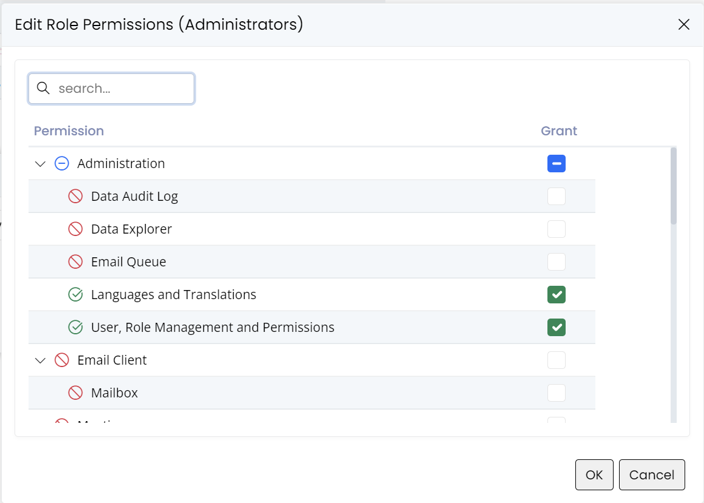
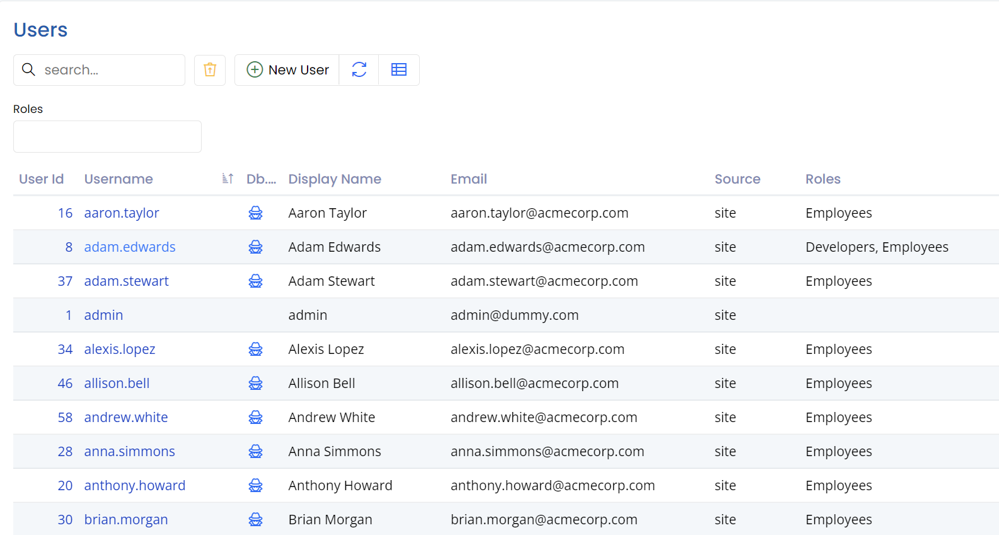
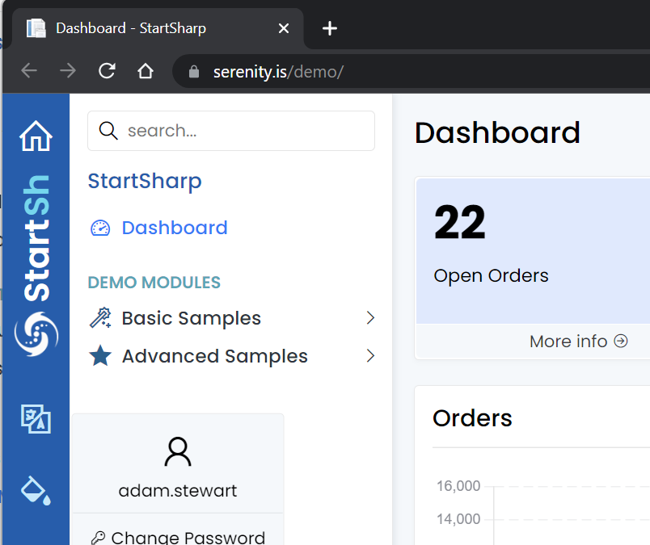

# Authentication &amp; Authorization

Serenity uses integrated authentication and authorization systems in the ASP.NET Core and provides some additional abstractions and helper classes to make it possible to:

- Work in environments other than web applications, 
- Free-form permission keys for fine-grained access to resources
- Declarative permissions for data manipulation and querying
- User impersonation
- Transiently granting permissions

See the following document for more information about ASP.NET Core security:

[ASP.NET Core Security Topics - Microsoft Docs](https://learn.microsoft.com/en-us/aspnet/core/security/?view=aspnetcore-10.0)

## IUserAccessor Interface

The current user in ASP.NET Core applications can be retrieved through `HttpContext.User` but accessing it directly would tie Serenity to web applications only. 

To abstract this, and make Serenity also useful for console, desktop, and other types of applications, we provide an [IUserAccessor](../api/dotnet/Serenity.Net.Core/Serenity.Abstractions/IUserAccessor.md) interface. 

The default implementation for this interface uses HttpContext.User in web applications but can be implemented differently for other kinds of applications/tests.

## Security Service Abstractions

Serenity provides abstractions for permission checking (authorization), user detail retrieval, password validation, claim creation, and permission key listing. They live in the `Serenity.Abstractions` namespace:

* [IUserAccessor](../api/dotnet/Serenity.Net.Core/Serenity.Abstractions/IUserAccessor.md) — access to the current user
* [IUserRetrieveService](../api/dotnet/Serenity.Net.Core/Serenity.Abstractions/IUserRetrieveService.md) — user detail retrieval by id or username
* [IUserClaimCreator](../api/dotnet/Serenity.Net.Core/Serenity.Abstractions/IUserClaimCreator.md) — creates a `ClaimsPrincipal` for a user
* [IUserPasswordValidator](../api/dotnet/Serenity.Net.Core/Serenity.Abstractions/IUserPasswordValidator.md) — validates usernames / passwords
* [IPermissionService](../api/dotnet/Serenity.Net.Core/Serenity.Abstractions/IPermissionService.md) — permission checking
* [IPermissionKeyLister](../api/dotnet/Serenity.Net.Core/Serenity.Abstractions/IPermissionKeyLister.md) — lists permission keys (used by the permission editor UI)
* [IRolePermissionService](../api/dotnet/Serenity.Net.Core/Serenity.Abstractions/IRolePermissionService.md) — role permission queries
* [IUserProvider](../api/dotnet/Serenity.Net.Core/Serenity.Abstractions/IUserProvider.md) — a combination of `IUserAccessor`, `IUserRetrieveService`, `IUserClaimCreator`, `IImpersonator`, `IRemoveCachedUser` and `IRemoveAll`

The `Serenity.Extensions` package provides base implementations for most of these, which handle the common logic so your application only needs a small subclass:

* `BaseUserRetrieveService<TRow>` — user retrieval from a `Users` table
* `BasePermissionService<TUserPermissionRow, TUserRoleRow>` — permission checking against user/role permission tables, including `ITransientGrantor` support
* `BaseRolePermissionService<TRolePermissionRow>` — role permission storage
* `BasePermissionKeyLister` — permission key listing from `[NestedPermissionKeys]` classes

Serene / StartSharp applications put their (thin) implementations of these in the `Modules/Common/AppServices` folder, under the `{ProjectName}.AppServices` namespace, and register them in `Startup.cs`:

```cs
services.AddSingleton<IPermissionService, AppServices.PermissionService>();
services.AddSingleton<IPermissionKeyLister, AppServices.PermissionKeyLister>();
services.AddSingleton<IRolePermissionService, AppServices.RolePermissionService>();
services.AddSingleton<IUserPasswordValidator, AppServices.UserPasswordValidator>();
services.AddUserProvider<AppServices.UserAccessor, AppServices.UserRetrieveService>();
```

`AddUserProvider` registers the `IUserAccessor` / `IUserRetrieveService` implementations you specify, tries to register a default `IUserClaimCreator` (`DefaultUserClaimCreator`), and registers the combination `IUserProvider` service.

You may have a look at these sample implementations before trying to write your own.

### IUserRetrieveService and UserDefinition

`IUserRetrieveService` is used to fetch a user's definition by their ID or username. Its interface is small:

```cs
public interface IUserRetrieveService
{
    IUserDefinition? ById(string id);
    IUserDefinition? ByUsername(string username);
}
```

It is implemented in `Serenity.Extensions` by `BaseUserRetrieveService<TRow>`, which loads the user row from the `Users` table. The application's `UserRetrieveService` (in `Modules/Common/AppServices/UserRetrieveService.cs`, namespace `{ProjectName}.AppServices`) only needs to tell the base class how to convert a user row into a user definition:

```cs
public class UserRetrieveService(ITwoLevelCache cache, ISqlConnections sqlConnections)
    : BaseUserRetrieveService<MyRow>(cache, sqlConnections)
{
    protected override IUserDefinition ToUserDefinition(MyRow user)
    {
        return new UserDefinition
        {
            UserId = user.UserId.Value,
            Username = user.Username,
            Email = user.Email,
            UserImage = user.UserImage,
            DisplayName = user.DisplayName,
            IsActive = user.IsActive.Value,
            Source = user.Source,
            PasswordHash = user.PasswordHash,
            PasswordSalt = user.PasswordSalt,
            UpdateDate = user.UpdateDate,
            LastDirectoryUpdate = user.LastDirectoryUpdate
        };
    }
}
```

#### UserDefinition

The object returned by the retrieve service implements the [IUserDefinition](../api/dotnet/Serenity.Net.Core/Serenity/IUserDefinition.md) abstraction:

```cs
public interface IUserDefinition
{
    string Id { get; }
    string Username { get; }
    string DisplayName { get; }
    string Email { get; }
    short IsActive { get; }
}
```

The template's `UserDefinition` class (in `Modules/Common/AppServices/Models/UserDefinition.cs`) implements `IUserDefinition` and `IHasPassword`, and adds app-specific members like `UserId`, `UserImage`, `PasswordHash`, `PasswordSalt`, `Source`, `UpdateDate`, `LastDirectoryUpdate`, and `HasPassword`.

#### Caching Behavior

`BaseUserRetrieveService<TRow>` caches user definitions in the local (two-level) cache:

- Lookups are cached under `UserByID_<id>` and `UserByName_<lowercase username>` keys.
- By default there is no expiry; entries stay cached until their cache group is invalidated.
- The cache group key comes from the user row's `GenerationKey`, so cached users are cleared whenever the `Users` table generation changes.
- The base class also implements `IRemoveCachedUser` (removes a single cached user) and `IRemoveAll` (clears the whole user cache group), which Serenity calls after user records are modified.

### IUserProvider

`IUserProvider` is a combination interface that merges the user-related abstractions into one:

```cs
public interface IUserProvider : IUserAccessor, IUserRetrieveService, IUserClaimCreator,
    IImpersonator, IRemoveCachedUser, IRemoveAll
{
}
```

Its default implementation, `DefaultUserProvider`, delegates to the `IUserAccessor`, `IUserRetrieveService`, and `IUserClaimCreator` services registered in the container, and is registered by `AddUserProvider`.

The main advantage is convenience: instead of injecting all those interfaces one by one into every class that needs the current user, user lookup, claim creation, or impersonation, you inject a single `IUserProvider`:

```cs
public class SomeService(IUserProvider users)
{
    public void DoSomething()
    {
        var current = users.User;                              // IUserAccessor
        var admin = users.ByUsername("admin");                 // IUserRetrieveService
        var principal = users.CreatePrincipal("admin", "Test"); // IUserClaimCreator
        users.Impersonate(principal);                          // IImpersonator
        users.RemoveCachedUser(id, username);                  // IRemoveCachedUser
    }
}
```

> Note: `DefaultUserProvider` implements `IImpersonator`, but its impersonation methods throw if the underlying `IUserAccessor` does not implement `IImpersonator`. The template's `UserAccessor` does, so impersonation works out of the box.

## Permission Keys

Serenity has a fine-grained user access control system that is based on free-form permission keys that are assigned to resources like navigation, pages, and service calls.

Permissions can be assigned directly to users or indirectly through assigned roles which can also have a set of permissions.

These permissions can be granted to users directly, or indirectly via their role assignments.



In the screen above we see the textual representations of the permission keys we talk about, but internally they correspond to the following free-form strings:

- `"Administration:DataAuditLog"`
- `"Administration:DataExplorer"`
- `"Administration:EmailQueue"`
- `"Administration:Translation"`
- `"Administration:Security"`

## Declarative Permission Attributes

Serenity has several permission attributes which declaratively determine the required permission key to perform particular actions:

- [DeletePermissionAttribute](../api/dotnet/Serenity.Net.Core/Serenity.Data/DeletePermissionAttribute.md)
- [ModifyPermissionAttribute](../api/dotnet/Serenity.Net.Core/Serenity.Data/ModifyPermissionAttribute.md)
- [NavigationPermissionAttribute](../api/dotnet/Serenity.Net.Core/Serenity.Data/NavigationPermissionAttribute.md)
- [ReadPermissionAttribute](../api/dotnet/Serenity.Net.Core/Serenity.Data/ReadPermissionAttribute.md)
- [ServiceLookupPermissionAttribute](../api/dotnet/Serenity.Net.Core/Serenity.Data/ServiceLookupPermissionAttribute.md)
- [UpdatePermissionAttribute](../api/dotnet/Serenity.Net.Core/Serenity.Data/UpdatePermissionAttribute.md)

These permission attributes are assigned to various resource types like entities:

```cs
    [ReadPermission("Administration:Security")]
    [ModifyPermission("Administration:Security")]
    [LookupScript(Permission = "Administration:Security")]
    public sealed class UserRow
    {
        // ...
    }
```

In the example above, the read, modify, and lookup permissions for the `User` entity are assigned as "`Administration:Security`".

If, for example, we wanted to assign different permissions for creating, updating, and deleting a user:

```cs
    [ReadPermission("Administration:User:Read")]
    [InsertPermission("Administration:User:Insert")]
    [UpdatePermission("Administration:User:Update")]
    [InsertPermission("Administration:User:Delete")]
    [LookupScript(Permission = "Administration:Security")]
    public sealed class UserRow
    {
        // ...
    }
```

Having the ability for fine-grained permissions does not always mean you should use them. We don't recommend defining/assigning different permissions for every type of entity and every type of action as it would make managing and maintaining them very difficult. 

The usual rule of thumb is, don't introduce a new permission key unless there is an actual need for such fine-grained control.

For example, in Serene, we assigned the `"Administration:Security"` permission for both the `User` and `Role` entities and several other operations. Before assigning them individual permission keys, you should ask yourself if there is an actual business requirement for an administrator to `manage only Roles`, while another administrator `manages only Users`. If yes, define separate permissions, if not wait until you need it.

This is the same for Insert/Update/Delete permissions. Do you need an administrator to only create users, another to only update them, and another admin to only delete them?

## Permission Key Definitions

Permission keys themselves are usually defined in a static class:

```cs
namespace Serene.Administration
{
    [NestedPermissionKeys]
    [DisplayName("Administration")]
    public class PermissionKeys
    {
        [Description("User, Role Management and Permissions")]
        public const string Security = "Administration:Security";

        [Description("Languages and Translations")]
        public const string Translation = "Administration:Translation";
    }
}
```

Even though this is not mandatory, it is common practice and is recommended to make it easier to access them via intelli-sense, determine their display names, and avoid typing errors.

## Authorization Attributes for Actions

To make it easy to validate permissions we provide some attributes in addition to the built-in ASP.NET `[Authorize]` attribute.

* [PageAuthorizeAttribute](../api/dotnet/Serenity.Net.Web/Serenity.Web/PageAuthorizeAttribute.md)
* [ServiceAuthorizeAttribute](../api/dotnet/Serenity.Net.Web/Serenity.Services/ServiceAuthorizeAttribute.md)

They have overloads that accept a *permission key* parameter, which automatically validates the permission.

Difference between the two lies in the way they handle unauthenticated access attempts. While the `[PageAuthorize]` attribute throws an exception, `[ServiceAuthorize]` provides an AJAX call-friendly service error.

There are also specialized versions of the `ServiceAuthorize` attribute that reads the permission key from the target type (usually an entity/row type) by checking a set of permission attributes, using the first one the target type has:

- [AuthorizeCreateAttribute](../api/dotnet/Serenity.Net.Web/Serenity.Services/AuthorizeCreateAttribute.md): `Insert`, `Modify`, or `Read` permission attributes.
- [AuthorizeDeleteAttribute](../api/dotnet/Serenity.Net.Web/Serenity.Services/AuthorizeDeleteAttribute.md): `Delete`, `Modify`, or `Read` permission attributes.
- [AuthorizeListAttribute](../api/dotnet/Serenity.Net.Web/Serenity.Services/AuthorizeListAttribute.md): `Read` or `ServiceLookup` permission attributes. 
- [AuthorizeUpdateAttribute](../api/dotnet/Serenity.Net.Web/Serenity.Services/AuthorizeUpdateAttribute.md): `Update`, `Modify`, or `Read` permission attributes.

## Impersonation

- The [`IImpersonator`](../api/dotnet/Serenity.Net.Core/Serenity.Abstractions/IImpersonator.md) interface and its default implementation [ImpersonatingUserAccessor](../api/dotnet/Serenity.Net.Core/Serenity.Web/ImpersonatingUserAccessor.md) class provide an option to execute an action as if another user is currently logged in.

This can be useful to call a service that requires special permissions in the context of an admin or another privileged user, while a user with a more limited set of permissions is logged in.

`ImpersonatingUserAccessor` wraps any class implementing the `IUserAccessor` interface and adds an impersonation ability to that. 

The template's `AppServices.UserAccessor` (in `Modules/Common/AppServices/UserAccessor.cs`, namespace `{ProjectName}.AppServices`) implements both `IUserAccessor` and `IImpersonator` out of the box, so no wrapping registration is required.

Then anywhere you need temporary impersonation, you should cast the `IUserAccessor` service to `IImpersonator`:

```cs
public class SomeHandler : IRequestHandler 
{
    private IUserAccessor userAccessor;

    public SomeHandler(IUserAccessor userAccessor)
    {
        this.userAccessor = userAccessor ?? 
            throw new ArgumentNullException(nameof(userAccessor));
    }

    public void SomeMethod()
    {
        var impersonator = (IImpersonator)userAccessor;

        // lets say current user is "test" here
        impersonator.Impersonate("admin");
        try 
        {
            // here current user is "admin"
            PerformSomeOperationAsAdmin();
        }
        finally
        {
            impersonator.UndoImpersonate();
        }
        // here current user becomes "test" again
    }
}
```

## Login As (also called impersonation)
StartSharp also provides an option to log in as (e.g. impersonate) another user on the user administration page:



By default, only the super admin (e.g. `admin` user) can perform this action. 

You may right-click the spy icon next to a username, and use the `open-in new incognito window` menu item. 



We don't allow opening in the same browser window, as this would effectively mean signing the current user out.

## Transiently Granting Permissions

Sometimes it would be better to temporarily (e.g. transiently) grant a user some permissions instead of impersonating an admin. [ITransientGrantor](../api/dotnet/Serenity.Net.Core/Serenity.Abstractions/ITransientGrantor.md) interface and its default implementation [TransientGrantingPermissionService](../api/dotnet/Serenity.Net.Core/Serenity.Web/TransientGrantingPermissionService.md) can do just that.

The template's `AppServices.PermissionService` (in `Modules/Common/AppServices/PermissionService.cs`) already has built-in transient-grant support: it derives from `BasePermissionService`, which implements `IPermissionService` and `ITransientGrantor`. No wrapping registration is required.

Then you can use it in a similar way to impersonation:

```cs
public class SomeHandler : IRequestHandler 
{
    private IPermissionService permissions;

    public SomeHandler(IPermissionService permissions)
    {
        this.permissions = permissions ?? 
            throw new ArgumentNullException(nameof(permissions));
    }

    public void SomeMethod()
    {
        var transientGrantor = (ITransientGrantor)permissions;

        transientGrantor.Grant("Administration:Security");
        try 
        {
            // here the current user temporarily has
            // "Administration:Security" permission
            PerformSomeOperationAsAdmin();
        }
        finally
        {
            transientGrantor.UndoGrant();
        }
        // here no longer
    }
}
```

Please note that granting temporary permission is performed in memory and is not stored anywhere.