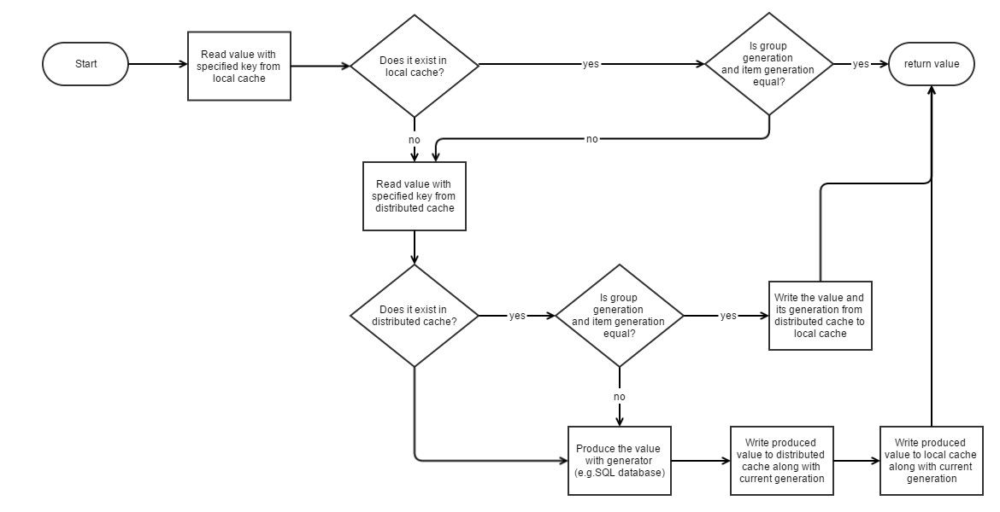

# Caching

Caching is an important part of modern, heavy-traffic applications. Even if your web application isn't getting so much traffic now, it might later and it is a good idea to design it with caching in mind from the start.

.NET provides mechanisms for local, in-memory caching (MemoryCache), and distributed caching (IDistributedCache) for storing cached items in a remote shared server like Redis, NCache, etc:

- [Caching in .NET - Microsoft Docs](https://learn.microsoft.com/en-us/dotnet/core/extensions/caching)

Serenity builds upon .NET caching mechanisms and provides some utility functions to make it easier to work with local and distributed caches.

The term *local* means that cached items are held in local memory (thus there is no serialization involved).

When your application is deployed on a web farm, local caching might not be enough or sometimes suitable as the in-memory cached items are not shared between multiple servers. This is where distributed caching comes into play.

## MemoryCacheExtensions Class

The static [MemoryCacheExtensions](../api/dotnet/Serenity.Net.Core/Serenity/MemoryCacheExtensions.md) class contains several extension methods to make it easier to work with the `MemoryCache`.

The [`Get<Item>`](../api/dotnet/Serenity.Net.Core/Serenity/MemoryCacheExtensions/Get.md) extension provides the ability to get an existing cached item or initialize it via a factory function if it does not exist. It also allows you to specify how long the item should be kept in the cache, e.g. its expiration.

```cs
memoryCache.Get<MyCachedItemType>("SomeUniqueCacheKey", TimeSpan.FromMinutes(5),
    () => { // this is the factory or loader function
        var item  = new MyCachedItemType();
        // populate item from database etc.
        return item;
    });
```

Here is the flow diagram for our `Get` extension method:


There is a similar `GetOrCreate` method in .NET `CacheExtensions` but it does not allow you to specify the expiration and it does not cache a `not found` result with a special `DBNull` value.

## User Profile Caching Sample

Let's assume we have a profile page on our site that is generated using several queries. We might have a model for this page e.g. UserProfile class that contains all profile data for a user, and a GetProfile method that produces this for a particular user id.

```cs
public class UserProfile
{
	public string Name { get; set; }
	public List<CachedFriend> Friends { get; set; }
	public List<CachedAlbum> Albums { get; set; }
	...
}
```

```cs
public UserProfile GetProfile(int userID)
{
	using (var connection = new SqlConnection("..."))
	{
        // load profile by userID from DB
    }
}
```

By making use of the LocalCacheExtensions.Get method, we could cache this information for one hour easily and avoid DB calls every time this information is needed.

```cs
public UserProfile GetProfile(int userID)
{
	return localCache.Get<UserProfile>(
		cacheKey: "UserProfile:" + userID,
		expiration: TimeSpan.FromHours(1),
		loader: delegate {
			using (var connection = new SqlConnection("..."))
			{
				// load profile by userID from DB
			}
		}
	);
}
```

## WEB Farms and Caching

Let's consider we have a social networking site and millions of user profiles. Profile pages of some famous users might be getting hundreds or thousands of visits per minute.

To generate a user profile, we would need more than one SQL query (friends, album names and picture counts, profile information, last status, etc.).

As long as a user didn't update her profile, the information that is shown on her page would be almost static. Thus, a snapshot of profile pages could be cached for 5 minutes or 1 hour, etc.

But this might not be enough. We are talking about hundreds of millions of profiles and users. Users would be doing much more than just looking at some profile pages. We would need more than one server that is distributed in several geographical locations on earth (a WEB Farm).

At a certain time, all these servers might have cached a very important person's (VIP) profile in the local cache. When the VIP makes a change in her profile, all these servers should renew their local cached profile, and this would happen in a few seconds. We now have a problem with load per server instead of load per user.

Once one of these servers loaded the VIP profile from the SQL database and cached it, other servers could make use of the same information without hitting the database. But, as each server stores cached information in its local memory, it is not trivial to access this information by other servers.

If we had a shared memory that all servers could access:

Information key          |Value
-------------------------|--------------------------------------
Profile:VeryFamousOne    |(Cached information for VeryFamousOne)
Profile:SomeAnother      |...
...                      |...
...                      |...
Profile:JohnDoe          |...

Let's call this memory the distributed cache. If all servers have a look at this common memory before trying DB we would avoid the load-per-server problem.

You can find many variations of distributed cache systems including Memcached, and Redis. They are also called `NoSQL` databases. You can think of them simply as a remote dictionary. They store key/value pairs in their memory and let you access them as fast as possible.

Warning! When it is used properly, the distributed cache can improve the performance of your application, just like the local cache. Otherwise, it can have a worse effect than local cache as there is a network transfer and serialization cost involved. Thus "if we keep things in distributed cache our site will run faster" is a myth.

When the cached data becomes too much, one computer's memory might be not enough to store all key/value pairs. In this case servers like Redis distribute data by clustering. This could be done by the first letter of the keys. One server could hold pairs starting with A, the others with B, etc. They generally use the hash of keys for this purpose.

## DistributedCacheExtensions Class

Similar to `MemoryCacheExtensions`, the [DistributedCacheExtensions](../api/dotnet/Serenity.Net.Core/Serenity/DistributedCacheExtensions.md) contains several extension methods to make it easier to work with `IDistributedCache` and use JSON serialization for types other than `String` and `byte[]`.

[SetAutoJson](../api/dotnet/Serenity.Net.Core/Serenity/DistributedCacheExtensions/SetAutoJson.md) generic method allows setting an item in the cache with a `string` or `byte[]` values, or JSON serializes it for any other type.

```cs
distributedCache.SetAutoJson("SomeByteArray", new byte[] { 1, 3, 5, });
distributedCache.SetAutoJson("SomeString", "SomeString");

distributedCache.SetAutoJson("SomeKey", new MyObject { ... });
distributedCache.SetAutoJson("AnotherKey", new MyObject { ... }, TimeSpan.FromMinutes(5));
```

The [GetAutoJson](../api/dotnet/Serenity.Net.Core/Serenity/DistributedCacheExtensions/GetAutoJson.md) generic method does the opposite of what `SetAutoJson` does. It JSON deserializes any type other than `string` or `byte[]`.

```cs
var byteArray = distributedCache.GetAutoJson<byte[]>("SomeKey");
var str = distributedCache.GetAutoJson<string>("SomeKey");
var myObj = distributedCache.GetAutoJson<MyObject>("SomeKey");
```

Serenity does not provide any custom `IDistributedCache` implementations. Serene and StartSharp use the `DistributedMemoryCache` as the default. 

The default implementations for `IMemoryCache` and `IDistributedCache` are registered in `Startup.cs` via the `AddServiceHandlers` call in the `Startup.cs` file which in turn calls the `AddCaching` extension method of [CoreServiceCollectionExtensions](../api/dotnet/Serenity.Net.Core/Serenity.Extensions.DependencyInjection/CoreServiceCollectionExtensions.md)

You may see the [.NET Caching](https://learn.microsoft.com/en-us/dotnet/core/extensions/caching) document for directions on enabling other distributed cache servers, like Redis or SQL Server. Just make sure you register the custom `IDistributedCache` implementation before the `AddServiceHandlers` or `AddCaching` calls in the `Startup.cs` file.

## Two Level Caching

When you use local (in-memory) caching, one server can cache some information and retrieve it as fast as possible but as other servers can't access that cached data, they have to query for the same information from the database.

If you prefer distributed caching to let other servers access cached data as it has some serialization/deserialization and network latency overhead, it may degrade performance in some cases.

There is also another problem with caching that needs to be handled: cache invalidation:

> There are only two hard things in Computer Science: cache invalidation and naming things.

> -- Phil Karlton

When you cache some information, you have to make sure that, when the source data changes, the cached information is invalidated (regenerated or removed from the cache).

## Using Local Cache and Distributed Cache in Sync

We might enjoy the best of both worlds by following a simple algorithm:

1. Check for a key in the local cache.
2. If the key exists in the local cache return its value.
3. If the key doesn't exist in the local cache, try distributed cache.
4. If the key exists in distributed cache return its value and add it to the local cache too.
5. If the key doesn't exist in the distributed cache, produce it from the database, and add it to both the local cache and distributed cache. Return the produced value.

This way, when a server caches some information in the local cache, it also caches it in the distributed cache, but this time other servers can re-use information in the distributed cache if they don't have a local copy in memory.

Once all servers have a local copy, none of them will need to access distributed cache again, thus, avoiding serialization and latency overhead.

## Validating Local Copies

All looks fine. But now we have a cache invalidation problem. What if in one of the servers cached data is changed? How do we notify them of this change, so that they can invalidate their *locally cached copy*?

We would change the value in the distributed cache, but as they don't check distributed cache anymore (shortcut from step 2 in the last algorithm), they wouldn't be noticed.

One solution to this problem would be to keep local copies for a certain time, e.g. 5 secs. Thus, when a server changes the cached data, other servers would use out-of-date information for 5 seconds mostly.

This method would help with batch operations that need the same cached information repeatedly. But even if nothing changed in the distributed cache, we would have to get a copy from distributed cache to the local cache every 5 seconds. If cached data is big, this would increase network bandwidth usage and deserialization cost.

We need a way to know if the data in the distributed cache is different from the local copy. There are several ways of it that I can imagine:

- Store hash alongside data in the local and distributed cache (slight hash calculation cost)
- Store an incrementing version number of data (how to make sure that two servers do not generate the same version numbers?)
- Store last time data is set in distributed cache (time sync problems)
- Store a random number (generation) alongside the data

Serenity uses generation numbers (random int) as the version.

So when we store a value in the distributed cache, let's say *SomeCachedKey*, we also store a random number with key *SomeCachedKey$GENERATION$*.

Now our prior algorithm becomes this:

1. Check for a key in the local cache.
2. If the key exists in the local cache
    - Compare its generation with one in distributed cache
    - If they are equal, return the locally cached value
    - If they don't match, continue to 4
3. If the key doesn't exist in the local cache, try distributed cache.
4. If the key exists in distributed cache return its value and add it to the local cache too, alongside its generation.
5. If the key doesn't exist in the distributed cache, generate it from the database, and add it to both the local cache and distributed cache with some random generation. Return the produced value.

## Validating Multiple Cached Items In One Shot

You might have cached data produced from some table. There might be more than one key in distributed cache for this table.

Let's say you have a profile table and cached profile items by their User ID values.

When a user's profile information changes, you may try to remove its cached profile from the cache. But what if another server or application you don't know about, cached some information that is generated from the same user profile data? You may not know what cached information keys exist in the distributed cache that depends on some user ID.

Most distributed cache implementations don't provide a way to find all keys that start with some string or it is computationally intensive (as they are dictionary-based).

So when you want to expire all items depending on some set of data, it might not be feasible.

While caching items, Serenity allows you to specify a group key, which is used to expire them, when the data that the group depends on changes.

Let's say one application produced *CachedItem17* from a user with ID 17's profile data and we use this ID as a group key (Group17_Generation):

Key                     |Value
------------------------|-----
CachedItem17            |cxyzyxzcasd
CachedItem17_Generation |13579
Group17_Generation      |13579

Here, the random generation (version) for the group is 13579. Along with cached data (CachedItem17), we stored whatever was the group generation when we produced this data (CachedItem17_Generation).

Suppose that another server, cached AnotherItem17 from User 17's data:

Key                     |Value
------------------------|-----
CachedItem17            |cxyzyxzcasd
CachedItem17_Generation |13579
AnotherItem17           |uwsdasdas
AnotherItem17_Generation|13579
Group17_Generation      |13579

Here, we reused Group17_Generation, as there was already a group version number in the distributed cache otherwise we would have to generate a new one.

Now, both items in the cache (CachedItem17 and AnotherItem17) are valid, because their version numbers match the group version.

If somebody changed User 17's data and we wanted to expire all cached items related to her, we need to just change the group generation:

Key                     |Value
------------------------|-----
CachedItem17            |cxyzyxzcasd
CachedItem17_Generation |13579
AnotherItem17           |uwsdasdas
AnotherItem17_Generation|13579
Group17_Generation      |54237

Now all cached items are expired. Even though they exist in the cache, we see that their generations don't match the group generation, so they are not considered valid.

> Group keys we use are usually name of the table that data is produced from.

## ITwoLevelCache Interface

As you might have noticed, we need to use memory and distributed caches together. 

The [ITwoLevelCache](../api/dotnet/Serenity.Net.Core/Serenity.Abstractions/ITwoLevelCache.md) interface is a combination of a memory cache and distributed cache:

```cs
public interface ITwoLevelCache
{
    IMemoryCache Memory { get; }
    IDistributedCache Distributed { get; }
}
```

## TwoLevelCacheExtensions Class

The static [TwoLevelCacheExtensions](../api/dotnet/Serenity.Net.Core/Serenity/TwoLevelCacheExtensions.md) class contains extension methods that operate on `ITwoLevelCache` instances and implement what we talked about so far, e.g. synchronization between them and cache invalidation.

### TwoLevelCacheExtenison.Get Method

- Tries to read a value from the local cache. If it is not found in there (or has an expired version), it tries the distributed cache.

- If neither contains the specified key, produces value by calling a loader function and adds the value to the local and distributed cache for a given expiration time.

- There are two overloads of the Get method. One that takes expiration time for local and distributed caches separately, and another that has only one expiration parameter for both.

- By using a group key, all items on both cache types that are members of this group can be expired at once (this is generation-based expiration, not time).

> To avoid checking group generation every time an item that belongs to group is requested, group generation itself is also cached in local cache. Thus, when a generation number changes, local cached items might expire after 5 seconds.

> This means that, if you use this strategy in a web farm setup, when a change occurs in one server, other servers might continue to use old local cached data for 5 seconds more.

> If this is a problem for your configuration, you should use DistributedCache methods directly instead of depending on TwoLevelCache.



```cs
CachedProfile GetCachedProfile(int userID)
{
    twoLevelCache.Get("CachedProfile:" + userID, TimeSpan.FromDays(1), "SomeGroupKey",
        () =>
        {
            using (var connection = new SqlConnection("..."))
            {
                connection.Open();
                return LoadProfileFromDB(connection, userID);
            }
        });
}

CachedProfile LoadProfileFromDB(IDbConnection connection, int userID)
{
    // ...
}
```

## TwoLevelCache.GetLocalStoreOnly Method

If you only want to store items in the local cache and not distributed cache, GetLocalStoreOnly can be useful.

When cached data by one server is not helpful for others (changes from server to server), so big or slow to serialize/deserialize, storing such data in the distributed cache is not meaningful.

So, why shouldn't you use LocalCache directly in this case?

You could but not if you want to specify a group key, and expire local cached items easily when the source data of that group changes (as if they are stored in the distributed cache).

## TwoLevelCache.ExpireGroupItems Method

This method allows you to expire all items that are members of one group key. It simply removes the group key from the local cache and distributed cache, so another version will be generated the next time it is queried.

```cs
twoLevelCache.ExpireGroupItems("SomeGroupKey");
```

You should call this from methods that change data.

> *Create, Update, Delete and Undelete* handlers do this automatically with *ConnectionKey.TableName* as the group key.

## TwoLevelCache.Remove Method

Removes an item and its version from local and distributed cache.

