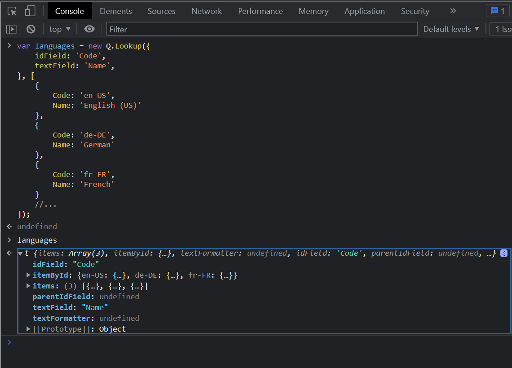
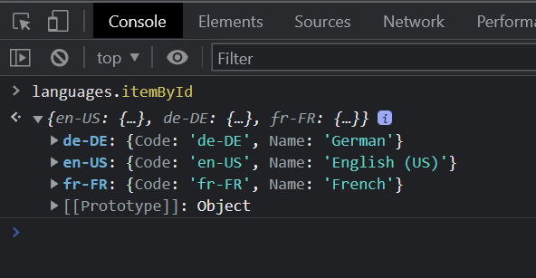
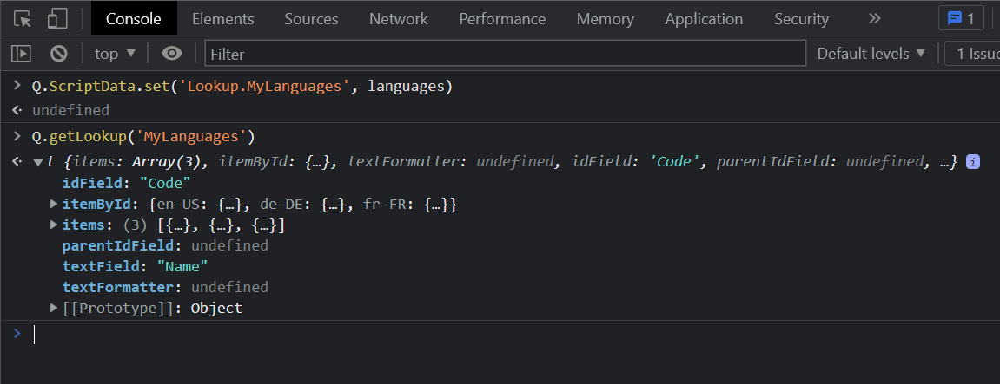
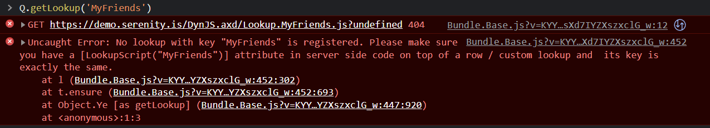
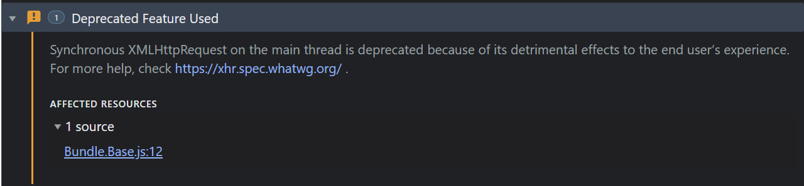
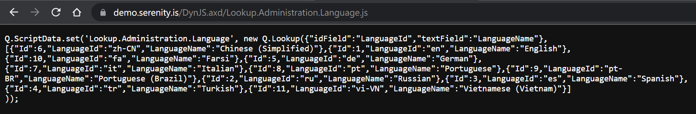
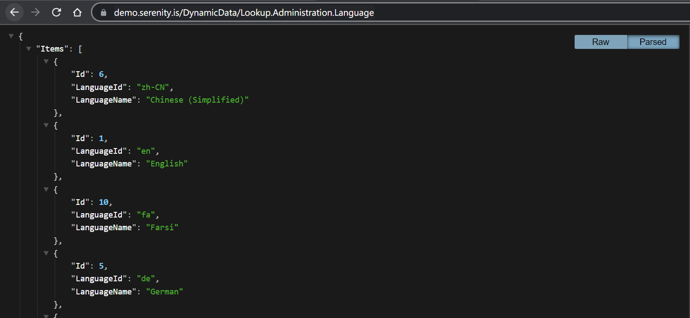

# Lookup Scripts

In computer science, a lookup table (LUT) is an array that replaces runtime computation with a simpler array indexing operation.

Lookups in Serenity are an array of objects, e.g. an in-memory table, sorted by default in a natural order like the `Name` column, suitable for display in a dropdown, in addition to the ability to access a particular item quickly via its `ID` property. Some people might call them `"reference tables"`.

## Q.Lookup Class

Before explaining what a `Lookup Script` is, we should first look at the `Lookup` TypeScript class in the `@serenity-is/corelib` package:

```ts
class Lookup<TItem> {
    constructor(options: LookupOptions<TItem>, items?: TItem[]);
    items: TItem[];
    itemById: { [key: string]: TItem; };
    idField: string;
    textField: string;
    //...
}

interface LookupOptions<TItem> {
    idField?: string;
    textField?: string;
    //..
}
```

It has a constructor accepting an options object with information about the `"idField"` (e.g. ID property), `"textField"` (e.g. the Name property), and an array of objects.

Let's create a lookup object for a set of languages.

```ts
var languages = new Q.Lookup({
    idField: 'Code',
    textField: 'Name',
}, [
    {
        Code: 'en-US',
        Name: 'English (US)'
    },
    {
        Code: 'de-DE',
        Name: 'German'
    },
    {
        Code: 'fr-FR',
        Name: 'French'
    }
    //...
]);
```

You may try the code above at https://demo.serenity.is in a developer console.



As seen above, the Lookup instance is an object with `idField` and `textField` fields that return the property names we passed to the constructor via options and an `items` field that returns the array passed via the second argument.

There is also an additional property named `itemById`, which is a dictionary of the items by their `"idField"` values:



As this is a dictionary, it should be obvious that the values in the ID (`Code`) properties of items are expected to be unique.

If we populated an ordinary `SELECT` element's options via this lookup, it would look like this:

```html
<select>
    <option value="en-US">English (US)</option>
    <option value="de-DE">German</option>
    <option value="fr-FR">French</option>
</select>
```

The `Lookup` class was originally designed to populate dropdown items; while providing some additional features like accessing an item by its ID, being able to read properties of the items other than the ID and Text, and providing a way to raise notifications when the source data changes so that the dropdowns which reference the lookup can update their options.

## Q.ScriptData Registry

`Q.ScriptData` is a central registry for named data objects like lookups. You may think of it as a version of the `IDynamicScriptManager` that works client-side.

Let's register our language lookup with a custom key:




`Q.ScriptData.set` method registers an object with the specified key which is passed as `Lookup.MyLanguages` in the sample above.

`"Lookup."` is the standard prefix for lookup objects in the `ScriptData` registry.

The registered lookup objects can later be accessed via their `lookup key` which is `MyLanguages`, e.g. the part after `Lookup.` in our sample.

Let's see what happens if we try to get a lookup that does not exist:



As seen in the screenshot above, the `Q.getLookup` function tried to load the lookup from the server via a call to the URL `~/DynJS.axd/Lookup.MyFriends.js`. As the dynamic script manager has no script registered with the name `"Lookup.MyFriends"`, it responded with a `404`, e.g. `Not Found`.

Then, our client-side error handler kicked in and tried to inform you about a possible typo or forgetting to add a `LookupScript` attribute on one of your entity objects server-side.

> ## Warning: Q.getLookup is Obsolete
> 
> You should note that the `Q.getLookup` method is obsolete, and you should prefer the `Q.getLookupAsync` instead. We merely use it here for sampling.
> 
> The first one does a synchronous XHR request, blocking the main browser UI thread, while the second one works asynchronously and returns a promise.
> 
> If you use `Q.getLookup` you'll be blocking the browser tab while the request is in progress, and will get a warning in the browser console like the one below:
> 
> 
> 
> For compatibility reasons, we can't remove the `Q.getLookup` method or the `MyRow.getLookup()` variants that call it, but you should avoid using them where possible.

## Contents of a Lookup Script

Let's see what is returned from `DynJS.axd` for an actual lookup script:



The above screenshot displays what is returned for `"Lookup.Administration.Language"` which is defined on the `LanguageRow` using the `[LookupScript]` attribute.

You should notice that it is very similar to the one we defined for our custom language lookup, containing a `Q.ScriptData.set` statement with some options and an array of language items.

Most dynamic scripts contain such a simple `Q.ScriptData.set` block with a key based on the script type and name. The remaining content is merely a JSON serialized array of objects.

If we wanted to get the data part only in JSON format, e.g. without the `Q.ScriptData.set` part, we could use the `DynamicData` endpoint instead of the `DynJS`:



> Pretty formatted display above is due to an extension I use

## LookupScript Attribute

The [LookupScript](../../api/dotnet/Serenity.Net.Core/Serenity.ComponentModel/LookupScriptAttribute.md) attribute is used in server-side code to define a lookup script that can be accessed from the client side via the `DynJS` endpoint.

This is how a `Lookup.Administration.Role` dynamic script is defined on `RoleRow.cs`:

```cs
[ConnectionKey("Default"), Module("Administration"), TableName("Roles")]
[ReadPermission(PermissionKeys.Security)]
[LookupScript]
public sealed class RoleRow : Row<RoleRow.RowFields>, IIdRow, INameRow
{
    [DisplayName("Role Id"), IdProperty]
    public int? RoleId
    {
        get => fields.RoleId[this];
        set => fields.RoleId[this] = value;
    }

    [DisplayName("Role Name"), NameProperty]
    public string RoleName
    {
        get => fields.RoleName[this];
        set => fields.RoleName[this] = value;
    }

    public string RoleKey
    {
        get => fields.RoleKey[this];
        set => fields.RoleKey[this] = value;
    }
}
```

## The Lookup Key

The name for generated lookup script starts with the `Lookup.` prefix followed by the lookup key.

The lookup key can be passed to the `LookupScript` attribute manually:

```cs
[LookupScript("MyModule.MyLookup")]
```

Or as in the `Role` sample above, can be conventionally determined from the `Module` which is `Administration`, and the entity type name without the `Row` suffix which is `Role`, resulting in "`Administration.Role`" as the lookup key.

If the target type does not have a `Module` attribute, the module name will be determined from the namespace.

## LookupInclude Attribute

The items in the lookup script will only contain the `Id` and `Name` properties for the entity, e.g. the ones marked with `IdProperty` and `NameProperty` attributes.

If you wanted to include some additional properties, you would need to add a `LookupInclude` attribute on top of them:

```cs
[LookupInclude]
public string RoleKey
{
    get => fields.RoleKey[this];
    set => fields.RoleKey[this] = value;
}
```

## Lookup Permission

By default, the lookup script `can be accessed by anyone`, including `anonymous users`.

But, if the attribute is placed on type with a `ReadPermission` attribute, like in the RoleRow sample above, it automatically gets its `ReadPermission` value while registering the lookup script:

```cs
[ReadPermission(PermissionKeys.Security)]
[LookupScript]
public sealed class RoleRow
```

So for the lookup script above, any user who tries to access that lookup script is required to have the "`Administration:Security`" permission.

If you wanted to specify the permission manually, you could do it like below:

```cs
[LookupScript(Permission = "SomePermission")]
```

In this case, the `ReadPermission` attribute will be ignored, and `"SomePermission"` will be checked instead.

To allow anyone including to access a lookup script specify "`*`" as the permission, to only allow authenticated users, you may specify it as "`?`".

> WARNING!
>
> Permissions are only checked when the lookup script is requested from the DynJS/DynamicData endpoint. If the script is already cached client-side, there is no way to perform the permission check.
>
> So, in a scenario where a user with administrative permission logins to your site and accesses some lookup, then logs out and another uses the same browser, either anonymously or by signing in, if the browser cached the lookup script, it is possible that the cached version will be returned without having to access the `DynJS/DynamicData` endpoints.
>
> If this is a security issue for you, don't store any sensitive data in lookups, or set relevant HTTP headers so that lookups are never cached at client-side.

 ## Custom Lookups

 The language lookup in `StartSharp/Serene` is defined as a custom row lookup like the below:

 ```cs
[LookupScript]
public sealed class LanguageLookup : RowLookupScript<LanguageRow>
{
    public LanguageLookup(ISqlConnections sqlConnections)
        : base(sqlConnections)
    {
        IdField = LanguageRow.Fields.LanguageId.PropertyName;
        Permission = "*";
    }

    protected override void PrepareQuery(SqlQuery query)
    {
        base.PrepareQuery(query);

        query.Select(LanguageRow.Fields.LanguageId);
    }
}
```

In this sample, the LanguageLookup is derived from `RowLookupScript` base class, which is also the class for auto-generated row lookup scripts.

In the class constructor, we manually set the IdField to the `LanguageId` property, while the ID field for the LanguageRow is the `Id` property:

```cs
public sealed class LanguageRow
{
    [DisplayName("Id"), Identity, IdProperty]
    public Int32? Id

    [DisplayName("Language Id")]
    public String LanguageId

    [DisplayName("Language Name"), NameProperty]
    public String LanguageName
```

This is one of the reasons we had to define this as custom lookup script, e.g. to set the `IdField` to something other than the "`IdProperty`" of the entity.

Also, in the `PrepareQuery` method, we manually include the `LanguageId` property, without adding a `LookupInclude` attribute on top of it.

Otherwise, the base `PrepareQuery` method would only select `Id` and `LanguageName` properties.

We set the permission to `*` in the constructor to allow anonymous users to access this lookup script, as the language selection should be available without logging in.

## Lookup Loading Process

As we saw in our previous sample, the lookups will be automatically loaded from the `DynJS` endpoint when they are requested first time via `Q.getLookup` or `Q.getLookupAsync` calls.

Once a lookup gets loaded on the current page, it will be cached in memory (e.g. in Q.ScriptData dictionary), and the next time it is requested via `Q.getLookup` or `Q.getLookupAsync` the memory cached version, without calling the `DynJS` endpoint.

In some cases, even if the script is not in the memory cache, if the browser already cached the dynamic script, it may return it without calling the `DynJS` endpoint.

Let's try to list the steps of what happens when you call Q.getLookupAsync, etc.

- If the script is already in the Javascript memory cache, e.g. the ScriptData dictionary, return it directly
- Check if the script is in the list of registered scripts server side. This list is provided via the special `RegisteredScripts` dictionary on the page load. It contains script names and their hashes. If it is not, generate a random hash via `new Date().getTime().toString()`.
- Send a `GET` request to `~/DynJS.axd/{scriptname}.js?v={hash}`
- If the browser has a match for this URL already in its cache, it may return it without calling the server.
- If the browser does not have it in its cache, because the script is not loaded before, or because the hash changed, it will perform a `GET` request to the server.
- `DynamicScriptMiddleware` intercepts the request and asks `IDynamicScriptManager` if it has such a script registered with the `{scriptname}`. If not, it responds with a `404`.
- DynamicScriptManager checks if the current user has the required permissions for this script. If not, an access violation is raised.
- DynamicScriptManager checks if it has a cached version of this script in memory and if it is still valid, e.g. not expired. If so, it returns the cached version.
- If the DynamicScriptManager does not have a cached version, it calls the dynamic script's `GetScript` method. For lookup scripts, this performs a database query.
- If the dynamic script is marked as cachable, e.g. its Expiration value is not negative, DynamicScriptManager caches the generated script, alongside its GZIP/Brotli compressed versions.
- Based on browser Accept headers, `DynamicScriptMiddleware` sends the raw script, or one of `GZIP/Brotli` compressed versions to the browser. For modern browsers, it is almost always `Brotli` compressed.
- ScriptData receives the script and executes it in the browser's global context via `eval` and caches the data in its internal in-memory dictionary for the next time. 
- ScriptData returns the requested data.

## Reloading Lookups

As we mentioned in the previous topic, the lookups are cached on both the client side; and the server side, and at various layers including the browser itself.

If you wanted to force reloading of a lookup script on the client side, you may use `Q.reloadLookup('TheLookupKey')` method. This will randomize its hash on the client-side `RegisteredScripts` dictionary, and force calling the `DynJS` endpoint next time.

Please note that even if you force calling the `DynJS` endpoint, it does not always mean the lookup data will be reloaded in the server. So you should use `Q.reloadLookup` only if you are certain that some action you performed from the client side, e.g. calling the save service for the lookup's entity (by clicking the Save button in the language dialog, etc.), should cause the lookup data to be invalidated server side.

If the dynamic script manager cached the lookup, it will simply return the cached version, instead of hitting the database.

The dynamic script manager invalidates the cached version only if it is expired, or the "`TwoLevelCache.ExpireGroupItems`" method is called with the dynamic script's `GroupKey`, e.g. originating row's group key. This is automatically done when you update an entity via its `Save` (Create/Update) handler.

If you directly update a database table via a tool like SQL Management Studio, or the `connection.UpdateById`, or `Dapper` methods the cache will never be invalidated. The dynamic script manager has no idea that you have changed something related to its scripts, and the default duration for caching is `Infinite`.

So what to do if you manually updated a table? You should either call `ExpireGroupItems` (recommended) or call `IDynamicScriptManager.Reset` (not recommended) which will remove all the cached scripts. You may also reset a particular script using the `IDynamicScriptManager.Changed("{scriptname}")` method if you know the exact script name.

There is currently no way to reset a dynamic script from the client side. If there was one, it would be easy for a bad person to perform DDOS attacks, and make your server caching useless.

## When to Use Lookups

Lookups are originally intended only for small reference tables with rarely changing data, as they are the only ones suitable for loading wholly from the server, and aggressive caching both at the client side and the server side.

Due to their relative ease of use, simplicity, and possibly because of the samples we provided in our tutorials, they became one of the most misused features in Serenity.

So, don't use a lookup if:

- You have a table with many records, e.g. more than 1000 or so.
- You have to load many additional columns for an item, other than the ID and Name properties.
- The data in the table changes frequently, especially the columns included in the lookup.
- You have to rely on the freshness and validity of the data (as it might be out of date due to caching).
- The lookup has to contain sensitive data (it may be viewed in the browser cache by others!)
- The lookup needs to be parameterized (use a service instead).

So, what to do if you can't use a lookup because of one of the reasons above? The answer is services, and the `ServiceLookupEditor` instead of the `LookupEditor`. 

Unlike the `LookupEditor`, `ServiceLookupEditor` uses a service call, e.g. List service to load matching results, it does not use Lookups (despite the name suggesting otherwise) or dynamic scripts, it never loads all the records, and it does not cache anything by default.

But, unlike a `LookupEditor` and a `Lookup`, it cannot access records by their IDs as a dictionary, it cannot provide all the records in an array, and it works asynchronously so when you set its value you cannot access properties of the selected entity in the next line.

For new applications, prefer `ServiceLookupEditor` for anything other than very small reference tables that do not change frequently.