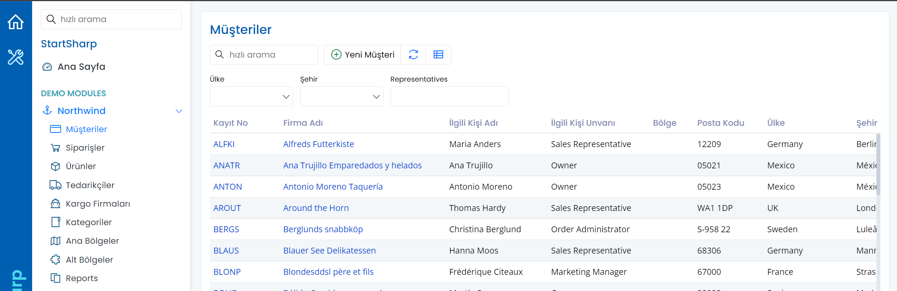

# Localization

Most web applications have to support a variety of languages. Sites like Youtube, and Wikipedia work in many languages.

The first time a user visits such a site, a language for her is automatically chosen depending on the browser language setting which is usually determined by the OS language and regional settings.

If the automatic selection does not result in what they expect, users can set their preferred language and this selection is stored in a client-side cookie or a user profile table.

Once a language is chosen, all texts are displayed in the selected language.

The Serenity platform is designed with localization in mind from the start.

You may see this yourself by setting your browser language or changing the language under the language dropdown of the Serenity demo (https://demo.serenity.is).

If you change to Turkish for example; and refresh your browser, you would see the demo in Turkish:



Here, the data is not translated but it is also possible to translate the user-entered data by some methods like culture extension tables.

## Localization in .NET itself

.NET applications generally use string resource files (.resx) and satellite assemblies:

- [Localization in .NET - Microsoft Docs](https://learn.microsoft.com/en-us/dotnet/core/extensions/localization)

The localization system in .NET works fine for most applications. The main problem we see with satellite assemblies is that they require a compilation step and it is not very suitable for translation by third parties and adding new languages or editing translations after the application itself is deployed. 

## Localization in Serenity

Serenity uses a custom localization system to get the potential advantages below:

- Add/remove the available languages from the application itself
- Edit the localizations at run time, so that it can be done by third parties like a translator
- Store/distribute translations as JSON files
- Store translations in another medium such as a database if desired

## ITextLocalizer Interface

Localization starts with the [ITextLocalizer](../api/dotnet/Serenity.Net.Core/Serenity/ITextLocalizer.md) interface:

```cs
public interface ITextLocalizer
{
    string TryGet(string key);
}
```

This is a very simple interface that only has a `TryGet` method which provides the ability to retrieve a translation for the current UI language (`CultureInfo.CurrentUICulture`) by its `text key`.

## Local Text Keys

Serenity uses `local text keys` instead of ordinary untranslated texts, as the same string might have different translations depending on the context.

For example, the word `Face` might have different meanings and different translations depending on the context, like a person's face, or the front surface of an object.

The text keys are generally defined in the following form:

- `Enums.Month.January`
- `Enums.Month.December`
- `Db.Northwind.Customer.CustomerName`
- `Dialogs.YesButton`

This form also categorizes them based on their purpose/context. For example, the `Enums.Month.` prefixed keys are the ones for values of an enumeration called `Month`. The `Db.Northwind.Customer.` prefixed keys are for the fields of a `Customer` entity in the `Northwind` module.

## LocalText Class

The [LocalText](../api/dotnet/Serenity.Net.Core/Serenity/LocalText.md) class stores a `local text key` and provides the ability to retrieve its translation for the current UI language (`CultureInfo.CurrentUICulture`) by using the `ITextLocalizer` interface.

```cs
public class LocalText
{
    public const string InvariantLanguageID = "";
    public static readonly LocalText Empty;

    public LocalText(string key);

    public string Key { get; private set; }
    public static implicit operator LocalText(string key);
    public string ToString(ITextLocalizer localizer);
}
```

A `LocalText` instance can be created via its constructor by passing a text key, or via implicit casting from any string. 

There is also a static `LocalText` instance called `Empty` which is similar to the `String.Empty`.

## Language Identifiers and The Invariant Language

A language ID is a code that assigns letters and/or numbers as identifiers or classifiers for languages.

Language IDs follow the RFC 1766 standard in the format `<languagecode2>-<country/regioncode2>`, where *languagecode2* is a lowercase two-letter code derived from ISO 639-1 and *country/regioncode2* is an uppercase two-letter code derived from ISO 3166.

Some sample language IDs are:

- `en`: English
- `en-US`: English as used in the United States (US is the ISO 3166-1 country code)
- `en-GB`: English as used in the United Kingdom (GB is the ISO 3166-1 country code)
- `es`: Spanish
- `es-AR`: Spanish as used in Argentina

Similar to `CultureInfo.InvariantCulture`, the invariant language (`LocalText.InvariantLanguageID`) is the default language with an empty identifier.

Unless specified otherwise, the local texts in your assemblies, e.g. the ones defined in C# code are considered to be written in the invariant language. In other words, it is the language for the source texts to be translated into other languages.

Though it is usually considered to be English, you may assume your natural language as the invariant language.

## ILocalTextRegistry Interface

As we mentioned before, the `ITextLocalizer` interface is the one we use to access translations but where can it retrieve these translations from? That is the responsibility of the class which implements the [ILocalTextRegistry](../api/dotnet/Serenity.Net.Core/Serenity.Abstractions/ILocalTextRegistry.md) interface:

```cs
public interface ILocalTextRegistry
{
    string TryGet(string languageID, string key, bool pending);
    void Add(string languageID, string key, string text);
}
```

This interface has the method `TryGet` which returns a translation in a specific language for a text key. 

It also has another method called `Add` which is used to register translations.`

The default implementation for the `ILocalTextRegistry` interface is the [LocalTextRegistry](../api/dotnet/Serenity.Net.Core/Serenity.Localization/LocalTextRegistry.md) class which stores these translations in memory using a set of dictionary objects.

The local text table is an in-memory table (dictionary) like:

Key                   |LanguageID|Text (Translation)
----------------------|----------|-------------------
Dialogs.YesButton     |en        |Yes
Dialogs.YesButton     |tr        |Evet
Dialogs.NoButton      |en        |No
Dialogs.NoButton      |tr        |Hayır


## Language Fallbacks

Both the `ILocalTextRegistry.TryGet` and `ITextLocalizer.TryGet` methods are supposed to return `null` if a translation in the requested language and one of its `fallback languages` are not available.

When a translation is not found in `en-US`, it is acceptable to look for a translation in `en` language, as they are closely related.

Two-letter language IDs (neutral languages) are implicitly language fallbacks of 4 letter country-specific codes. So the `es` language is the language fallback of `es-AR` and, `en` is the language fallback of `en-US` and `en-GB`.

Invariant language is the final fallback of all languages implicitly.

Providers may also support setting language fallbacks explicitly, so you can set `en-US` as the language fallback of `en-UK` if needed.

This is how looking up a translation for a local text key works:

- If the current language has a translation for the key, return it.
- Check every explicitly defined language fallback for a translation.
- If language ID is a 4-letter country-specific code, check neutral language for a translation.
- Check invariant language for a translation.
- Return null otherwise

Let's say we set `en-US` as the language fallback of `en-UK`. If we search for a translation in `en-UK`, it is looked up in this order:

1. en-UK
2. en-US
3. en
4. invariant

## Initialization of the Local Text System

The default implementations of services required localization system is registered in `Startup.cs` file via `[CoreServiceCollections.AddTextRegistry](../api/dotnet/Serenity.Net.Core/Serenity.Extensions.DependencyInjection/CoreServiceCollectionExtensions/AddTextRegistry.md) method.

You may not find that in the `Startup.cs` file, as the method is called internally by the `AddServiceHandlers`:

```cs
services.AddServiceHandlers(); // this internally calls AddTextRegistry
```

There is also an `InitializeLocalText` method in `Startup.cs` file which adds local text keys and translations to the local text registry from a set of classes in your application and other sources like JSON files:

```cs
public static void InitializeLocalTexts(IServiceProvider services)
{
    var env = services.GetRequiredService<IWebHostEnvironment>();
    services.AddBaseTexts(env.WebRootFileProvider)
        .AddJsonTexts(env.WebRootFileProvider, "Scripts/site/texts")
        .AddJsonTexts(env.ContentRootFileProvider, "App_Data/texts");
}
```

## Registering Translations Manually

You can add translations to the local text registry from the `InitializeLocalTexts` method. Sources for these translations might be a database table, an XML file, embedded resources, etc.

```cs
public static void InitializeLocalTexts(IServiceProvider services)
{
    var env = services.GetRequiredService<IWebHostEnvironment>();
    services.AddBaseTexts(env.WebRootFileProvider)
    // ..
    var registry = services.GetRequiredService<ILocalTextRegistry>();
    // load these texts from some source like a database table
    registry.Add("es", "Dialogs.YesButton", "Sí");
    registry.Add("fr", "Dialogs.YesButton", "Oui");
    // ..
}
```

Please note that the order is important here, e.g. the texts added later will override the texts that may be added before them for the same text key and language ID pairs.

# JSON Local Texts

Serenity supports local text registration through JSON files containing a simple key/value dictionary:

```json
{
  "Forms.Administration.User.DisplayName": "Display Name",
  "Forms.Administration.User.Email": "E-mail",
  "Forms.Administration.User.EntitySingular": "User",
  "Forms.Administration.User.EntityPlural": "Users"
}
```

To register all local text keys and translations from JSON files in a folder, call *AddJsonTexts* with the file provider and the folder path:

```cs
services.AddJsonTexts(env.ContentRootFileProvider, "my/folder/with/localtext/jsonfiles")
```

File names in the folder must follow a convention:

`{Some Prefix You Choose}.{LanguageID}.json`

where `{LanguageID}` is two or four-letter language code. Use *invariant* as language code for invariant language.

Some sample file names are:

- `site.texts.en-US.json`
- `MyCoolTexts.es.json`
- `user.texts.invariant.json`

Files in a folder are parsed and added to the registry in their file name order. Thus, for the sample file names above, the order would be:

1. `MyCoolTexts.es.json`
2. `site.texts.en-US.json`
3. `user.texts.invariant.json`

> This order is important as adding a translation in some language with same key overrides prior translation.

## Default Folders Containing JSON Local Texts

As you might have noticed, the `InitializeLocalTexts` method calls `AddJsonTexts` for two predetermined folders:

```cs
.AddJsonTexts(env.WebRootFileProvider, "Scripts/site/texts")
.AddJsonTexts(env.ContentRootFileProvider, "App_Data/texts");
```

The first one is a folder that contains your application-specific translations. 

The one under `App_Data/texts` is the folder where the user translations made through `Administration/Translations` page is saved by default. It is recommended to transfer texts from these files to application translation files under `~/Scripts/site/texts` before publishing.

## Nested Local Texts

Serenity allows you to define nested static classes containing LocalText objects to register translations:

```cs
[NestedLocalTexts]
public static partial class Texts
{
    public static class Site
    {
        public static class Dashboard
        {
            public static LocalText WelcomeMessage = "Welcome to Serenity";
        }
    }

    public static class Validation
    {
        public static LocalText DeleteForeignKeyError =
            "Can't delete record. '{0}' table has records that depends on this one!";
        public static LocalText SavePrimaryKeyError =
            "Can't save record. There is another record with the same {1} value!";
    }
}
```

These definitions allow you to reference localized texts with intelli-sense support, without having to memorize the string keys.

These embedded translation definitions are commonly used to define default translations in the invariant language.

Here is a table of translations that are defined with this *Texts* class:

|Key                             |LanguageID|Text (Translation)
|--------------------------------|----------|-------------------------------
|Site.Dashboard.WelcomeMessage   |          |Welcome to Serenity
|Validation.DeleteForeignKeyError|          |Can't delete record...
|Validation.SavePrimaryKeyError  |          |Can't save record...

Local text keys are generated from nested static class names with a dot inserted in between. The topmost static class (Texts) name is ignored though it is a good idea to name it something like *Texts* for consistency.

Unless otherwise stated, the language ID for these texts is considered to be the invariant language (empty string).

The topmost class (e.g. *Texts* here) for nested local text registration classes must have the [NestedLocalTextsAttribute](../api/dotnet/Serenity.Net.Core/Serenity.ComponentModel/NestedLocalTextsAttribute.md) attribute.

```cs
public sealed class NestedLocalTextsAttribute : Attribute
{
    public string LanguageID { get; set; }
    public string Prefix { get; set; }
}
```

It has two optional properties named `LanguageID` and `Prefix`. 

`LanguageID` allows you to define the language translations are in.

It is a good idea to register default texts in the invariant language (even if texts are not in English), as it is the eventual language fallback for all languages.

If we used it like:

```cs
[NestedLocalTexts(LanguageID = "en-US")]
public static partial class Texts
{
}
```

The `LanguageID` column in the translations table would be "en-US":

|Key                             |LanguageID|Text (Translation)
|--------------------------------|----------|-------------------------------
|Site.Dashboard.WelcomeMessage   |en-US     |Welcome to Serenity
|Validation.DeleteForeignKeyError|en-US     |Can't delete record...

The `Prefix` property value is used as a prefix for local text keys:

```cs
[NestedLocalTexts(LanguageID = "en-US", Prefix = "APrefix.")]
public static partial class Texts
{
    // ..
}
```

Key                                        |LanguageID|Text (Translation)
-------------------------------------------|----------|-------------------------------
APrefix.Site.Dashboard.WelcomeMessage      |en-US     |Welcome to Serenity
APrefix.Validation.DeleteForeignKeyError   |en-US     |Can't delete record...

NestedLocalTexts are automatically registered in the `Startup.cs` file, via the `AddBaseTexts` call in the `InitializeLocalTexts` method.

## Row Texts

Any `DisplayName` attribute defined for a property of an entity class (`Row`) automatically registers a local text key and its translation:

```cs
namespace Serene.Administration
{
    [Module("Administration")]
    [DisplayName("Users"), InstanceName("User")]
    public sealed class UserRow
    {
        [DisplayName("User Id"), Identity, IdProperty]
        public int? UserId { ... }

        [DisplayName("Username"), Size(100), NotNull, QuickSearch, LookupInclude, NameProperty]
        public string Username { ... }

        [DisplayName("Source"), Size(4), NotNull, Insertable(false), Updatable(false), DefaultValue("site")]
        public string Source
        {
            get => fields.Source[this];
            set => fields.Source[this] = value;
        }
    //...
    }
}
```

In the example `UserRow` above, the following local texts are registered at startup:

Key                          |LanguageID|Text (Translation)
---------------------------------|----------|-------------------------------
Db.Administration.UserId         |          |User Id
Db.Administration.Username       |          |Username
Db.Administration.Source         |          |Source
Db.Administration.EntityPlural   |          |Users
Db.Administration.EntitySingular |          |User


The text is read from the `DisplayName` attribute and the key is derived from the `local text prefix` for the entity (which is `"Db.Administration."` in this sample) and the property name.

`EntityPlural` and `EntitySingular` are special keys that correspond to the title (e.g. Users) and instance name for the entity class. Their values are read from `DisplayName` and `InstanceName` attributes on the row class.

Every entity has a local text prefix which is calculated from its module name which is `"Administration"` in this sample, that is set via the `Module` attribute. If no `Module` attribute is present, the module name is calculated from the namespace.

The local text prefix can also be set by placing a [LocalTextPrefixAttribute](../api/dotnet/Serenity.Net.Core/Serenity.ComponentModel/LocalTextPrefixAttribute.md) on the row class. 

Another way is to set the `LocalTextPrefix` property in the `RowFields` class constructor but is not recommended.

Row texts are also automatically registered in the `Startup.cs` file, via the `AddBaseTexts` call in the `InitializeLocalTexts` method.

## Enumeration Texts

Display text for enumeration values can be specified with the `DescriptionAttribute`.

```cs
namespace MyApplication
{
    public enum Sample
    {
        [Description("First Value")]
        Value1 = 1,
        [Description("Second Value")]
        Value2 = 2
    }
}
```

This enumeration and its Description attributes define the following local text keys and translations:

Key                              |LanguageID|Text (Translation)
---------------------------------|----------|-------------------------------
Enums.MyApplication.Sample.Value1|          |First Value
Enums.MyApplication.Sample.Value2|          |Second Value

You can use these keys to access translated descriptions for enumeration values, or use the extension method GetText() defined for enumeration types (import namespace Serenity to make this extension method available).

```cs
Console.WriteLine(MyApplication.Sample.Value1.GetText(localizer));
```
...which returns
```
> First Value
```

Enum texts are also automatically registered in the `Startup.cs` file, via the `AddBaseTexts` call in the `InitializeLocalTexts` method.

## EnumKey Attribute

Enumeration translations use the full name of the enumeration type as the prefix to generate local text keys. This prefix can be overridden with EnumKeyAttribute:

```
namespace MyApplication
{
    [EnumKey("Something")]
    public enum Sample
    {
        [Description("First Value")]
        Value1 = 1,
        [Description("Second Value")]
        Value2 = 2
    }
}
```

Now defined keys and translations are:

Key                   |LanguageID|Text (Translation)
----------------------|----------|-------------------------------
Enums.Something.Value1|          |First Value
Enums.Something.Value2|          |Second Value

Please note that overriding the enum key is NOT recommended, as it is known to cause problems while using modular TypeScript.

