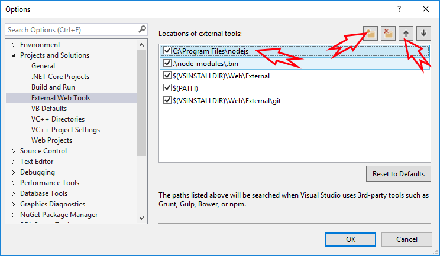

# Getting Started

The best and fastest way to get started with Serenity is the `Serene` starter application template.

> Premium customers can also use the `StartSharp` template, which they can download from the [serenity.is members area](https://serenity.is).

> Please check the prerequisites below before trying to install Serene.

You have a few options for installing the Serene template:

* [Installing Serene from VS Marketplace (Windows)](installing_serene_from_visual_studio_gallery.md)

* [Installing Serene with DotNet New](installing_serene_with_dotnet_new.md)

## Prerequisites

### Visual Studio, .NET, and TypeScript Versions

The application requires _Visual Studio 2026+_ with the most recent updates installed.

The .NET 10 SDK is only supported in Visual Studio 2026 18.8+.

If you don't have access to Visual Studio 2026+, you can alternatively use the command line to create projects and work in Visual Studio Code.

You can install the .NET SDK from:

https://dotnet.microsoft.com/download

As of this writing, the recommended version of TypeScript is 6.0.3+.

The project includes a reference to a recent version of the `Microsoft.TypeScript.MSBuild` package, which Visual Studio should use automatically.

You can also check https://www.typescriptlang.org/download for information on updating your TypeScript.

### Node.js / npm

Node.js and its package manager npm are used for the following:

- TypeScript typings (.d.ts) for libraries like jQuery and Bootstrap.
- Installing and executing external tools like ESBuild

Node.js and npm LTS (Long Term Support) versions are required. You can download them from [https://nodejs.org/en/](https://nodejs.org/en/).

The application checks their versions when you create a project and asks for confirmation to download and install them if needed. Still, it's a good idea to check your versions manually by opening a command prompt:

```cmd
> npm -v
11.1.1
```

```cmd
> node -v
24.10.0
```

If you get an error, they might not be installed or might not be on the path. Also, make sure your versions are equal to or higher than the ones shown above.

### Visual Studio and External Web Tool Paths

Even if you have the correct Node.js / npm installed, Visual Studio might still try to use its integrated (and older) version of Node.js.

In Visual Studio, click `Tools` => `Options`. Under `Projects and Solutions` => `External Web Tools`, add `C:\Program Files\nodejs` to the top of the list by clicking the folder-plus icon and then using the up arrow:


