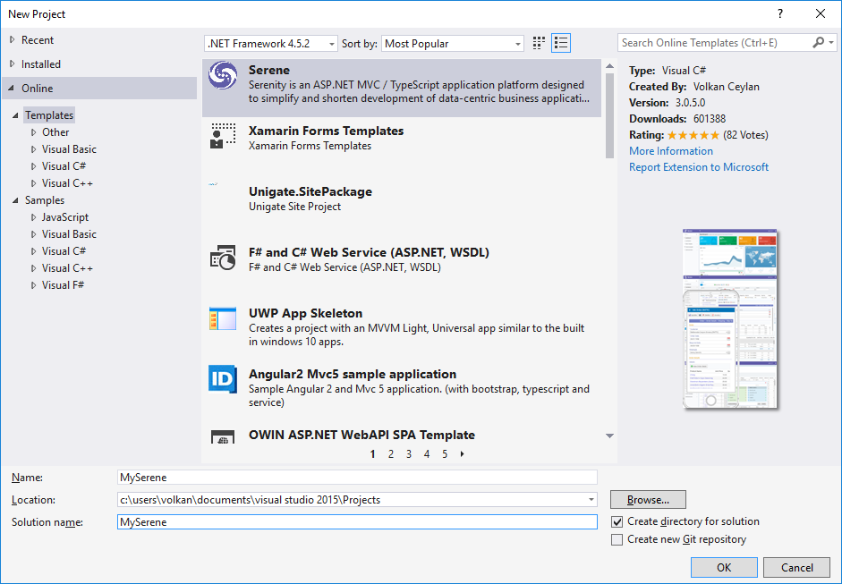
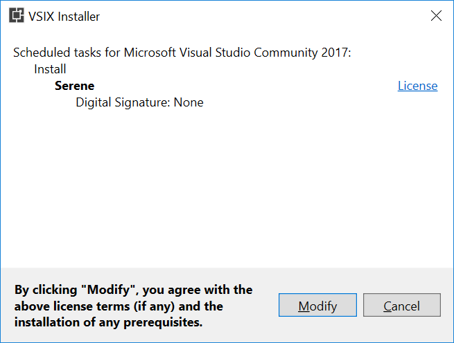
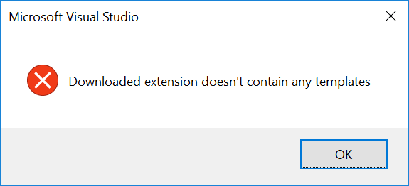

# Installing Serene Directly From Visual Studio

Start Visual Studio and Click _New =&gt; Project_.

> Note that this application template requires Visual Studio 2012 or higher. Make sure you have the latest Visual Studio updates installed.

In the New Project dialog box _Recent_, _Installed_ and _Online_ sections will be shown on left and _Installed_ is the active one.

Click the _Online_ section and wait a bit while _Retrieving information_ message is on screen.

> Please wait while it is loading results.

Serene might be already showing on top of the list. If it is not, type _SERENE_ into input box with _Search Online Templates_ label and press ENTER.

You will see _Serene \(Serenity Application Template\)_:

## Creating a New Project in Visual Studio 2015 and Older

Name your application something like _MyCompany_, _MyProduct_, _HelloWorld_ or leave the default _Serene1_.

> Please don't name it _Serenity_. It may conflict with other Serenity assemblies.

> After you create your first project, Serene template is installed into Visual Studio, so you can use the _Installed_ section in _New Project_ dialog to create another Serenity application.

Click OK to download Serene and create your new project

> Your project will use ASP.NET MVC 4 version of Serene, next time you may choose ASP.NET Core version from _New Project_ dialog, _Installed_ section.

## Creating a New Project in Visual Studio 2017

Unfortunately Visual Studio 2017 changed template installation process. When you select Serene from _Online_ section and click OK, you'll see this dialog:

When you click Modify, you'll be asked to terminate Visual Studio and other related processes.

After installation, Visual Studio won't restart itself. You'll have to manually relaunch Visual Studio.

Now, if you again go to _Online_ section and click _Serene_, you'll get this error message:

Unfortunately, this is a VS2017 bug. 

Please close _Online_ section, and find Serene under _New Project_ => _Installed_ => _Visual C#_:

> After you create your first project, Serene template is installed into Visual Studio, so you can use the _Installed_ section in _New Project_ dialog to create another Serenity application.

Name your application something like *MyCompany*, *MyProduct*, *HelloWorld* or leave the default *Serene1*.

> Please don't name it *Serenity*. It may conflict with other Serenity assemblies.

Click OK.

## Choosing Between ASP.NET MVC / ASP.NET Core

We have two versions of Serene template. One that uses classic ASP.NET MVC 4 (SERENE) and another one that works on ASP.NET CORE 2.0 / .NET CORE 2.0.

ASP.NET Core is a recent technology and is platform independent (as long as you target .NET Core it also runs on Linux / OSX). 

ASP.NET MVC only runs on Windows and .NET framework but more mature (latest version is dated 2/9/2015).

We can say both versions of Serene is pretty stable. 

Here is a document from Microsoft that might help you choose between two frameworks:

https://docs.microsoft.com/en-us/aspnet/core/choose-aspnet-framework

> Unfortunately Visual Studio 2015 doesn't let you choose which version to use on first install. But, you will see ASP.NET Core version after installation on New Project dialog.

## Feature Selection

Serene will prompt you to choose features you would like to see.

All of these features / samples are optional. Initially we recommend you to leave them all checked so that you might have a look at how they are implemented.

After having some experience with Serene, you might create a new application and clear all these checkboxes to have a bare minimum project.

Choose features you like, click OK and take a break while Visual Studio creates the solution.