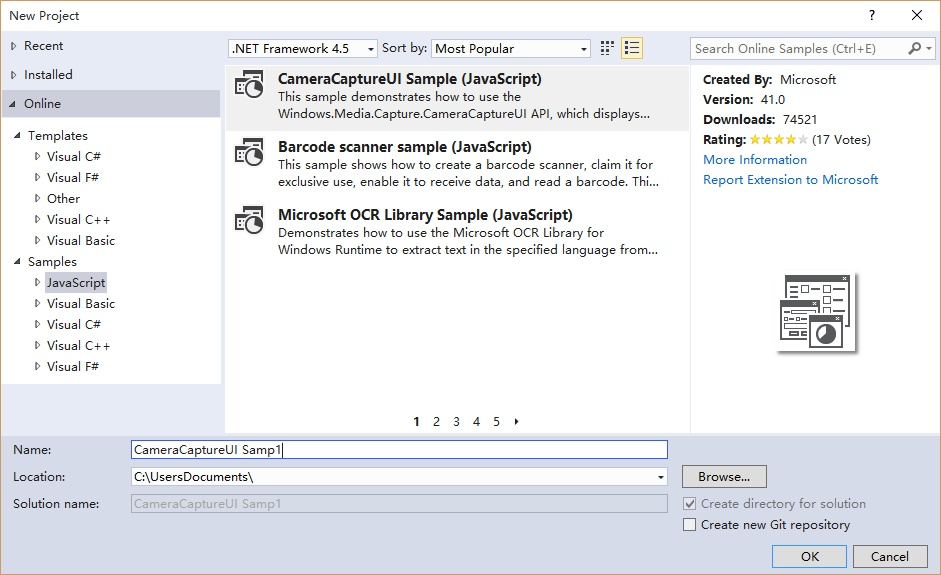
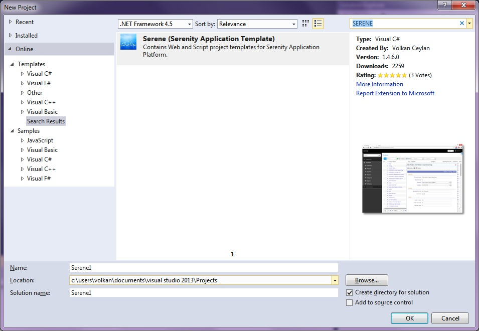

# 直接安装SEREN到Visual Studio Installing Serene Directly From Visual Studio

启动Visual Studio并点击 *新建 => 项目*。Start Visual Studio and Click *New => Project*.

> 请注意，这个应用程序模板需要Visual Studio 2012或更高的版本。请确保你已经安装了最新的Visual Studio更新。Note that this application template requires Visual Studio 2012 or higher. Make sure you have the latest Visual Studio updates installed.

在新建项目对话框左侧显示着 *最近的模板* *已安装的模板* 和 *联机模板* ，其中 *已安装的模板* 是我们最常用的部分。In the New Project dialog box *Recent*, *Installed* and *Online* sections will be shown on left and *Installed* is the active one.

点击 *联机模板* 稍等片刻将在Click the *Online* section and wait a bit while *Retrieving information* message is on screen.

> 在加载结果时请耐心等候。Please wait while it is loading results.

在搜索框中输入 *SERENE* 并按 ENTER 键确认。Type *SERENE* into input box with *Search Online Templates* label and press ENTER.

你将看到*Serene (Serenity Application Template)*：You will see *Serene (Serenity Application Template)*:

Name your application something like *MyCompany*, *MyProduct*, *HelloWorld* or leave the default *Serene1*.

> Please don't name it *Serenity*. It may conflict with other Serenity assemblies.

Click OK and take a break while Visual Studio downloads the template and creates the solution.

> 使用该方式创建第一个项目后，Serene的模板已安装到Visual Studio, 所以你可以使用  *新建项目*对话框中的 *已安装的模板*中选择Serenity模板进行创建另一个新的Serenity应用程序。After you create your first project, Serene template is installed into Visual Studio, so you can use the *Installed* section in *New Project* dialog to create another Serenity application.
