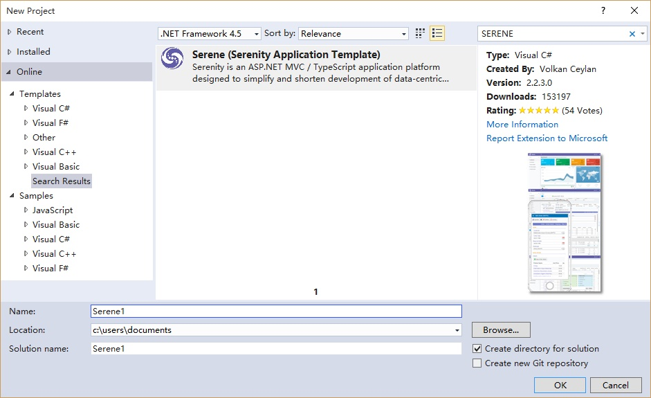

# Installing Serene Directly From Visual Studio

Start Visual Studio and Click _New =&gt; Project_.

> Note that this application template requires Visual Studio 2012 or higher. Make sure you have the latest Visual Studio updates installed.

In the New Project dialog box _Recent_, _Installed_ and _Online_ sections will be shown on left and _Installed_ is the active one.

Click the _Online_ section and wait a bit while _Retrieving information_ message is on screen.

> Please wait while it is loading results.

Type _SERENE_ into input box with _Search Online Templates_ label and press ENTER.

You will see _Serene \(Serenity Application Template\)_:

# Visual Studio 2015 and Older

Name your application something like _MyCompany_, _MyProduct_, _HelloWorld_ or leave the default _Serene1_.

> Please don't name it _Serenity_. It may conflict with other Serenity assemblies.

Click OK and take a break while Visual Studio downloads the template and creates the solution.

> After you create your first project, Serene template is installed into Visual Studio, so you can use the _Installed_ section in _New Project_ dialog to create another Serenity application.

# Visual Studio 2017 Users

Unfortunately Visual Studio 2017 changed template installation process. When you select Serene from _Online_ section and click OK, you'll see this dialog:

When you click Modify, you'll be asked to terminate Visual Studio and other related processes.

After installation, Visual Studio won't restart itself. You'll have to manually relaunch Visual Studio.

Now, if you again go to _Online_ section and click _Serene_, you'll get this error message:

Unfortunately, this is a VS2017 bug. 

Please close _Online_ section, and find Serene under _New Project_ => _Installed_ => _Templates_ => _Visual C#_:

