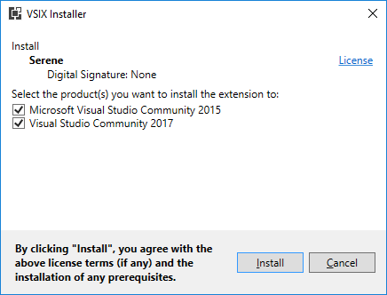

# Installing Serene From Visual Studio Marketplace

## Downloading Template

Open URL below in your browser:

https://marketplace.visualstudio.com/items?itemName=VolkanCeylan.SereneSerenityApplicationTemplate

Click *Download* to transfer VSIX file to your computer.

**You need Visual Studio 2019 to run Serene as ASP.NET Core 5 SDK only supports Visual Studio 2019 with latest updates.**

> There is also an ASP.NET MVC version that could run in Visual Studio 2017 but it is obsolete, not supported and not updated anymore. 
> https://marketplace.visualstudio.com/items?itemName=VolkanCeylan.SereneMvc

## Install Template into Visual Studio

After download is finished, double click the downloaded VSIX file to start Visual Studio extension installation dialog 
> 

Click Install when prompted.

> Note that this application template requires Visual Studio 2019 or higher. Make you sure you have the latest Visual Studio updates installed.

## Creating a New Project in Visual Studio

Start Visual Studio (if it was already open, restart it). Click File => New Project. You should see Serene template under Templates => Visual C# section.

> Please use one named SERENE if you have both SERENE and SERENE (ASP.NET MVC - Obsolete). SERENE is the ASP.NET CORE version, and is the recommended one.

Name your application something like *MyCompany*, *MyProduct*, *HelloWorld* or leave the default *Serene1*.

> Please don't name it *Serenity*. It may conflict with other Serenity assemblies.

Please use Pascal casing, e.g. a name that starts with a Capital Letter. Don't name your project something like `myProject`.

Click OK.

## Feature Selection

Serene will prompt you to choose features you would like to see.

All of these features / samples are optional. Initially we recommend you to leave them all checked so that you might have a look at how they are implemented.

After having some experience with Serene, you might create a new application and clear all these checkboxes to have a bare minimum project.

Choose features you like, click OK and take a break while Visual Studio creates the solution.