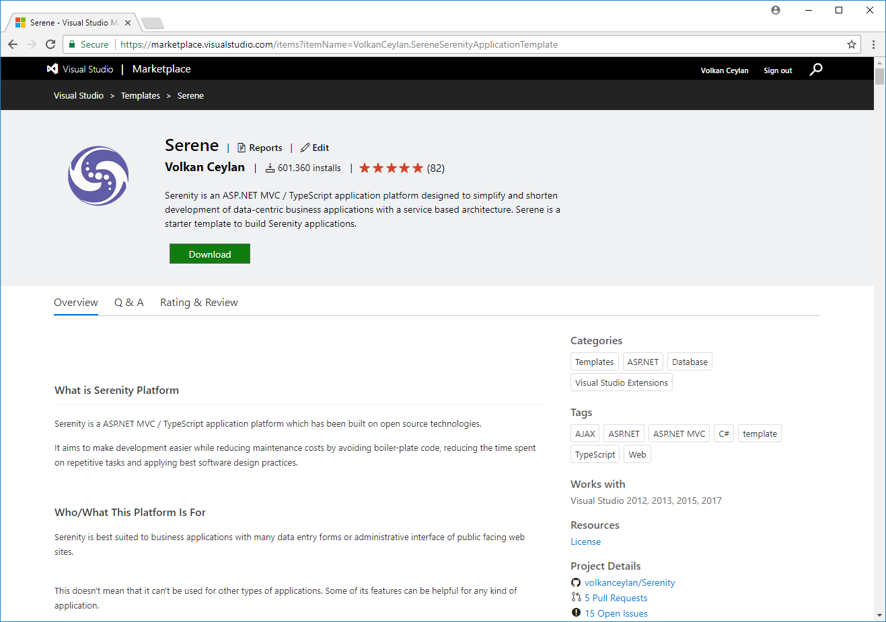
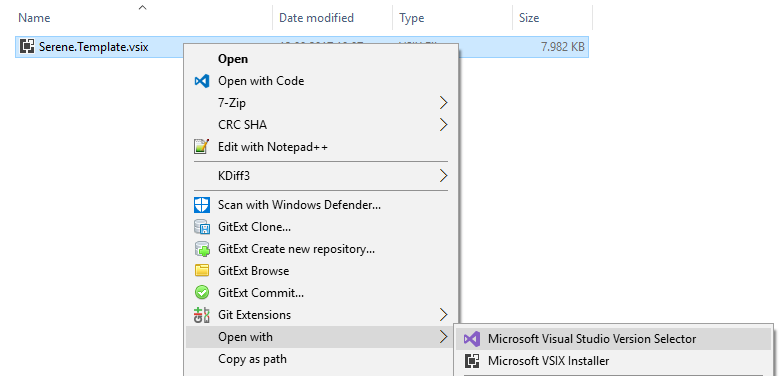
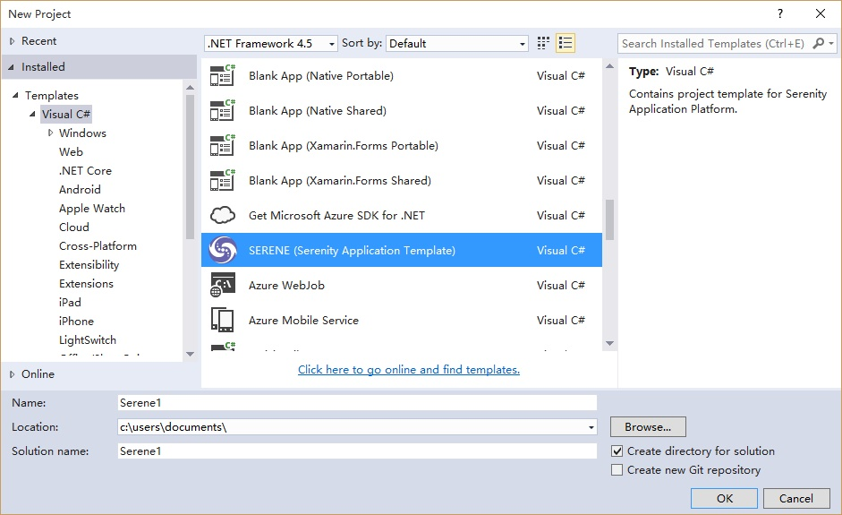

# Installing Serene From Visual Studio Marketplace

Open URL below in your browser:

https://marketplace.visualstudio.com/items?itemName=VolkanCeylan.SereneSerenityApplicationTemplate

Click *Download* to transfer VSIX file to your computer.

After download is finished, click the downloaded VSIX file to start Visual Studio extension installation dialog and click Install.

> If you have both Visual Studio 2017 and 2015 installed, sometimes Visual Studio 2015 installer might pick up VSIX file so it only installs in Visual Studio 2015. If you experience this issue, right click the file, click *Open With* and choose *Visual Studio Version Selector*.

> Note that this application template requires Visual Studio 2012 or higher. Make you sure you have the latest Visual Studio updates installed. ASP.NET MVC Core version requires Visual Studio 2017 with Update 3

Start Visual Studio (if it was already open, restart it). Click File => New Project. You should see Serenity template under Templates => Visual C# section.

Name your application something like *MyCompany*, *MyProduct*, *HelloWorld* or leave the default *Serene1*.

> Please don't name it *Serenity*. It may conflict with other Serenity assemblies.

Click OK and take a break while Visual Studio creates the solution.

