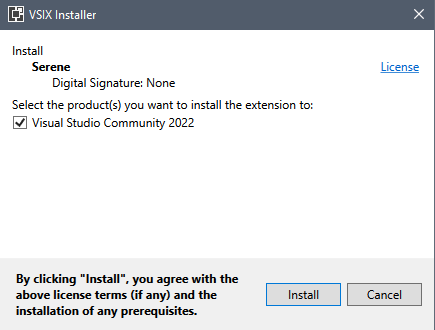
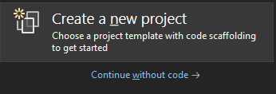
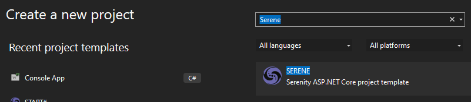
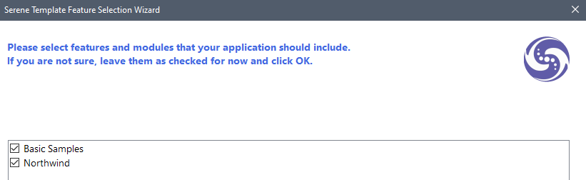

# Installing Serene From Visual Studio Marketplace

## Downloading Template

Open the URL below in your browser:

https://marketplace.visualstudio.com/items?itemName=VolkanCeylan.SereneSerenityApplicationTemplate

Click *Download* to transfer the VSIX file to your computer.

**You need Visual Studio 2022 to run Serene as .NET 6 SDK only supports Visual Studio 2022 with the latest updates.**

## Install Template into Visual Studio

After the download is finished, double-click the downloaded VSIX file to start the Visual Studio extension installation dialog 
> 

Click Install when prompted.

## Creating a New Project in Visual Studio

Start Visual Studio (if it was already open, restart it). Click `Create a new project` on the startup screen (or from the menu `File` => `New Project`).

If not displayed already, find `Serene` using the top search input, and select `SERENE`.

Name your application something like `MyCompany`, `MyProduct`, or `HelloSerenity`, or leave the default name `Serene1`. 

Please don't name it `Serenity`. It may conflict with other Serenity assemblies.

You should use Pascal casing, e.g. a name that starts with a `Capital Letter`. Don't name your project something like `myProject`.

Click `OK`.

## Feature Selection

Serene will prompt you to choose features you would like to see.

The listed features/samples are all optional. Initially, we recommend you leave them all checked so that you might have a look at how they are implemented.

After having some experience with Serene, you might create a new application and clear all these checkboxes to have a bare minimum project.

Choose features you like, click `OK` and take a break while Visual Studio creates the solution.