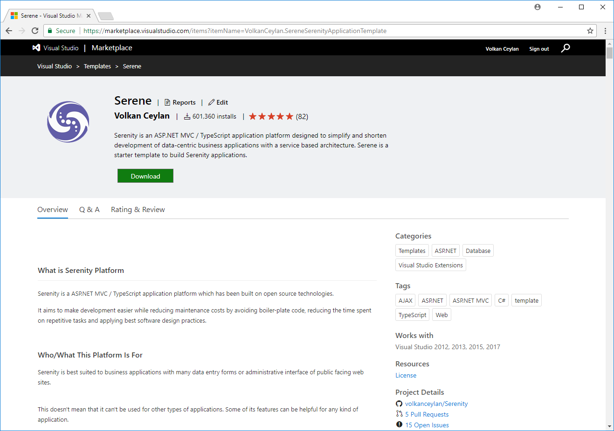
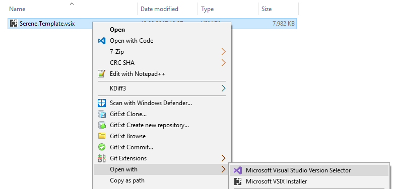
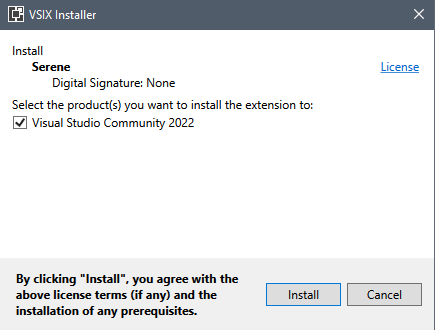
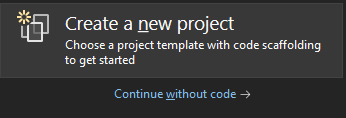
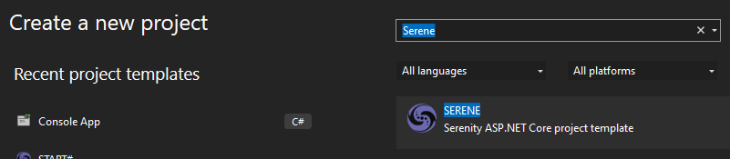
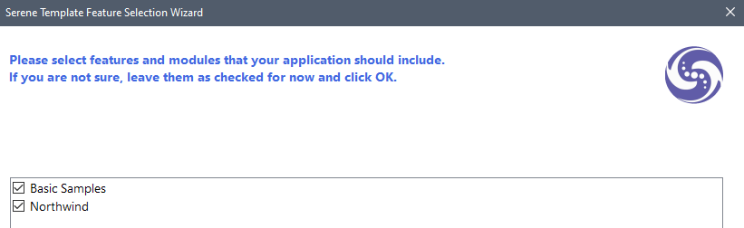

# Installing Serene From the Visual Studio Marketplace

## Downloading the Template

Open the URL below in your browser:

https://marketplace.visualstudio.com/items?itemName=VolkanCeylan.SereneSerenityApplicationTemplate

Click *Download* to transfer the VSIX file to your computer.

**You need Visual Studio 2026 18.8+ to run Serene, because the .NET 10 SDK only supports Visual Studio with the latest updates.**

## Installing the Template in Visual Studio

After the download finishes, double-click the downloaded VSIX file to open the Visual Studio extension installer:

Click Install when prompted.

## Creating a New Project in Visual Studio

Start Visual Studio (if it was already open, restart it), and click `Create a new project` on the startup screen, or select `File` => `New Project` from the menu.

If it isn't already displayed, use the search box at the top to find `Serene`, then select `SERENE`.

Name your application something like `MyCompany`, `MyProduct`, or `HelloSerenity`, or leave the default name `Serene1`.

Please don't name it `Serenity`. It may conflict with other Serenity assemblies.

You should use Pascal casing, for example a name that starts with a capital letter. Don't name your project something like `myProject`.

Click `OK`.

## Selecting Features

Serene will prompt you to choose the features you would like to include.

All of the listed features/samples are optional. Initially, we recommend you leave them all checked so you can see how they are implemented.

Once you have some experience with Serene, you can create a new application and clear all of these checkboxes for a bare-minimum project.

Choose the features you like, click `OK`, and take a break while Visual Studio creates the solution.