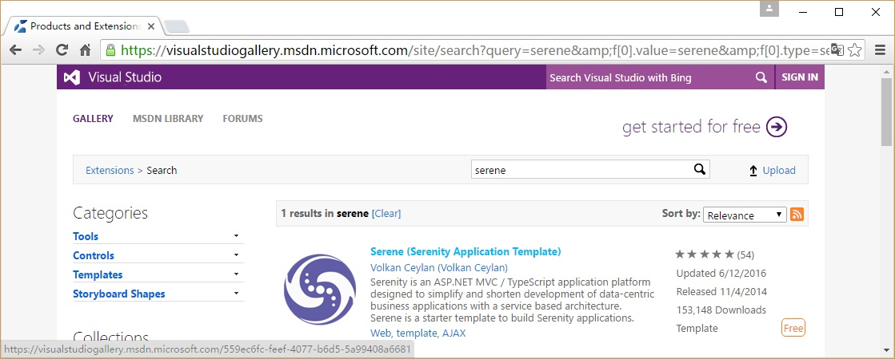

# 从Visual Studio 库中安装SERENE Installing Serene From Visual Studio Gallery

在浏览器打开链接http://visualstudiogallery.msdn.microsoft.com/ 

在*搜索 Visual Studio 库* 搜索框中输入*Serene*并按 ENTER 键。

你将看到*Serene (Serenity Application Template)*，单击标题进入详细页面。

点击*下载*，VSIX文件将下载到你的电脑。

下载完成后，单击下载的 VSIX 文件，启动 Visual Studio 扩展安装对话框并单击安装。

> 请注意，这个应用程序模板需要Visual Studio 2012或更高的版本。请确保你已经安装了最新的Visual Studio更新。

启动Visual Studio（如果已经打开，请重新启动）。单击 文件 => 新建项目 。你应该能在 模板 => Visual C# 中看到Serenity模板。

命名您的应用程序，像*MyCompany*, *MyProduct*, *HelloWorld*或保留默认值*Serene1*。

> 请不要将其命名为*Serenity*，它可能会与其他Serenity程序集冲突。

点击OK并稍等片刻，Visual Studio将创建模板解决方案。

