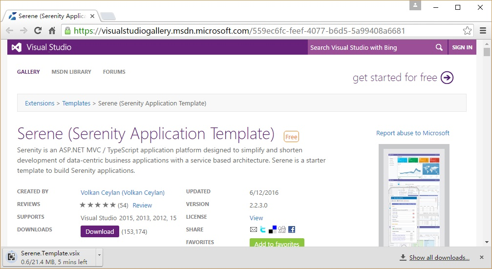

# Installing Serene From Visual Studio Gallery

Open http://visualstudiogallery.msdn.microsoft.com/ in your browser.

Type *Serene* into the search input with *Search the Visual Studio Gallery* label and press ENTER.

You will see *Serene (Serenity Application Template)*, click to open it.

Click *Download* to transfer VSIX file to your computer.

After download is finished, click the downloaded VSIX file to start Visual Studio extension installation dialog and click Install.

> Note that this application template requires Visual Studio 2012 or higher. Make you sure you have the latest Visual Studio updates installed.

Start Visual Studio (if it was already open, restart it). Click File => New Project. You should see Serenity template under Templates => Visual C# section.

Name your application something like *MyCompany*, *MyProduct*, *HelloWorld* or leave the default *Serene1*.

> Please don't name it *Serenity*. It may conflict with other Serenity assemblies.

Click OK and take a break while Visual Studio creates the solution.

