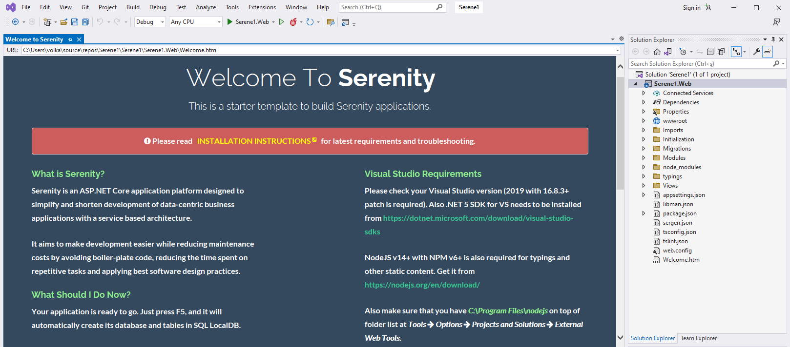

# Starting Serene

After your first project is created in Visual Studio using the Serene template, you will see a solution like this:

> Asp.Net Core users don't have to use Visual Studio, but we'll use Visual Studio in this guide as we think most of our users will.



Your solution contains a `Serene1.Web` project, which is an ASP.NET Core application. 

It includes server-side code written in C# (.cs) and client-side code that is written in TypeScript (.ts).

`Serene1.Web` has references to Serenity NuGet packages, so, when required, you can update it using the package manager or manually by editing the project file.

Serene automatically creates its database in `SQL Local DB` at the first run, so just press F5 or click run and you are ready to go.

When the application launches use the `admin` user and `serenity` password to log in. You can change the password or create more users later, using the `Administration/User Management` page.


The sample application includes old and famous Northwind data along with services and the user interface to edit it, which is mostly produced by Serenity Code Generator.

### Troubleshooting Connection Problems

If you are getting a connection error like the following while starting Serene for the first time:

```
> A network-related or instance-specific error occurred 
> while establishing a connection to SQL Server. 
> The server was not found or was not accessible. 
> Verify that the instance name is correct...
```

This error might mean that you don't have SQL Server Local DB installed. This server comes pre-installed with Visual Studio. 

In the `appsettings.json` file you'll find the `Default` and `Northwind` connection entries:

```json
"Data": {
  "Default": {
    "ConnectionString": 
      "Server=(localdb)\\MsSqlLocalDB;Database=Serene2_Default_v1;..."
    "ProviderName": "System.Data.SqlClient"
  },
  "Northwind": {
    "ConnectionString": 
      "Server=(localdb)\\MsSqlLocalDB;Database=Serene2_Northwind_v1;...",
    "ProviderName": "System.Data.SqlClient"
  }
}
```

#### Fixing Connection Strings

Visual Studio 2015+ comes with SQL Server 2014+ LocalDB. Its default instance name is MsSqlLocalDB by default. 

If you have an error, open an administrative command prompt and type

```bat
> sqllocaldb info
```

This will list the Local DB instances like:

```
MSSqlLocalDB
test
```

If you don't have MsSqlLocalDB listed, you can create it:

```bat
> sqllocaldb create MsSqlLocalDB
```


If you have another SQL server instance, for instance, SQL Express, change the data source to `.\SqlExpress`:

```json
"Data": {
  "Default": {
    "ConnectionString": 
      "Server=.\\SqlExpress;Database=Serene1_Default_v1;...",
    "ProviderName": "System.Data.SqlClient"
  },
  "Northwind": {
    "ConnectionString": 
      "Server=.\\SqlExpress;Database=Serene1_Northwind_v1;...",
    "ProviderName": "System.Data.SqlClient"
  }
}
```

Just change the connection string if you want to use another SQL server instance.

> Perform these steps for both Default and Northwind databases.
