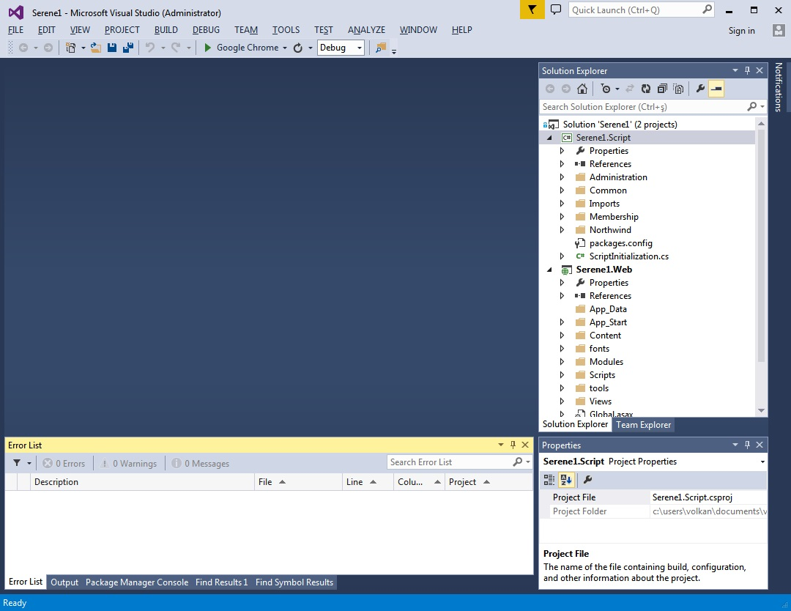
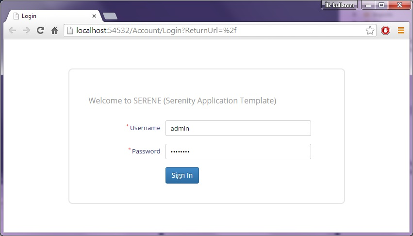

# 开始使用 Serene

在 Visual Studio 中使用Serene模板创建第一个项目后，你将看到这样的解决方案︰



你的解决方案包含一个名为 Serene1.Web 的 ASP.NET MVC 应用程序。

Serene1.Web 项目包含 C# (.cs)编写的服务端代码和 TypeScript (.ts) 编写的客户端代码。

Serene.Web 拥有 Serenity 的 NuGet 程序包引用，这样你就可以根据需要使用包管理控制台随时更新它。

> 上面是 < 2.1 版的截图，其中有一个使用 *Saltarelle 编译器* 生成客户端代码 的 Serene1.Script 项目。从 2.1 之后我们更换为 TypeScript 编写客户端代码，并且客户端代码（.ts 文件） 也全部集成到 Web 项目中。

Serene 在首次运行时将自动在 SQL local db 中创建数据库，所以只须按 F5 就可运行使用示例。

当应用程序启动时使用`admin`用户和`serenity`密码登录。然后你可以使用 *管理/用户管理* 页面更改密码或创建更多的用户。



示例应用程序包括由 Serenity 代码生成器为 Northwind 数据库的生成的服务和可编辑的用户界面。

### 数据库连接问题 

如果你在第一次启动 Serene 时遇到类似于下面数据库连接错误 ︰

> A network-related or instance-specific error occurred while establishing a connection to SQL Server. The server was not found or was not accessible. Verify that the instance name is correct and that SQL Server is configured to allow remote connections. (provider: SQL Network Interfaces, error: 50 - Local Database Runtime error occurred. The specified LocalDB instance does not exist.
)


此错误意味着可能你没有安装 SQL Server Local DB 2012。 SQL Server Local DB 2012 预装在 Visual Studio 2012 / Visual Studio 2013 。

在 Serene.Web/web.config 文件中有 *Default* 和 *Northwind* 连接配置 ︰

```xml
<connectionStrings>
    <add name="Default" connectionString="Data Source=(LocalDb)\v11.0; 
        Initial Catalog=Serene_Default_v1; Integrated Security=True" 
        providerName="System.Data.SqlClient" />
  </connectionStrings>
```

`(localdb)\v11.0` 使用默认 SQL Server 2012 LocalDB 实例。

如果你没有 SQL LocalDB 2012，你可以从下面的连接中获取安装：

http://www.microsoft.com/en-us/download/details.aspx?id=29062

Visual Studio 2015 内置 SQL Server 2014 LocalDB，它的默认实例名为MsSqlLocalDB。因此，如果你使用 VS2015，请把连接字符串`(localdb)\v11.0` 修改为 `(localdb)\MsSqlLocalDB`。

```xml
<connectionStrings>
    <add name="Default" connectionString="Data Source=(LocalDb)\MsSqlLocalDB; 
        Initial Catalog=Serene_Default_v1; Integrated Security=True" 
        providerName="System.Data.SqlClient" />
  </connectionStrings>
```

如果你仍然有错误，请使用管理员身份打开cmd命令提示符,并输入：

```bat
> sqllocaldb info
```

这会列出类似下面的 localdb 实例：

```
MSSqlLocalDB
test
```

如果你的没有列出 MsSqlLocalDB,你可以创建它：

```bat
> sqllocaldb create MsSqlLocalDB
```


如果你有另一个 SQL server 实例，例如 SQL Express，请把数据源更改为`.\SqlExpress` ︰


```xml
<connectionStrings>
    <add name="Default" connectionString="Data Source=.\SqlExpress; 
        Initial Catalog=Serene_Default_v1; Integrated Security=True" 
        providerName="System.Data.SqlClient" />
  </connectionStrings>
```


你还可以使用另一个 SQL 服务器，只需更改连接字符串即可。

> 请为 Default 和 Northwind 数据库执行这些步骤，因为 Serene 1.6.4.3+ 默认创建这两个数据库。
