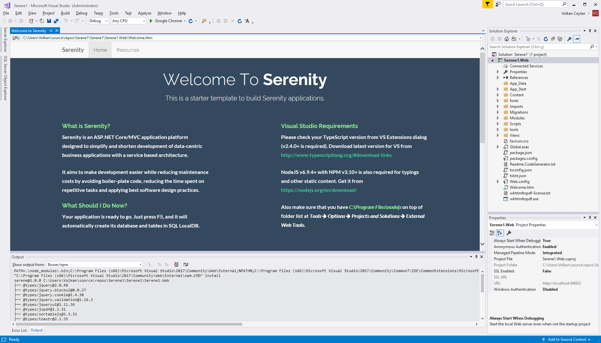
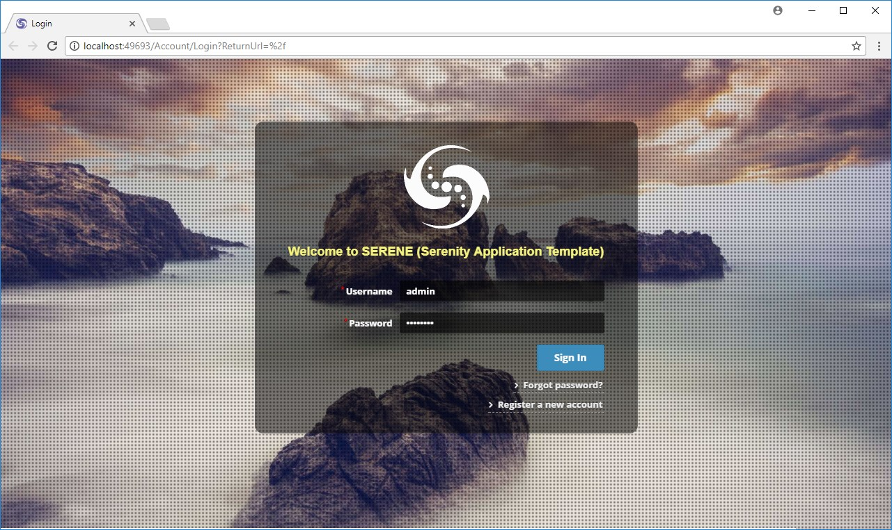

# Starting Serene

After your first project is created in Visual Studio using Serene template, you will see a solution like this:

> Asp.Net Core users don't have to use Visual Studio, but we'll use Visual Studio in this guide as we think most of our users will.



Your solution contains Serene1.Web project, which is an ASP.NET Core application. 

It includes server side code written in C# (.cs) and client side code that is written in TypeScript (.ts).

Serene.Web has references to Serenity NuGet packages, so you can update it using package manager console anytime necessary.

Serene automatically creates its database in SQL local db at first run, so just press F5 and you are ready to go.

When application launches use `admin` user and `serenity` password to login. You can change password or create more users later, using *Administration / User Management* page.



The sample application includes old and famous Northwind data along with services and user interface to edit it, which is mostly produced by Serenity Code Generator.

### Troubleshooting Connection Problems

If you are getting a connection error like the following while starting Serene for first time:

```
> A network-related or instance-specific error occurred 
> while establishing a connection to SQL Server. 
> The server was not found or was not accessible. 
> Verify that the instance name is correct...
```

This error might mean that you don't have SQL Server Local DB installed. This server comes preinstalled with Visual Studio. 


#### ASP.NET Core

In `appsettings.json` file you'll find *Default* and *Northwind* connection entries:

```json
  "Data": {
    "Default": {
      "ConnectionString": "Server=(localdb)\\MsSqlLocalDB;Database=Serene2_Default_v1;Integrated Security=true",
      "ProviderName": "System.Data.SqlClient"
    },
    "Northwind": {
      "ConnectionString": "Server=(localdb)\\MsSqlLocalDB;Database=Serene2_Northwind_v1;Integrated Security=true",
      "ProviderName": "System.Data.SqlClient"
    }
  }
```

#### Fixing Connection Strings

Visual Studio 2015+ comes with SQL Server 2014+ LocalDB. It's default instance name is MsSqlLocalDB by default. 

If you have an error, open an administrative command prompt and type

```bat
> sqllocaldb info
```

This will list localdb instances like:

```
MSSqlLocalDB
test
```

If you don't have MsSqlLocalDB listed, you can create it:

```bat
> sqllocaldb create MsSqlLocalDB
```


If you have another SQL server instance, for example SQL Express, change data source to `.\SqlExpress`:


```xml
<connectionStrings>
    <add name="Default" connectionString="Data Source=.\SqlExpress; 
        Initial Catalog=Serene_Default_v1; Integrated Security=True" 
        providerName="System.Data.SqlClient" />
  </connectionStrings>
```

You can also use another SQL server. Just change the connection string.

> Perform these steps for both Default and Northwind databases.
