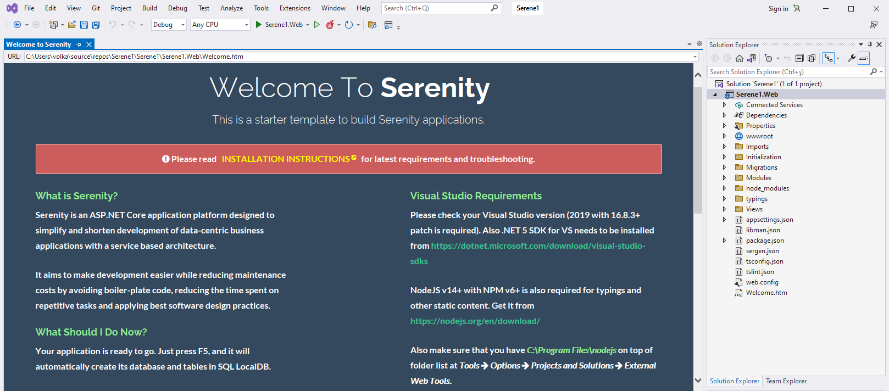
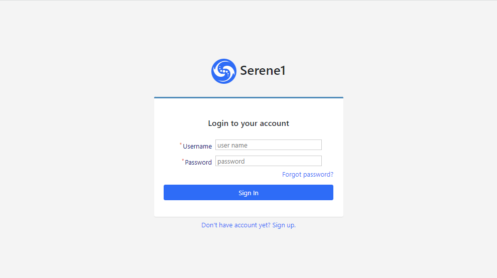

# Starting Serene

After your first project is created in Visual Studio using the Serene template, you will see a solution like this:

> ASP.NET Core users don't have to use Visual Studio, but we'll use it in this guide since we think most of our users will.



Your solution contains a `MySerene1.Web` project, which is an ASP.NET Core application.

It includes server-side code written in C# (.cs) and client-side code written in TypeScript (.ts).

`MySerene1.Web` has references to Serenity NuGet packages, so you can update them when required, either with the package manager or manually by editing the project file.

Serene automatically creates its database in `SQL Local DB` on the first run, so just press F5 (or click Run) and you're ready to go.

When the application launches, log in with the `admin` user and the `serenity` password. You can change the password or create more users later from the `Administration/User Management` page.



The sample application includes the well-known Northwind data, along with the services and user interface to edit it, most of which is produced by the Serenity code generator.

## Troubleshooting Connection Problems

If you get a connection error like the following when starting Serene for the first time:

```
> A network-related or instance-specific error occurred
> while establishing a connection to SQL Server.
> The server was not found or was not accessible.
> Verify that the instance name is correct...
```

This error might mean that you don't have SQL Server LocalDB installed. LocalDB comes pre-installed with Visual Studio.

In the `appsettings.json` file, you'll find the `Default` and `Northwind` connection entries:

```json
"Data": {
  "Default": {
    "ConnectionString": 
      "Server=(localdb)\\MsSqlLocalDB;Database=MySerene1_Default_v1;...",
    "ProviderName": "System.Data.SqlClient"
  },
  "Northwind": {
    "ConnectionString": 
      "Server=(localdb)\\MsSqlLocalDB;Database=MySerene1_Northwind_v1;...",
    "ProviderName": "System.Data.SqlClient"
  }
}
```

### Fixing Connection Strings

Visual Studio 2015+ comes with SQL Server 2014+ LocalDB, whose default instance name is `MsSqlLocalDB`.

If you get an error, open an administrative command prompt and type:

```bat
> sqllocaldb info
```

This will list the LocalDB instances, for example:

```
MSSqlLocalDB
test
```

If `MsSqlLocalDB` isn't listed, you can create it:

```bat
> sqllocaldb create MsSqlLocalDB
```

If you have another SQL Server instance, for example SQL Express, change the data source to `\.\SqlExpress`:

```json
"Data": {
  "Default": {
    "ConnectionString": 
      "Server=.\\SqlExpress;Database=MySerene1_Default_v1;...",
    "ProviderName": "System.Data.SqlClient"
  },
  "Northwind": {
    "ConnectionString": 
      "Server=.\\SqlExpress;Database=MySerene1_Northwind_v1;...",
    "ProviderName": "System.Data.SqlClient"
  }
}
```

To use another SQL Server instance, just change the connection string.

> Perform these steps for both the `Default` and `Northwind` databases.
