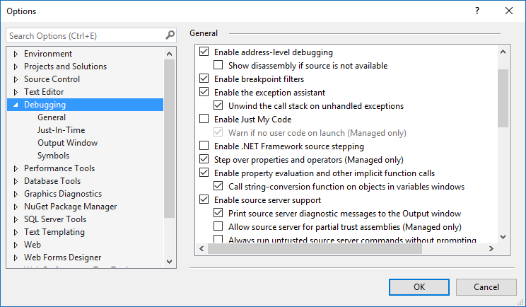

# How To: Debug into Serenity Sources

Serenity NuGet packages (since 5.0.49) already contain debug information embedded inside the DLL files (e.g. there are no pdb files, that info is embbedded inside the DLL) and are setup to use SourceLink which fetches the sources from GitHub.

To enable source link support, just go to your Visual Studio options, and under Debugging -> General, check **Enable Source Link support**.

You should also *uncheck* **Enable Just My Code**:

Now put a breakpoint on any code that calls Serenity code, then when the breakpoint is hit, use F11 etc. to debug into Serenity codes.