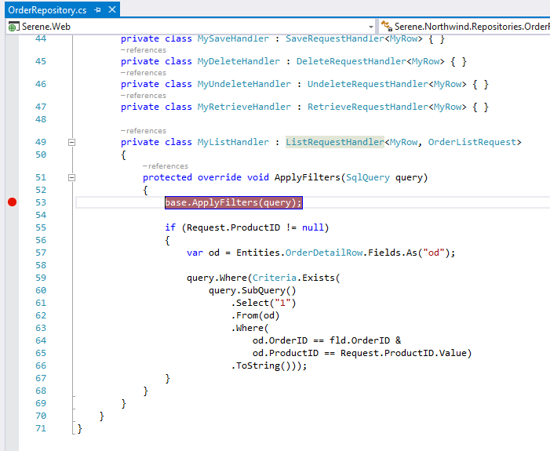
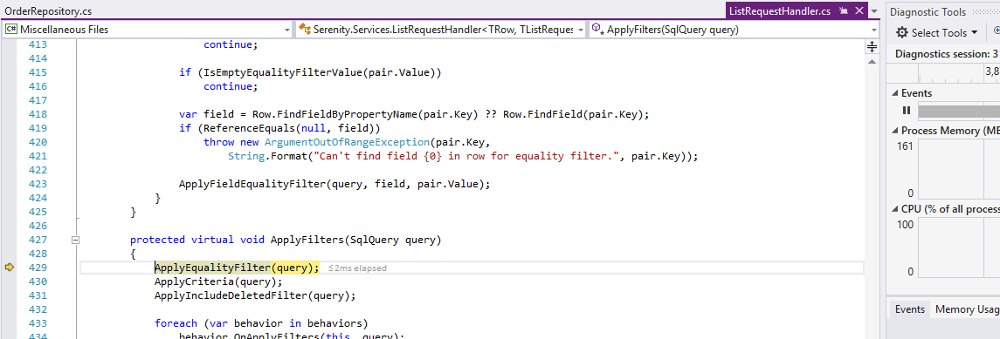
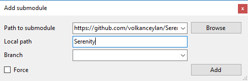

# How To: Debugging with Serenity Sources

Sometimes you might want to debug (or trace into) Serenity sources. There are two ways to do this.


### By Enabling Source Server Support

Serenity NuGet packages already contains .pdb files debugging, which are modified to use GitHub as a symbol source by using excellent GitLink project:

[https://github.com/GitTools/GitLink](https://github.com/GitTools/GitLink)

> You don't need GitLink to debug, it's just a tool used by Serenity while publishing

To enable source server support, just go to your Visual Studio options, and under Debugging -> General, click **Enable source server support**.


You should also ***uncheck*** *Enable Just My Code*:


Now put a breakpoint on OrderRepository -> MyListHandler -> ApplyFilters or some other code you like:



Launch application in debug mode, navigate to Orders page, and enjoy debugging:




### By Adding Serenity as a SubModule

This option is only recommended for advanced users with a good knowledge of Git, Submodules and .NET in general. You'll also lose the ability to update Serenity and related files simply with NuGet.

> I don't recommend this to novice users. If you do this and break your project, sorry but i can't help you.

I assume you have a project named SereneSample, and have a GIT repository for it already.

In GitExtensions, enter Repository -> SubModules -> Add submodule:



Under Path to submodule enter:

https://github.com/serenity-is/Serenity.git

Enter *Serenity* as Local path.

Then click *Add* to add Serenity as a submodule to your repository. Then close the submodules dialog, and return to Visual Studio.

Expand your project references for *SereneSample.Web* and remove following references:

```
Serenity.Core
Serenity.Data
Serenity.Data.Entity
Serenity.Services
Serenity.Web
```

Right click your solution, click Add -> Existing Project and select Serenity.Core.csproj under Serenity folder.

Repeat it for Serenity.Data, Serenity.Data.Entity, Serenity.Services and Serenity.Web.

Right click your project references, click Add Reference -> Projects -> Solution and check all projects we added above, then click OK.

Now build your solution. There should be no errors.

Unload your project by right clicking it and clicking *Unload*. Then again right click project name and click *Edit*.

Add *Import* statement below, after the last *Import Project* statement in your csproj (there should be 4 Import Project statements, 5 after including this one):

```xml
  <Import Project="$(SolutionDir)Serenity\tools\Submodule\Serenity.Submodule.Web.targets" />
```

Under *CompileSiteLess* include this:
```xml
<Exec Command="&quot;$(ProjectDir)tools\node\lessc.cmd&quot; 
 &quot;$(ProjectDir)..\..\Serenity\Serenity.Web\Style\serenity.less&quot; 
 &gt; &quot;$(ProjectDir)Content\serenity\serenity.css&quot;">
</Exec>
    ...
```

Save file and reload project.

Now you can use Serenity as a submodule and debug normally.


