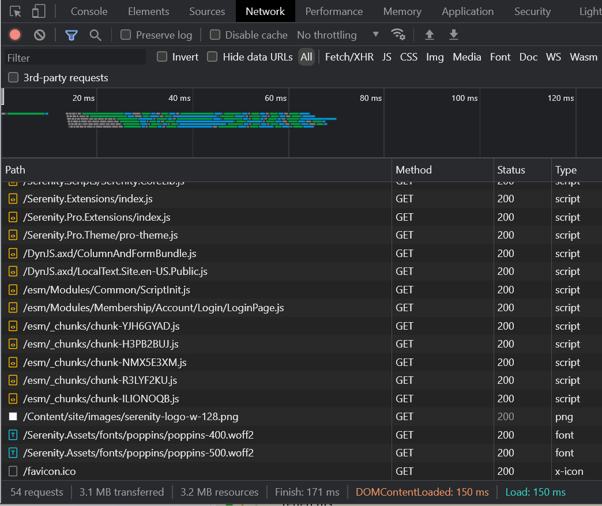
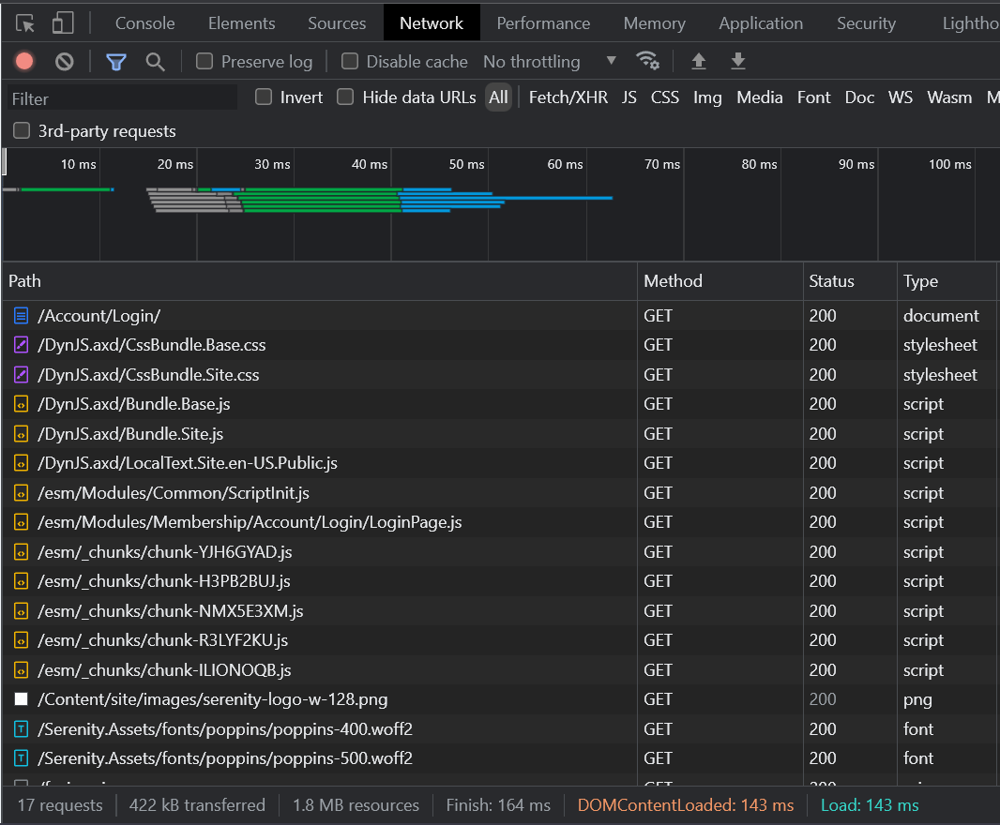

# How-To: Enable Script/Style Bundling

In Serene/StartSharp templates there are about 3MB+ of .js/.css files that are included by default in _LayoutHead.cshtml.



As seen in the screenshot above, `3.1 MB` is transferred over the network via 54 requests.

This might cause bandwidth and performance problems for some systems, especially when a Serenity-based site is accessed from mobile devices.

There are several ways to handle these problems, like minification and gzipping to decrease script size and bundling to pack scripts into fewer files, to reduce the number of requests.

Serenity comes with a script bundling and minification/compression system out of the box for globally included scripts/stylesheets. 

> The modular Javascript files served under `~/esm/` folder are handled, e.g. minified and bundled by `esbuild` itself so the information in this topic does not apply to them

### The `appsettings.bundles.json` File

The `appsettings.bundles.json` file at your project root contains the list of bundles and their contents for Javascript/Stylesheets.

```json
{
  "CssBundling": {
    "Bundles": {
      "Base": [
        "~/Serenity.Assets/fonts/poppins/poppins.css",
        "~/Serenity.Assets/fonts/open-sans/open-sans.css"
        //...
      ],
      "Site": [
        "~/Serenity.Assets/Content/jquery.fileupload.css",
        "~/Serenity.Assets/Content/colorbox/jquery.colorbox.css",
        "~/Content/site/site.css"
      ],
      "Pages/Dashboard": [
        "~/Serenity.Pro.Theme/pages/dashboard.css",
        "~/esm/Modules/Common/Dashboard/DashboardPage.css"
      ]
    }
  },
  "ScriptBundling": {
    "Bundles": {
      "Base": [
        "~/Serenity.Assets/nprogress/nprogress.js",
        "~/Serenity.Assets/jquery/jquery.js",
        //...
        "~/Serenity.Scripts/Serenity.CoreLib.js",
        "~/Serenity.Extensions/index.js",
        "~/Serenity.Pro.Extensions/index.js",
        "~/Serenity.Pro.Theme/pro-theme.js"
      ],
      //...
      "Site": [
        "dynamic://ColumnAndFormBundle"
      ]
    }
  }
}
```

Here we define several Script bundles, `Base` and `Site`, corresponding to `~/DynJS.axd/Bundle.Base.js` and `~/DynJS.axd/Bundle.Site.js` dynamic script files.

Similarly, there are several Style bundles defined including `Base`, `Site`, and `Pages/Dashboard` which corresponds to `~/DynJS.axd/BundleCss.Base.css`, `~/DynJS.axd/BundleCss.Site.css` and `~/DynJS.axd/BundleCss.Pages/Dashboard.css`.

The order of bundle contents is important as they are included in the order they are defined. You should consider dependencies when ordering the bundle contents. For example, a jQuery plugin should not be included before the `jQuery` itself is included.

## When Bundling is Disabled (Default)

These bundles are used in `_LayoutHead.cshtml` and some other places like the following:

```xml
//...
@Html.StyleBundle("Base" + rtl)
@Html.StyleBundle("Site")
@Html.ScriptBundle("Base")
@Html.ScriptBundle("Site")
//...
```

When bundling is disabled (it is by default), and if you look at the source of a page you'll see something like this:

```html
<link href="/Serenity.Assets/fonts/poppins/poppins.css?v=2023031912" 
    rel="stylesheet" type="text/css"/>
<link href="/Serenity.Assets/fonts/open-sans/open-sans.css?v=2023031912" 
    rel="stylesheet" type="text/css"/>
//...
<link href="/Serenity.Assets/Content/jquery.fileupload.css?v=2023031912" 
    rel="stylesheet" type="text/css"/>
<link href="/Serenity.Assets/Content/colorbox/jquery.colorbox.css?v=2023031912" 
    rel="stylesheet" type="text/css"/>
<link href="/Content/site/site.css?v=9Ce6PEyK88kLXTLEjUbZfA" 
    rel="stylesheet" type="text/css"/>
//...
<script src="/Serenity.Assets/nprogress/nprogress.js?v=2023031912" 
    type="text/javascript"></script>
<script src="/Serenity.Assets/jquery/jquery.js?v=2023031912" 
    type="text/javascript"></script>
//...
<script src="/Serenity.Pro.Theme/pro-theme.js?v=2023031912"
    type="text/javascript"></script>
<script src="/DynJS.axd/ColumnAndFormBundle.js?v=5W-I1I_Qc3-bxgy5ZY5dNQ" 
    type="text/javascript"></script>
```

The style files and scripts defined in the bundle definitions are included one after another while adding a special prefix `?v=2023031912` for the current date/time to invalidate the browser cache.

In this state, bundles are only used to define which scripts to include on the page.

### Enabling Bundling

You should enable bundling (especially minification) only in production. Otherwise, it might become very difficult to debug Javascript.

To enable bundling, just set the `ScriptBundling -> Enabled` and the `CssBundling -> Enabled` properties in the `appsettings.json` file to `true`:

```json
{
    "CssBundling": {
        "Enabled": true,
        "Minimize": true,
        "UseMinCss": true
    },
    "ScriptBundling": {
        "Enabled": true,
        "Minimize": true,
        "UseMinJs": true
    }
}
```

The `Minimize` option controls if the bundled scripts should be minified before bundling, and `UseMinJS` and `UseMinCSS` controls if there is a `sample.min.js` next to a `sample.js` file, it should be used instead of minifying the file again in memory.

NUglify library is used for minification. This will be applied before bundling/gzipping so our bundles will become about %40 smaller, but will be much harder to read, so enable this only in production.

When bundling is enabled, all these files are optionally minified, concatenated into bundle files in memory, GZip/Brotli compressed, and cached by their content hash. If you look at the page source now, it will change to this:

```html
<link href="/DynJS.axd/CssBundle.Base.css?v=kD-QTI_-sOPVn1xsZO8cVQ" 
    rel="stylesheet" type="text/css"/>
<link href="/DynJS.axd/CssBundle.Site.css?v=mHMeisU5pO7Mq7ZQDtAnhA" 
    rel="stylesheet" type="text/css"/>
<script src="/DynJS.axd/Bundle.Base.js?v=-SEDdefry-i_QyrN8U_7ow" 
    type="text/javascript"></script>
<script src="/DynJS.axd/Bundle.Site.js?v=w0am-CzW3EQfbVNaX1WDgg"
    type="text/javascript"></script>
```

So there are only 4 JS/CSS bundle files included on the page. And the URL for them includes a suffix like `?v=kD-QTI_-sOPVn1xsZO8cVQ` with actual hashes of the bundled files.

If we have another look at the network tab, we'll see there are now 17 requests with only 422 KB transferred instead of 3.1 MB before. An 85% reduction, which is not bad...



### What Is v=p53uqJ... In My Script Tags?

This is a version number; or HASH of your script. Whether bundling is enabled or not, when you use the `Html.Script` extension, it will add these hash to your script includes. This hash allows the browser to cache the script until it changes. When the content of a script changes, its hash will change too, so the browser won't cache and use an older version.

This is the reason you'll never have script caching problems with Serenity apps.
