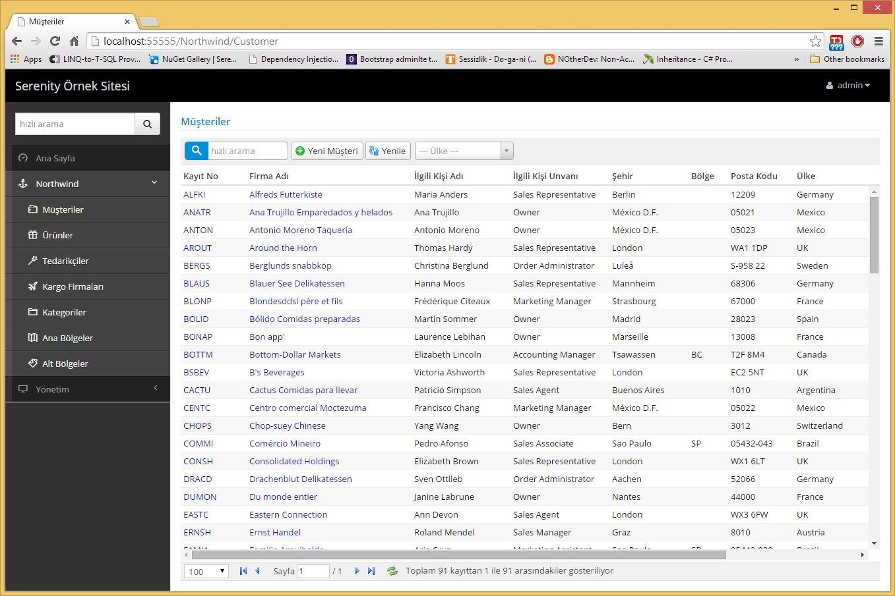

# Localization

> This section will be updated for Serenity v5

Most web applications must support a variety of languages. Sites like Youtube, Wikipedia, Facebook works in many languages.

First time a user visits such a site, a language for her is automatically chosen depending on the browser language (pre-determined by regional settings).

If automatic selection is not what they expect, users can set their preferred language and this selection is stored in a client-side cookie (or server side user profile table).

Once a language is chosen, all texts are displayed in the selected language.

Serenity platform is designed with localization in mind from the start.

If you are using *Serene / StartSharp* you can see this yourself by setting your browser language or 
changing the language under sidebar settings.

If you change to Turkish for example, and refresh your browser, you will the site in Turkish:

> Here, data is not translated but it is also possible to translate user entered data by some methods like culture extension tables.
