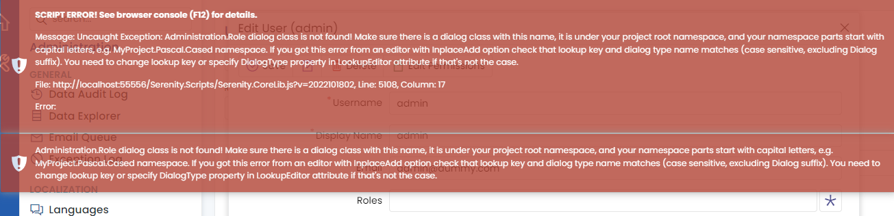
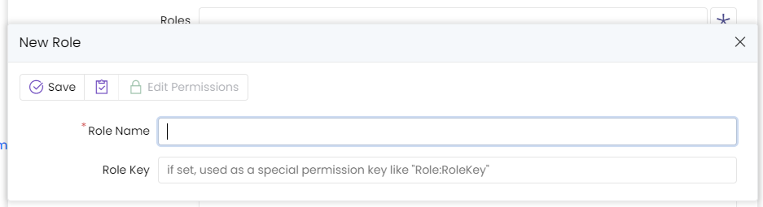

# Serenity 6.2.6 Release Notes (2022-10-18)

## Descending Columns were Sorted First When Multiple Sort Orders Defined (fixed in 6.2.5)

If there are multiple sorted columns defined in `Column.cs`:

```cs
public class SomeColumns
{
    [SortOrder(1)]
    public string Column1 { get; set;}
    [SortOrder(2, descending: true)]
    public string Column2 { get; set;}
}
```

Even though the grid was expected to be sorted by `Column1` followed by `Column2 DESC`, it was the opposite. E.g. the order was `Column2 DESC` followed by `Column1`.

This was caused because the way sort orders are passed to client side. Descending orders are passed as negative values, e.g. `Column2` actually has a sort order of `-2`.

Thus, when they were ordered, `-2 < 1` is true.

This is fixed with a simple `Math.abs()` call during initial sort order calculation (thanks RaportTrap, e.g. A.Schlögelhofer).

## Published `tsbuild` Helpers as `@serenity-is/tsbuild` Npm Package

We had a node script file called `tsbuild.js` which called the `esbuild` to compile `modular style TypeScript` code. The code in that file is now distributed as an npm package and `tsbuild.js` only imports that package so that we can later apply updates / fixes when required.

## Two Level Cache Group Expiration was Applied To More Groups Than Required

We have a `cache group key` based cache invalidation feature in `TwoLevelCache` system in Serenity. This allows expiring items that belong to a common group in distributed cache, without having to know the keys for all such cached items.

For example, if you have some cached data that is produced from `UserRow` records, like individual user information cached by id / username, it is possible to expire all such items when something in `User` row changes.

There is a `ExpireGroupItems` method which changes `the generation number` of `group` so that all cached items using the `old generation number` are automatically expired.

Save / Delete handlers calls this automatically for their entity type after the transaction is committed by making use of `InvalidateOnCommit` extension method.

During a batch update, where you may update multiple records in a transaction, this could cause group generation to be changed multiple times for the same entity type, and writing to the distributed cache multiple times as well. So we had an optimization that packs those generation changes to be only once per group key. 

This was working properly before the change to .NET dependency injection. Due to the way it was ported to .NET 5 DI, we noticed that it was causing unnecessary group key generation changes, ones that were origination from prior unrelated transactions.

So, for example if someone changes something in `Users` table, this helper would reset only the `Users` group generation as expected. But if another following call modifies the `Language` table, it would reset the cache for `Users` in addition to the `Language` table this time.

This is now fixed, but it could have some side effects. As the cache is no longer being reset for unreleated entities anymore, you may sometimes wonder why it was randomly resetting cache before the fix, and not anymore...


## Reverted Microsoft.Data.SqlClient from 4.1.0 back to 4.1.0 in sergen

In recent days, we had error reports from our users about `sergen` not being able to connect the SQL database due to some certificate issue. The solution for that was about adding a `TrustServerCertificate=true` in the connection string. 

But suprisingly, the portal could connect to the SQL server without that setting. So we investigated what could the cause for this, and only difference we could find was the version of `Microsoft.Data.SqlClient` package. While `sergen` had a direct reference to `Microsoft.Data.SqlClient 4.1.0` version, `StartSharp` and `Serene` was indirectly using `2.0.1` via `FluentMigrator` and `Sereniy.Data` packages.

A search in internet revealed the following document:

https://techcommunity.microsoft.com/t5/sql-server-blog/released-general-availability-of-microsoft-data-sqlclient-4-0/ba-p/2983346

So, `Encrypt=true` e.g. wire encryption for connection between the client and SQL server became the default for `Microsoft.Data.SqlClient` in versions `4.x+`. Encryption requires a `certificate`, and most SQL server installations had `local untrusted / development certificates`. Some older versions don't even support `encryption`.

As the document states, you are recommended to install a trusted certificate to your SQL server. If you can't, you may use `Encrypt=false` in your connection string, or `TrustServerCerticate=true` which are normally not recommended for security reasons.

We can understand their reasons, but this is serious breaking change, which only affected `sergen` as it used `4.1.0` version, so most users thought it is a problem with `sergen` itself.

We'll be using latest versions of `Microsoft.Data.SqlClient` in the future which is `5.x` as of moment. But we know that most users don't read the change logs so if we did that, it could affect them badly, especially if it only happened in production. So, for now we are reverting to latest `3.x` release which is `3.1.1`, both for `sergen` and `Serenity.Data`.

You may update `Microsoft.Data.SqlClient` version in your application, or set `Encrypt=true` in your connections strings now, if you want to use encrypted connections (recommended), or to see if it will work once we update the package ourselves.

## Added a `NodeScriptRunner` Class to `Serenity.Web` That Can Be Used to Run Node Scripts Like `tsbuild` on Application Startup

As you may already know, we are working on ES module support since 6.1 versions. Users would have to manually run `node tsbuild --watch` in their project directory during development, to get compile on save support for `esbuild` similar to TypeScript did with it's compileOnSave option.

We now added a `NodeScriptRunner` and relevant `IApplicationBuilder` extension method to handle this automatically. So, during application start, watching is started automatically, and you get output from esbuild in your console log. And once the application quits, the background watch process should also quit.

The blog post for ES modules switch is updated to reflect this:

https://serenity.is/blog/2022/10/15/switching-to-es-modules

This feature comes pre-enabled in projects created from StartSharp 6.2.6+. Others may enable it by following the directions in the post above.

## Inplace Add Dialog Types are Automatically Imported Into `Form.ts` Files Generated by Sergen / Pro.Coder

We have an `InplaceEdit` option and the corresponding `DialogType` property in `LookupEditor` attributes. When enabled, it shows a button next to the editor, and opens the specified dialog class on click which allows you to add / edit the records listed in the dropdown editor.

When the `DialogType` is not specified explicitly, we use the lookup key instead, as long as they match, e.g. if the lookup key is `Administration.Role` and the dialog class is `MyProject.Administration.RoleDialog`.

When using namespaces, it is possible to locate a dialog class by its full / partial name, by searching under global scope, e.g. `window`. 

But for ES module style dialogs, as they are not loaded into global scope, and they are not even loaded at all unless explicitly imported somewhere.

So, since switching to ES modules, inplace add feature was causing issues about dialog types when you click the inplace button, and what worked before magically seemed to not working anymore.

We developed workaround for that, as long as you use corresponding `Form.ts` files in your calling dialogs, which sergen automatically does while generating the code first time:

```ts
// UserDialog.ts
import { UserForm, UserRow, UserService } from "../";
//...

@Decorators.registerClass()
export class UserDialog extends EntityDialog<UserRow, any> {
    // ...

    protected form = new UserForm(this.idPrefix);
```

So here in `UserDialog` we are importing `UserForm` and using it. Note that importing is not enough, we also need to reference / use it somewhere, otherwise `esbuild` will simply erase the import in output.

Let's say you added `InplaceAdd = true` to `UserForm.cs` roles property:

```cs
    [FormScript("Administration.User")]
    public class UserForm
    {
        //...
        [LookupEditor(typeof(RoleRow), Multiple = true, InplaceAdd = true)]
        public List<int> Roles { get; set; }
    }
```

For this to work, there must be a way for the `Roles editor` in `UserDialog` to locate `RoleDialog` class. 

This form definition in C# is serialized to JSON and passed to client side, so the only thing `Roles editor` knows about the dialog type is a simple string: `Administration.Role`.

You click the inplace add button in `UserDialog`, it tries to find `YourProject.Administration.RoleDialog` but it can't, as the role dialog is defined in a module, not global namespace:




A manual workaround could be to manually import `RoleDialog` from the `UserDialog`:

```cs
// UserDialog.ts
import { UserForm, UserRow, UserService } from "../";
import { RoleDialog } from "../Role/RoleDialog";

RoleDialog.name.toString();

//...

@Decorators.registerClass()
export class UserDialog extends EntityDialog<UserRow, any> {
    // ...

    protected form = new UserForm(this.idPrefix);
```

This simply imports the RoleDialog, and pretends to be using it, so that it is not erased by `esbuild` / TypeScript.

Ok, but somehow this would not work, if the `@registerClass` decorator on `RoleDialog` did not include the full name:

```ts
@Decorators.registerClass()
export class RoleDialog extends EntityDialog<RoleRow, any> {
```

In the sample above, Serenity type registration knows nothing other than the class name is `RoleDialog` so it is not possible to match this class with a `Administration.RoleDialog` as there could be multiple `Role` dialog classes in different modules.

But in namespaces mode, as the class was placed in `StartSharp.Administration` namespace, Serenity could find its fullname by scanning the `window` (this is normally done on jQuery ready event). This is not possible with ES modules.

So, let's add the full name to registerClass call:

```ts
@Decorators.registerClass('StartSharp.Administration.RoleDialog')
export class RoleDialog extends EntityDialog<RoleRow, any> {
```

Now, we have our `RoleDialog` shown properly:



`Sergen`, after 6.2.6 will automatically add the full name to `registerClass` decorators it generates. But for your existing dialogs that you convert to manually, you'll need to set full name manually.

Anyway, even if doing this, we still need to `fake import` RoleDialog class into `UserDialog.ts` file.

To make it easier for our users who got used to have inplace add feature work like it was before, we are now generating these `fake imports` in `UserForm.ts` file:

```ts
import { RoleDialog } from "@/Administration/Role/RoleDialog";

export interface UserForm {
//..
}

export class UserForm extends PrefixedContext {
//..
}

[RoleDialog]; // inplace add dialog types
```

This should solve most of such cases, but you still need to add full name to `registerClass` decorators for the ES module dialog classes you use for inplace add.

## Sergen Adds Full Name to @registerClass Decorators in Generates

As stated in prior topic, `sergen` now adds the full name to `@registerClass` for newly generated modules, as it is a must for ES module classes to be registered properly:

```ts
@Decorators.registerClass('StartSharp.Administration.MyNewDialog')
export class MyNewDialog extends EntityDialog<RoleRow, any> {
```

For your existing classes, that you convert to ES modules, please add full name during conversion according to your project name, module name and class name.

## Send an Empty Source Map with 202 Status, Instead of 403

In `StartSharp 6.1.8` we added a `SourceMapSecurityMiddleware` so that you can optionally disable source maps in production.

As we returned a 403, e.g. not allowed response, there were some warnings shown in browser console, so we are now returning an empty source map instead with HTTP 200 status code, instead of 403.