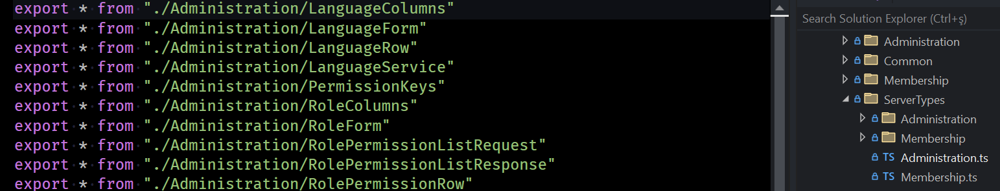

# Serenity 6.4.2 Release Notes (2022-12-09)

## Set Default for TOptions Generic Argument for Widget as Any (6.3.3)

The `Widget` class, which serves as the base class for all UI components, was originally defined as follows:

```ts
class Widget<TOptions> {
    // ...
}
```

Now, we have introduced a default value for the `TOptions` generic argument:

```ts
class Widget<TOptions = any> {
}
```

This change allows you to use it simply as "`Widget`" instead of "`Widget<any>`."

If you encounter an error message like:

```
Generic type `Widget<TOptions>` requires 1 type argument(s)
```

You should update the "`@serenity-is/corelib`" package in your `package.json` file to the latest version (6.3.3 or higher), execute "`npm install`," and then restart Visual Studio.

## Added Option to Disable Module Re-Exports in `sergen.json`

When generating `ServerTypes` for your modules, `Sergen` also generates module re-exports or module indexes, as illustrated in the following image:



These re-exports allow you to import multiple types from a module with a single import statement, like this:

```ts
import { RoleRow, UserColumns, UserRow, UserService } from "@/ServerTypes/Administration";
```

However, this approach means that your `Grid.ts` file will have an indirect dependency on all the types re-exported from the `Administration.ts` file. In this example, `LanguageColumns` and `RoleColumns` will also be imported, even if they are not used.

While tree-shaking should help reduce this effect, there may be cases where you prefer to avoid it. We have added an option to disable these re-export files in `sergen.json` if desired:

```json
{
    "ServerTypings": {
        "ModuleReExports": false
    }
}
```

## Better Detection for Formatter Types for Client Types Transform (6.3.5)

In some cases, especially when your custom formatter type is defined in an ES module (ESM), attributes corresponding to the formatter types may not have been generated.

We have now improved the detection process to include more interface matches, such as:

- `@serenity-is/corelib:Formatter`
- `@serenity-is/corelib/slick:Formatter`

We also expanded the list of attribute types to detect, including:

- `@serenity-is/corelib:Decorators.registerFormatter`
- `Decorators.registerFormatter`
- `registerFormatter`

## Fixed SleekGrid Auto Column Hints Plugin

`SleekGrid` is our ES6 rewrite of SlickGrid. We made an effort to drop the `jQuery` dependency and make it optional. This means that if `jQuery` is available in the global scope, `SleekGrid` can utilize it.

We initially used `addEventHandler` calls to bind events, as they work both with and without jQuery. However, this approach led to some unexpected side effects.

While we rewrote the core and grid classes in ES6, not all plugins have been converted to ES modules yet. Some plugins, including the `AutoTooltips` plugin, are still used from the legacy SlickGrid code and are dependent on jQuery and its synthetic event system.

As a result, tooltips were not displayed when hovering over cells with overflowed text content.

To address this issue, we have transitioned to using `jQuery.on` to bind events when jQuery is available, instead of the `addEventHandler` calls, in order to resolve such issues.

These changes should improve the clarity and readability of your release notes.

## Fixed RTL Mode Scroll Column Rendering (6.3.6, SleekGrid 1.4.4)

Originally, `SlickGrid` did not support `RTL` mode. Several years ago, we made modifications to the original SlickGrid code to introduce experimental RTL support.

As reported in this issue:

[GitHub Issue #6595](https://github.com/serenity-is/Serenity/issues/6595)

`SleekGrid` had issues with rendering when performing horizontal scrolling in RTL and mobile mode, such as on narrow screens. 

Initially, we suspected this problem to be a bug introduced by our `SleekGrid` rewrite, but it turned out that it was not the case.

It appears that this bug has existed for years, even with our old `SlickGrid` code, and it was only reported recently.

The root cause was the browser returning `scrollLeft` as a negative number in RTL mode. We have resolved this issue by taking the absolute value of the `scrollLeft`.

## Added XML Docs for Serenity.Net.Services / Serenity.Net.Web

While we had XML doc comments for the `Serenity.Net.Core`, `Serenity.Net.Data`, and `Serenity.Net.Entity` libraries, we were lacking them for `Serenity.Net.Services` and `Serenity.Net.Web`.

Now, all these libraries are equipped with XML comments, and the API reference documentation ([Serenity API Reference](https://serenity.is/docs/api/dotnet/Serenity.Net.Web/README)) contains descriptions for all classes, methods, and properties.

## Updated Serenity Docs Topics for .NET 6 and ES Modules

Some of the documentation topics on our website were outdated, designed for older Serenity versions, or created for the `Namespace` style instead of the newer `ES Modules` style, as demonstrated in our `Movie Tutorial`.

Serene has now adopted ES modules as the default approach, and the `Movie Tutorial` has been updated to reflect this change.

We have revised various topics, including `Introduction`, `DI`, `Configuration`, `Authentication`, `Localization`, `Caching`, and `Connections`. While there are a few topics that still require updating, we aim to complete this process as soon as possible.

## jQuery Path in the `Serenity.Assets` Package Has Changed

Previously, `jQuery` was included from the following path:

```json
// appsettings.bundles.json
"~/Serenity.Assets/Scripts/jquery-{version}.js",
```

The use of the `Scripts` folder and `{version}` suffix was derived from the default installation locations of the `jQuery NuGet` packages. We had previously used third-party `NuGet` packages to acquire static script libraries. However, we have now transitioned to using the `Libman` tool (Microsoft Library Manager) and our `Serenity.Assets` package for installing and updating static scripts, including `Bootstrap` and `jQuery`, as web assets. We have retained the original file structure for compatibility.

jQuery is now located at:

```json
// appsettings.bundles.json
"~/Serenity.Assets/jquery/jquery.js",
```

We recommend updating your inclusions in the `appsettings.bundles.json` file accordingly.

## Bootstrap and jQuery Updates

We have updated Bootstrap to version 5.2.3 and jQuery to version 3.6.1. Bootstrap remains in its previous location within the `Serenity.Assets` package. However, please take note of the change in the jQuery path, as mentioned above.

## Introduction of Full Set of Undelete Handler-Related Types and Behaviors (6.4.0)

While we had established request handlers and service behaviors for operations like `Retrieve`, `List`, `Save`, and `Delete`, there was a noticeable absence of similar interfaces and service behaviors for the `Undelete` operation.

Starting from version 6.4.0, we have introduced a comprehensive set of dependency-injectable request handlers and relevant service behaviors for undelete operations.

```cs
namespace Serenity.Services
{
    public interface IUndeleteBehavior
    {
        void OnPrepareQuery(IUndeleteRequestHandler handler, SqlQuery query);
        void OnValidateRequest(IUndeleteRequestHandler handler);
        //...
    }

    public interface IUndeleteHandler<TRow, TUndeleteRequest, 
        TUndeleteResponse>
        : IRequestHandler<TRow, TUndeleteRequest, TUndeleteResponse>
        where TRow : class, IRow, new()
        where TUndeleteRequest : UndeleteRequest
        where TUndeleteResponse : UndeleteResponse, new()
    {
        TUndeleteResponse Undelete(IUnitOfWork uow, 
            TUndeleteRequest request);
    }

    //....
```


## Breaking Change - Changes to `IUploadStorage.CopyFrom` and `IUploadStorage.WriteFile` Method Parameters

Our upload storage abstraction, named `IUploadStorage`, used to have the following two methods, among others:

```cs
public interface IUploadStorage
{
    string CopyFrom(IUploadStorage sourceStorage, 
        string sourcePath, string targetPath, bool? autoRename);

    string WriteFile(string path, Stream source,
        bool? autoRename);
```

The last parameter, named `autoRename`, was somewhat unclear regarding its purpose.

- If passed `false`, the upload storage was expected to raise an exception if a file with the same path existed.

- If passed `true`, the upload storage would attempt to find a suitable name like `File (2).jpg` if a file at the same path existed.

- If passed null, the upload storage would overwrite the existing file.

We have introduced an `OverwriteOption` enumeration to clarify this:

```cs
public enum OverwriteOption
{
    /// <summary>Raise an error</summary>
    Disallowed = 0,
    /// <summary>Overwrite the target file</summary>
    Overwrite = 1,
    /// <summary>Try to find a suitable name</summary>
    AutoRename = 2
}
```

Now, we use this enumeration instead of the `autoRename` flag:

```cs
public interface IUploadStorage
{
    string CopyFrom(IUploadStorage sourceStorage, 
        string sourcePath, string targetPath, OverwriteOption overwrite);

    string WriteFile(string path, Stream source, 
        OverwriteOption overwrite);
```

This change should only affect you if you've implemented a custom `IUploadStorage` object previously. Otherwise, it should not cause any issues, as we have also added extension methods (though obsolete) with the `autoRename` flag for compatibility.

## Switch to PNPM from NPM for Serenity Projects

This change should not impact you unless you are using `Serenity` as a submodule or copying projects like `common-features`, `pro-features`, etc., into your solution.

`PNPM` is a superior, faster, more efficient, and straightforward alternative to NPM. After encountering some NPM version issues, we decided to give `PNPM` a try:

- [https://pnpm.io/](https://pnpm.io/)

While StartSharp and Serene still use `npm` as we wanted to conduct further testing with `PNPM` before recommending it to our customers, you may install `PNPM` via NPM:

```cmd
npm install -g pnpm
```

Alternatively, you can follow the installation instructions at:

- [https://pnpm.io/installation](https://pnpm.io/installation)

## Interface Checks Via `Q.isAssignableFrom` Now Use Type Names Instead of Relying Solely on Object References

During our process of writing `JEST` tests for Serenity using `esbuild`, we encountered some errors related to missing types, such as formatters. Upon investigation, we discovered that `@serenity-is/corelib/q`, specifically the `Q` helper, and certain interface classes existed in multiple memory copies. This issue arose because `esbuild` bundled `Q` and other packages into multiple intermediate output files.

While this problem was primarily a configuration issue, we recognized that it might affect our users in the future, even if we resolved it for ourselves. In addition to rectifying the `esbuild` configuration, we implemented a workaround that allows us to identify formatter types and marker interfaces, even when they exist in multiple memory copies or are included in multiple bundles.

To achieve this, we check their registration names. For instance, if two separate copies of the `ISlickFormatter` interface have the same registration name, such as `Serenity.ISlickFormatter`, they are considered a match. Consequently, `FormatterTypeRegistry.get()` can now locate formatters defined in another bundle, even if the marker interfaces for them differ.

## Abstracting the SixLabors.ImageSharp Dependency (6.4.0)

We have switched to using `SixLabors.ImageSharp` instead of `System.Drawing`, as the latter does not function properly in environments like `Linux`. The primary use of this library is for image scaling during uploads and thumbnail generation.

However, please note that `SixLabors.ImageSharp` recently modified its licensing terms, potentially requiring us to switch to another library if it becomes incompatible with our MIT (Serenity/Serene) or commercial (StartSharp) licenses. Instead of having a hard-coded dependency on `SixLabors` or another library, we have abstracted the dependency through the introduction of a new `IImageProcessor` interface:

```cs
(int width, int height) GetImageSize(object image);

object Load(Stream source, out ImageFormatInfo formatInfo);

object Scale(object image, int width, height,
    ImageScaleMode mode, string backgroundColor, bool inplace);

void Save(object image, Stream target, string mimeType, 
    ImageEncoderParams encoderParams);
```

This interface contains only the fundamental methods required for processing uploaded images. It offers the flexibility to switch to another library in the future if necessary. You can also use a completely different library through dependency injection or customize the default one to suit your specific needs.

## The `UploadProcessor` Class is Obsolete and Replaced with `IUploadProcessor` Abstraction

The `UploadProcessor` class used in the temporary upload method in `FilePage.cs` has been marked as obsolete.

You should now inject the new `IUploadProcessor` interface and utilize it within the `HandleUploadRequest` method as follows:

```cs
public class FileController : Controller
{
    private readonly IUploadStorage uploadStorage;
    private readonly IUploadProcessor uploadProcessor;

    public FileController(IUploadStorage uploadStorage, 
        IUploadProcessor uploadProcessor)
    {
        //...
        this.uploadProcessor = uploadProcessor ?? 
            throw new ArgumentNullException(nameof(uploadProcessor));
    }

    [NonAction]
    private ServiceResponse HandleUploadRequest(HttpContext context)
    {
        // ...
        IUploadOptions uploadOptions = new UploadOptions
        {
            ThumbWidth = 128,
            ThumbHeight = 96,
            ThumbMode = ImageScaleMode.PreserveRatioNoFill
        };

        var uploadIntent = Request.Query["uploadIntent"];
        if (!string.IsNullOrEmpty(uploadIntent))
        {
            // Modify uploadOptions here based on uploadIntent if desired.
        }

        var uploadInfo = uploadProcessor.Process(file.OpenReadStream(),
            file.FileName, uploadOptions);
    }
}
```

## Added Optional `UploadIntent` Property to Upload Editor Attributes

Previously, options specified on an upload editor, such as `ImageUploadEditor(...)`, had no impact on temporary uploads. This disconnect between temporary upload processing and the editor caused the temporary upload to lack constraint checking based on the editor's attributes.

For instance, consider a property defined in one of your rows like this:

```cs
[FileUploadEditor(MinSize = 1_000, MaxSize = 10_000_000)]
public string SomeFile { get; set; }
```

This property is meant to restrict files to be between 1KB and 10MB in size. However, during the initial temporary upload, there was no way to apply these constraints.

To address this, we've introduced a new `UploadIntent` property that you can pass to upload editors. This property gets passed back to the temporary upload method via the query string and helps connect the temporary upload to the editor's attributes. Here's how it works:

```cs
Here are the improved release notes with grammar fixes:

```cs
var processor = new UploadProcessor(UploadStorage, Logger)
{
    ThumbWidth = 128,
    ThumbHeight = 96
};
```

There are no file size constraints here, other than the thumb width/height to generate. Even if you specify the thumb size in the upload editor attribute, it won't be used during temporary upload.

When you click the `Save` button, the upload behavior kicks in, locates the editor attribute, and checks constraints.

However, until you click the `Save` button, you won't know that the file you're uploading does not conform to the constraints.

This may not be very critical, but showing the error early to the end user might be helpful, especially when the form is extensive and has multiple upload editors.

We now have a free-form string property called `UploadIntent` that you may pass to upload editors. They will pass it back to the temporary upload method via the query string:

```cs
// In SomeRow.cs
// ...
[FileUploadEditor(MinSize = 1_000, MaxSize = 10_000_000, UploadIntent = "ProfileImage")]
public string SomeFile { get; set; }
// ...

// In FilePage.cs
IUploadOptions uploadOptions = new UploadOptions
{
    ThumbWidth = 128,
    ThumbHeight = 96,
    ThumbMode = ImageScaleMode.PreserveRatioNoFill
};

var uploadIntent = Request.Query["uploadIntent"];
if (!string.IsNullOrEmpty(uploadIntent))
{
    // Modify uploadOptions based on uploadIntent as needed
    switch (uploadIntent)
    {
        case "ProfileImage":
            var attr = typeof(SomeRow).GetProperty("SomeFile")
                .GetAttribute<FileUploadEditor>();
            uploadOptions.MinSize = attr.MinSize;
            uploadOptions.MaxSize = attr.MaxSize;
            // ...
            break;
    }
}
```

## Restructured Upload Editor Interfaces and Introduced `BaseUploadEditorAttribute` (6.4.0)

Starting with the changes initiated in 6.3.0 and further refined in 6.4.0, we have restructured the upload editor attributes and their associated interfaces to enhance functionality and flexibility.

Here are the key changes and components:

### New Interfaces for Upload Editors

- `IUploadEditor`
   - This serves as a marker interface for all upload editor attributes.
   - It includes properties like `IsMultiple`, `DisableDefaultBehavior`, and `UploadIntent`.

- `IUploadFileConstraints`
   - It covers constraints on file uploads, including options like `AllowNonImage`, `AllowedExtensions`, `ExtensionBlacklist`, `ImageExtensions`, `MaxSize`, and `MinSize`.
   - You can customize which file types are allowed, set size limits, and more.

- `IUploadFileOptions`
   - This interface is dedicated to additional file options, such as `CopyToHistory`, `DisplayFileName`, and `FilenameFormat`.

- `IUploadImageConstraints`
   - These constraints are applied when a file is classified as an image.
   - They encompass properties like `MinWidth`, `MaxWidth`, `MinHeight`, `MaxHeight`, `IgnoreExtensionMismatch`, `IgnoreEmptyBitmap`, and `IgnoreInvalidImage`.

- `IUploadImageOptions`
   - This interface is used for customizing image-specific options like `ThumbWidth`, `ThumbQuality`, and `ScaleWidth`.

### Implementation in Upload Editors

All upload editors now implement these interfaces. Furthermore, they derive from a common base abstract class known as `BaseUploadEditorAttribute`. You have the flexibility to create custom upload editor attributes by subclassing this base class.

### `UploadOptions` Class

To simplify the management of upload editor attribute properties, we've introduced the `UploadOptions` class. This class implements all the upload interfaces except `IUploadEditor` since it's not relevant for temporary uploads. It also provides default values for properties like `ImageExtensions`.

The `UploadOptions` class plays a crucial role in `FilePage`, as it initializes defaults for temporary uploads and allows for customization through the `UploadIntent`.

### Customizable `IFilenameFormatSanitizer`

We've also introduced the `IFilenameFormatSanitizer` interface, which can be injected via dependency injection (DI). This interface allows you to customize the sanitization behavior for file name format strings containing placeholders, such as `|SomeField|/|AnotherField|`.

The restructuring of upload editor interfaces and the introduction of `BaseUploadEditorAttribute` and `UploadOptions` simplify the customization process, while the `IFilenameFormatSanitizer` interface provides additional control for file name formatting.