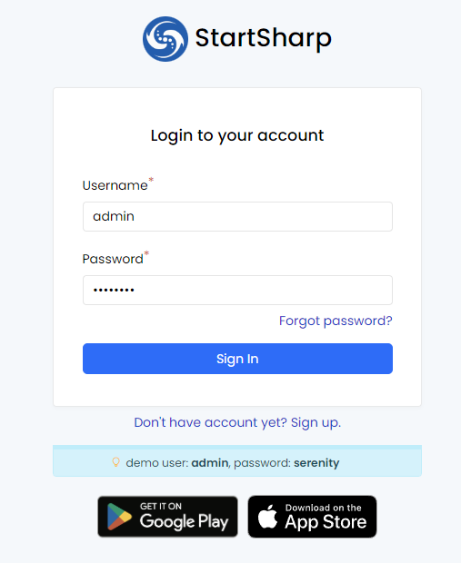
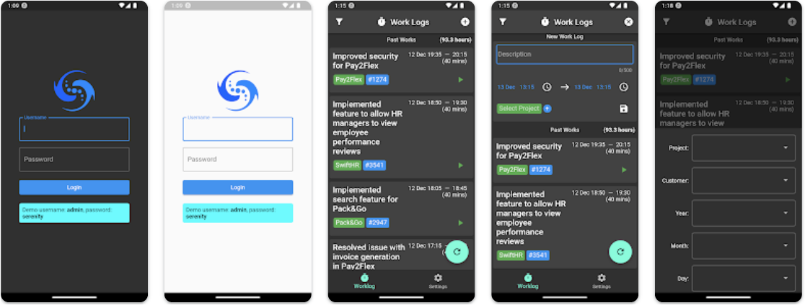

# Serenity 6.4.3 Release Notes (2023-01-07)

## Flutter-Based Mobile Applications for Android/iOS [StartSharp Enterprise]

You can now try out our new `Flutter`-based mobile applications at https://demo.serenity.is. 



These samples demonstrate integration with Serenity application services using OpenID Connect/JWT authentication and include the WorkLog module implementation, localization, and dark theme options.



Please note that the source code and support for the mobile application are only available to `StartSharp Enterprise` customers.

## OpenIddict Integration and JWT Authentication Options [StartSharp]

We have introduced a new package called `Serenity.Pro.OpenIddict` for StartSharp customers. It enables JWT authentication using the `OpenID Connect` protocol.

To enable `OpenIddict` in a new StartSharp project, you can simply set the `Enabled` flag to `true` in the `appsettings.json` file:

```json
OpenIdSettings: {
    `Enabled`: true
}
```

We will be preparing a document with instructions on how to add OpenId integration to an existing StartSharp project.

## Introduced AutoValidateAntiforgeryIgnoreBearerFilter Attribute

Antiforgery in ASP.NET Core is a mechanism to prevent request forgery attacks. You can learn more about it at the following link:

https://learn.microsoft.com/en-us/aspnet/core/security/anti-request-forgery?view=aspnetcore-7.0

When using `Cookies` authentication, the anti-forgery tokens mechanism in ASP.NET Core helps to protect against such attacks. However, when using `JWT` and `Bearer` authentication headers, it is still necessary to validate the anti-forgery token, which can make it difficult to call services from mobile applications.

To address this issue, we have introduced a new attribute called `AutoValidateAntiforgeryIgnoreBearerAttribute` that you can use instead of `AutoValidateAntiforgeryTokenAttribute` in the `Startup.cs` file:

```diff
- options.Filters.Add(typeof(AutoValidateAntiforgeryTokenAttribute));
+ options.Filters.Add(typeof(AutoValidateAntiforgeryIgnoreBearerAttribute));
```

Unlike AutoValidateAntifogeryTokenAttribute, AutoValidateAntiforgeryIgnoreBearerAttribute will skip anti-forgery validation if the request contains an Authentication: Bearer header and does not contain any cookie headers.

We believe that this change will not introduce any security holes, as we believe that XCSRF attacks are not possible with such requests. However, if you are concerned about this risk, you should not use this attribute.

## New Glassy Light Theme [StartSharp]

We added a new theme called `Glassy Light (glassy-light)` with a background and transparency effects to `Serenity.Pro.Theme`:


## [BREAKING CHANGE] `Q.getTypeName` is renamed to `Q.getTypeShortName`

The full name for a type registered with `@Decorators.registerClass` can typically be accessed using `Q.getTypeFullName`. Previously, we had a `Q.getTypeName` method that returned only the name portion (e.g. without the namespace), similar to the `Type.Name` property in .NET. However, we noticed that this method was often confused with `getTypeFullName`, so it has been renamed to `Q.getTypeShortName`.

We have also improved the handling of some internal type properties, such as the `__typeName` static property which stored the full name for registered types. This property is now non-enumerable, along with its internal counterpart `__typeName$`, which has been removed. These properties were originally necessary for TypeScript/Saltaralle and older browsers like IE9, but we no longer support them.

## Improved Handling for Type Registries like `EnumTypeRegistry`, `EditorTypeRegistry`, and `FormatterTypeRegistry`.

The Serenity type-system uses various type registries to locate types such as editors and enums by their registration names or keys. There is also a `Q.initTypes` method that is called after the `document.ready` event and scans the global object (`window`) to discover types.

Some of the registries did not function correctly if the initialization method was not executed, or if they were unable to find types that were registered or loaded after the initialization method ran (e.g. dynamically loaded scripts or dynamic imports). This caused issues from time to time, particularly after switching to ES modules.

All of the type registries have been rewritten to use a unified discovery mechanism and can locate types that are dynamically loaded after initialization or even if the initialization method has not yet been executed, as long as the types have decorators like `registerClass` with a proper key.

This should significantly reduce the occurrence of error messages such as `Editor XYZ could not be found`, etc. In rare cases where the system does not work, you will at least receive a more informative error message like the following:

```
SomeSampleName formatter class not found! 
Make sure there is such a formatter type under the project root namespace,
and its namespace parts start with capital letters like MyProject.MyModule.MyFormatter.

If using ES modules, make sure the formatter type has a decorator like 
@Decorators.registerFormatter('MyProject.MyModule.MyFormatter') with the full name of your formatter type and "side-effect-import" this formatter class from the current "page.ts/grid.ts/dialog.ts file (import "./thepath/to/MyFormatter.ts").

After applying fixes, build and run "node ./tsbuild.js" (or "tsc" if using namespaces) from the project folder.
```

## [BREAKING CHANGE] Toastr Notification Functions like `Q.notifyError` Will Escape HTML by Default

The notification library that we rely on, Toastr, did not HTML-escape messages by default, making it vulnerable to HTML script injection attacks if untrusted user input was passed to notification methods such as `Q.notifyAlert`, etc. While recent versions of Toastr have added an escape option, it is not the default.

To address this issue, we now HTML-escape any message strings passed to these functions by default and set Toastr's default HTML escape option to true.

This change may cause issues if you were using one of these methods and expected it to accept HTML input, as Toastr does by default. In this case, you will need to pass `escapeHtml: false` (after evaluating the risks and manually escaping any user input) to continue accepting HTML input.

```ts
Q.notifyAlert(`<p>Some html message<b>User Entered:</b> ${htmlEncode(userInput)}</p>`, { escapeHtml: false });
```

## Removed jQuery ScrollIntoView Dependency

When you click a category link in a Serenity form, we scroll the relevant category into view using the native JavaScript version (if the jQuery `scrollintoview` plugin is not available).

You may remove the following script from appsettings.bundles.json:

```json
"~/Serenity.Assets/Scripts/jquery.scrollintoview.js",
```

## Removed `jquery.iframe-transport.js` Dependency

This script was previously used by `jquery.fileupload` for older browsers like IE 9, but it is no longer necessary as we no longer support Internet Explorer.

You may remove it from appsettings.bundles.json:

```json
"~/Serenity.Assets/Scripts/jquery.iframe-transport.js",
```

## Removed `Serenity.Pro.UI.js` Dependency [StartSharp]

Serenity.Pro.UI is a legacy project which integrates Serenity Widgets as React components. It is currently used only by the Email client sample. If you don't use it, you may safely remove it from your bundles:

```json
"~/Serenity.Pro.UI/index.js",
```

The email client sample is currently being rewritten with ES modules, and after that is completed, Serenity.Pro.UI will become obsolete.

## Removed TemplateBundle, Introduced ColumnAndFormBundle

You may have the following bundle definition in your `appsettings.bundles.json`:

```json
"Site": [
    "dynamic://ColumnsBundle",
    "dynamic://FormBundle",
    "dynamic://TemplateBundle"
    "dynamic://FormBundle",
    //...
]
```
`TemplateBundle` contained dialog, etc. templates that were defined in `*.ts.html` or `.Template.html` files. These templates are no longer used and if you don't have any such files in your project, you can safely remove that bundle.

`ColumnsBundle` and `FormBundle` contained the columns and form definitions. They are still necessary, but are now available in a combination bundle named `ColumnAndFormBundle`. You can replace the bundle definition above with the following:

```json
"Site": [
    "dynamic://ColumnAndFormBundle",
    //...
]
```

## Rewrote Dashboard with ES Modules [StartSharp]

As part of our transition to ES modules, we rewrote the Dashboard page using ES modules. We removed many legacy and out-of-date components such as `jquery.knob`, `jquery.icheck`, `jquery.sparkline`, and `jvectormap`, and used modern alternatives like `ChartJS` and `jsvectormap` instead.

In combination with using data URIs for profile images and the `WEBP` image format, which provides much better compression than `PNG` and `JPG`, the size of the Dashboard page has been dramatically reduced.

See the latest `DashboardIndex.cshtml` and `DashboardPage.ts` in the StartSharp repository for more information.

## GroupItemMetadataProvider is Ported to ES Modules

We are continuing to port plugins of SlickGrid to SleekGrid and ES modules, with the latest being `GroupItemMetadataProvider`.

This plugin now includes the ability to show totals directly on the group rows, in addition to or instead of separate total rows which are not normally visible when groups are collapsed. A StartSharp sample is in progress...

## Q.alert, Q.confirm Methods Are Suffixed with `Dialog`

The methods in the `Q` namespace (@serenity-is/corelib/q) that show message dialogs, such as `alert`, `confirm`, and `prompt`, were getting mixed up with the browser's default methods with the same names, especially after the switch to ES modules because they no longer have the `Q.` namespace prefix.

To avoid this issue, we have suffixed them with `Dialog`, e.g. `Q.alert` became `Q.alertDialog`, `Q.confirm` became `Q.confirmDialog`.

The old functions are still available for now, but they are obsolete and you should avoid using them.

## TsBuild Trigger Argument is Now Obsolete

You might have the following in your package.json:

```json
"scripts": {
    "prepare": "node ./tsbuild.js --trigger"
```

This allowed us to restore ES module typings from your project and package references to the `node_modules` directory after running the `npm install` command. Because the `npm install` command deleted the fake module folders we created, we had to recreate them after install was completed. 

To trigger the target that handles restoration, we created a fake `_trigger.ts` file. This caused Visual Studio to run a design-time build as its file system watcher detected a change in a TypeScript file. However, this method did not work properly if Visual Studio was not open during the `npm install` and we have now found a better way to handle this issue.

```json
"scripts": {
    "prepare": "dotnet build -target:RestoreTypings"
```
This runs the `RestoreTypings` target via `MSBuild` directly, rather than relying on Visual Studio's behavior.

## [BREAKING CHANGE] Some Row Properties Are Only Available via IRow or IEditableRow Interface

In the base `Row` class, there are many properties and methods, such as `TrackWithChecks`, `TrackAssignments`, `IdField`, `NameField`, `IgnoreConstraints`, and `IsAnyFieldAssigned`, that are mostly implementation details and are rarely used. However, they still appear in IntelliSense when viewing the member list of an entity in Visual Studio.

Even though our `JsonRowConverter` omits these properties during serialization/deserialization, `System.Text.Json` (which we will be switching to soon) and several third-party tools such as `ApiExplorer`, which is used by `Swagger`, consider them to be properties that should be passed to/from service requests. This can even break the Swagger UI as it tries to traverse the `IdField` and `NameField` properties, which may contain circular references through `RowFields` and `Joins` metadata.

These properties are now only available explicitly via the `IRow` interface. If you accessed them directly, you may need to cast your object, for example `"((IRow)myRow).IdField"` instead of `"myRow.IdField"`.

There was also another set of properties that were only intended to be used with desktop applications such as WinForms and WPF, including `BeginEdit`, `EndEdit`, `IsAnyFieldChanged`, and `PreviousValues`. These properties are now only available via the `IEditableRow` interface.

## Issues Causing Swagger UI to Fail is Resolved

Several changes were made to the `Row` class, including making some properties only available via the `IRow` interface, to improve the completion list for row instances and resolve issues with Swagger integration.

Other changes to the way `ServiceEndpoint` actions handle parameter binding should also resolve several issues with Swagger, such as expecting the service request object to be passed from the query string instead of the request body and assuming that `IDbConnection` and `IUnitOfWork` arguments are passed from the client.

While Swagger is not required to make your services available to third parties, it can be a useful tool for providing a user-friendly interface for others to discover and try your API.

We have not enabled Swagger by default in `StartSharp`, as we believe it is not needed by most users. However, we will be adding a tutorial on enabling Swagger integration in the `StartSharp` repository for those who are interested.

## [BREAKING CHANGE] `Slick.Event` is renamed to `Slick.EventEmitter`, and `Slick.EventHandler` is renamed to `Slick.EventSubscriber`

Similar to `Q.alert` style of functions, `Event` and `EventHandler` types in the `Slick` namespace were causing confusion with the default browser types. To resolve this, the following renames were made:

- `Slick.Event` was changed to `Slick.EventEmitter`
- `Slick.EventHandler` was changed to `Slick.EventSubscriber`
- `Slick.Handler` was changed to `Slick.EventListener`

Note that these types are typically only used with the `SleekGrid` and `Serenity` libraries. If you have used the old names, you may need to apply these changes.

The old names are still available at runtime for compatibility with legacy plugins, but the type names are not present in the TypeScript declarations.

## Added `TransactionSettings` with `IsolationLevel` and `DeferStart` Options

There is a new option type called `TransactionSettings`, which includes the following properties:

```cs
public class TransactionSettings
{
    public IsolationLevel? IsolationLevel { get; set; }
    public bool? DeferStart { get; set; }
}
```

It is used to control the `UnitOfWork` transaction parameters that are automatically created in `ServiceEndpoint` actions when the action includes an `IUnitOfWork` typed parameter:

```cs
public SaveResponse Update(IUnitOfWork uow, SaveRequest<MyRow> request)
```

When an action includes an `IUnitOfWork` parameter, Serenity will automatically create an `UnitOfWork` object, which wraps a database transaction. You can now use the new `TransactionSettingsAttribute` to override the transaction isolation level and defer transaction start options for actions or their controllers:

```cs
[TransactionSettings(IsolationLevel.ReadComitted, DeferStart = true)]
public class SomeController : ServiceEndpoint
{
    public SaveResponse Update(IUnitOfWork uow, SaveRequest<MyRow> request)
}
```

The `UnitOfWork` constructor now includes optional `IsolationLevel` and `DeferStart` arguments that control the transaction isolation level and whether to defer the start of the transaction.

The default for `IsolationLevel` is `Unspecified` which means the isolation level is determined by the connection provider as it was before.

By default, when a `UnitOfWork` object is created, the connection is opened and the transaction is started. This means that even if the method or request handler being called does not need to open a connection or start a transaction, it will still be done.

For example, if a save handler receives an entity with a null value for a non-null field, it will raise a validation error before any database operations are performed. In this case, the connection and transaction are not needed, but they are still created in the calling action.

This is not a problem for actions with an `IDbConnection` argument, as the connections are not opened until they are needed. However, `UnitOfWork` objects had to open the connection and start the transaction in their constructor. 

The `DeferStart` argument allows you to delay starting the transaction until the connection is opened. The `StateChange` event of the `DbConnection` is used to detect when the transaction is needed for the first time, such as when the connection state changes to `Open`.

The default behavior is still to start the transaction immediately, as this has been the previous behavior, and changing it may have unexpected side effects. However, if you are aware of the potential risks and want to override the default behavior, you can do so in the `Startup.cs` file:

```cs
services.Configure<TransactionSettings>(opt => opt.DeferStart = true);
```

## Improved `TSTypeLister` Performance

The `TSTypeLister` class is used by `sergen` and `Serenity.Pro.Coder` to extract types from the `TypeScript` files in your project. It first needs to identify the list of included files in your `tsconfig.json`, which it does by performing a directory scan for `.ts` files in your project directory.

Previously, this directory scan would include full scans of large folders such as `node_modules`, `obj`, `bin`, etc., even if the `tsconfig.json` included a pattern like `Modules/**/*` in the `includes` field.

We have now optimized the directory scanner to avoid unnecessary scans of these large folders when such an `includes` pattern is present. This can lead to significant improvements in build time, particularly for source generators that are executed in the background for every change in the source code. In some projects, we have seen a 10x improvement, with transform durations dropping from 5 seconds to 500ms.
