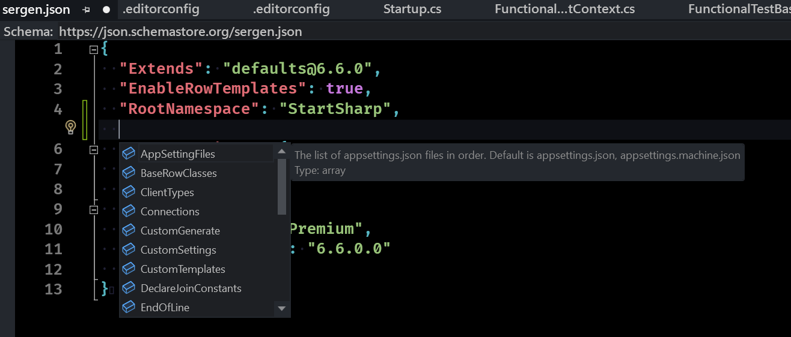

# Serenity 6.6.0 Release Notes (2023-03-15)

## New Criteria Builder for TypeScript

Unlike C#, JavaScript lacks the operator overloading feature, which led to the need for a different approach to designing the Criteria system on the client side.

We also chose to use an array-based format for passing Criteria objects from the browser to the server. On the server, Criteria objects are structured in a polymorphic tree format. The format we selected for JavaScript is designed to be easily JSON serializable/deserializable while preserving the types of constant values such as numbers, strings, booleans, etc.

For example, `[["Amount"], '>=', 5]` corresponds to a criteria expression `Amount >= 5`. Note the additional parentheses around `"Amount"`. Without them, it would correspond to a criteria expression `'Amount' >= 5`, i.e., "the string 'Amount' greater than or equal to 5," instead of "the field 'Amount' greater than or equal to 5".

The rationale behind this design is that it's permitted to have a constant in either part of the binary criteria. Therefore, we don't assume blindly that the first parameter is a "field name." It can only be a "field name" if it is "an array" containing "a single string." Otherwise, it is a "string" value.

So, `[5, '>=', ['Amount']]` is equivalent to the expression: `5 >= Amount`.

Another reason for this approach is future extensibility, allowing for criteria such as the following:

`[['Amount1'], '+', ['Amount2'], '>=', 5]`

Which corresponds to the expression `Amount1 + Amount2 >= 5`. Please note that such arithmetic operators are not yet supported.

For unary operators, the array syntax expects the operator to be the first element:

`['is null', ['Amount']]` => `Amount IS NULL`

We have included some helper methods like `Criteria.and()`, `Criteria.or()`, and `Criteria.Operator.isNull`, among others, so that you don't need to remember operator names. However, you still need to remember the operator order:

```ts
Criteria.or(
    Criteria.and(
        [Criteria.Operator.isNotNull, ['Amount']],
        [['Amount'] >= 5]
    ),
    [['Status'], Criteria.Operator.in, [[1, 2, 3]]
)
```

```sql
((Amount is not null) and (Amount >= 5)) or (Status in (1, 2, 3))
```

Notice the extra array used for the `IN` operator? That's another implementation detail that you should be careful about.

Luckily, we have now introduced a criteria builder function to make the above statement easier to type:

```ts
Criteria.or(
    Criteria.and(
        Criteria('Amount').isNotNull(),
        Criteria('Amount').ge(5)
    ),
    Criteria('Status').in([1, 2, 3])
)
```

This version should be more readable than the previous one, with code completion support. As a bonus, you won't have to worry about the implementation details anymore.

## New `Criteria.parse` Function

If the criteria builder we mentioned above is still not user-friendly enough, or you prefer to type criteria expressions in a simple string format similar to an `SQL WHERE` statement, you can use the new `Criteria.parse` function:

```ts
Criteria.parse("((Amount is not null) and (Amount >= 5)) or (Status in (1, 2, 3))")
```

What if you want to make some of the values dynamic, such as getting them from the UI? No, we do not suggest using string concatenation in any case.

One of the reasons to avoid string concatenation to build SQL statements is to prevent SQL injection attacks. However, this risk does not apply here since this string is parsed on the client and converted to a JSON array before being passed to the server.

Nevertheless, it is possible to create invalid expressions, leading to parsing errors, especially if the values are strings that might contain quotes.

So what do we do here? We use the parameterized syntax:

```ts
Criteria.parse("((Amount is not null) and (Amount >= @a)) or (Status in @s)", {
    a: 5,
    s: [1, 2, 3]
})
```

This approach is similar to Dapper, but please note that you should not use parentheses with the `IN` statement when using parameters. For example, `Status in (@s)` is invalid, and `Status in (@s1, @s2)` is also invalid. The correct version is `Status in @s`, where the value of `s` is an array.

OK, but it's still possible to make typos for parameter names. Our answer to that is a special tagged string syntax we recommend:

```ts
Criteria.parse`((Amount is not null) and (Amount >= ${5})) or (Status in ${[1, 2, 3]})`
```

It looks much cleaner, don't you think?

## New Source Generator for ESM Entry Points

`Serenity.Pro.Coder` has a new source generator for paths to ESM entry points, e.g., the output paths of ESM modules under `wwwroot/esm/**/*Page.js`, similar to what the MVC generator does for CSHTML files.

So when specifying the module for your pages, you will have compile-time checking and auto-completion support:

```cs
[Route("Administration/Language")]
public ActionResult Index()
{
    return this.GridPage(ESM.Modules.Administration.Language.LanguagePage,
        LanguageRow.Fields.PageTitle());
}
```

## It is Now Recommended to Have a Default Export for Pages

For modular-style page init scripts, like `LanguagePage.ts`, we had a syntax like the one below:

```ts
import { initFullHeightGridPage } from "@serenity-is/corelib/q"
import { LanguageGrid } from "./LanguageGrid";

$(function() {
    initFullHeightGridPage(new LanguageGrid($('#GridDiv')).element);
});

// additional export just for demo
export class SomeOtherClass {
}
```

This initializes the page, e.g., executes the function wrapped in `$ (jQuery)` as soon as the module is imported anywhere. 

Although it is fine as long as you use the module only for the relevant page, there are some issues:

- It is not very testable.
- It is not possible to use any exports you might have there without executing the page initialization block.
- If scripts for multiple pages are bundled together, both of their initialization blocks may execute.
- It is not possible to easily pass options to the initialization script.

We now recommend an alternative syntax with a default export:

```ts
import { initFullHeightGridPage } from "@serenity-is/corelib/q"
import { LanguageGrid } from "./LanguageGrid";

export default function pageInit() {
    initFullHeightGridPage(new LanguageGrid($('#GridDiv'), opt).element);
}

// export default function pageInit(opt?: SomeOptions) {
// if you wanted to accept options and pass them to the grid 
// or use them in another way

// additional export just for demo
export class SomeOtherClass {
}
```

And now:

- It is possible to import, execute, and test the initialization function selectively.
- You can pass it options.
- You can import SomeOtherClass.

To use this syntax, you should switch to the `GridPage` extension method in the `Serenity.Extensions` package described in the next topic, or use the syntax below in your view:

```html
<script type="module">
    import pageInit from '@Html.ResolveWithHash("~/esm/Modules/Administration/Language/LanguagePage.js")';
    pageInit();
</script>
```

## GridPage Extensions are moved into the `Serenity.Extensions` Package

During the switch to ES modules, we added an extension method called `GridPage` to `Serene` and `StartSharp` to initialize pages written as ESM from the controller:

```cs
[PageAuthorize(typeof(LanguageRow))]
public class LanguageController : Controller
{
    [Route("Administration/Language")]
    public ActionResult Index()
    {
        return this.GridPage("@/Administration/Language/LanguagePage",
            LanguageRow.Fields.PageTitle());
    }
}
```

There is no `LanguageIndex.cshtml` for this page as it uses the `Views/Shared/GridPage.cshtml`.

NOTE: We received comments from users who thought it was not possible to use ordinary Index.cshtml files to initialize modular pages anymore. You can still use classic views if you want:

```cs
[PageAuthorize(typeof(LanguageRow))]
public class LanguageController : Controller
{
    public ActionResult Index()
    {
        [Route("Administration/Language")]
    }
    return View("~/Modules/Administration/Language/LanguageIndex.cshtml");
}
```

```xml
// LanguageIndex.cshtml
@inject Serenity.ITextLocalizer Localizer
@{
    ViewData["Title"] = Localizer.Get("Db.Administration.Language.EntityPlural");
}

<div id="GridDiv"></div>

<script type="module" src="@Html.ResolveWithHash("~/esm/Modules/Administration/Language/LanguagePage.js")">
</script>
```

As this extension and its view were placed in Serene/StartSharp, it was not possible to use them from feature packages, like our sample ones. So we moved them into `Serenity.Extensions`.

It is recommended to remove `GridPageExtensions.cs` and `GridPage.cshtml` files from your project and use the ones in `Serenity.Extensions` instead.

The new one also provides a `PanelPage` that creates a PanelDiv instead of a GridDiv.

`GridPage` and `PanelPage` have overloads that use the new `ModelPage` extension, which accepts a `ModulePageModel` with additional parameters:

```cs
public class ModulePageModel
{
    public string HtmlMarkup { get; set; } // markup, which is <div id="GridDiv"></div> for GridPage
    public object Options { get; set; } // options to pass to the pageInit method
    public string Layout { get; set; } // set the layout to another view, e.g., _LayoutNoNavigation etc.
    public string Module { get; set; } // the path to the ESM module
    public string PageId { get; set; } // set s-PageId class in body, might be used for CSS, etc.
    public LocalText PageTitle { get; set; } // page title
}
```

## Serenity Demo Module Views are Converted to ES Modules

Since we switched to ES modules, we have been converting most of our code to modular TypeScript syntax. Even though `@serenity-is/corelib`, `@serenity-is/extensions`, and most of our other features have been rewritten as ES modules, they still work in the namespaces mode at runtime, as we still need to support users who have namespace-style code.

While the TypeScript code has been converted to ES modules, the code in their views was written as namespace-style JavaScript, which may have confused our users.

As the `Serenity.Demo.BasicSamples` and `Serenity.Demo.AdvancedSamples` modules are not directly referenced or imported by your applications in TypeScript code, we decided to convert their views into ES modules as well.

During this conversion, we also merged their `Grid.ts`, `Dialog.ts`, etc. files into a `Page.ts` file with a default `pageInit()` export, so that the TypeScript code for the sample can be viewed via just one file.

They do not yet use the `GridPage` or `PanelPage` extensions as their views contain extra HTML markup and links for sample-specific information.

We recommend taking a look at their source code to better understand the changes.

Here is a simplified diff for `EntityDialogAsPanel`:

```diff
- <li><a href="javascript:myDialogAsPanel.load({}, function() { Q.notifySuccess('Switched to new record mode'); })">Switch to new record mode with Javascript</a></li>
+ <li><a id="SwitchToNewRecordMode" href="javascript:;">Switch to new record mode with Javascript</a></li>
- <li><a href="javascript:myDialogAsPanel.load(11048, function() { Q.notifySuccess('Loaded entity with ID 11048'); })">Load Order with ID 11048 with javascript</a></li>
+ <li><a id="LoadEntityWithId" href="javascript:;">Load Order with ID 11048 with javascript</a></li>
- @Html.BasicSamplesSourceFile("EntityDialogAsPanel.ts")
+ @Html.BasicSamplesSourceFile("EntityDialogAsPanelPage.ts")

 <div id="DialogDiv"></div>

-<script type="text/javascript">
-    var myDialogAsPanel;
-    jQuery(function () {
-        // first create a new dialog
-        myDialogAsPanel = new Serenity.Demo.BasicSamples.EntityDialogAsPanel();
-        // load a new entity if the URL doesn't contain an ID, or load the order with the ID specified in the page URL
-        // here we use the done event in the second parameter, to be sure the operation succeeded before showing the panel
-        myDialogAsPanel.load(@Html.Raw(Model.ToJson()) || {}, function() {
-            // if we didn't reach here, probably there is no order with the specified ID in the URL
-            myDialogAsPanel.element.removeClass('hidden').appendTo('#DialogDiv');
-            myDialogAsPanel.arrange();
-        });
-    });
+<script type="module">
+    import pageInit from '@Html.ResolveWithHash(Html.BasicSamplesModuleFile("EntityDialogAsPanelPage.js"))';
+    pageInit(@Json.Serialize(Model));
```

Note that we are using `<script type=module>` in place of a regular script block. Instead of referencing the global namespace version like `new Serenity.Demo.BasicSamples.EntityDialogAsPanel()`, we are importing the page init function from the module `EntityDialogAsPanelPage.js`.

The code in the removed script block and the ones embedded in the href attributes have been moved to the `Page.ts` file:

```ts
export default function pageInit(model: any) {

    // First create a new dialog, store it in globalThis,
    // e.g., window so that the sample can access it from outside the module
    var myDialogAsPanel = new EntityDialogAsPanel();

    $('#SwitchToNewRecordMode').click(() => {
        myDialogAsPanel.load({}, function() { notifySuccess('Switched to new record mode'); });
    });

    $('#LoadEntityWithId').click(() => {
        myDialogAsPanel.load(11048, function() { notifySuccess('Loaded entity with ID 11048'); });
    });

    // Load a new entity if the URL doesn't contain an ID, or load the order with the ID specified in the page URL
    // Here we use the done event in the second parameter to ensure the operation succeeded before showing the panel
    myDialogAsPanel.load(model || {}, function () {
        // If we didn't reach here, probably there is no order with the specified ID in the URL
        myDialogAsPanel.element.removeClass('hidden').appendTo('#DialogDiv');
        myDialogAsPanel["arrange"]?.();
    });
}
```

Moving the code blocks into the page script will help with compile-time error checking and allow the use of intelli-sense.

## Service Endpoints Derive from ControllerBase Instead of Controller

"ControllerBase" is the base class for "Controller," which adds view support, among a few other features related to pages.
Our "Endpoint" (Service) classes don't require views. Thus, we decided to use "ControllerBase" as the base class for "ServiceEndpoint."
If you forgot to update "Serenity.Pro.Coder" or run "dotnet sergen update" after updating Serenity packages, old versions of these generators won't consider your service classes as valid controllers. This may lead to TypeScript errors. So, please update both "Serenity.Pro.Coder" and "sergen" and restart Visual Studio.
Also, if, for some reason, you returned a "View" from a "ServiceEndpoint" action, you will have to move that action into a page controller.

## Page and Endpoint Suffixes are Used Instead of Controller

In ASP.NET MVC, only classes whose names ended with the "Controller" suffix were considered controllers, e.g., "C" in the MVC. It ignored classes with other types of names, even if they derived from the "Controller" class.
We had to name both our page controller and service endpoint classes as "LanguageController" and put them into different namespaces. Even though their files were named "LanguagePage.cs" and "LanguageEndpoint.cs," the classes they contained were both named "LanguageController."
Not sure which version fixed this, but in ASP.NET Core, this is no longer necessary. Any class with the "[Controller]" attribute, regardless of its name, is considered a controller. The classic "Controller" class derives from the "ControllerBase" class, which has the "[Controller]" attribute. So, as long as your class derives from one of them, it is considered a controller.
We updated "sergen" and "Serenity.Pro.Coder" to handle the new suffixes "Page" and "Endpoint," and renamed all our classes accordingly.
Some of these controllers, like "Serenity.Pro.Meeting.MeetingController," were used in "Startup.cs" to register their assemblies:
```cs
typeof(Serenity.Pro.DataAuditLog.DataAuditLogController).Assembly,
typeof(Serenity.Pro.DataExplorer.DataExplorerController).Assembly,
typeof(Serenity.Pro.EmailClient.MailboxController).Assembly,
typeof(Serenity.Pro.EmailQueue.EmailQueueController).Assembly,
//...
```
We left them as an abstract obsolete copy of the corresponding Page classes. Therefore, you will only get warnings after updating Serenity packages. However, it is recommended to change them to Page versions:

```cs
typeof(Serenity.Pro.DataAuditLog.DataAuditLogPage).Assembly,
typeof(Serenity.Pro.DataExplorer.DataExplorerPage).Assembly,
typeof(Serenity.Pro.EmailClient.MailboxPage).Assembly,
typeof(Serenity.Pro.EmailQueue.EmailQueuePage).Assembly,
//...
```

## New Options for Sergen

We have added many options to Sergen to fine-tune code generation and leverage new language features.

**SaveGeneratedTables**:

By default, Sergen saves the options specified for generated tables, such as `Identifier`, `Module`, etc., back into the `sergen.json` file.

This information can be quite useless unless you plan to generate code again for the same table. It can clutter your `sergen.json` file and cause conflicts during merges. To address this issue, we recommend disabling it by setting this option to false.

**ForeignFieldSelection**:

When specified, this option overrides the set of foreign view fields generated for a row. The default value for `ForeignFieldSelection` is "All," which means that all fields of the joined foreign table will be generated as view fields.

For instance:

```json
{
    "ForeignFieldSelection": "NameOnly"
}
```

Previously, the default behavior for Sergen caused some problems, such as generating large row classes, even for log fields like CreatedBy and ModifiedOn. It polluted intellisense with many view fields that were often unnecessary and negatively impacted performance. Additionally, changes to fields in joined tables did not propagate to the rows using them, leading to runtime errors.

To illustrate this, let's consider a `City` table with a foreign key to the `Country` table. When generating code for the `City` table, it produced a set of properties like this:

```cs
public class CityRow
{
    // table fields
    CityId
    CityName
    CountryId
    //... some other city fields
    CreatedBy
    CreatedOn
    ModifiedBy
    ModifiedOn

    // foreign view fields originating from the CountryId FK join
    CountryName
    //... some other country fields
    CountryCreatedBy
    CountryCreatedOn
    CountryModifiedBy
    CountryModifiedOn
}
```

We now recommend setting this option to "NameOnly," which will bring only the "name" property of the foreign table into the currently generated row. The set of properties generated will then become:

```cs
public class CityRow
{
    CityId
    CityName
    CountryId
    CreatedBy
    CreatedOn
    ModifiedBy
    ModifiedOn

    CountryName
}
```

You can manually add fields you need later, preferably using the `[Origin]` attribute to benefit from compile-time checking.

There is also a "None" option, which prevents the generation of any foreign view fields.

**IncludeForeignFields**:

This option is an array of field names to additionally include when the `ForeignFieldSelection` is set to "NameOnly" or "None."

This allows you to selectively generate code for some additional foreign fields that you always want to have in your generated row. For example, if you want to include "CreatedOn" and "ModifiedOn" in addition to the "Name" property in all generated rows, you can specify them like this:

```json
{
    "ForeignFieldSelection": "Name",
    "IncludeForeignFields": [
        "CreatedOn",
        "ModifiedOn"
    ]
}
```

**DeclareJoinConstants**:

When set to true, Sergen will generate constants for every join alias it uses.

For example, instead of defining an entity like this:

```cs
public sealed class CustomerRow : Row<CustomerRow.RowFields>, IIdRow, INameRow
{
    //...    

    [DisplayName("City"), ForeignKey("[test].[City]", "CityId"), LeftJoin("jCity")]
    public int? CityId
    {
        get => fields.CityId[this];
        set => fields.CityId[this] = value;
    }

    [DisplayName("City Name"), Expression("jCity.[CityName]")]
    public string CityName
    {
        get => fields.CityName[this];
        set => fields.CityName[this] = value;
    }

    [DisplayName("City Country Id"), Expression("jCity.[CountryId]")
    public int? CityCountryId
    {
        get => fields.CityCountryId[this];
        set => fields.CityCountryId[this] = value;
    }

    //...
}
```

Sergen will generate code as follows:

```cs
public sealed class CustomerRow : Row<CustomerRow.RowFields>, IIdRow, INameRow
{
    const string jCity = nameof(jCity);

    //...    

    [DisplayName("City"), ForeignKey("[test].[City]", "CityId"), LeftJoin(jCity)]
    public int? CityId
    {
        get => fields.CityId[this];
        set => fields.CityId[this] = value;
    }

    [DisplayName("City Name"), Expression($"{jCity}.[CityName]")]
    public string CityName
    {
        get => fields.CityName[this];
        set => fields.CityName[this] = value;
    }

    [DisplayName("City Country Id"), Expression($"{jCity}.[CountryId]")]
    public int? CityCountryId
    {
        get => fields.CityCountryId[this];
        set => fields.CityCountryId[this] = value;
    }

    //...
}
```

This improvement facilitates the referencing and renaming of join aliases, in addition to providing compile-time checks and intelli-sense support. Enabling this option is also recommended.

**FileScopedNamespaces**:

When set to true, the generated code will utilize the `File-Scoped Namespaces` feature introduced in C# 10. This means that instead of the traditional namespace definition:

```cs
namespace MyApp.MyModule
{
    public class MyRow
    {
    }
}
```

You will have the following simplified code structure:

```cs
namespace MyApp.MyModule;

public class MyRow
{
}
```

This change leverages the new language feature introduced in C# 10 and can improve the clarity and brevity of your code.

**Enable Row Templates**:

This is a flag that should only be activated when using StartSharp because row templates are exclusively supported via the source generator in the `Serenity.Pro.Coder` package.

When set to true, the generated rows will adopt the `RowTemplate` style:

```cs
public sealed partial class CustomerRow : Row<CustomerRow.RowFields>, IIdRow, INameRow
{
    class RowTemplate
    {
        [DisplayName("Customer Id"), Identity, IdProperty]
        public int? CustomerId { get; set; }

        [DisplayName("Customer Name"), Size(50), NotNull, QuickSearch, NameProperty]
        public string CustomerName { get; set; }

        [DisplayName("City"), ForeignKey("[test].[City]", "CityId"), LeftJoin("jCity"), TextualField(nameof(CityName))]
        public int? CityId { get; set; }

        [DisplayName("City Name"), Expression("jCity.[CityName]")]
        public string CityName { get; set; }

        [DisplayName("City Country Id"), Expression("jCity.[CountryId]")]
        public int? CityCountryId { get; set; }
    }
}
```

**OmitDefaultSchema**:

Our templates must be compatible with multiple database types, such as SQL Server, MySQL, Sqlite, Firebird, Oracle, etc.

While SQL Server supports schemas, in MySQL, schema is synonymous with a database, and in Oracle, it's used in place of a username. Sqlite, on the other hand, lacks schema support entirely. Consequently, we avoid using database schemas and instead utilize prefixes like `wlog_`.

Typically, we work with SQL Server during sample development, initially generating code with Sergen for SQL Server. Subsequently, we test it with various database types.

However, as the default schema is 'dbo' in SQL Server, Sergen generates expressions and table names that include the 'dbo.' schema for our entities, like 'dbo.wlog_Customer.' We are then compelled to manually remove these 'dbo.' prefixes from expressions in our XYZRow.cs files.

This option, when enabled, excludes the default schema (e.g., 'dbo.' in SQL Server and 'public.' in PostgreSQL) from generated expressions. 

If you must support multiple database types, as we do, it is advisable to set this option to true.

**TSBuild => EntryPoints**:

By default, our tsbuild script identifies TypeScript files matching the following glob patterns as entry points, which are subsequently passed to `esbuild`:

```
- Modules/**/*Page.ts
- Modules/**/ScriptInit.ts
```

Should you wish to specify different patterns for any reason, you can do so by configuring the `EntryPoints` under the `TSBuild` section in `sergen.json`:

```json
{
    "TSBuild": {
        "EntryPoints": [
            "Modules/**/*Page.ts",
            "Modules/**/ScriptInit.ts",
            "Modules/My/AdditionalEntry.ts",
            "Modules/**/*Page.tsx"
        ]        
    }
}
```

This list is also used by our new ESM source generator if it is specified.

You need to update `@serenity-is/tsbuild` in `packages.json` to `6.6.0` or later, and run `npm install`.

## Extends Support for `sergen.json`

Similar to the `tsconfig.json` file's `extend` feature, `sergen.json` now supports the `Extends` property:

```json
{
    "Extends": "../sergen.base.json"
}
```

These paths are relative to the current `sergen.json` file. In the provided example, this `sergen.json` file extends a `sergen.base.json` file located in its parent directory.

It's important to note that `sergen.base.json` can also extend another base file, but circular references should be avoided.

Just like `tsconfig.json`, any settings in the `sergen.json` file will take precedence over values with the same keys in the `sergen.base.json` file.

## Default Extends in Sergen.json

The `Extends` field in `sergen.json` now supports a special syntax, like `defaults@6.6.0`, to extend from the defaults defined in `Sergen` for that particular version.

```json
{
    "Extends": "defaults@6.6.0"
}
```

We recommend configuring the `Extends` field in your `sergen.json` as `defaults@6.6.0` to adopt the modern defaults we have chosen. These defaults include:

```json
{
  "DeclareJoinConstants": true,
  "EndOfLine": "LF",
  "FileScopedNamespaces": true,
  "ForeignFieldSelection": "NameOnly",
  "OmitDefaultSchema": true,
  "SaveGeneratedTables": false,
  "Restore": {
    "Exclude": [
      "**/*"
    ],
    "Typings": false
  },
  "ServerTypings": {
    "LocalTexts": true
  }
}
```

It's important to note that these defaults were not set in `sergen` for compatibility reasons. If there is anything you disagree with in our predefined defaults, you can always override it in your `sergen.json`.

## JSON Schema for `sergen.json`

We have uploaded a JSON schema for `sergen.json` to `json.schemastore.org`. When you open a `sergen.json` file in Visual Studio, you will benefit from autocomplete, validation, and help hints support:



## Introduced CSS Rule for Site Logo Image

Previously, in files like `_Sidebar.cshtml` and some membership-related pages, we used the following HTML markup:

```html

```

This presented a challenge because it required you to change this logo in multiple places after creating your application from the template. Additionally, it was impossible to change the logo in features developed as NuGet packages, such as the new OpenIddict module consent pages.

The new markup for site logo images in `_Layout.cshtml` and other files looks like this:

```html

```

This markup doesn't include the image path; it consists of just two CSS classes. To set your logo, you should add or edit the following line in your site.css file, replacing the Serenity logo with your own logo image:

```css
.s-site-logo-img {
    content: url(/Content/site/images/serenity-logo-w-128.png);
}
```

Additionally, there is an `s-form-title-logo` class that adjusts the appearance of the logo in forms, giving it a rounded shape with the sidebar band background. You can use this class to modify the logo styling by overriding its CSS rules.

## ConfigureSection Attribute

Introducing the `[DefaultSectionKeyAttribute]` and the `ConfigureSection` extension, so instead of:

```cs
services.Configure<Serenity.Pro.Extensions.BackgroundJobSettings>(
    Configuration.GetSection(Serenity.Pro.Extensions.BackgroundJobSettings.SectionKey));
```

in your `Startup.cs` file, you can now write:

```cs
services.ConfigureSection<Serenity.Pro.Extensions.BackgroundJobSettings>(Configuration);
```

## [Breaking Change] Q.Lookup Global Type Removed for ES Modules

The globally defined `Q.Lookup` interface is no longer available when using ES modules. 

If you have referenced it in your modular code, make sure to `import { Lookup } from "serenity-is/corelib/q"` and replace instances of `Q.Lookup` with `Lookup` in your project.

## [Breaking Change] CKEditorBasePath Default Changed to "~/Serenity.Assets/Scripts/ckeditor/"

Previously, the default path for `CKEditor` was set to "~/Serenity.Assets/Scripts/ckeditor/" for compatibility reasons. 

We used to configure it in `ScriptInit.ts` to use the new location, which is "~/Serenity.Assets/Scripts/ckeditor/".

Now, we have removed the corresponding line in `ScriptInit.ts` and updated the default value to "~/Serenity.Assets/Scripts/ckeditor/".