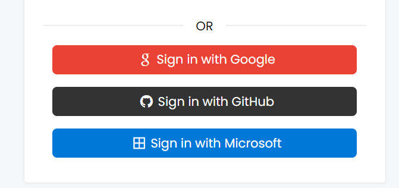
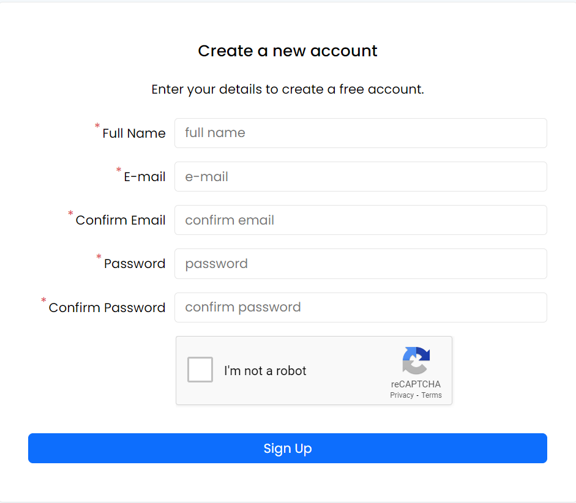
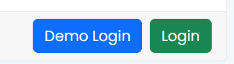
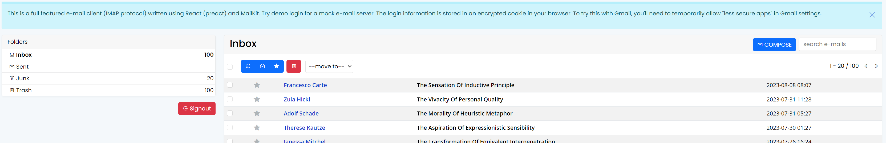
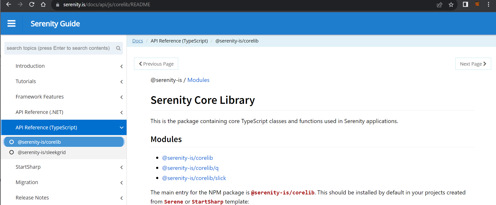
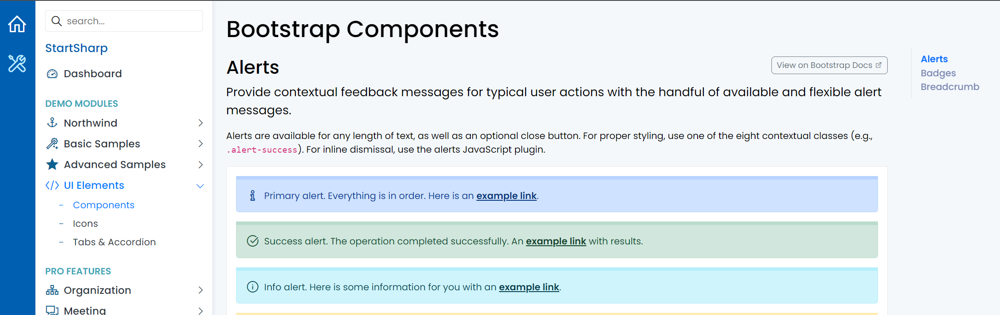

# Serenity 6.8.0 Release Notes (2023-08-14)

## New Feature Package: Serenity.Pro.OpenIdClient

In this update, we are excited to introduce the `Serenity.Pro.OpenIdClient` package, which allows seamless external login through platforms like Google, Microsoft, GitHub, and more.



This implementation also includes robust account link/unlink actions to associate existing accounts with these external logins.


Please note that link/unlink pages require account elevation, such as re-entering the password. You should register the default implementation for `IElevationHandler` in your `Startup.cs` file.

```csharp
services.AddSingleton<IElevationHandler, DefaultElevationHandler>();
```


This package is exclusively available to Business/Enterprise customers. For detailed documentation on integrating external logins into your existing project, please refer to the StartSharp repository.

## Mitigation for Potential XSS Attack via Login Page Return URL

In response to potential XSS attacks via email links, a critical security enhancement has been implemented.

The LoginPage.tsx now includes a defensive check to accept return URLs that begin with a forward slash (/) exclusively.

> We extend our gratitude to Tasfaout Abderrahim for bringing this security concern to our attention.

To ensure the security of your projects, please aply the following check in LoginPage.tsx:

```jsx
if (returnUrl && /^\//.test(returnUrl)) {
```

## SettingStorage Interface Now Supports Promises

The SettingStorage module has undergone modifications to improve both performance and security. The `getItem` and `setItem` methods may now return Promises, eliminating synchronous XHR calls.

```ts
interface SettingStorage {
    getItem(key: string): string | Promise<string>;
    setItem(key: string, value: string): void | Promise<void>;
}
```

As a result, similar adjustments have been made to the DataGrid's `restoreSettings`, `persistSettings`, and `getPersistedSettings` methods.

For users with custom code utilizing these methods, please ensure compatibility with the Promise return type. This may involve using asynchronous operations (async/await).

Additionally, a new method, `restoreSettingsFrom`, takes precedence over `restoreSettings` in mixins, derived classes, etc. It's important to note that `restoreSettingsFrom` does not handle null settings parameters (e.g., loading from defaults).


## Extension Whitelist/Blacklist Include and Exclude

Previously, we introduced an `appsettings.json` setting that allowed you to blacklist or whitelist extensions. This setting included `ExtensionWhitelist` and `ExtensionBlacklist` properties with sensible defaults.

If you had overridden these properties in your `appsettings.json, you were required to list both the defaults and the extensions you wanted to include or exclude.

To simplify the process of including or excluding additional extensions, we have introduced the following properties:

- `ExtensionBlacklistInclude`
- `ExtensionBlacklistExclude`
- `ExtensionWhitelistInclude`
- `ExtensionWhitelistExclude`

You can now use these properties instead of overriding the defaults, which is recommended.

## Q.initFullHeightGridPage Method Now Utilizes Flex Layout

Previously, the `initFullHeightGridPage` method calculated the height of the provided `GridDiv` based on the window height and other vertical panels on the same page. It also attached to the resize event to recalculate the height when the window size changed.

While this method worked well in most cases, it caused issues, especially with responsive layouts, such as mobile pages. It also made it more challenging to apply CSS rules based on `@media` queries.

We have updated the `initFullHeightGridPage` function to take advantage of the `flex` layout system instead of manually calculating the height. This modification requires the `section.content` to also use the flex layout and some additional CSS rules. Generally, updating `Serenity.Pro.Theme` should suffice, but Serene users might need to manually apply the latest changes in the `common-theme.css` file.

If you wish to retain the old legacy behavior, you can pass `{ setHeight: true }` as the second parameter.

## Restored ReCaptcha Functionality

During the transition to .NET dependency injection, the captcha widget became non-functional because it was not possible to access the app configuration containing the site key and secret key from the form definition itself.

We have implemented a custom property processor that leverages dependency injection, enabling captcha editors to function once more. Additionally, we have integrated a sample into the Signup form.



Don't forget to set `Recaptcha:SiteKey` and `Recaptcha:SecretKey` in appsettings.json.

## IUserClaimCreator Interface for Creating ClaimsPrincipal

Previously, there was a static `CreatePrincipal` method in `UserRetrieveService` within StartSharp/Serene, which was used in the login page to create a ClaimsPrincipal when a user logs in. Custom claims could be added to the principal by modifying this method. However, this method was not accessible from feature packages.

To address this, we have abstracted the method into a separate interface, `IUserClaimCreator`. The default implementation is available as `DefaultUserClaimCreator`. If you need to add custom claims, you should inherit from this class and override its methods.

To implement this change, add `services.AddSingleton<IUserClaimCreator, DefaultUserClaimCreator>` to your `Startup.cs` file, and inject `IUserClaimCreator` instead of using the static method in `UserRetrieveService`.

## Applied Patch for jQuery UI Touch Events

Since jQuery UI does not support touch events for mobile devices, and SlickGrid, dialogs, and several other widgets still depend on jQuery UI, it was not possible to reorder columns or group by columns on mobile devices.

We have applied a touch events patch to the `jquery-ui.js` file, which is our custom, compact version of jquery-ui, ensuring that touch actions now work as expected.

## Compact Version of `Texts.ts` File

The `Texts.ts` file, containing a `Q.proxyTexts` call, previously generated code in a single line that included all the local text keys. This often resulted in merge conflicts when two feature branches introduced new text keys.

We have now created a multi-line formatted and compact version that excludes text key leaves, focusing only on groups. This format should lead to fewer conflicts and improved readability:

```ts
StartSharp['Texts'] = proxyTexts(Texts, '', {
    Db: {
        Administration: {
            Language: {},
            // ...
        },
        Forms: {
            Membership: {
                Login: {},
                SendActivation: {},
                SignUp: {},
            },
            // ...
        },
    },
}) as any;
```

## Set Content-Disposition Header for Report Preview

When previewing a PDF report and attempting to save it, it used to generate a file named `Render.pdf`. We have now corrected this by setting the `Content-Disposition` header correctly. As a result, when you save the file, it will have a default file name based on the report type, similar to when you download the report.

## Password-Related Account Actions Moved to Serenity.Extensions

We've relocated password-related pages and their services, such as Forgot Password, Reset Password, Change Password, etc., from the direct implementation in StartSharp/Serene under `Modules/Membership/Account` to the `Serenity.Extensions` NuGet package. In StartSharp/Serene, you only need to include a one-liner as shown below:

```cs
[Route("Account/[action]")]
public class AccountPasswordActionsPage : AccountPasswordActionsPageBase<UserRow>
{
}
```

To make this work in your project, ensure that `UserRow` implements a few additional interfaces:

```cs
public sealed class UserRow : Serenity.Extensions.Entities.LoggingRow<UserRow.RowFields>, 
    IIdRow, INameRow, IIsActiveRow, 
    IDisplayNameRow, IEmailRow, IPasswordRow // new interfaces
{
    //...
    StringField IDisplayNameRow.DisplayNameField => fields.DisplayName;
    StringField IEmailRow.EmailField => fields.Email;
    StringField IPasswordRow.PasswordHashField => fields.PasswordHash;
    StringField IPasswordRow.PasswordSaltField => fields.PasswordSalt;
}
```

While it's still possible to copy this code into your project and customize it, we recommend using the `Serenity.Extensions` NuGet package for a smoother and more maintainable solution.

## Serenity.Pro.UI Obsoleted, Email Client Sample Rewritten with jsx-dom

Serenity.Pro.UI, previously used exclusively by the Email Client sample, is now obsoleted. We have rewritten the Email client using jsx-dom.

If you have references to `Serenity.Pro.UI` in your project, you may safely remove them after updating `Serenity.Pro.EmailClient` to the latest version (if you are using it).

Additionally, the email client sample has received a visual overhaul and now includes a mock IMAP server implementation for demonstration purposes.





## Removal of DevelopmentMode from Web.config

In your project's web.config file, there may be a setting related to DevelopmentMode due to the initial ASP.NET Core sample upon which StartSharp/Serene was based. It may appear as follows:

```xml
<environmentVariables>
    <environmentVariable name="ASPNETCORE_ENVIRONMENT" value="Development" />
```

Unfortunately, this line may persist even after deployment, causing your website to run in Development mode.

We recommend removing this line from the web.config file to avoid the need for manual removal after publishing.

## API Documentation for Serenity TypeScript Code

We have generated API documentation for the @serenity-is/corelib and @serenity-is/sleekgrid packages using TypeDoc. You can access this documentation at https://serenity.is/docs under the "Api Reference (TypeScript)" section.



## JSX-DOM Integration

We have added `jsx-dom` integration (https://github.com/alex-kinokon/jsx-dom), a library similar to React. However, it directly creates HTML elements instead of using a VDOM.

This integration offers improved compatibility with the existing Serenity Widget structure that uses jQuery and contains code for direct DOM manipulation.

It is primarily used in the `renderContents()` method instead of the `getTemplate()` method. This allows events to be bound at widget creation, and references to elements can be acquired.

While there is currently no direct dependency on `jsx-dom` in @serenity-is/corelib itself, it exposes a `jsxDomWidget` method that can be used to create a `jsx-dom` compatible functional component from a widget type, as shown below:

```ts
var StringEditor_ = jsxDomWidget(StringEditor); 
return `<StringEditor_ readonly={true} maxlength={50} />`
```

We have incorporated JSX-DOM in several places in the Serene/StartSharp code, including membership-related pages such as Login, Signup, and Password actions.

```jsx
protected renderContents() {
    const id = this.useIdPrefix();
    const myTexts = Texts.Forms.Membership.Login;
    const returnUrl = this.getReturnUrl();
    this.element.empty().append(<>
        <AccountPanelTitle />
        <div class="s-Panel p-4">
            <h5 class="text-center my-4">{myTexts.LoginToYourAccount}</h5>
            <form id={id.Form} action="">
                <div id={id.PropertyGrid}></div>
                <div class="px-field">
                    <a class="float-end text-decoration-none" href={resolveUrl('~/Account/ForgotPassword')}>
                        {myTexts.ForgotPassword}
                    </a>
                </div>
```

We have also added `useIdPrefix()` and `Widget.useIdPrefix()` methods to simplify the generation of unique IDs based on the Widget's `idPrefix` in jsx-dom-based code, similar to the `~_` prefix in classic templates.

## Switched to JSX Automatic Runtime

In StartSharp, we have transitioned to the JSX automatic runtime by configuring "jsx" to "react-jsx" and "jsxImportSource" to "jsx-dom" in tsconfig.json. 

To use React or Preact in one of your .tsx files, you can switch the runtime by adding a pragma comment at the top of the file, like this: `/** @jsxImportSource react */`.

## Page.tsx Files Now Considered ESM Entry Points

In addition to `**/*Page.ts` files, `**/*Page.tsx` files are now recognized as ESM entry points for esbuild in tsbuild and sergen.

## Replaced toastr with an Embedded Version

We have replaced `toastr` with an embedded version that was rewritten in TypeScript, adapted from:

- https://raw.githubusercontent.com/JPeer264/toastr2/master/src/Toastr.ts. 

This change allows us to display notifications even when toastr.js is not loaded on the page. You can remove toastr.js from appsettings.bundles.json, but please retain toastr.css as it is still required.

## Obsoleted IExceptionLogger

The IExceptionLogger interface is now obsolete. Please log exceptions directly using .NET's ILogger interface and its LogError method. For StartSharp users, replace the `app.UseExceptional()` line with `app.UseExceptionLogger()` in Startup.cs. This change also enables implicit logging to StackExchange.Exceptional via the new `InformationalException` type.

## parseDateTime and parseISODateTime No Longer Return `false` [Breaking Change]

The Q.parseDate and Q.parseISODateTime functions now return an Invalid Date instance, which means its .valueOf() method returns NaN. This is a departure from the previous behavior where they returned "false" or "null," a decision that was incorrect at the time. 

This change prevents invalid dates from being mistakenly considered equal to empty dates. It aligns with the JavaScript Date constructor, which also returns a Date instance with a NaN value for invalid dates, promoting consistency.

## New UI Elements Samples

A new navigation group has been added to the StartSharp demo, featuring UI/Bootstrap-related samples:



We have plans to add more samples to this category related to UI components and Bootstrap widgets.