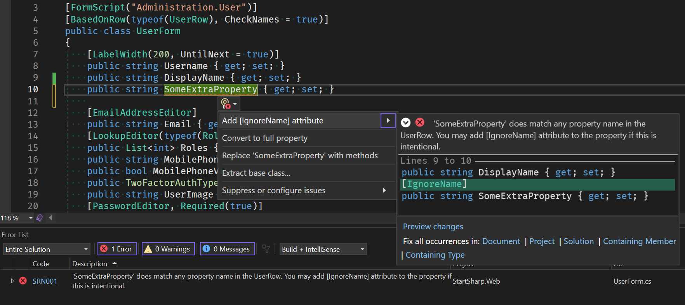
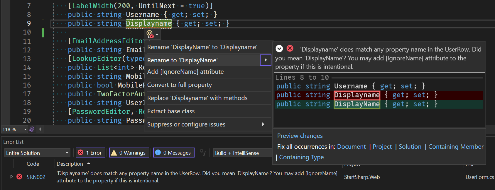
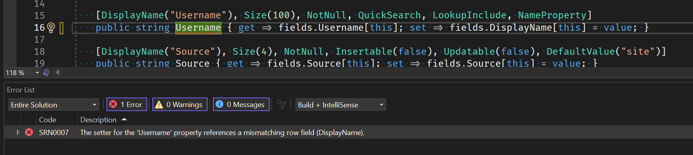
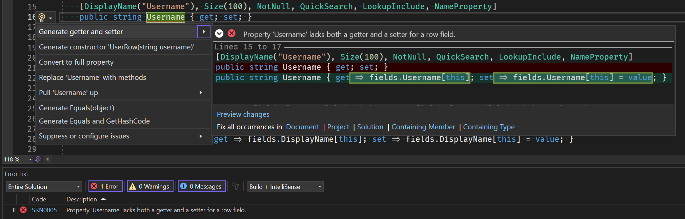
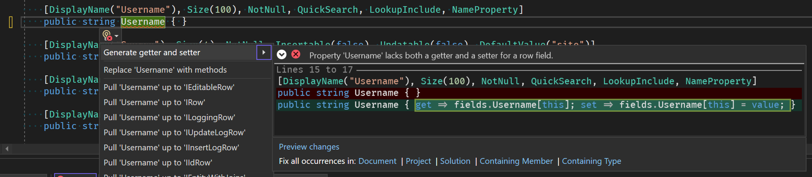
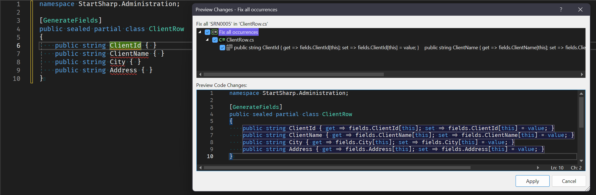

# Serenity 6.9.5 Release Notes (2023-10-26)

## New Form / Column Property Name Analyzers and Code Fixes

In Serenity, form and column definitions generally look similar to the following:

```csharp
[FormScript("Administration.User")]
[BasedOnRow(typeof(UserRow), CheckNames = true)]
public class UserForm
{
    [LabelWidth(200, UntilNext = true)]
    public string Username { get; set; }
    public string DisplayName { get; set; }
```

The `BasedOnRow` attribute determines that this grid column definition is based on the `UserRow`, meaning the properties in the columns definition inherit the corresponding properties with the same name.

The assignment `CheckNames = true` in the `BasedOnRow` attribute ensures that any property defined in the columns class should have a matching property in the row class with the same name and casing.

If `CheckNames` is set to true and you want to add an extra property that does not exist in the row class, you should add the `[IgnoreName]` attribute on top of it. This ensures that the property naming was intentional and not a typo.

```csharp
[FormScript("Administration.User")]
[BasedOnRow(typeof(UserRow), CheckNames = true)]
public class UserForm
{
    [LabelWidth(200, UntilNext = true)]
    public string Username { get; set; }
    public string DisplayName { get; set; }

    [IgnoreName]
    public string SomeExtraProperty { get; set; }
    //...
}
```

Failure to add an `[IgnoreName]` attribute will result in Serenity raising a runtime error:

```plaintext
System.InvalidProgramException: StartSharp.Administration.UserForm 
has a [BasedOnRow(typeof(StartSharp.Administration.UserRow), CheckNames = true)] 
attribute, but its 'SomeExtraProperty' property doesn't have a matching field 
with the same property/field name in the row. Please check if the property is named correctly.

To remove this validation, you may set CheckNames to false in the [BasedOnRow] attribute.
To disable checking for this specific property, add an [IgnoreName] attribute to the property itself.
```

This name-checking feature is very useful as it helps avoid typos when entering column and form properties. Sometimes these mistakes are related to casing, such as using `Displayname` instead of `DisplayName`, or forgetting to remove/rename some property from columns or forms when removing/renaming a property in the row class. Such errors generally lead to JSON serialization errors or empty column/form input problems.

Since the validation is performed at runtime, you may not be aware of the typo until you open a grid or display a form when the error is shown. This can be problematic if you deployed an application without knowing that one of the screens is going to fail.

To overcome this issue and improve the developer experience, we have prepared an analyzer for checking property names while you are coding in the IDE:



As seen in the screenshot above, the analyzer in `Serenity.Pro.Coder` checks the property name during development and reports an error with code SRN001 ('SomeExtraProperty' does not match any property name in the UserRow...).

It also offers a code fix with the option to 'Add [IgnoreName] attribute,' which you can access by clicking the light bulb icon (or `Ctrl+.`). Clicking this option will automatically add the `[IgnoreName]` attribute to the property itself.

As we mentioned, one of the most common mistakes is related to casing, such as typing `Displayname` instead of `DisplayName`. Since C# and JavaScript are case-sensitive, this can be a problem. In this case, our analyzer can identify the issue and offer a better solution:



This time, the analyzer detects that this is a casing error and offers to rename the property to `DisplayName` to match the UserRow class.

Note that the first option in the menu, e.g., 'Rename DisplayName to Displayname,' is not produced by our analyzer; it is generated by Visual Studio itself, probably via some spell-check system, and does nothing when you click it.

All these errors are also produced during the build, so even if you don't have a particular form/columns file with an issue open in the editor, you'll still get an error during the build. This way, having the error at runtime can be avoided.

## New Row Property Getter/Setter Analyzer and Code Fixes

Serenity entities have properties with get/set methods like the following:

```csharp
public string Username { get => fields.Username[this]; set => fields.Username[this] = value; }
```

These get/set methods are required to be written in this way for the Serenity entity system to work properly and facilitate features like assignment tracking and change notifications.

The fields used within these statements are usually defined in a `RowFields` nested class:

```csharp
public StringField Username;
```

Each property should use a row field that matches its name. You normally have to define these fields manually and write the get/set methods that reference the correct field.

We recently introduced a `[GenerateFields]` attribute that allows the `Serenity.Pro.Coder` source generator to create these fields for you. However, you still have to write the get/set methods yourself as C# does not yet support partial properties.

Whether you use `GenerateFields` or manually define fields, you still have to write and ensure the correct get/set statements for all your row properties. Sometimes, it is possible to reference a different field by mistake while writing a get/set method:

```csharp
public string Username { get => fields.Username[this]; set => fields.DisplayName[this] = value; }
```

Here, the get method uses the correct field, but the set method is setting the display name. You might think this should be very rare, but we have observed many developers making such mistakes, especially when adding new row properties manually. This is a serious mistake and can lead to many problems at runtime, such as overwriting the wrong property or producing unexpected results during JSON serialization/deserialization.

Until C# introduces partial properties, which does not seem likely to happen soon, we are now introducing a new analyzer for row property get/set methods in Serenity.Pro.Coder:



It detects that the Username property is referencing the wrong field in its setter and informs us accordingly.

Another useful feature of this analyzer is its ability to generate getter/setter code for you if you simply write a basic `{ get; set; }` statement:



It works even if you just open and close braces, e.g., `{}`:



This way, you can avoid manually writing getter/setter code for row properties and let Pro.Coder handle that for you.

When defining a new row type, it is also possible to quickly generate multiple get/set statements in a class by using the "Fix all occurrences in document" option:



Combined with the `GenerateFields` attribute, we believe this will make it much easier to define new entities or add properties to existing ones, even without partial properties in C#.

Please note that the analyzer currently inspects all public properties of a row class and assumes they should have proper get/set methods accessing their corresponding fields unless they are getter-only. In most cases, this should not cause any issues, but if you have any extra properties in your row class that don't have corresponding row fields for some reason, you will need to use the "Suppress or configure issues" option in the dropdown to turn this analyzer off per property or for the entire file by adding a pragma statement:

```csharp
[GenerateFields]
public sealed partial class ClientRow
{
    public string ClientId { get => fields.ClientId[this]; set => fields.ClientId[this] = value; }
    public string ClientName { get => fields.ClientName[this]; set => fields.ClientName[this] = value; }
    public string City { get => fields.City[this]; set => fields.City[this] = value; }
#pragma warning disable SRN0005
    public string SomeIrregularProperty { get; set; }
#pragma warning restore SRN0005
}
```