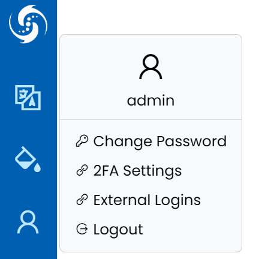
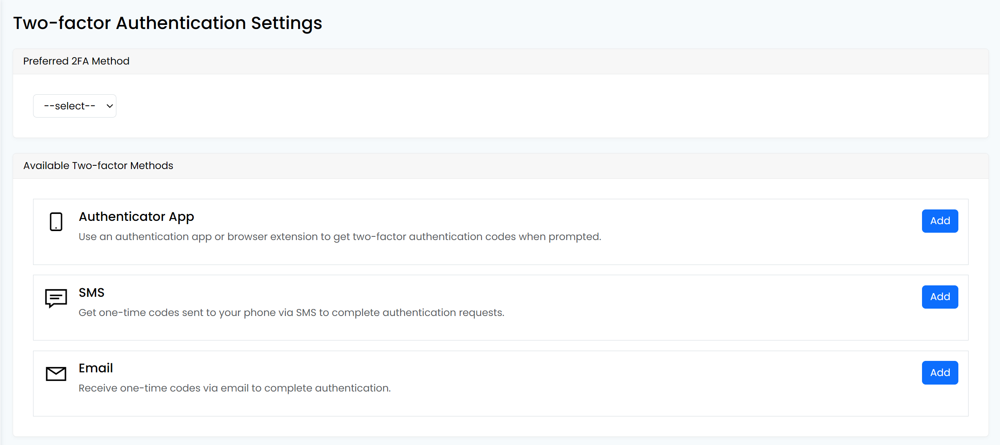
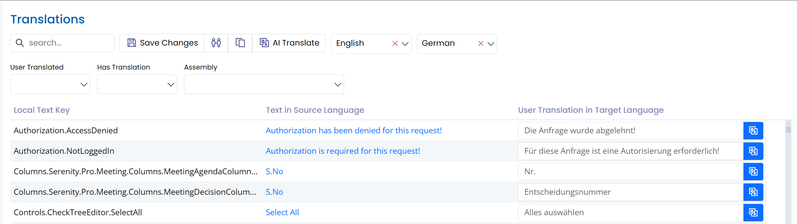

# Serenity 8.7.9 Release Notes (2024-11-13)

These release notes detail the significant changes made between versions 8.6.1 and 8.7.9. For a complete list of changes, please refer to the [Serenity Change Log](https://github.com/serenity-is/Serenity/blob/master/CHANGELOG.md).

## New Two-factor Authentication System

We have introduced a new 2FA system that supports additional methods such as Authenticator Apps (e.g., Authy, Google Authenticator, Microsoft Authenticator, etc.) along with a configuration page for users to set up their 2FA options.

The configuration page is accessible from the user menu:



Note that in the demo, you will need to enter the password `serenity` on the elevation page to test this.

> Even though you can configure 2FA in the demo, it won't actually be enabled, as doing so would block other users from logging in.




Currently, SMS, Email, and Authenticator options are available.

The `Authenticator` option is provided via the `Serenity.Pro.TwoFactorAuthenticator` package and is available to `Business` and `Enterprise` level customers.

We are also working on a new 2FA provider for passkeys (e.g., passkey devices or thumbprint readers), which will include an option to log in without entering a password.

The base 2FA system is included in the `Serenity.Pro.Extensions` package and can be configured in `Startup.cs`:

```cs
services.AddTwoFactorAuth();
```

To enable the `Authenticator` method (Business/Enterprise), add this line after `AddTwoFactorAuth`:

```cs
services.AddAuthenticatorTwoFactorMethod();
```

Then configure it in `appsettings.json`:

```json
"Authenticator": {
   "Enabled": true,
   "PrivateKey": "e88GRmakTGtdCzHWrrBy...",
   "Issuer": "Your Application Name"
}
```

The `PrivateKey` should be a base64-encoded RSA-2048 key (without header/footer and line endings). You can use tools like PuTTYgen to generate one. Alternatively, you can use a `CertificateThumbprint` to import the key from the machine certificate store by its thumbprint: 

```json
"Authenticator": {
   "Enabled": true,
   "CertificateThumbprint": "abcde..."
}
```

## AI/Machine Translation Option in the Translation Screen

We have added an AI translation option to the translation screen:



This allows you to use AI translation for individual texts or the `AI Translate` button to translate texts with no existing translations (e.g., `Has Translation: false`).

The default implementation uses the OpenAI API or compatible endpoints. Enable this feature in `appsettings.json`:

```json
"Translation": {
  "Enabled": true,
  "ApiKey": "....your api key here...",
  "UseStructuredOutput": true,
  "ParallelRequests": 1,
  "BatchSize": 5
}
```

To use a provider other than OpenAI, such as Ollama, configure the endpoint:

```json
"Translation": {
  "Endpoint": "http://someserver:11434/v1/"
}
```

Ensure the URL includes only the `/v1/` part, as `chat/completions` will be appended automatically.

This feature is included in the `Serenity.Pro.Extensions` package and can be configured in `Startup.cs`:

```csharp
services.AddAITextTranslation(Configuration);
```

## Application-specific Service Implementations Moved to `Modules/Common/AppServices`

We have consolidated application-specific implementations of common services like `IPermissionService` and `IUserAccessor`, previously scattered across folders like `Initialization` and `Modules/Administration/User/Authentication`, under `Modules/Common/AppServices`. The models they use are now under `Modules/Common/AppModels`. This restructuring makes these services easier to locate and manage.

## New `IUserProvider` Interface

We have introduced the `IUserProvider` abstraction, which combines `IUserAccessor`, `IImpersonator`, `IUserClaimCreator`, `IUserRetrieveService`, and `IUserCacheInvalidator`. This allows you to inject a single service to access commonly used authentication-related services.

Replace the following lines in `Startup.cs`:

```cs
services.AddSingleton<IUserAccessor, AppServices.UserAccessor>();
services.AddSingleton<IUserClaimCreator, DefaultUserClaimCreator>();
services.AddSingleton<IUserRetrieveService, AppServices.UserRetrieveService>();
```

with:

```cs
services.AddUserProvider<AppServices.UserAccessor, AppServices.UserRetrieveService>();
```

This extension registers `UserAccessor` and `UserRetrieveService` as singletons and also registers `DefaultUserClaimCreator` as the `IUserClaimCreator` singleton.

If you have a custom `UserClaimCreator`, use the three-argument generic version:

```cs
services.AddUserProvider<AppServices.UserAccessor, AppServices.UserRetrieveService,
    AppServices.UserClaimCreator>();
```

## Using `declare` Modifier for TypeScript Class Fields

Consider the following class definition:

```typescript
class B {
    constructor() {
        this.someMethod();
    }

    someMethod() { ... }
}

class C extends B {
  foo = 100;
  bar: string;

  someMethod() {
    this.foo = this.foo * 2;
    this.bar = "test";
  }
}
```

Unless `useDefineForClassFields: false` is set in `tsconfig.json`, class members are initialized as properties in the generated JavaScript code, even if they lack initializers:

```javascript
class C extends B {
  constructor() {
    super();
    Object.defineProperty(this, "foo", { ... });
    Object.defineProperty(this, "bar", { ... });
  }

  override someMethod() {
    this.foo = this.foo * 2;
    this.bar = "test";
  }
}
```


## Using `declare` Modifier for TypeScript Class Fields

When you have a class member defined like below:

```typescript
class B {
    constructor() {
        this.someMethod();
    }

    someMethod() { ... }
}

class C extends B {
  foo = 100;
  bar: string;

  someMethod() {
    this.foo = this.foo * 2;
    this.bar = "test";
  }
}
```

Unless you have `useDefineForClassFields: false` in tsconfig.json file, they are initialized as properties in generated javascript code even if you don't initialize them:

```javascript
class C extends B {
  constructor() {
    super();
    Object.defineProperty(this, "foo", {
      enumerable: true,
      configurable: true,
      writable: true,
      value: 100,
    });
    Object.defineProperty(this, "bar", {
      enumerable: true,
      configurable: true,
      writable: true,
      value: void 0
    });
  }

  override someMethod() {
    this.foo = this.foo * 2;
    this.bar = "test";
  }
}
```

This may not look like a problem, but notice that they are initialized after calling the base constructor, e.g. `super()`. 

Thus, when the base constructor calls `someMethod()` (which can be considered virtual), `this.foo` is `undefined` and `this.foo * 2` becomes `NaN` and not `200` as expected. `this.bar` gets set to `"test"` momentarily but after the control goes back to the `C` constructor, the properties are redefined, and they become `100` and `undefined`.

This effectively means you can't get and set values of subclass fields in any of the virtual methods called by the base constructor. It is a big issue for systems that use inheritance, and especially our Widget system that calls some virtual methods like `renderContents`, `createToolbarExtensions` etc. during initialization.

When TypeScript has `useDefineForClassFields: false` in tsconfig.json, some of these issues are mitigated as it goes back to logic before TypeScript 3.7. See https://www.typescriptlang.org/docs/handbook/release-notes/typescript-3-7.html#the-usedefineforclassfields-flag-and-the-declare-property-modifier for more information.

Also, even when `useDefineForClassFields: false`, esbuild's latest version has an open issue where a class with any decorators ignores useDefineForClassFields setting and generates an invalid javascript breaking the application completely: https://github.com/evanw/esbuild/issues/3939

For now, we recommend using `declare` modifier as a workaround for any class fields that does not have an initializer:

```typescript
class C extends B {
  declare bar: string;
}
```

This won't solve the issue with initializers and virtual methods called from the base constructor, but at least any value assigned to bar from a virtual method will be preserved.

## Enhanced Security Against XSS Attacks

HTML strings returned from formatters and format functions are now automatically sanitized by default.

While formatters should already use `ctx.escape()` for user-provided or dynamic content, this change adds an additional layer of protection.

The default sanitizer uses a basic regex-based solution. If DOMPurify is available globally, it will be used instead. You can also specify a custom sanitizer by setting `gridDefaults.sanitizer` in `ScriptInit.ts`. 

To ensure security, we recommend updating existing formatters to use `jsx-dom` or `Fluent` rather than returning raw HTML strings.

## New `sergen doctor` Command

A new `dotnet sergen doctor` command has been introduced to check for common issues, such as mismatched Serenity package versions, outdated Node/NPM versions, project name inconsistencies, root namespace or path problems, and more. It also displays additional information, such as the calculated configuration used by `sergen` for code generation.

```powershell
C:\MyProject.Web> dotnet sergen doctor
Project File: C:\MyProject.Web.csproj
sergen.json Location: C:\MyProject.Web\sergen.json
sergen.json Contents: {
  "Extends": "defaults@6.6.0",
  "EnableGenerateFields": true,
  "RootNamespace": "MyProject",
  // ...
}
Using Generator Config: {
  "Extends": "defaults@6.6.0",
  "RootNamespace": "MyProject",
  //...
  "BaseRowClasses": []
}
Using Root Namespace (from sergen.json): MyProject
Sergen Version: 8.7.9.0
Serenity.Net.Web Version: 8.7.9
WARNING: Your NPM version (9.12.0) is outdated. Please install the latest NPM version (at least 10.8.2+).
@serenity-is/tsbuild Version: 8.7.4
jsx-dom Version: 8.1.5
```

We plan to add more checks for commonly encountered issues during the development and maintenance of Serenity applications.

## Sergen Now Also Generates ESM Helper

Similar to `Pro.Coder`, `sergen` now generates an ESM helper during MVC transformation.

```cs
namespace Serenity.Demo.BasicSamples;

public static partial class ESM
{
    public const string ChangingLookupTextPage = "~/Serenity.Demo.BasicSamples/esm/Modules/Editors/ChangingLookupText/ChangingLookupTextPage.js";
    public const string ChartInDialogPage = "~/Serenity.Demo.BasicSamples/esm/Modules/Dialogs/ChartInDialog/ChartInDialogPage.js";
    public const string CloneableEntityDialogPage = "~/Serenity.Demo.BasicSamples/esm/Modules/Dialogs/CloneableEntityDialog/CloneableEntityDialogPage.js";
    // ...
}
```

## Short Versions of ESM Helpers

The generated helper for ESM entry point locations previously used a nested class structure, as shown below:

```cs
public static partial class ESM
{
    public static partial class Modules
    {
        public static partial class Category
        {
            public const string CategoryPage = "~/Serenity.Demo.Northwind/esm/Modules/Category/CategoryPage.js";
        }
    }
}
```

Referencing an individual entry required specifying the full path:

```cs
return this.GridPage(ESM.Modules.Category.CategoryPage);
```

If the folder structure changed, you would need to update all references. For example, moving the `Category` folder under a `SubModule` folder would require this change:

```cs
return this.GridPage(ESM.Modules.SubModule.Category.CategoryPage);
```

The `ESM` class now includes shortcuts to views at the top level, making references easier and less dependent on folder structure:

```cs
public static partial class ESM
{
    public const string CategoryPage = "~/Serenity.Demo.Northwind/esm/Modules/Category/CategoryPage.js";

    public static partial class Modules
    {
        public static partial class Category
        {
            public const string CategoryPage = "~/Serenity.Demo.Northwind/esm/Modules/Category/CategoryPage.js";
        }
    }
}
```

Now, you can simply use:

```cs
return this.GridPage(ESM.CategoryPage);
```

If multiple `CategoryPage` files exist under different folders, shortcuts will not be generated to avoid ambiguity. In such cases, use the long version.

## ServerTypings Now Use Relative Paths

Files under `Modules/ServerTypes` previously used paths starting with the `@/` prefix:

```ts
import { SomeRow } from "@/ServerTypes/MyModule";
```

This mapping was defined in `tsconfig.json`:

```json
"paths": {
      "@/*": [ "./Modules/*" ],
      //...
}
```

While this was convenient for referencing the root of the `Modules` directory, it occasionally caused issues, such as errors in TypeScript IntelliSense when the mapping was missing or temporarily unreadable. It also posed challenges when referencing source files directly from test projects (e.g., Jest tests).

To address these issues, the `@/*` mapping is now removed from `tsconfig.json`, and `sergen` generates relative paths instead:

```ts
import { SomeRow } from "../../ServerTypes/MyModule";
```

Although not mandatory, we recommend removing the `@/*` path mapping from `tsconfig.json` and updating TypeScript sources accordingly.

## Extending `EntryPoints` in `sergen.json`

`Pro.Coder`/`sergen` uses a default list of entry points for ESM files:

```json
  "Modules/**/*Page.ts",
  "Modules/**/*Page.tsx",
  "Modules/**/ScriptInit.ts"
```

This list can be overridden in `sergen.json` if needed:

```json
{
  "TSBuild": {
    "EntryPoints": {
      "Modules/**/*Page.ts",
      "Modules/**/*Page.tsx",
      "Modules/**/ScriptInit.ts",
      "Some/Additional/EntryPoint.ts"
    }
  }
}
```

However, overriding the list requires duplicating the default entry points, which could become problematic if the defaults change. Users who override the list would need to update their configurations.

To simplify this, you can now extend the default entry points by starting the list with a `+` symbol:

```json
{
  "TSBuild": {
    "EntryPoints": {
      "+",
      "Some/Additional/EntryPoint.ts"
    }
  }
}
```

## New `TransformInclude` Interface for Client Type Generation

During client type transformation, normally only the editor types and their options are generated as attributes:

```ts
export interface SomeEditorOptions {
    someOption: number;
}

export class SomeEditor extends Widget<SomeEditorOptions> {
}
```

```cs
public class SomeEditorAttribute : CustomEditorAttribute 
{   
    public double SomeOption 
    {
        // ...
    }
}
```

There may be some interface or option types that you would like to generate as server-side classes, without them being used for an editor. 

An example could be the options passed to a `GridPage` or `PanelPage` initialization method:

```ts
export interface ResetPasswordOptions {
    token: string;
    minPasswordLength: number;
}

export default function pageInit(opt: ResetPasswordOptions) {
    // ...
}
```

```cs
// ResetPasswordPage.cs
public virtual IActionResult ResetPassword(string t,
    //...
    return this.PanelPage(ESM.ResetPasswordPage, options: new
    {
        token = token,
        minPasswordLength = settings.MinPasswordLength
    });
```

Note that when passing options from `ResetPasswordPage.cs`, we had to use an anonymous class, which provides no type or property name checks.

It is now possible to transform `ResetPasswordOptions` server-side by extending the `TransformInclude` interface:

```ts
import { TransformInclude } from "@serenity-is/corelib";

export interface ResetPasswordOptions extends TransformInclude {
    token: string;
    minPasswordLength: number;
}
```

```cs
// Extensions.ResetPasswordOptions.generated.cs
namespace Serenity.Extensions;

public partial class ResetPasswordOptions
{
    public double minPasswordLength { get; set; }
    public string token { get; set; }
}

// ResetPasswordPage.cs
public virtual IActionResult ResetPassword(string t)
{
    //...
    return this.PanelPage(ESM.ResetPasswordPage, options: new ResetPasswordOptions
    {
        token = token,
        minPasswordLength = settings.MinPasswordLength
    });
```

Note that the properties are generated in lowercase (e.g., the same case as in TypeScript) to match the casing in JSON, eliminating the need for the `JsonProperty` attribute.

## Module Page Extensions Now Automatically Include CSS Files and the `ModulePageInit` Html Helper

When you import CSS from your TypeScript files, like this:

```ts
// SomePage.ts
import "./somestyle.css";
```

ESBuild automatically generates a `.css` file, in addition to the `SomePage.js` file, under `wwwroot/esm`:

- `wwwroot/esm/Modules/SomeModule/SomePage.js`
- `wwwroot/esm/Modules/SomeModule/SomePage.css`

The `SomePage.css` file will bundle all CSS rules from the included `.css` files, not just from the `Page.ts` file, but also any referenced TypeScript files.

This approach allows you to place page-specific styles in `.css` files next to your TypeScript sources, avoiding the need to populate `site.css` with styles that are only used on specific pages.

Previously, to use this style, you would need to import it from the `.cshtml` file like this:

```cshtml
@Html.Stylesheet(ESM.SomePage)
<script type="module">
import pageInit from '@Html.ResolveWithHash(ESM.SomePage)';
pageInit();
</script>
```

Now, with the new `Html.ModulePageInit`, it’s just a one-liner:

```cshtml
@Html.ModulePageInit(ESM.SomePage);
```

This helper automatically includes the `Page.css` file if it exists and generates the initialization script block.

The `GridPage` and `PanelPage` extensions have also been updated to automatically include the accompanying CSS, so you can do this without needing a `.cshtml` file:

```cs
return this.GridPage(ESM.SomePage);
```

If you don’t want the CSS file to be automatically included for any reason, pass the `css` argument as `false`:

```cs
return this.GridPage(ESM.SomePage, css: false);
```

## Legacy Namespaces Code Support Removed

Sergen will no longer generate namespace-based code or transform C# types for classes like editors, etc., defined in legacy namespace-style TypeScript code.

Existing generated files under `Imports/ServerTypings` will not be deleted, but migrating to modern ESM modules is strongly recommended.

## Removal of Some Legacy Font, Style, and Script Files from `Serenity.Assets`

- The legacy `~/Serenity.Assets/Content/font-awesome.css` has been removed. Serene users should replace it with `~/Serenity.Assets/line-awesome/css/line-awesome-fa.min.css` to switch to the Line Awesome font.
- `toastr.css` and `toastr.js` have been removed from `Serenity.Assets`. They are now integrated into `corelib` and `pro-theme/common-style` files.
- `select2.css` and related files have been removed from `Serenity.Assets`. They are now integrated into `pro-theme/common-style` files.
- The legacy Open Sans font under `~/Serenity.Assets/Content/font-open-sans.css` has been removed. Serene users should update `appsettings.bundles.json` to reference `~/Serenity.Assets/fonts/open-sans/open-sans.css`.
- Unused assets such as `bootstrap-icons`, `tabler-icons`, `jquery.fileupload.css`, `jspdf.js`, `jquery.autoNumeric.js`, `jquery.validate.js`, `preact.umd.js`, `select2.js`, and legacy font versions have been removed.

Any of these files that are still required by your application can be installed via npm/libman or copied from an older version of `Serenity.Assets`.

## Merged Style Files in Serene

Serene previously had two style files: `common-style.css` and `common-theme.css`, both included in `appsettings.bundles.json`.

The style rules from `common-style.css` have now been merged into `common-theme.css`, so the inclusion of `common-style.css` can now be removed from `appsettings.bundles.json`.

## New Base Classes for `PermissionService`, `PermissionKeyLister`, `RolePermissionService`, and `UserRetrieveService`

Serene and StartSharp traditionally have custom implementations of services like `PermissionService` and `UserRetrieveService`. These do not have default implementations in the Serenity core libraries, as their implementation depends on entity types and database structure, and can vary based on the application’s specific requirements.

While most applications prefer to use these services as is, if we update our sample implementations (e.g., by adding an interface or modifying permission checks), it becomes challenging to apply these updates to older implementations in your projects. We have now created base classes in `Serenity.Extensions` to make it easier for you to update, while still offering customization options through virtual methods. This reduces the amount of code required for these implementations.

```cs
public class PermissionService(ITwoLevelCache cache,
    ISqlConnections sqlConnections,
    ITypeSource typeSource,
    IUserAccessor userAccessor,
    IRolePermissionService rolePermissions,
    IHttpContextItemsAccessor httpContextItemsAccessor = null) :
    BasePermissionService<UserPermissionRow, UserRoleRow>(cache, sqlConnections, typeSource,
        userAccessor, rolePermissions, httpContextItemsAccessor)
{
    protected override bool IsSuperAdmin(ClaimsPrincipal user)
    {
        return user.Identity?.Name == "admin";
    }
}

public class RolePermissionService(ITwoLevelCache cache, ISqlConnections sqlConnections, ITypeSource typeSource)
    : BaseRolePermissionService<RolePermissionRow>(cache, sqlConnections, typeSource)
{
}
```

Note that to use these base classes, your row types must implement interfaces such as `IUserPermissionRow` and `IRolePermissionRow`:

```cs
public sealed class UserPermissionRow : Row<UserPermissionRow.RowFields>, IIdRow, INameRow, IUserPermissionRow
{
    //...
    Field IUserPermissionRow.UserIdField => fields.UserId;
    StringField IUserPermissionRow.PermissionKeyField => fields.PermissionKey;
    BooleanField IUserPermissionRow.GrantedField => fields.Granted;
}
```

## New `ApplicationPartsTypeSource`

In Serenity applications, we use the `ITypeSource` interface to discover assemblies and types that Serenity should scan for entities, attributes, settings, local text resources, and other types.

This approach improves performance by avoiding the scanning of System/Microsoft and Data Access assemblies, which would not contain Serenity-specific attributes. 

Another reason for using `ITypeSource` is to allow Serenity to ignore specific assemblies or types, even if they are referenced by your application. For example, you may want to exclude `FileUploadBehavior` from the `Serenity.Web` assembly if you have a custom file upload behavior in your application.

Typically, there is a `TypeSource.cs` file in your application that contains a list of assemblies:

```cs
namespace Serene.AppServices;

public class TypeSource() : DefaultTypeSource([
    typeof(Serenity.Localization.ILocalText).Assembly, // Serenity.Core
    typeof(DefaultSqlConnections).Assembly, // Serenity.Net.Data
    typeof(Row<>).Assembly, // Serenity.Net.Entity
    typeof(SaveRequestHandler<>).Assembly, // Serenity.Net.Services
    typeof(HttpContextItemsAccessor).Assembly, // Serenity.Net.Web
    typeof(Serenity.Reporting.ExcelExporter).Assembly, // Serenity.Extensions      
    typeof(Serenity.Demo.Northwind.CustomerPage).Assembly, // Serenity.Demo.Northwind
    typeof(Serenity.Demo.BasicSamples.BasicSamplesPage).Assembly, // Serenity.Demo.BasicSamples
    typeof(Startup).Assembly // Serene.Web
])
{
}
```

If you add a reference to a Serenity feature assembly, you will also need to add it to this type source. If you forget to do so, Serenity will not scan or initialize types in that assembly, which can result in runtime errors.

An additional issue arises if marker types like `Row<>` move between assemblies, which makes this list invalid. For example, the `Serenity.Net.Entity` and `Serenity.Net.Data` assemblies will be merged into the `Serenity.Net.Services` assembly in version 8.8.0, so those lines should be removed to avoid duplicating entries in the `TypeSource`. Otherwise, `Serenity.Net.Services` would be included multiple times, leading to unexpected behavior.

ASP.NET Core already uses an `ApplicationPartsManager` system that includes all assemblies referencing ASP.NET Core. This system is used to scan for controllers and page types, meaning any assembly that references `Serenity.Web` is automatically included in the part manager, as `Serenity.Web` references ASP.NET Core. All Serenity feature projects reference `Serenity.Web`, so we can now discover them from the part manager.

We have introduced the `ApplicationPartsTypeSource`, which can be used in place of manually defining `TypeSource` classes in your application. To use it, make the following changes in `Startup.cs`:

```cs
// Remove these three lines:
var typeSource = new AppServices.TypeSource();
services.AddSingleton<ITypeSource>(typeSource);
services.ConfigureSections(Configuration, typeSource);

// Add these two lines instead:
services.AddApplicationPartsTypeSource();
services.ConfigureSections(Configuration);
```

Once you have tested and confirmed that it works correctly, you may remove the old TypeSource.cs from your project.

## Connected Mode for Grid Editors and Additional Validation Checks

Grid editors that derive from `GridEditorBase` work in-memory, meaning they do not make service calls to retrieve detail records or create/update them. The data they display, such as the set of detail records (e.g., `OrderDetail`), is loaded from the master service (e.g., `Order`) along with the `Retrieve` call of the master entity:

```json
// Services/Northwind/Order/Retrieve: { EntityId: 1357 }
{
    "OrderId": 1357,
    "OrderDate": "2024-11-05",
    //...
    "DetailList": [
        { "OrderDetailId": 9912, "Quantity": 1, "ProductId": 358, "ProductName": "Some Product" }
    ]
}
```

The population of the `"DetailList"` property during the retrieval of the `Order` record (e.g., when opening the order dialog) is handled behind the scenes by the `MasterDetailRelation` behavior. While it may not be immediately obvious, checking the Network Console will show something similar to the above, with no request made to the `Services/Northwind/OrderDetails/List` or `OrderDetails/Retrieve` services.

When you add or update detail records in the detail grid, no request is made to the `OrderDetail` or `Order` services; everything is handled in memory. The database is not updated until the master record is saved.

When saving the master record (e.g., `Order`), again, no request is made to the `OrderDetail` service, and the update occurs alongside the save of the master entity:

```json
// Services/Northwind/Order/Update
{
    "EntityId": 1357,
    "Entity": {
        "OrderId": 1357,
        "OrderDate": "2024-11-05",
        //...
        "DetailList": [
            { "OrderDetailId": 9912, "Quantity": 3, "ProductId": 456, "ProductName": "Another Product" }
        ]
    }
}
```

Again, the creation, update, and deletion of detail entities are performed behind the scenes by the `MasterDetailRelation` behavior. If you check the network console, you will not see any calls to the `OrderDetail` service.

This lifecycle may sometimes confuse developers, as it is not always clear that operations are performed in memory, even though it appears to function like an ordinary (connected/SQL mode) entity. Developers may change the grid to subclass `GridEditorBase` but forget to update the dialog (e.g., `OrderDetailDialog`) to subclass `GridEditorDialog`. This leads to the grid working in-memory, while the dialog operates in normal (connected) mode, i.e., making requests to the `OrderDetail` service. In this case, newly added detail records (in-memory) are not yet available in the database and therefore cannot be retrieved from the server. Existing records may open in the dialog, but any changes made will not reflect in the detail grid, as the grid does not refresh itself from the server after the detail dialog is saved.

In fact, you don't need to use a grid editor to show or edit a set of detail records in a master dialog. You could simply add a `@Decorators.editor()` attribute to your grid class (without subclassing `GridEditorBase`), implement a property to set the `masterId` (e.g., `orderId`), which in turn sets an equality filter in the grid to show only details for that master record. So why bother with in-memory mode?

There are several reasons, but two primary ones make it necessary to use in-memory grid editors and master-detail relations:

- When creating a new `Order` record, we don't yet have an `OrderId`, making it impossible to insert `OrderDetail` records before saving the `Order` dialog. This would be user-unfriendly, as the user would need to save the `Order` first before adding `Detail` records to the grid. It is theoretically possible to auto-save the `Order` by intercepting the click event of the `Add` button, but that may not always be desirable.
- In some cases, in-memory editing and saving details along with the master entity is preferred. For example, we might not want to save an invoice with no detail lines, or we may need to perform calculations (e.g., a summary) or validations over the details before saving the invoice.

If you want to retain the in-memory editing experience when creating a master record (e.g., a new order) but use a service-based (connected) detail grid when editing a master record, we now offer a `connectedMode` option for the `GridEditorBase` class.

To use this mode, both your grid editor and editor dialog types should have a `getService` method, just like normal grids (normally, we remove this method from grid editor samples), and they should both have a `getRowDefinition` method:

```ts
export class OrderDetailsEditor<P = {}> extends GridEditorBase<OrderDetailRow, P> {
    protected getRowDefinition() { return OrderDetailRow; }
    protected getService() { return OrderDetailService.baseUrl; }
    //...
}

export class OrderDetailsDialog<P = {}> extends GridEditorDialog<OrderDetailRow, P> {
    protected getRowDefinition() { return OrderDetailRow; }
    protected getService() { return OrderDetailService.baseUrl; }
    //...
}
```

The `getService` method is necessary, as the grid will call the `OrderDetail` service in connected mode.

The `getRowDefinition` method is required because the grid needs to know the entity's ID property (instead of the mock `__id` property used by in-memory editors) in order to retrieve and update records via the `OrderDetail` service.

Additionally, in the `validateEntity` method, it is recommended to skip updating foreign textual fields and calculated fields when in connected mode:

```ts
protected override async validateEntity(row: OrderDetailRow, id: any) {
    row.ProductID = toId(row.ProductID);

    //...

    if (this.connectedMode)
        return true;

    // These operations are only necessary for in-memory (master new record) mode,
    // as the record will be loaded via the OrderDetails/Retrieve service for connected mode
    const lookup = await ProductRow.getLookupAsync();
    row.ProductName = lookup.itemById[row.ProductID].ProductName;
    row.LineTotal = (row.Quantity || 0) * (row.UnitPrice || 0) - (row.Discount || 0);
    return true;
}
```

Another requirement is to update other methods like `getGridCanLoad`, `getNewEntity`, and provide a way to switch to connected mode by setting the master ID:

```ts
protected override getGridCanLoad() {
    // The grid should use the service to load records when orderId is set
    return super.getGridCanLoad() && this.orderId != null;
}

protected override getNewEntity() {
    // Populate the OrderID for the connected mode dialog
    return {
        OrderID: this.orderId
    };
}

private _orderId: number;

public get orderId() { 
    return this._orderId; 
}

public set orderId(value: number) {
    if (this._orderId !== toId(value)) {
        this.setEquality(OrderDetailRow.Fields.OrderID, this._orderId = toId(value));
        // Switch to connected mode when orderID is not null
        this.connectedMode = this._orderId != null;
        this.refresh();
    }
}
```

It is recommended to set `MinSelectLevel` to `SelectLevel.Explicit` for the `DetailList` property in `OrderRow.cs` so they are not loaded unnecessarily by the `MasterDetailRelation` behavior when editing a master record:

```cs
[MinSelectLevel(SelectLevel.Explicit)]
public List<OrderDetailRow> DetailList { get => fields.DetailList[this]; set => fields.DetailList[this] = value; }
```

The final step is to pass the `OrderId` from the master dialog to the editor:

```ts
// OrderDialog.ts
protected afterLoadEntity() {
    super.afterLoadEntity();
    this.form.DetailList.orderId = this.entityId;
}
```

We also added a few validation methods to `GridEditorBase` that check if the ID property returned from the `getRowDefinition` or `getIdProperty` methods of the dialog and grid editor are the same, and if the services are the same. It also checks that the dialog type derives from `GridEditorDialog`. These are commonly encountered mismatches for grid editors and their dialogs.

## `EditorUtils.setReadonly` and `EditorUtils.setReadOnly` Point to the Same Method

Previously, we had the `EditorUtils.setReadonly` method for elements, and `EditorUtils.setReadOnly` for widgets. While they generally behaved similarly, there were differences, especially for widgets that combine multiple inputs (e.g., date/time editors) or non-input widgets with custom readonly behaviors (e.g., grids or upload editors). In these cases, using `EditorUtils.setReadonly` with an HTML element reference could produce different results compared to using `EditorUtils.setReadOnly` with a widget reference.

To eliminate confusion, these methods have now been combined. Both `EditorUtils.setReadonly` and `EditorUtils.setReadOnly` now point to the same function and can accept elements, widgets, or arrays of both. When an element reference is passed, the method automatically searches for the attached widget.

Moreover, you no longer need to use `EditorUtils.setReadonly` methods, as all editor widgets now have a `readOnly` property that can be set directly:

```ts
// before
EditorUtils.setReadOnly(this.form.Amount, true);
// after
this.form.Amount.readOnly = true;
```

## New `IFeatureToggles` Interface

We’ve introduced a new `IFeatureToggles` interface that allows you to enable or disable certain features without the need to remove their assembly references.

```cs
/// <summary>
/// An interface to access feature toggle values
/// </summary>
public interface IFeatureToggles
{
    /// <summary>
    /// Gets if a feature is enabled
    /// </summary>
    /// <param name="feature">Feature name</param>
    bool IsEnabled(string feature);
}
```

The default implementation should be registered in `Startup.cs` before everything else:

```cs
public void ConfigureServices(IServiceCollection services)
{
    services.AddFeatureToggles(Configuration);
    services.AddApplicationPartsTypeSource();
    services.ConfigureSections(Configuration);
    //...
}
```

The default implementation uses the `FeatureToggles` section in `appsettings.json`:

```json
"FeatureToggles": {
    "SomeFeatureName": false
}
```

Here’s an example of how feature toggles are used, specifically for the `DataAuditLog` feature:

```cs
// FeatureKeys.cs
[FeatureKeySet]
public enum FeatureKeys
{
    DataAuditLog,
    DataAuditLogBehavior
}

[assembly: RequiresFeature(Serenity.Pro.DataAuditLog.FeatureKeys.DataAuditLog)]

// DataAuditLogPage.cs
[FeatureBarrier(FeatureKeys.DataAuditLog)]
public class DataAuditLogPage : Controller
{
}

// DataAuditLogBehavior.cs
[RequiresFeature(FeatureKeys.DataAuditLogBehavior)]
public class DataAuditLogBehavior
{
}
```

Feature keys are recommended to be defined as enums, but you can also use free-form string constants. In the example above, we define a `FeatureKeys` enum that contains features related to `DataAuditLog`.

When an assembly is marked with the `[RequiresFeature]` attribute, the associated assembly and all its types are excluded from the type source if the feature is disabled (i.e., the flag is `false` in `appsettings.json`). The `[RequiresFeature]` attribute can also be applied to individual types such as service behaviors or rows, allowing selective exclusion based on a feature flag. In the example, `DataAuditLogBehavior` is excluded if either `"DataAuditLog"` or `"DataAuditLogBehavior"` is `false`.

The `[FeatureBarrier]` attribute works similarly to `[RequiresFeature]`, but it’s intended for controllers and actions. This is necessary because ASP.NET Core does not inherently understand Serenity’s type sources, and the `[RequiresFeature]` attribute cannot disable actions or controllers directly.

Initially, we considered using the Microsoft.FeatureManagement package, but found it too complex for our needs. It relied heavily on filters defined in configuration, assumed features were disabled by default unless explicitly enabled, and didn't align with our preference of enabling most features by default (with configuration options to disable). Furthermore, we want to support feature dependencies, where disabling a parent feature automatically disables its related sub-features.

By using this feature flag system, we plan to consolidate some packages, such as `Serenity.Pro.DataAuditLog` and `Serenity.Pro.EmailQueue`, into `Serenity.Pro.Extensions`. This will allow users to disable individual features without needing to remove the assembly reference. For example, you will be able to disable `DataAuditLog` and/or `EmailQueue` without removing the corresponding assemblies.

This also allows for dynamic feature control at runtime, such as in multi-tenant applications where features can be enabled or disabled based on the current tenant or hostname.

## New `IdentityKey` and `AutoIncrement` Extensions for FluentMigrator

Database systems have different ways of defining auto-increment columns (sequences or generators), and previously, we had a few extension methods to handle these variations:

```cs
this.CreateTableWithId32("DataAuditLog", "LogId", s => s
    .WithColumn("LogType").AsInt16().NotNullable()
    //...
    .WithColumn("NewValue").AsString(int.MaxValue).Nullable());
```

These methods created an `Identity` column for SQL Server and a generator for Oracle, among other behaviors. However, there were still issues with some database types, such as MySQL, especially when the auto-increment column is not the primary key or when there are multiple primary keys.

To resolve these issues, we’ve introduced the `AutoIncrement` and `IdentityKey` extensions, which handle discrepancies across different databases (including MySQL and Oracle). These new extensions don’t require arrow functions like the old `CreateTableWithId32`, `CreateTableWithId64`, etc.:

```cs
Create.Table("DataAuditLog")
    .WithColumn("LogId").AsInt32().IdentityKey(this)
    .WithColumn("LogType").AsInt16().NotNullable()
    //...
    .WithColumn("NewValue").AsString(int.MaxValue).Nullable();
```

- `IdentityKey` combines `NotNullable()`, `Identity()`, and `PrimaryKey()`.
- `AutoIncrement` combines `NotNullable()` and `Identity()`.

These new extensions are database-agnostic, meaning they won’t fail on databases like Oracle or MySQL, unlike FluentMigrator's native `Identity()` extension.