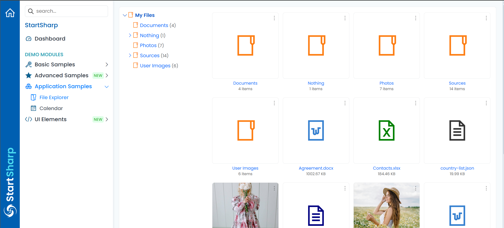
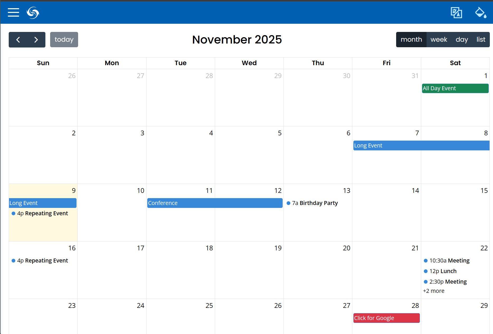
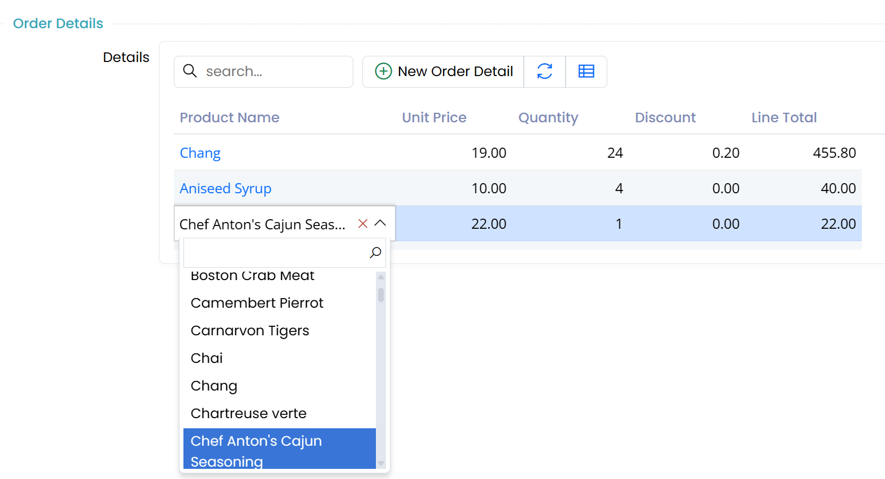
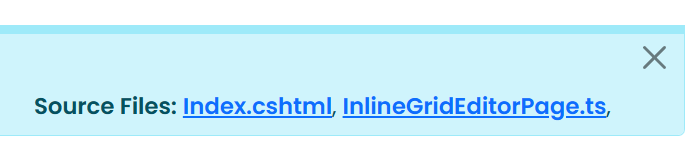
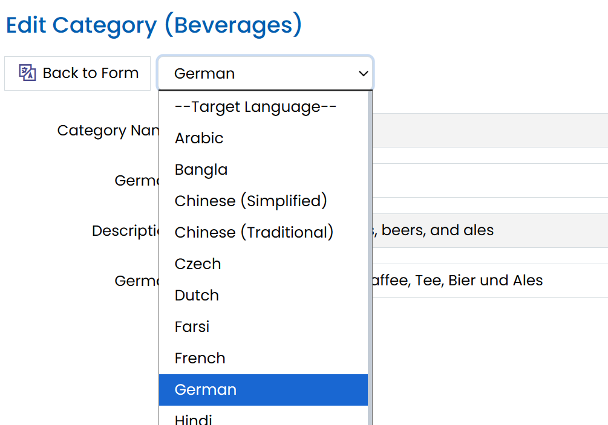

# Serenity 9.0.0 Release Notes (2025-09-16)

These release notes detail the significant changes made between versions 8.8.0 and 9.0.0. For a complete list of changes, please refer to the [Serenity Change Log](https://github.com/serenity-is/Serenity/blob/master/CHANGELOG.md).

## New File Explorer Sample (StartSharp)

A new File Explorer sample is available in the Serenity demo:

https://demo.serenity.is/AppSamples/FileExplorer



It is implemented with JSX and signals and demonstrates how to implement a custom application using Serenity. It has a file tree, thumbnails for images, a lightbox, dropdowns for file items, and can launch Office applications (if available) for Word, Excel, and other file types.

## FullCalendar Integration Sample (StartSharp)

We now have a Calendar application sample in the Serenity demo that integrates the FullCalendar component (https://fullcalendar.io/).

https://demo.serenity.is/AppSamples/Calendar




## New Type Registration System 

**Type registration via decorators** (e.g., `Decorators.registerClass`, `Decorators.registerEditor`, etc.) is now deprecated (it still works but is not recommended):

```ts
import { Decorators, Widget } from "@serenity-is/corelib";

@Decorators.registerClass("MyProject")
export class MyType extends Widget<any> {
}
```

You may now use a static `[Symbol.typeInfo]` property declaration instead:

```ts
import { Widget } from "@serenity-is/corelib";

export class MyType extends Widget<any> {
    static [Symbol.typeInfo] = 
        this.registerClass("MyProject.MyModule.MyType");
}
```

This new approach offers several advantages over decorators. Most importantly, decorator information is not emitted by TypeScript in declaration files (e.g., `.d.ts`), making it difficult or impossible to identify registration names for referenced project/npm package types.

Another reason for this change is a longstanding bug in esbuild ([see issue](https://github.com/evanw/esbuild/issues/4087)) with decorators and property initializers, which currently only has a workaround by using `experimentalDecorators: true` in `tsconfig.json`.

The new registration methods also support passing interfaces or attributes as an array in the second argument. For example, to set `@Decorators.panel(true)` on a class, you can do:

```ts
import { Widget, PanelAttribute } from "@serenity-is/corelib";

export class MyType extends Widget<any> {
    static [Symbol.typeInfo] = 
        this.registerClass("MyProject.MyModule.MyType", 
            [new PanelAttribute(true)]);
}
```

Note: When using this new registration method, TypeScript will not allow any decorators on the containing type, as the `this` expression is referenced in a static field initializer. If you need to use third-party decorators, you can use an alternative registration style:

```ts
import { Widget, classTypeInfo, registerType } from "@serenity-is/corelib";

@someCustomDecorator("test")
export class MyType extends Widget<any> {
    static [Symbol.typeInfo] = 
        classTypeInfo("MyProject.MyModule.MyType"); 
    static { registerType(this); }
}
```

This is equivalent to `this.registerType`, as the `registerType` static method in `Widget` calls `classTypeInfo` and `registerType` internally.

This style is also useful for formatter registration, as formatters typically do not have a base type and cannot simply call `this.registerType` like widget subclasses:

```ts
export class MyFormatter implements Formatter {
    static [Symbol.typeInfo] = 
        formatterTypeInfo("MyProject.MyModule.MyFormatter"); 
    static { registerType(this); }
}
```

For consistency, you may also choose to extend the new `FormatterBase` class:

```ts
export class MyFormatter extends FormatterBase implements Formatter {
    static [Symbol.typeInfo] = 
        this.registerFormatter("MyProject.MyModule.MyFormatter");
}
```

For all registration styles, you can now pass only the namespace ending with a dot (the enclosing type name will be auto-appended):

```ts
import { Widget } from "@serenity-is/corelib";

export class MyType extends Widget<any> {
    static [Symbol.typeInfo] = this.registerClass("MyProject.MyModule.");
}
```

Sergen / Serenity.Pro.Coder now also generates namespace constants under the `Modules/ServerTypes/Namespaces.ts` file, so you can use them to avoid typos:

```ts
import { Widget } from "@serenity-is/corelib";
import { nsMyModule } from "../../ServerTypes/Namespaces";

export class MyType extends Widget<any> {
    static [Symbol.typeInfo] = this.registerClass(nsMyModule);
}
```

We hope this will reduce mistakes when renaming classes or using a namespace with mismatched casing.


## Split Insert/Update Log Interfaces

The `IInsertLogRow` interface, which included `InsertUserIdField` and `InsertDateField` properties:

```csharp
public interface IInsertLogRow
{
    Field InsertUserIdField { get; }
    DateTimeField InsertDateField { get; }
}
```

is now split into `IInsertDateRow` and `IInsertUserIdRow` sub-interfaces:

```csharp
public interface IInsertDateRow
{
    DateTimeField InsertDateField { get; }
}

public interface IInsertUserIdRow
{
    Field InsertUserIdField { get; }
}

public interface IInsertLogRow : IInsertDateRow, IInsertUserIdRow
{
}
```

Similarly for `IUpdateLogRow`:

```csharp
public interface IUpdateDateRow
{
    DateTimeField UpdateDateField { get; }
}

public interface IUpdateUserIdRow
{
    Field UpdateUserIdField { get; }
}

public interface IUpdateLogRow : IUpdateDateRow, IUpdateUserIdRow
{
}
```

This provides the ability for rows to store only the date or the user during logging, if desired.

If you explicitly implemented these interfaces in some of your rows without subclassing `LoggingRow` and referenced the specific row interface like this:

```csharp
class SomeRow
{
    DateTimeField IInsertLogRow.InsertDateField => Fields.InsertDate;
    Field IInsertLogRow.InsertUserIdField => Fields.InsertUserId;
    DateTimeField IUpdateLogRow.UpdateDateField => Fields.UpdateDate;
    Field IUpdateLogRow.UpdateUserIdField => Fields.UpdateUserId;
}
```

you may get an error. You will need to replace the interface references:

```csharp
class SomeRow 
{
    DateTimeField IInsertDateRow.InsertDateField => Fields.InsertDate;
    Field IInsertUserIdRow.InsertUserIdField => Fields.InsertUserId;
    DateTimeField IUpdateDateRow.UpdateDateField => Fields.UpdateDate;
    Field IUpdateUserIdRow.UpdateUserIdField => Fields.UpdateUserId;
}
```


## New Grid EditLink Helper

If you wanted to add an edit link which opens the edit form for a particular record, you simply add the `[EditLink]` attribute:

```csharp
public class SomeColumns
{
    [EditLink]
    public string Description { get; set; }
}
```

This is handled behind the scenes by the grid to wrap the column's formatter output with an anchor element:

```html
<a class="s-EditLink s-MyGrid-DescriptionLink" 
    href="#MyGrid/ALFKI" 
    data-item-type="MyGrid" 
    data-item-id="1234">Some Description</a>
```

It uses the `itemLink` function defined in the `DataGrid` class which in turn calls `SlickFormatting.itemLink` helper:

```ts
protected itemLink(itemType?: string, idField?: string, 
    text?: Format<TItem>, 
    cssClass?: (ctx: FormatterContext) => string, 

    encode: boolean = true): Format<TItem> {
        return SlickFormatting.itemLink( // ...
        );
    }
```

The `itemType` and `idField` default to the entity grid's own values, but it is possible to pass different values to open another entity dialog.

For historic reasons, the arguments of this function are not very intuitive, though it is rarely used directly as most usage happens through the `[EditLink]` attribute.

We now provide a new EditLink function that accepts a props option:

```typescript
public EditLink = (props: {
    /** formatter context (contains item, value etc) */
    context?: FormatterContext,
    /** The id of the entity to link to. 
        * If not provided it will be taken from ctx.item[idField] */
    id?: string,
    /** The name of the field in item that contains the entity id. 
        * Defaults to idProperty. Used if id is not provided. */
    idField?: string,
    /** The item type to link to. Defaults to this.getItemType() */
    itemType?: string,
    /** Extra CSS class to add to the link element 
        * besides s-EditLink. Optional. */
    cssClass?: string,
    /** Tab index to add to the link element. Optional. */
    tabIndex?: number,
    /** The link text. If not provided it will be taken 
        * from ctx.escape(ctx.value) */
    children?: any
}): any => {
```

which can also be used in JSX contexts:

```typescript
protected override getColumns() {
    const columns = new OrderDetailColumns(super.getColumns());
    columns.ProductName.format = ctx => <this.EditLink context={ctx} />
    return columns.valueOf();
}
```

Again, it is still recommended to use the `[EditLink]` attribute but this helper might be useful for formatters where edit links might be generated conditionally or alongside other elements.


## Inline Editing Improvements and Inline Grid Editor Sample


We have now introduced an inline grid editor sample (e.g. for classes deriving from `GridEditorBase`):

https://demo.serenity.is/AdvancedSamples/InlineGridEditor



It was possible to use inline editing for in-memory grids, but as it was configured to work with server-side services by default, it was not very clear at first glance.

Inline editing in this sample works in memory for the `New Order` dialog, while it works directly with the server (e.g. saves every change) for the `Edit Order` dialog (connected mode). This demonstrates that it is possible to configure inline editing both for in-memory and connected modes.

There are also several new options for the `GridEditController`:

- `getPropertyItem` callback to optionally override the property item corresponding to a particular cell (row/column). This might allow using different editors or editing properties for different rows.

- `saveHandler` also receives a secondary `args` argument with a `defaultHandler` property, allowing you to call the default save handler when needed.

- `bulkSaveHandler` which allows you to override logic for bulk update operations.

## Containing Folder Names of Several Projects are Changed

The following folder names which are located under `Serenity/src/` have been renamed:

- `Serenity.Net.Core/` => `core/`
- `Serenity.Net.Services/` => `services/`
- `Serenity.Net.Web/` => `web/`

The following `common-features` project folders:

- `Serenity.Demo.BasicSamples/` => `demo.basicsamples/`
- `Serenity.Demo.Northwind/` => `demo.northwind/`
- `Serenity.Extensions/` => `extensions/`

> The folder names of pro-features projects have also been changed similarly. Please see the premium repository.

This change should not affect you unless you are using Serenity as a submodule. So, the users of NuGet packages have nothing to worry about.


## GitHub Source Links for Samples Are Updated to Use the Corresponding Release Commit ID

You may see source links on demo pages which take you to the corresponding source file(s) on GitHub for the demo page:



They were originally pointing to the `master` branch, so when the folder structure or filename changes the link might get broken. Also, as it was showing the latest version, it was not possible to see the state of a demo source at the version in use.

The links now take you to the particular commit the demo is released for. This should fix the broken links and allow you to see the source code as at the point it was released.

Note that this will only affect the demo projects that are version >= 9.0.1.

## New `Html.CspNonce` Helper

We have now introduced a new `Html.CspNonce()` helper which can be used to generate a nonce to be applied to script and CSS includes and specified in the `Content-Security-Policy` header.

Note that as CSP can be limiting for some applications, it is not enabled by default in Serene/StartSharp. There is a commented out `Content-Security-Policy` meta element in `_LayoutHead.cshtml` which you should adjust to your needs and uncomment to enable CSP if you wish:

```html
@*<meta http-equiv="Content-Security-Policy" content="base-uri 'self'; default-src 'self'; ..." />*@
```

## New Interface Source Generator

For service request handlers we normally define a corresponding interface to abstract the operation and use it in service endpoints instead of the concrete implementation type:

```csharp
using MyRow = Serenity.Pro.WorkLog.WorkLogRow;

namespace Serenity.Pro.WorkLog;

public interface IWorkLogAssignToInvoiceHandler : IRequestHandler
{
    ServiceResponse AssignToInvoice(IUnitOfWork uow, WorkLogAssignToInvoiceRequest request);
}

public class WorkLogAssignToInvoiceHandler(...) : IWorkLogAssignToInvoiceHandler
{
    public ServiceResponse AssignToInvoice(IUnitOfWork uow, WorkLogAssignToInvoiceRequest request)
    //...
}
```

When we modify some argument or type in the handler type we should also modify the arguments or types of the interface which could be tedious work.

We now provide a source generator that will generate the code for the interface automatically:

```csharp
namespace Serenity.Pro.WorkLog.RequestHandlers;

[GenerateInterface]
public class WorkLogAssignToInvoiceHandler() : IWorkLogAssignToInvoiceHandler
{
    public ServiceResponse AssignToInvoice(IUnitOfWork uow, WorkLogAssignToInvoiceRequest request)
    //...
}
```

Note the `[GenerateInterface]` attribute that triggers the source generator.

We also moved the request handlers to `.RequestHandler` namespace so that they will not show up in IntelliSense in endpoints etc. The generated interface will use the namespace without `.RequestHandlers` suffix, e.g. for the sample above, the namespace for the interface will be `Serenity.Pro.WorkLog`.

## New `npmCopy` Feature in TSBuild

There may be cases where you would like to include a script or style file under `node_modules`, for example to use it in `appsettings.bundles.json`. It is not possible to reference files under `node_modules` directly, as the static files under `node_modules` are not available to public consumers. Only the files under `wwwroot` are served by default. You could theoretically serve node_modules by using the static files provider but it is not recommended as the folder would be too big and `node_modules` won't be available in a published application normally.

For this reason, we provide several static scripts like Bootstrap via `Serenity.Assets` so that you could use them in `appsettings.bundles.json`. Another way is to use a tool like `libman`.

Now we provide another option via `tsbuild`'s new `npmCopy` helper:

```javascript
import { build, npmCopy } from "@serenity-is/tsbuild";

npmCopy([
    "some/path/to/file.js"
])
```

Which copies `node_modules/some/path/to/file.js` to `wwwroot/npm/some/path/to/file.js` along with any accompanying `.min.js` file.

It is not necessary to execute `npmCopy` manually in most cases, as `tsbuild` now calls it automatically for entries starting with `~/npm/` in `appsettings.bundles.json`:

```json
{
  "CssBundling": {
    "Bundles": {
      "Base": [
        //...
        "~/npm/flatpickr/dist/flatpickr.css",
        "~/npm/glightbox/dist/css/glightbox.min.css",
        //..
      ]
    }
  },
  "ScriptBundling": {
    "Bundles": {
      "Base": [
        //...
        "~/npm/glightbox/dist/js/glightbox.min.js",
        //...
      ]
    }
  }
}
```

So, just npm install the library with static scripts and CSS files you need, include necessary paths in `appsettings.bundles.json` (prefix with `~/npm/` instead of `node_modules/`) and tsbuild will take care of the rest.

You may only need to call `npmCopy` for any script or style file that you use in other places like a `Page.cshtml` file that has a particular script include for that page only.

## Several Legacy / Third Party Scripts are Removed from Serenity.Assets

As `jquery` is no longer necessary, we removed the following third party scripts from Serenity.Assets:
- jquery.colorbox (prefer glightbox from npm; we use it in StartSharp now)
- jquery.cookie
- jquery.event.drag
- jquery.maskedinput
- jquery-ui
- jquery-ui-i18n
- jspdf (if not available in global/window, PDFExportHelper will try to load it from CDNJS by default)
- jspdf.autotable (if not available in global/window, PDFExportHelper will try to load it from CDNJS by default)

If you still need these legacy scripts (e.g. in appsettings.bundles.json) you may install them via npm / libman.json or use them via CDN.

Also removed `ckeditor` from Serenity.Assets. `HtmlContentEditor` will load it (v4.22.1) from CDNJS by default. Please remove line `HtmlContentEditor.CKEditorBasePath = "~/Serenity.Assets/Scripts/ckeditor/"` from ScriptInit.ts.

## It is Recommended to Add BeforeTargets="ResolveProjectStaticWebAssets" to the RunTSBuild Target

Due to some changes in .NET9+ Static Web Assets SDK, build and publish may sometimes fail as esbuild might create / delete some files after the SDK discovers static assets.

Please modify your `RunTSBuild` target to include a `BeforeTargets` as shown:

```xml
<Target Name="RunTSBuild" BeforeTargets="ResolveProjectStaticWebAssets" ...>
```

The line below can be removed after this change:

```xml
<GenerateComputedBuildStaticWebAssetsDependsOn>RunTSBuild...
```

## The `experimentalDecorators` Option Should be Set Back to true

As `esbuild` has an unresolved bug with decorators and initializers (https://github.com/evanw/esbuild/pull/4092) you may have script errors unless you set `"experimentalDecorators": true` in `tsconfig.json`. Unfortunately, so far the esbuild author has not provided any fix or reaction to this issue even though we created pull requests with a fix.

Although the new type registration system which does not depend on decorators should remedy this issue, if you use decorators in existing code it is still recommended to set this flag to true.

## Support for Partial Row Properties

If you are targeting .NET 9 SDK (instead of .NET 8), Sergen and Pro.Coder now support partial row field getter / setters. E.g. instead of:

```cs
public sealed partial class LanguageRow : Row<LanguageRow.RowFields>
{
    public string LanguageName { get => fields.LanguageName[this]; set => fields.LanguageName[this] = value; }
}
```

You may now write:

```cs
public sealed partial class LanguageRow : Row<LanguageRow.RowFields>
{
    public partial string LanguageName { get; set; }
}
```

And Sergen will generate the accessors automatically.

## New Localization UI and List Service / Dropdown Localization

Added a `FieldLocalizationListBehavior` to support localization during list requests. Currently, only `ServiceLookupEditor` can display localized dropdowns:


Enhanced localization UI by adding a dropdown to select the target language, displaying inputs for the selected language only. The selection persists in local storage:




## Switched to ClosedXML

We transitioned from `EPPlus` to `ClosedXML` due to licensing issues and lack of updates to the free open source version of `EPPlus`. The change primarily affects `ExcelReportGenerator` users, with updates to helper function arguments and return types (e.g., `XLWorkbook` instead of `ExcelPackage`). 

The only impacted screen was the `ProductExcelImport` sample. Other Excel export and report functionalities remain unaffected. 

If EPPlus is still required, manually add its reference and retain a copy of the old `ExcelReportGenerator`.

## IRowOperationInterceptor and ISqlOperationInterceptor

It is now possible to intercept some SQL operations done through `SqlHelper` (connection.ExecuteReader, connection.ExecuteNonQuery etc.) and `EntityConnectionExtensions` (connection.TryById, connection.InsertAndGetID etc.) by implementing `ISqlOperationInterceptor` and/or `IRowOperationInterceptor` in the mock connection class.

This is especially useful for unit testing. See how we use it in our tests in `Serenity.Net.Tests`:

[EntityConnectionExtensions_ById_Tests.cs](https://github.com/serenity-is/Serenity/blob/master/tests/Serenity.Net.Tests/entity/extensions/EntityConnectionExtensions_ById_Tests.cs)


## New AddApplicationPartsFeatureToggles Extension

The new `services.AddApplicationPartsFeatureToggles` can be used in Startup instead of `services.AddFeatureToggles`. 

```cs
services.AddApplicationPartsFeatureToggles(Configuration);
services.AddApplicationPartsTypeSource();
```

This also scans enum types with [FeatureKeySet] attribute in application parts, and disables features that have a [DefaultValue(false)] attribute on them by default. 


It also discovers dependencies between features themselves (for example a DataAuditLog_Services sub feature might depend on a DataAuditLog feature, e.g. disabling it also disables all sub features) so it is recommended to switch to AddApplicationPartsFeatureToggles.

We also added the ability to declare dependencies between feature flags themselves by adding `[RequiresFeature]` attribute to the FeatureKeys enum members, or the enum itself:

```cs
namespace Serenity.Pro.DataAuditLog;

[FeatureKeySet]
[RequiresFeature(DataAuditLog)]
public enum FeatureKeys
{
    DataAuditLog,
    DataAuditLogBehaviors,
    DataAuditLogEndpoints,
    DataAuditLogHandlers,
    DataAuditLogMigrations,
    DataAuditLogPages
}
```

Here all the feature flags defined in this `FeatureKeys` enum depend on the `DataAuditLog` feature. So, by setting `DataAuditLog` to false, all of them will be disabled.

We have also added a new argument (`disabledByDefault`) to `AddFeatureToggles` method to pass a list of feature toggle keys (enums or strings) to disable by default without having to set in configuration. The default will be used if the flag is not specified in the configuration, e.g. it will not override the configuration setting. It is also possible to pass ["*"] to disable all features by default, but is not recommended as it would mean when we add a new feature flag in the future (not necessarily a new feature, just a new toggle to disable some part of a feature), all users would have to enable it manually in configuration.

## New Default Set of Global Usings For Serenity

We now automatically add common namespaces like `System.Collections.Generic`, `Serenity`, `Serenity.ComponentModel` etc. to usings from `Serenity.Net.Web.targets` (e.g. any project referencing `Serenity.Web` package) unless `SerenityUsings` property is explicitly set to `false` in the project. This means most `Using` items from StartSharp/Serene projects might be removed.

## **Package Mergers**:

- `Serenity.Net.Data` and `Serenity.Net.Entity` packages are now merged into `Serenity.Net.Services`. Remove references to these packages and update `TypeSource` implementations accordingly. Switching to `ApplicationPartsTypeSource` is recommended.

- `Serenity.Pro.DataAuditLog` and `Serenity.Pro.EmailQueue` are merged into the `Serenity.Pro.Extensions` package. Remove their assembly references if using a classic type source.

- `Serenity.Pro.Theme` package contents are merged into `Serenity.Pro.Extensions`. Update references in `appsettings.bundles.json`:
    - Replace `~/Serenity.Pro.Theme/pro-theme.js` with `~/Serenity.Pro.Extensions/pro-theme.js`.
    - Replace `~/Serenity.Pro.Theme/pages/dashboard.css` with `~/Serenity.Pro.Extensions/pages/dashboard.css`.
    - Replace `~/Serenity.Pro.Theme/pro-theme{.rtl}.css` with `~/Serenity.Pro.Extensions/pro-theme{.rtl}.css`.
    - Remove `~/Serenity.Pro.Extensions/pro-extensions{.rtl}.css`, as it is merged into `pro-theme.css`.
    
- `Serenity.Pro.Organization` is merged into `Serenity.Pro.Meeting`. Remove its references from your project and `TypeSource`.