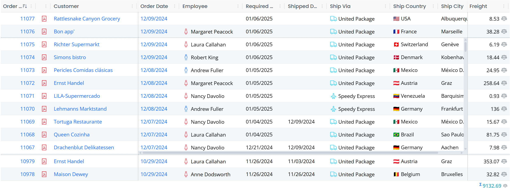
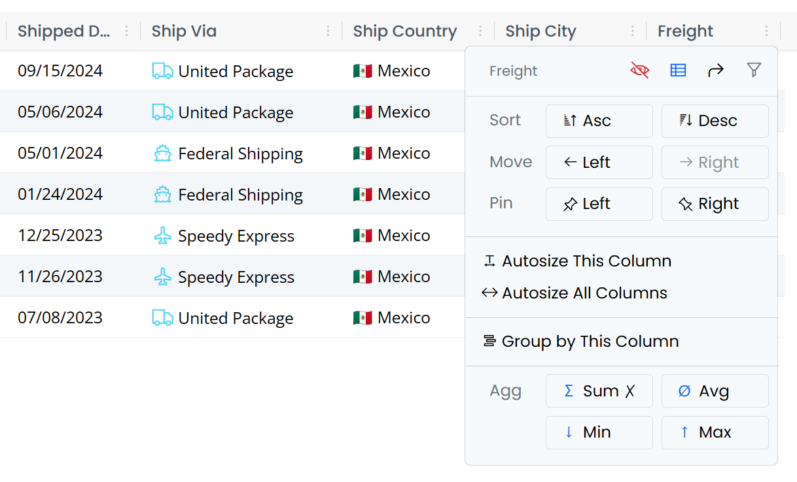
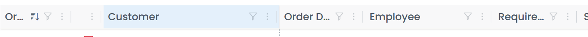
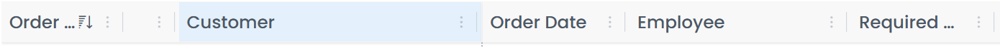
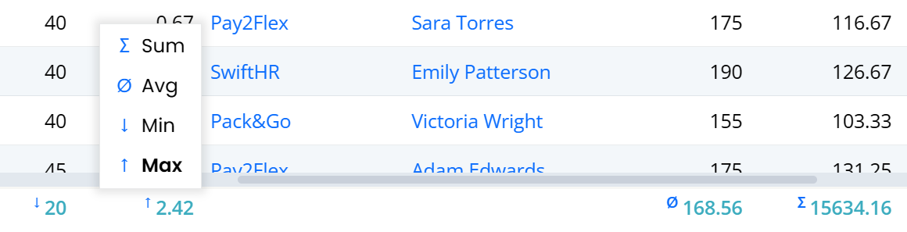
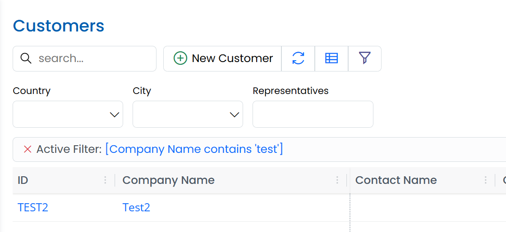

# Serenity 9.1.0 Release Notes (2025-11-10)

These release notes detail the significant changes made in version 9.1.0. For a complete list of changes, please refer to the [Serenity Change Log](https://github.com/serenity-is/Serenity/blob/master/CHANGELOG.md).

## Introducing DomWise

`@serenity-is/domwise` is our new library to create DOM elements with full TypeScript support.

It is primarily based on [jsx-dom](https://github.com/alex-kinokon/jsx-dom) with integrated signal support via [@preact/signals-core](https://github.com/preactjs/signals) and some extra types / ideas from [ryansolid/dom-expressions (SolidJS)](https://github.com/ryansolid/dom-expressions) and [lusito/tsx-dom](https://github.com/Lusito/tsx-dom).

Even though `jsx-dom` served us well so far, it lacked some features that we needed like signals integration, and we wanted to be able to quickly add new features and fix any discovered ones.

`@serenity-is/domwise` also exports signal functions like `signal`, `computed`, `effect` etc. from `@preact/signals-core`. It supports signals as attribute values and element children, and reactively updates the attributes and dom nodes when signal values change.

We recommend removing `jsx-dom` from your `package.json`, and setting the `jsxImportSource` to `@serenity-is/domwise`. 

Removing the `@preact/signals-core` and using the signal functions from `@serenity-is/domwise` is also recommended.

You may spot a few differences between `jsx-dom` and `domwise`. For example, the HTML element attributes are lower cased to match the actual HTML attribute casing, e.g. `tabindex` instead of `tabIndex`, `readonly` instead of `readOnly`, `for` instead of `htmlFor`. We added aliases for a few commonly used ones like `tabIndex`, `htmlFor`, `maxLength` etc. but if you come across one that we missed, please use the lowercase variant.

The reason we chose this (apart from the fact that we based our type definitions on `dom-expressions`, not `jsx-dom`) is that we want to make it easier to copy/paste actual HTML code to our `.tsx` files. For example, if you wanted to use some Bootstrap sample code in your app, previously you had to replace most of the attribute names.

For compatibility, event handlers are left as camelCase, e.g. onClick.

## Enhanced Layout (StartSharp)

The layout system for SleekGrid is completely rewritten, and we now introduce Enhanced Layout, which is an improved and feature-complete version of previously available (but unused) Frozen Layout. It supports pinning columns to left (start), or right (end) and frozen columns at the top or bottom.



In the sample above, Order ID and Customer columns are pinned to the left, and Freight is pinned to the right. There are also two frozen rows at the top and the bottom.

What is nice about this enhanced layout is that it also acts responsively, and temporarily unpins / unfreezes columns / rows when there is not enough space for the main scrolling area. This is especially important for mobile devices.

Enhanced Layout is enabled by default for all grids in StartSharp, though pinning / frozen rows are opt-in. If you were using FrozenLayout in some of your grids (by overriding `getSlickOptions`), it is recommended to remove it.

## New Column Menu (StartSharp)

Columns now have a very functional dropdown menu:



On the top right there are small icons to hide the column, show column picker, reset columns, and edit column filter if `HeaderFiltersMixin` is active.

The split actions allow changing the sort order, moving the column to the left or right.

The following actions are available if the corresponding grid mixin / plugin is active. They automatically add their own actions to the header menu when attached to the grid.

There is an option to pin columns to left or right when `EnhancedLayout` is enabled.

There are options to auto-size the column, or all columns when `AutoColumnWidthMixin` is active.

`Group by This Column` option is shown when the `DraggableGroupingMixin` is active.

When the `CustomSummaryMixin` is enabled, there are options to set the Summary/Aggregate type for the column.

## Automatic Registration for Grid Mixins/Plugins (StartSharp)

All the available grid plugins / mixins like `HeaderMenuPlugin`, `AutoColumnWidthMixin`,  `CustomSummaryMixin`, `DraggableGroupingMixin` and `HeaderFiltersMixin` now provide an option to automatically register with all grids in the application. It is also possible to limit the registration to a subset of the grids via a predicate.

Auto registration is configured in StartSharp via `Modules/Common/script-init/autoregister-init.ts` file:

```typescript

// the options set in callbacks here only apply to auto-registered mixins

HeaderMenuPlugin.enableAutoRegister(_args => { });

AutoColumnWidthMixin.enableAutoRegister(args => {
    if (!shouldAutoRegister(args)) return;

    // disable auto size on load
    args.options.autoSizeOnLoad ??= false;
});

DraggableGroupingMixin.enableAutoRegister(args => {
    if (!shouldAutoRegister(args)) return;

    // hide panel when there are no grouped columns
    args.options.showPanelWhenNoGroups = false;
});

CustomSummaryMixin.enableAutoRegister(args => {
    if (!shouldAutoRegister(args)) return;

    // hide footer when there are no summaries
    args.options.showFooterWhenNoSummaries = false;
});

HeaderFiltersMixin.enableAutoRegister(args => {
    if (!shouldAutoRegister(args)) return;

    // hide filter button when column is not filtered
    args.options.showButtonWhenNotFiltered = false;
});

function shouldAutoRegister(args: AutoRegisterArgs): boolean {
    // Auto-register mixins only in EntityGrids that are not GridEditors. 
    // You may modify it based on your requirements and use args.pluginType
    // to filter specific mixins.
    args.cancel = !(args.dataGrid instanceof EntityGrid) ||
        (args.dataGrid instanceof GridEditorBase);

    return !args.cancel;
}
```

Based on your preferences, you may customize auto-registration process in this file and override options for the auto-registered instance.

Note that the auto-registered instance is removed when another instance of the same mixin / plugin is manually registered in the specific grid.

It is possible to cancel the auto registration for an individual grid / plugin by setting `args.cancel` to `false` in `autoregister-init.ts`, or by overriding `autoRegisteringPlugin` method in the grid class:

```ts
export class OrderGrid<P = {}> extends EntityGrid<OrderRow, P> {
    protected override autoRegisteringPlugin(args: AutoRegisterArgs) {
        args.cancel = args.pluginType === HeaderFiltersMixin;
    }
}
```

The plugin/mixin type is available in `args.pluginType`. It is also possible to override options for current grid this way by setting `args.options.someOption`.

## HeaderFiltersMixin Hide Button Option



As it is possible to open the column filter popup via column header menu, HeaderFiltersMixin provides an option (`showButtonWhenNotFiltered`) to hide the filter button when the column is not filtered. This is useful to save space for the column header itself.



The option (`showButtonWhenNotFiltered`) is set to `false` (e.g. hide the button when not active) in `autoregister-init.ts` file for auto-registered HeaderFiltersMixin instances, but you may also set this option while creating the mixin, or by setting it in `HeaderFiltersMixin.defaultOptions`.

When the column has an active filter, the button will still be shown as an indicator.

## DraggableGroupingMixin Panel Auto Toggle Option

As it is now possible to group by a column via the column header menu, DraggableGroupingMixin has an option named `showPanelWhenNoGroups` that if set to false, hides the grouping bar (one with text `Drag a column here...`) when there are no grouped columns.

The default for it is true, while it is set to `false` in `autoregister-init.ts` file to save vertical space for the auto-registered instance.

You may also set it via `DraggableGroupingMixin.defaultOptions`.

## CustomSummaryMixin Footer Auto Toggle and Indicators

As it is now possible to set summary types for a column via the column header menu, CustomSummaryMixin offers an option named `showFooterWhenNoSummaries` that if set to false, hides the grid footer when there are currently no columns with summaries.

The default for it is true, while it is set to `false` in `autoregister-init.ts` file to save vertical space for the auto-registered instance.

You may also set it via `CustomSummaryMixin.defaultOptions`.

`CustomSummaryMixin` also has indicator symbols for the current aggregate type:



## Several Attributes are Renamed / Deprecated

- Renamed `[ScriptSkip]` attribute to `[TransformIgnore]` attribute to better match the intent, e.g. ignoring the class or property during Sergen/Pro.Coder transforms from C# to TypeScript. `ScriptSkip` still exists but is deprecated. The old name felt a bit like `skip this on client/script side`.

- Renamed `[Ignore]` attribute to `IgnoreUIField` to better match the intent, e.g. ignoring the generation of column / form fields for that property. `Ignore` attribute still exists but is deprecated. The old name was not clear enough.

- Renamed `IgnoreNameAttribute` to `SkipNameCheckAttribute` to better match the intent. `IgnoreName` attribute still exists but is deprecated.

- [OneWay] attribute is also obsolete, use [SkipOnSave] attribute. There is now a [SkipOnLoad] attribute which does for loading what OneWay/SkipOnSave does for saving. We also now have [Unbound] attribute, which when placed on a column property, will cause the column to have no field, and act like a mix of [SkipOnSave, SkipOnLoad, SkipNameCheck].

- Renamed `Grid` (@serenity-is/sleekgrid) to `SleekGrid` to avoid mix-ups with `DataGrid`, `EntityGrid` and other grid types.

## New Attributes Namespace for Symbol.typeInfo Based Registrations

We introduced `[Symbol.typeInfo]` style type registrations in 9.0.0. As we could not use decorators when using the `typeInfo` style registration we had to use a different way to specify attributes than the decorator way, e.g. `@Decorators.panel()`

```ts
import { Widget, PanelAttribute } from "@serenity-is/corelib";

export class MyType extends Widget<any> {
    static [Symbol.typeInfo] = this.registerClass(
        "MyProject.MyModule.MyType", [new PanelAttribute(true)]);
}
```

Now you may use `Attributes` namespace which works similar to the `Decorators` namespace:

```ts
import { Attributes, Widget } from "@serenity-is/corelib";

export class MyType extends Widget<any> {
    static [Symbol.typeInfo] = this.registerClass(
        "MyProject.MyModule.MyType", [Attributes.panel()]);
}
```

This makes it easier to add attributes in line with the `Decorators` way, and as all available attribute types will be available under `Attributes` namespace, they will show up on IntelliSense when you type `Attributes.`.


## Advanced Filtering Changes

The `FilterableAttribute` which used to control advanced filtering on grids via a bottom filter bar and an advanced filter dialog is renamed to `AdvancedFilteringAttribute` which you may use via `Attributes.advancedFiltering()`.

When there is no active advanced filter, the filter bar will no longer be shown to save space. To make it possible to edit advanced filter when the filter bar is hidden, we added a tool button next to the column picker:



The filter bar is also moved to the top of the grid. This will make it easier to identify when a grid has an advanced filter.

## GetColumns Method is Deprecated (DataGrid/EntityGrid)

We had a `protected getColumns()` method in `DataGrid` subclasses that is used to create the initial column set for a grid, but as its name matched the `SleekGrid`'s `getColumns()` method that returned the current set of visible columns in the grid, sometimes users tried to call this method to get the current columns, instead of `dataGrid.sleekGrid.getColumns()`.

```ts
protected override getColumns() {
    const columns = super.getColumns();
    // ... add / modify columns
    return columns;
}
```

Please override `protected createColumns()` method instead which better matches the intent:

```ts
protected override createColumns() {
    const columns = super.createColumns();
    // ... add / modify columns
    return columns;
}
```

To access currently visible columns for a data/entity grid, you may use `.columns` property, or `.sleekGrid.getColumns()` method:

```ts
const columns = this.columns;
// above is equivalent to...
const columns = this.sleekGrid.getColumns();
```

To access all the columns (including invisible ones, not necessarily matching the visible order)

```ts
const columns = this.allColumns;
// above is equivalent to...
const columns = this.sleekgrid.getAllColumns();
```


## Fluent.toggle, Fluent.hide, Fluent.show Now Sets The Hidden Attribute

For compatibility with jQuery, we previously chose to set `style.display` to `none` when an element is hidden via `Fluent` methods. We now decided to use the `hidden` attribute which applies to all element types, and actually hides the element even if the `style.display` property is overridden by a Bootstrap class like `d-block`. 

Fluent tries to handle this transition gracefully, but it is recommended to update the logic in your own files.

## SleekGrid Layout Rewrite and Touch Device Fixes

SleekGrid now has a better column dragging system that also works in touch devices.

We also rewrote the layout system of the SleekGrid from the ground up. It now uses a `CSS Grid` layout for the main panels / viewport. We moved most of the layout logic to the grid from individual layout systems like `BasicLayout` / `FrozenLayout`.

SleekGrid is now able to handle dynamic changes of pinned columns and frozen rows. It also handles it responsively so that when the viewport gets small (e.g. on mobile devices) or when there are not enough data rows, the number of pinned columns and frozen rows is temporarily reduced to make the scrollable area visible.

When any cell in the last row of a full size grid with a `Select2` dropdown is clicked, as `Select2` tries to position its dropdown momentarily, a page scrollbar is shown. This triggered a layout event in the grid, causing it to hide the editor due to a full re-render.

Another similar issue was present in `Product` page with legacy editor inputs and the Android touch keyboard.

These issues are now fixed, and `SleekGrid` should perform better with mobile devices.

Note that SleekGrid which was hosted as a submodule inside Serenity repository, is now embedded as a sub-tree. If you are using Serenity as a submodule, you may need to rename / delete `Serenity/packages/sleekgrid` folder before pulling latest changes.

## Interface Versions of SleekGrid and RemoteView

To avoid direct dependency on SleekGrid and RemoteView classes, we now have interface versions of these types, ISleekGrid and IRemoteView. This may affect you if you referenced one of these types directly.

## New DOMParser Based Sanitizer

SleekGrid now has an improved, and more secure HTML sanitizer, based on DOMParser. Even though we enable DOMPurify in our application templates instead of this sanitizer, the built-in sanitizer should be enough for most of the cases.

The old regex-based basic sanitizer could fail in some complex cases.

`@serenity-is/corelib` now also has a `sanitizeHtml` function that uses SleekGrid's configured one if available, DOMPurify or its own DOMParser based sanitizer. We recommend using this function where you need HTML sanitization for user-provided content (unless you directly reference DOMPurify).

## Strings Returned From Formatters Are Assumed To Be Text (`**[Breaking Change]**`)

`gridDefaults.enableHtmlRendering` is now false by default. This means strings returned from formatters are assumed to be text, not raw HTML. You should convert those formatters to return HTML elements (via `domwise` etc). 

Note that when this flag is false (default now), the ctx.escape() function will return strings as is, will not HTML-encode them, as it would otherwise result in double HTML escaping.
 
If you want to revert to the previous behavior (not recommended), set gridDefaults.enableHtmlRendering = true in ScriptInit.ts etc.


## Sergen MVC:AsNamespace Option

Added a `MVC:AsNamespace` option to sergen.json which causes a `.MVC` namespace suffix to be generated instead of an `MVC` class. 

When enabled, the `ESM` helper class will also be generated under this namespace, e.g. `RootNamespace.MVC`. 

This should reduce confusion when a namespace like `Serenity.Extensions` is added to global usings as it also has its own `MVC` helper. 

The default is false for now as it would be a problem for `ESM.` references as they would need to be written as `MVC.ESM.` or an alias should be assigned in the project file like `<Using Include="$(MSBuildProjectName).MVC.ESM" Alias="ESM" />`. New projects have this alias defined by default.

The new `defaults@9.0.0` in `sergen.json` can be used instead of `defaults@6.6.0` to enable this flag by default (new projects will also use `defaults@9.0.0`).
