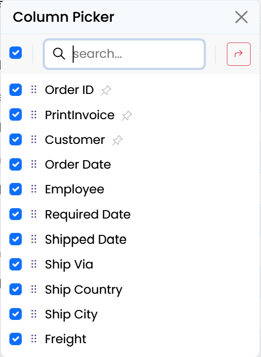

# Serenity 9.2.0 Release Notes (2025-11-24)

> **Note:** This is the last version targeting .NET 8. Future versions (starting 10.0.0) require .NET 10 and Visual Studio 2026.

These release notes detail the significant changes made in version 9.2.0. For a complete list of changes, please refer to the [Serenity Change Log](https://github.com/serenity-is/Serenity/blob/master/CHANGELOG.md).

## Content Security Policy (CSP) Support

We have made significant improvements to support **Content Security Policy (CSP)** headers. While most modern applications use CSP to prevent XSS attacks, implementing it has been challenging with Serenity due to inline styles and scripts used by some components.

### styleNonce Option for SleekGrid

SleekGrid now supports a `styleNonce` option in its constructor for stricter CSP directives. If not passed explicitly, it will automatically look up a nonce value from:

- A `<meta name="csp-nonce">` element in the document head, or
- A `<script>` or `<style>` element with a `nonce` attribute in the document head.

```ts
const grid = new SleekGrid(container, columns, options, {
    styleNonce: "random-nonce-value"
});
```

### Replaced Inline Style Attributes

We replaced inline style attributes across the codebase to support stricter CSP directives. Components like dialogs, block UI, select2, filter panels, property grids, and various sample pages have been updated to use CSS classes instead of inline styles.

The one remaining exception is **CKEditor 4**, which inherently requires `unsafe-inline` for styles. This is one of the reasons we are moving toward Tiptap as the default HTML editor (see below).


### Recommended JSX Style for Inline Styles

When an inline style is assigned directly via the `style` attribute as a string, it may create a CSP issue, whereas assigning it as an object won't:

```jsx
// CSP issue
<div style="font-weight: bold; display: inline-block;" />

// No CSP issue
<div style={{ fontWeight: "bold", display: "inline-block" }} />
```

It is recommended to avoid inline style assignment as a string even if you don't enable CSP.

### New CSP Directive Helpers

We added helper methods to `HtmlScriptExtensions` that make it easier to manage CSP directives both from the layout and per specific pages:

```cshtml
// In _LayoutHead.cshtml:
<meta http-equiv="Content-Security-Policy" content="
    @Html.GetCspDirective("base-uri", "self")
    @Html.GetCspDirective("default-src", "self")
    @Html.GetCspDirective("img-src", "data:", "https:", "self")
    @Html.GetCspDirective("font-src", "self", "https://fonts.gstatic.com")
    @Html.GetCspDirective("script-src", "self")
    @Html.GetCspDirective("style-src", "self")
    @Html.GetCspDirective("connect-src", "self", "http:", "ws:", "wss:")" />
```

**`Html.CspNonce()`** now optionally accepts an `addDirectives` parameter (default `true`) that automatically adds `script-src` and `style-src` nonce directives:

```cshtml
@{
    var nonce = Html.CspNonce(); // adds 'nonce-{value}' to script-src and style-src
}
```

**`Html.AddCspDirective()`** allows adding directives from specific pages. For example, the EmailClient page adds CKEditor-compatible directives:

```cshtml
@{
    // has to be added here because of the CKEditor that is used in email editor
    Html.AddCspDirective("style-src", "unsafe-inline", "https://cdnjs.cloudflare.com/ajax/libs/ckeditor/");
    Html.AddCspDirective("script-src", "unsafe-inline", "https://cdnjs.cloudflare.com/ajax/libs/ckeditor/");
}
```

Values that consist only of alphanumeric characters, hyphens, and underscores are automatically quoted (e.g., `self` becomes `'self'`). If `unsafe-inline` is present in a directive, any nonce or hash values are automatically removed to avoid CSP ignoring the `unsafe-inline` directive.

**`Html.GetCspDirective()`** retrieves the accumulated CSP directive string, merging any manually specified values with ones added via `AddCspDirective`. The result is HTML-attribute-encoded and includes the trailing semicolon.

### CSP Enabled by Default (StartSharp)

The CSP meta tag is now enabled by default in `_LayoutHead.cshtml` using the new helper methods, instead of being commented out:

```cshtml
<meta http-equiv="Content-Security-Policy" content="
    @Html.GetCspDirective("base-uri", "self")
    @Html.GetCspDirective("default-src", "self")
    @Html.GetCspDirective("img-src", "data:", "https:", "self")
    @Html.GetCspDirective("font-src", "self", "https://fonts.gstatic.com")
    @Html.GetCspDirective("script-src", "self")
    @Html.GetCspDirective("style-src", "self")
    @Html.GetCspDirective("connect-src", "self", "http:", "ws:", "wss:")" />
```

### AddCspDirective Overloads (9.2.1)

We added `AddCspDirective` overloads for `ControllerBase` and `HttpContext` to provide more flexibility in adding CSP directives from controllers and middleware.

## Tiptap Editor Integration (StartSharp)

We have configured `HtmlNoteContentEditor` and `HtmlReportContentEditor` to use **Tiptap** instead of CKEditor by default. Tiptap is a modern, framework-agnostic rich text editor based on ProseMirror, and it is fully compatible with strict CSP directives.

### Configuration

Tiptap is configured in `Modules/Common/script-init/tiptap-init.ts`:

```typescript
import { HtmlContentEditor, HtmlNoteContentEditor, HtmlReportContentEditor } from "@serenity-is/corelib";

HtmlContentEditor.tiptapModule = () => import("../dynamic-module/tiptap-module.mjs");
HtmlNoteContentEditor.defaultEditorProvider = "tiptap";
HtmlReportContentEditor.defaultEditorProvider = "tiptap";
```

Note that the initialization code above still keeps `CKEditor` as the default for `HtmlContentEditor`, as some features like the email client, email compose dialog, etc. might still require features provided by `CKEditor`. If you test it and confirm that it is not an issue for your environment, you may also set the default to `tiptap`:

```typescript
HtmlContentEditor.defaultEditorProvider = "tiptap";
```

The Tiptap module is loaded dynamically and exposes various extensions via `tiptap-module.mts`:

```typescript
export * from '@tiptap/core';
export * from "@tiptap/extension-file-handler";
export * from "@tiptap/extension-image";
export * from "@tiptap/extension-subscript";
export * from "@tiptap/extension-superscript";
// ... other extensions
```

### CKEditor Deprecation

CKEditor 4 support is still available but is now opt-in. It will be removed in a future version as it is out-of-date and is not compatible with strict CSP. To use CKEditor for a specific editor instance, you can set the `editorProvider` option:

```typescript
new HtmlContentEditor({
    editorProvider: "ckeditor",
    // ... other options
});
```

The `getConfig` method in `HtmlContentEditor` is now deprecated; use `getCKEditorConfig` instead.

## New `useUpdatableComputed` Helper (DomWise)

We added a new `useUpdatableComputed` helper in `@serenity-is/domwise` to create a factory for computed signals that can be manually updated as a batch:

```typescript
import { useUpdatableComputed } from "@serenity-is/domwise";

const { computed, update } = useUpdatableComputed();

const totalPrice = computed(() => {
    // This will re-evaluate when update() is called
    return items.value.reduce((sum, item) => sum + item.price * item.quantity, 0);
});

// Later, batch-update all computed values:
batch(() => {
    items.value.push(newItem);
    update(); // triggers recomputation of dependent computed signals
});
```

This is useful for computed signals that depend not only on other signals but on externally changing state. The `HeaderMenuPlugin` in StartSharp now uses this helper internally.

## RTL and Column Improvements (SleekGrid)

### CSS Variables for RTL

Instead of using separate `sleek-vars.rtl` and `sleek-vars.ltr` stylesheets, we now change the values of `--l` (left) and `--r` (right) CSS variables based on the document direction. This simplifies the CSS and makes it easier to support RTL layouts.

### Increased Column Limit

The maximum number of supported columns in SleekGrid has been increased from **50 to 100**, which should be sufficient for most use cases.

## Enhanced Attribute System (9.1.5)

We enhanced the type system for JavaScript client-side attributes and interfaces:

- **`CustomAttribute`** base class added for extensible attribute support and attribute typing
- **`AttributeSpecifier`** union type introduced for flexible attribute specification (classes, instances, factories)
- `registerClass`, `registerEditor`, and `registerFormatter` now handle `AttributeSpecifier`

You no longer need to call `Attributes.factoryFunction()` — the registration helper will call it automatically. This means you can pass attribute classes or references directly, and the factory is invoked behind the scenes:

```typescript
// Before (still works — explicit factory call):
static [Symbol.typeInfo] = this.registerClass(
    "MyProject.MyModule.MyType", [Attributes.panel()]);

// After (factory called automatically):
static [Symbol.typeInfo] = this.registerClass(
    "MyProject.MyModule.MyType", [Attributes.panel]);
```

Similarly, calling `new SomeAttributeClass()` is no longer necessary — you can pass the class reference directly:

```typescript
// Both work the same now, the second is preferred:
[new PanelAttribute(true)]
[PanelAttribute]
```

## New Column Picker Dialog (9.1.4)

The Column Picker Dialog has been completely redesigned. Instead of a split view with visible/hidden column lists, it now has a **unified column list** with checkboxes to toggle visibility:

Key improvements:
- **Single list** with checkboxes instead of two separate lists
- **Real-time changes** — changes are applied as soon as a checkbox is clicked or columns are dragged
- **Works with raw SleekGrid** or any other component with columns, as long as necessary callbacks are provided
- **Improved "Toggle All" handling** — only one populate operation is necessary when multiple columns are shown (9.1.6)
- **Better search/reset separation** (9.1.4)




## SleekGrid Event System Redesign (9.1.2)

The SleekGrid event system has been redesigned to resolve issues that occurred when jQuery was loaded on the same page.

Previously, all event arguments were passed through a single `e` argument. Now, only a subset of commonly used `Args` properties (such as `grid`, `column`, `row`, `cell`) are passed directly through the event argument, while the rest can be accessed via a second `args` parameter or `e.args`:

```typescript
grid.onColumnsResized.subscribe((e) => {
    // e contains grid, column, row, cell etc.
    // Additional properties can be accessed via e.args
    const allColumns = e.args.columns;
});
```

If you have custom event handlers that access non-standard event properties, you may need to update them to use `e.args` instead.

## PromptDialog Improvements (9.1.1)

`PromptDialog` now has two new options:

- **`submitOnEnter`** (default `true`) — submits the dialog when Enter is pressed
- **`closeOnEscape`** (default `true`) — closes the dialog when Escape is pressed

These can be modified globally via `PromptDialog.defaultOptions`:

```typescript
PromptDialog.defaultOptions.submitOnEnter = true;
PromptDialog.defaultOptions.closeOnEscape = true;
```

You can also access the editor directly via the new `getEditor` method:

```typescript
const dialog = new PromptDialog({});
const editor = dialog.getEditor();
editor.value = "Some default text";
```

## Persistence Flags (9.1.6)

The persistence system now stores the **used persistence flags** in the persisted grid settings. This allows the grid to correctly restore settings even when the available persistence flags differ between versions.

## HeaderFiltersPlugin Enhancements (9.1.0)

### getFilterText Option

`HeaderFiltersPlugin` now supports a `getFilterText` option to override the displayed filter value. This is useful when you want to show a formatted version of the filter value:

```typescript
HeaderFiltersMixin.create(container, {
    // ...
    getFilterText: (item) => {
        if (item.type === HeaderFilterType.DateRange) {
            return `${item.dateFrom} - ${item.dateTo}`;
        }
        return item.text;
    }
});
```

### headerFilterChecked / headerFilterUnchecked

Instead of a single `headerFilterValues` array, columns now have `headerFilterChecked` and `headerFilterUnchecked` arrays for more precise control over which values are checked by default:

```typescript
columns: [
    {
        field: "Country",
        headerFilterChecked: ["USA", "Canada"],
        headerFilterUnchecked: ["Mexico"],
    }
]
```

### Formatter Purpose

Formatters now receive a `purpose` parameter when called for header filter rendering. The `'header-filter'` purpose allows formatters to render differently in header filter dropdowns. The checkbox/boolean formatter has been updated with special handling for this purpose.

## FormatterContext Helper (9.1.0)

A new `formatterContext` helper is available in SleekGrid that should be used instead of directly creating a formatter context. This helper will correctly set the `sanitizer`, `escape`, and other arguments based on global/grid options:

```typescript
import { formatterContext } from "@serenity-is/sleekgrid";

const context = formatterContext(grid, column, item, row, cell);
const result = column.format(context);
```

The `groupTotalsFormatter` is now deprecated — use `groupTotalsFormat` instead, which accepts a `FormatterContext` just like `column.format` does.

## `bindThis` Helper (9.1.0)

A new `bindThis` helper is available in `@serenity-is/sleekdom` to auto-bind class functions, avoiding the need for `this.someFunction.bind(this)` which creates a new function every time and makes event unsubscription difficult:

```typescript
class MyClass extends Widget<any> {
    handleClick() {
        // 'this' is correctly bound
    }

    constructor() {
        const boundThis = bindThis(this);
        // boundThis is a proxy for "this" that lazily auto-binds
        // functions on first access and stores them on "this"
        this.element.addEventListener("click", boundThis.handleClick);
    }

    destroy() {
        // Works because the proxy already saved the bound version on "this"
        this.element.removeEventListener("click", this.handleClick);
    }
}
```

## HTML Validation Improvements (9.1.6)

### HTML Content Editor Validation

The HTML content editor's validation handling has been improved. The validator now properly handles HTML content editors and validates them correctly even when they are in a hidden state.

### `[hidden] *` Ignored by Validation

The validation system now ignores elements with a `[hidden]` attribute, just like it does for `.hidden *` elements. This ensures that hidden editors are not validated.

## Other Notable Changes

### Last .NET 8 Version

9.2.0 is the **last version targeting .NET 8**. Only critical bug fixes may be released from the `net8` branch as 9.2.x patches. **Version 10.0.0 requires .NET 10** and Visual Studio 2026.

### IRemoteView.getFilteredItems (9.1.6)

`IRemoteView` now has a `getFilteredItems` method, and redundant comments have been removed from `RemoteView` methods that already have comments in the interface.

### Login Page 2FA Improvements (StartSharp, 9.1.1)

The login page's two-factor authentication code entry experience has been improved, with better UI for entering codes and improved error handling.

### AutoNumeric Options

Known options from editor options are now passed through to the AutoNumeric instance from integer/decimal editors.

### Package Updates

Updated NPM packages:
- `@preact/signals` to 2.5.0
- `glob` to 12.0.0
- `vitest` to 4.0.10
- `jsdom` to 27.2.0
- `datatables` to 2.3.5

### Bugfixes

- **Tree toggle with HTML rendering disabled**: Fixed a potential issue with `SlickFormatting.treeToggle` when the formatter returns a string and `enableHtmlRendering` is `false`. Updated the default comment in `FormatterContext.enableHtmlRendering`.
- **Null flags in persistence**: Fixed null flags issue when restoring persisted grid settings (9.1.7).
- **Grid radio selection mixin**: Fixed an issue where `GridRadioSelectionMixin` was using an HTML string incorrectly (9.1.6).
- **Input focus in grid**: Fixed a wrong `isImmediatePropagationStopped` check in `onDragInit` that was preventing inputs from getting focus in the grid (9.1.5).
- **asyncPostProcess setTimeout**: Fixed a potential `this` issue in `setTimeout` for `asyncPostProcess` (9.1.5).
- **Actions dropdown visibility**: Fixed an issue where the actions dropdown was hidden due to `.slick-cell` having a `z-index` value in `slick.base.css` (9.1.4).
- **Header menu `this` context**: Fixed some actions in the header menu failing due to losing the `this` context when calling `preventDefault` (9.1.4).
- **Sergen System.Data.Common reference**: Fixed an issue with `System.Data.Common` reference in `sergen g` (9.1.3).
- **Serene Translation page formatters**: Converted formatters in the Serene Translation page to JSX syntax as HTML strings are no longer supported by default (9.1.2).
- **Quick filter params**: Added coalesce to `quickFilterParams` as `Object.assign` fails when it is `null` (9.1.2).
- **CSP sample pages**: Fixed remaining discovered CSP-related issues in sample pages (9.2.1).

## Upgrading to 9.2.0

1. Update the Serenity submodule to the 9.2.0 commit (`8114dd702a1fca350a41f320a3495226e94d2d3f`)
2. Update NuGet packages to 9.2.0
3. Update npm packages:
   - `@serenity-is/corelib` to 9.2.0
   - `@serenity-is/domwise` to 1.0.2
   - `@serenity-is/sleekgrid` to 2.0.4
   - `@serenity-is/tsbuild` to 9.1.6
4. If you use `HtmlNoteContentEditor` or `HtmlReportContentEditor`, review the new Tiptap configuration (see `tiptap-init.ts` in the latest template)
5. If you use CSP, review the new CSP helper methods and the enabled CSP meta tag in `_LayoutHead.cshtml`
6. If you have custom code that directly references the old SleekGrid event argument structure, update it to use the new `e.args` pattern where needed
7. Remove any calls to `Attributes.factoryFunction()` — they are no longer needed

