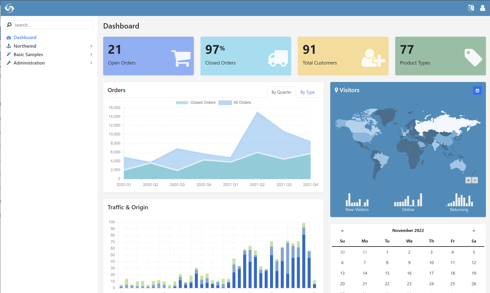

# A Tour Of Serene Features

After logging in to Serene, you are greeted with the dashboard page.

The page content, except for numbers calculated from Northwind tables, contains random data.

There is an accordion navigation menu on the left side which has a search feature by input above it. We'll talk about how to customize items there in later sections.

On the top navigation, there is a dropdown menu with a user icon with which we can change our password or log out in addition to a language button to change the active language.

We'll talk about the following features of Serene:

* [Northwind Module](northwind.md)
* [Basic Samples Module](basic-samples.md)
* [Localization](localization.md)
* [User and Role Management](user-management.md)