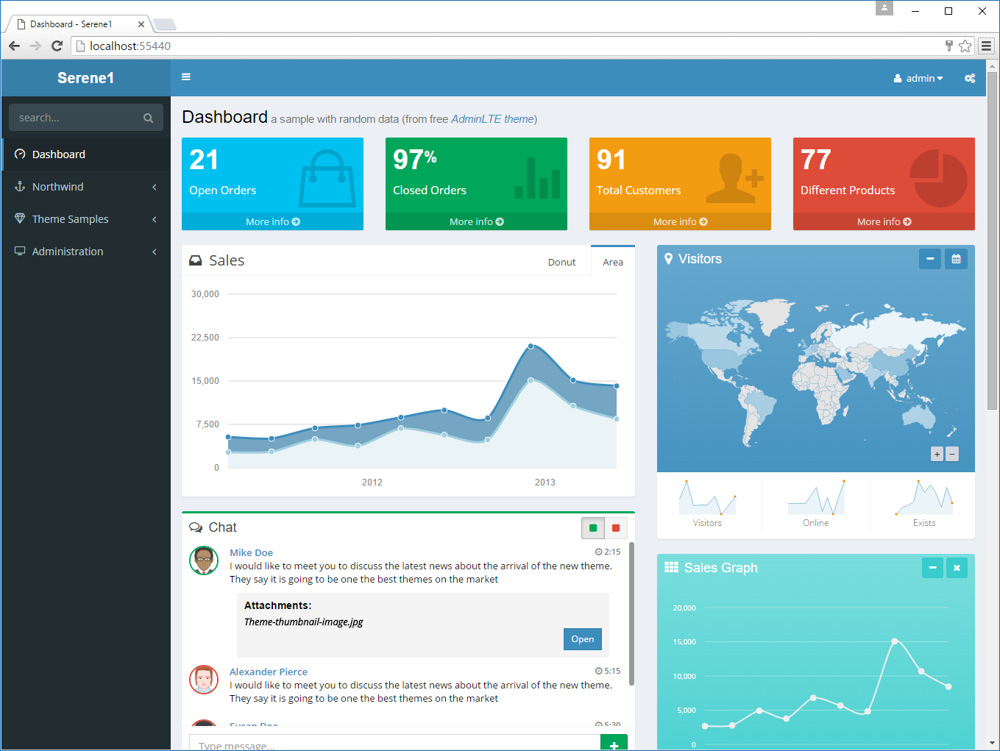

# Serene 功能概览

登录 Serene 系统后，你将看到 控制面板 页面。

> 这是一个使用免费主题 AdminLTE(https://almsaeedstudio.com/themes/AdminLTE/index.html)的示例页面。

网页的数据内容，除了从 Northwind 数据库表计算而来，还包含一些随机数据。

网页的左侧是一个带有搜索功能的手风琴菜单，我们将在后面的章节中讨论如何自定义菜单内容。

在顶部的导航中，左边显示网站的名称（或 logo），右边有一个包含当前用户名的下拉列表和一个设置按钮，我们可以通过设置按钮更改主题或显示的语言。

* [主题](theming.md)
* [本土化](localization.md)
