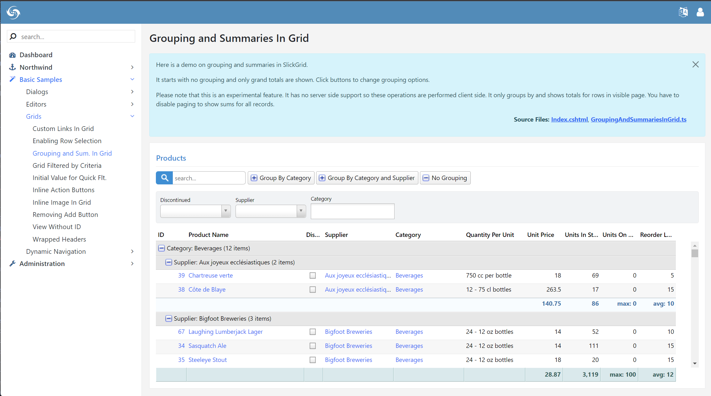
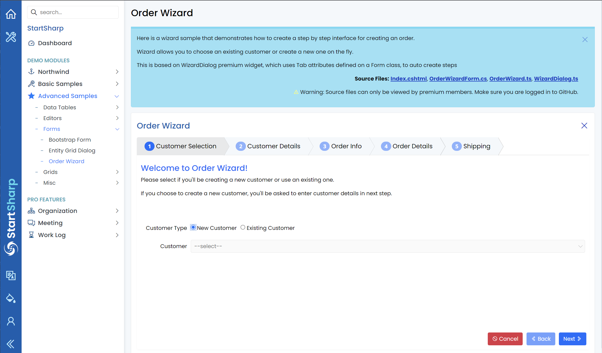

# Basic Samples Module

This module contains additional samples that demonstrate how to handle common concerns and requirements in Serenity applications.

The samples are divided into several categories, including Dialogs, Editors, and Grids.

The source code for each sample, which is hosted in the `common-features` repository can be directly accessed by clicking the `Source File` links on the top right of the sample page.

Most of the samples require the types in the Northwind module, thus the NuGet package containing basic samples (`Serenity.Demo.BasicSamples`) has a reference to the `Serenity.Demo.Northwind` package.

If you are using the StartSharp template, you'll also have access to an `Advanced Samples` module with samples demonstrating extra features in StartSharp:

The source code for Advanced Samples is hosted in the StartSharp repository under the `pro-features` folder, and can also be accessed by clicking the `Source Files` links on the top right of each sample page.