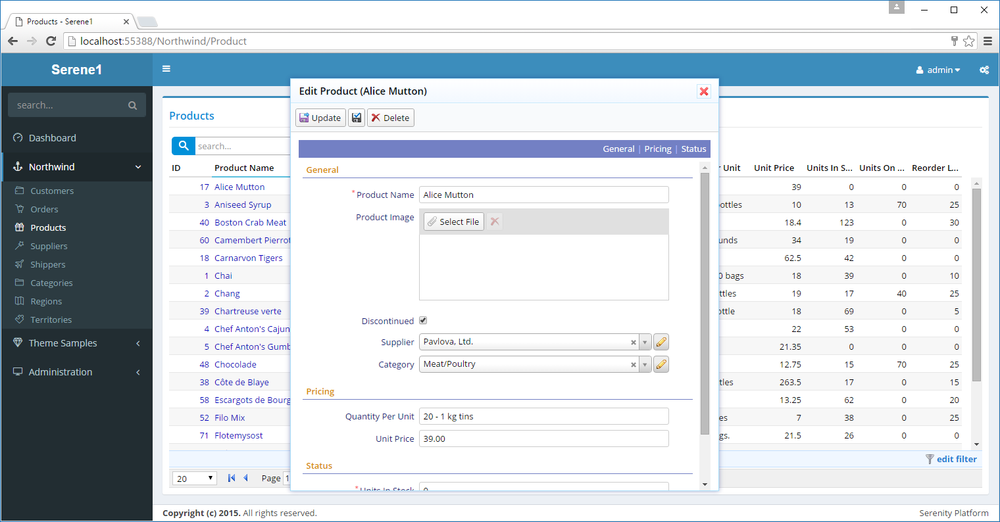

# 编辑对话框

当你在产品页面点击产品名称时，将显示该行的编辑对话框。



在客户端显示该对话框时，没有 WebForm 那样的回发事件，点击产品名称后使用 AJAX 请求，从服务器端加载该行的实体数据（仅返回数据，不包含页面标签）。对话框是自定义的 jQuery UI 对话框。

在此对话框窗体顶部有一蓝色背景导航栏，有三个分类导航项：*General*、*Pricing* 和 *Status*。通过点击此分类导航链接，你可以导航到该分类的表单起始位置。

每个表单字段由 label 标签和输入控件水平排列成一行。如果需要的话，你也可以在一行中显示多个字段（需要调整 CSS）。

带有 "\*" 标记表示必填字段（不能为空）。 

每个字段根据其数据类型有对应的输入控件，如字符串、图像上传、复选框、下拉列表等。

如果我们查看源代码，我们会看到这样的 HTML代码（为了方便起见，做了简化）：

```html

<div class="field ProductName">
    <label>Product Name</label>
    <input type="text" class="editor s-StringEditor" />
</div>

<div class="field ProductImage">
    <label class="caption"> Product Image</label>
    <div class="editor s-ImageUploadEditor">
        ...
    </div>
</div>

...
```

每个字段有一个独立的 "div" 标签，且该标签都含有 "field" 样式，该 "div" 标签内有一个 "label"元素 和另一个根据字段类型变化的元素（如：input, select, div）。

我们可以通过元素的类名称来标识输入控件的类型（例如，s-StringEditor, s-ImageUploadEditor）


在工具栏中，*更新* 按钮，保存并关闭当前实体对话框； *应用更改* 按钮，保存数据并保持对话框打开； *删除* 按钮，删除当前实体。

虽然你可以自定义按钮、字段、添加标签和其他元素，但很多 Serenity 编辑窗体都是类似这样的界面。