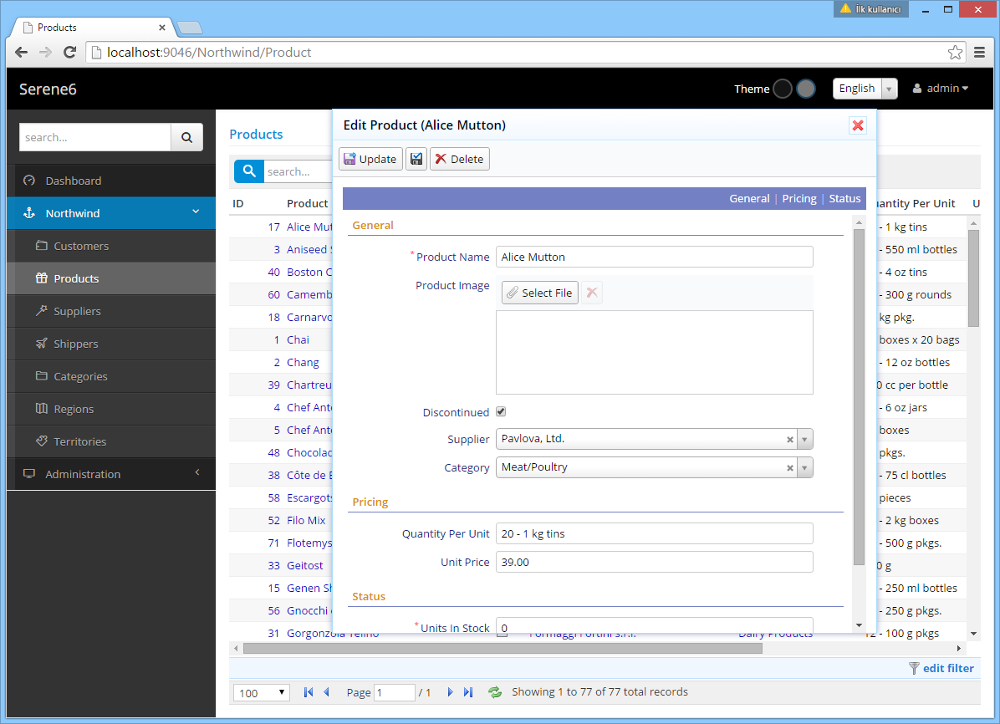

# Edit Dialogs

When you click a product name in Products page, an editing dialog for that row is displayed.



In this form we have three categories for fields: *General*, *Pricing* and *Status*.

Each form field occupies a row with label and editor. You may choose to show more than one 
field in a row if required (with CSS).

Fields marked with "*" are required (cannot be empty).

Each field has a specific type of editor tailored to its data type like *string*, *image upload*, *checkbox*, *select* etc.

We would see such an HTML code if we looked at the source (simplified for brevity):

```html

<div class="field ProductName">
    <label>Product Name</label>
    <input type="text" class="editor s-StringEditor" />
</div>

<div class="field ProductImage">
    <label class="caption"> Product Image</label>
    <div class="editor s-ImageUploadEditor">
        ...
    </div>
</div>

...
```

Every field has a separate "div" of its own with class "field". Inside this div, there is a "label" element and another element (input, select, div) that changes with the editor type for that field.

We can look at the class names of these elements to identify their editor types (e.g. *s-StringEditor*, *s-ImageUploadEditor*)

