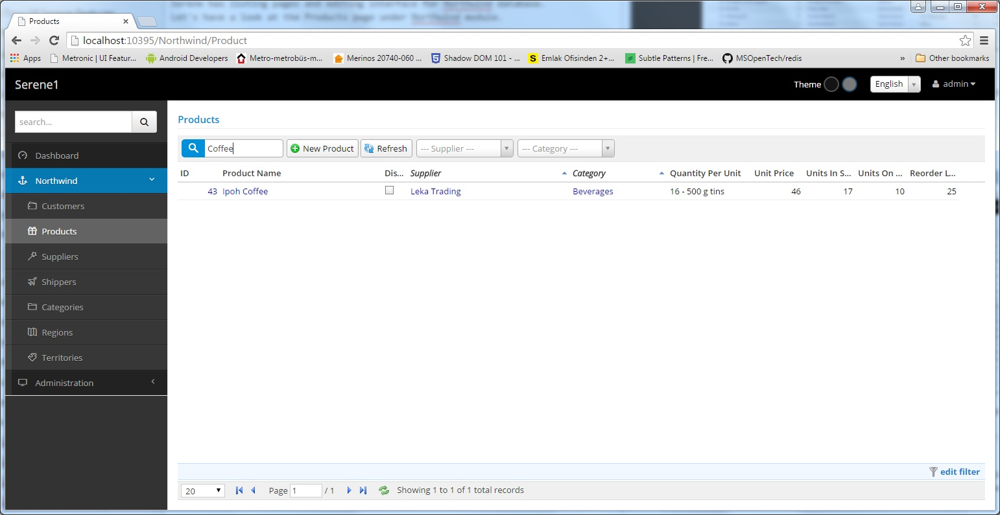

# Listing Pages

Serene has listing pages and editing interface for Northwind database. Let's have a look at the Products page under Northwind module.

Here we see list of products sorted by product name (initial sort order).

> Grid component is SlickGrid with a customized theme.

> https://github.com/mleibman/SlickGrid

You can change order by clicking column headers. To sort descending, click the same column header again.

To sort by multiple columns, you can use Shift+Click.

Here is what it looks like after sorting by Category then Supplier columns:

When you changed sort order, grid loaded data from a service with an AJAX request. 

> When you open the page first time, initial records were also loaded by an AJAX call.

By default grid loads records by 100 page size. Only records in current page are loaded from server. In the sample image, i changed page size to 20 (bottom left of grid) to show paging in effect.

On top left of the grid, you can type something to do a simple search.

Type *coffee* for example to see products containing it in their names.

It searched in product name field. It is also possible to use another, or multiple fields for quick search. We'll see how in later chapters.

On top right of the grid, there are quick filtering dropdowns for *Supplier* and *Category* fields.

Choose *Seafood* as *Category* and it will show only products in that category.

> Dropdown component is Select2

> https://github.com/select2/select2

All sorting, paging and filtering is done on server side with dynamic SQL queries generated by Serenity service handlers.

