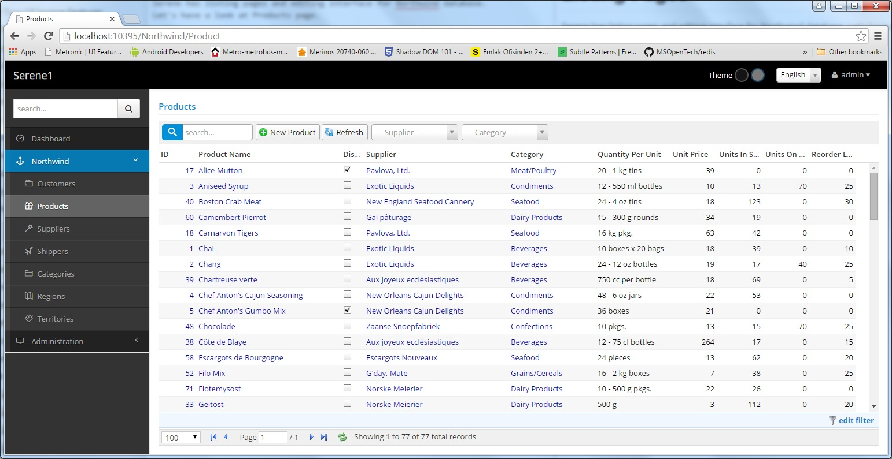
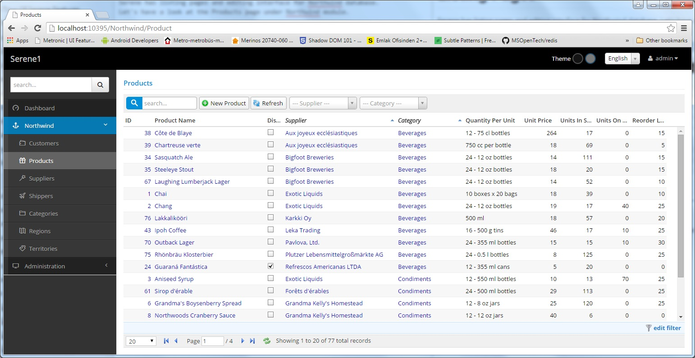

# Listing Pages

Serene has listing pages and editing interface for Northwind database. Let's have a look at the Products page under Northwind module.

Here we see list of products sorted by product name (initial sort order).

You can change order by clicking column headers. To sort descending, click the same column header again.

To sort by multiple columns, you can use Shift+Click.

Here is what it looks like after sorting by Category then Supplier columns:

