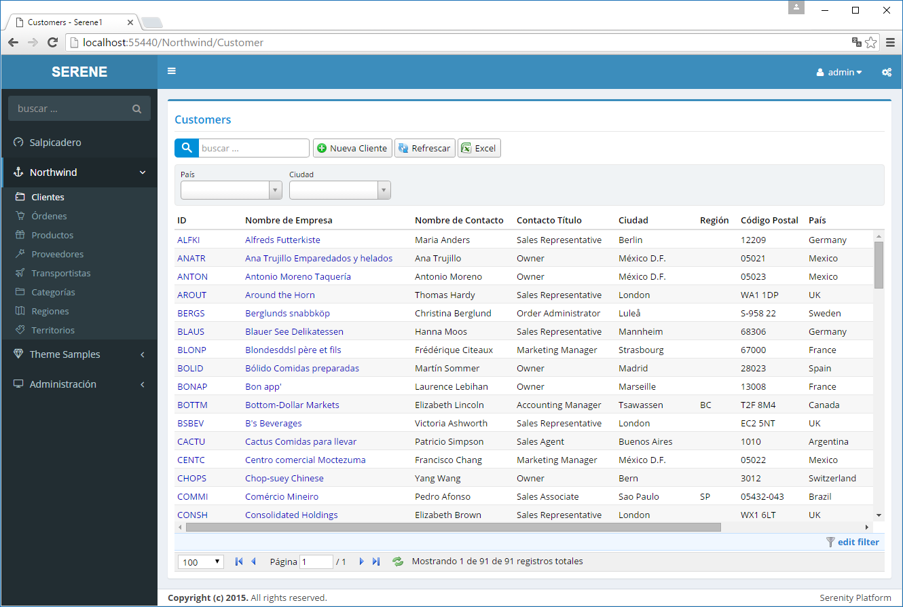
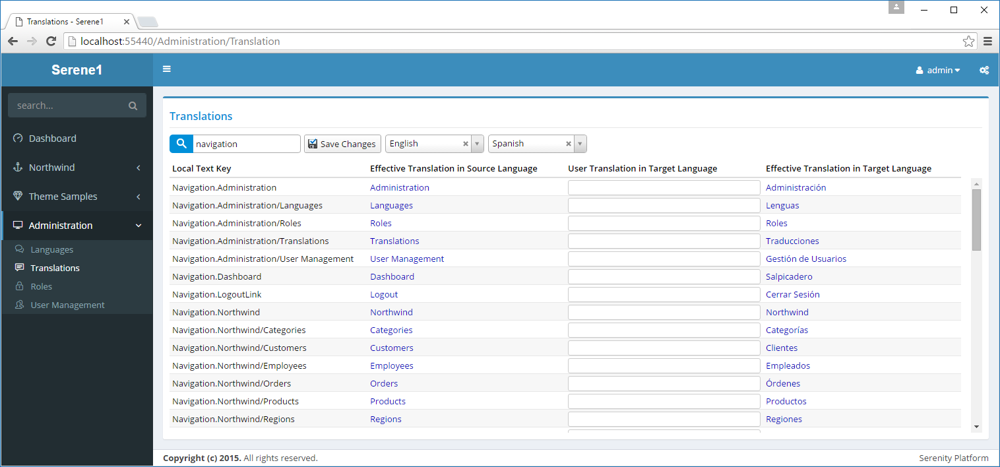
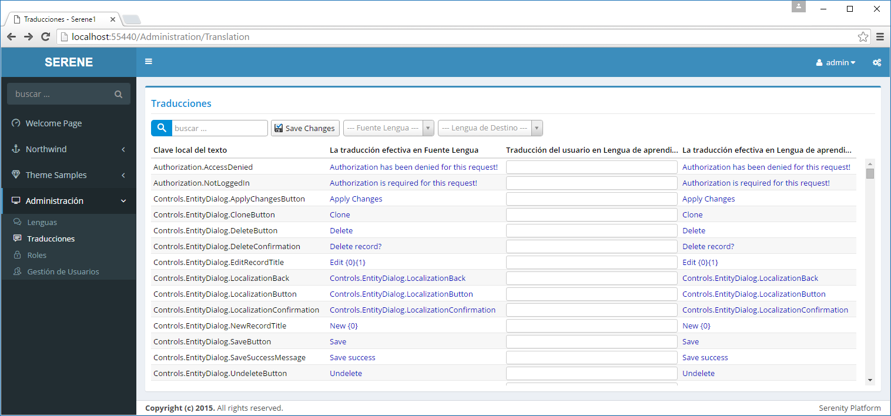

# 本地化

Serene 允许你通过右上角的设置菜单<i class="fa fa-gears"></i> 来修改网站当前使用的语言。

尝试把网站语言修改为西班牙语。



> 我并不熟悉西班牙语，这是使用机器翻译的，若有错误，请见谅。

当你更改语言时，页面将重新加载，与修改主题后没有刷新页面而直接应用修改的方式不同。

Serene 同样把 es 作为将作为 *"语言设置"* 的内容保存在浏览器的 cookie 中，所以下次你访问该站点时，它会记住你最新的设置，将显示为西班牙语。

当你第一次启动 Serene 时，你可能会看到网站内容显示的是英文，但也有可能显示为西班牙、土耳其语或俄语（这些都是目前可用的示例语言），这与你的操作系统或浏览器的语言设置有关。

可在 web.config 中配置：

```xml
<globalization culture="en-US" uiCulture="auto:en-US" />
```

在这里我们设置 U I的本地化语言为自动选择，如果系统无法确定你浏览器的语言，将使用 EN-US。

你也可以设置其他语言作为备用语言：

```xml
<globalization culture="en-US" uiCulture="auto:tr-TR" />
```

或者设置一个默认语言，在这种情况下，网站将以设置的默认语言显示网站内容：

```xml
<globalization culture="en-US" uiCulture="es" />
```

> 如果不想让用户更改用户界面语言，你应该删除语言选择下拉列表。

> 你可以通过使用 *系统管理 / 语言管理* 菜单下的页面为语言下拉列表添加更多的语言选项。


## 本地化 UI 文本

Serene 有自定义资源文本译文的能力。

在导航菜单中选择 *系统管理 / 翻译管理*：



在顶部左侧的搜索框中输入导航文本并查看文本与导航菜单的关系。

在页面的下拉列表中选择英语作为原文及西班牙语作为译文，并在本地文字标识 *Navigation.Dashboard* 的用户自定义中输入 *Welcome Page*。

点击 *保存修改*。

当你切换到西班牙语言时，控制面板菜单项将更改为 Welcome Page 而不是 Salpicadero。



当你保存更改时，Serene 在 App_Data/texts 文件夹中创建 user.texts.es.json 文件，其内容如下：

```json
{
    "Navigation.Dashboard": "Welcome Page"
}
```

在 `~/scripts/site/texts` 文件夹中，也有类似的 Serene 默认翻译的页面文本 JSON 文件：

- site.texts.es.json
- site.texts.invariant.json
- site.texts.tr.json

> 建议你在发布网站之前把 user.texts.xx.json 的内容拷贝到 site.texts.xx.json 文件中。如果 App_Data 已被项目排除，你还可以使用这种方式对其进行版本控制。