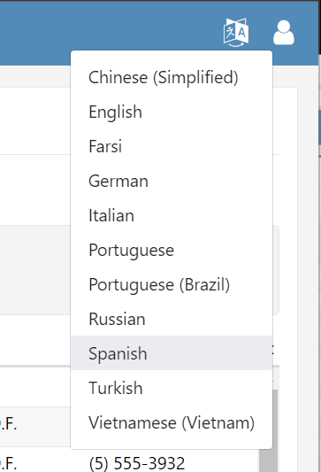
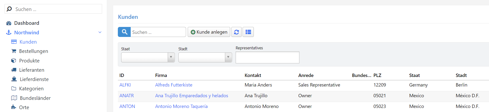
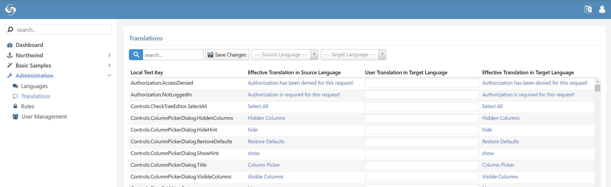
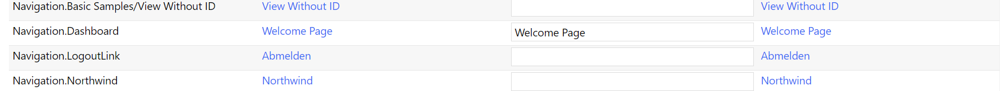
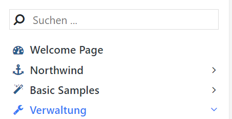

# Localization

Serene allows you to change the active language from the top right language dropdown:



> This dropdown is located on the left sidebar band in `StartSharp`.

Try changing the active language to German.



> Machine translation is used to generate these texts, so sorry for any translation mistakes...

When you changed the language, the page is reloaded to get the set of translated texts in the target language.

Serene also added a cookie named `LanguagePreference` with content `"de"` to your browser, so the next time you visit the site, it will remember your last selection and start with German.

When you launched Serene first time, you might have seen the site in English, but it is also possible that it started in Spanish, Turkish, or Russian if you have an operating system or browser using that language as the default.

If you don't want to let users to the change UI language, you should remove the language selection dropdown.

You may add more languages to the language selection dropdown by using the `Languages` page under the `Administration` menu.

## Translating UI Texts

Serene includes the ability to translate its text resources directly from the web application.

Click *Administration* then the *Translations* link in the navigation:



Type *navigation* into the top left search box to see the list of texts related to the navigation menu. Choose `English` as the source language and `German` as the target language.

Type *Welcome Page* into line with *Navigation.Dashboard* local text key:



Click `Save Changes`.

When you switch to the German language, the Dashboard menu item will be changed to `Welcome Page` instead of `Dashboard`:



When you saved changes, Serene created a `user.texts.de.json` file in the folder `App_Data/texts` with content like the below:

```json
{
    "Navigation.Dashboard": "Welcome Page"
}
```

There are also other similar JSON files in the `wwwroot/Scripts/site/texts` folder, with default translations for the Serene interface:

- site.texts.de.json
- site.texts.invariant.json
- site.texts.tr.json

> It is recommended to transfer your translations from user.texts.xx.json files to site.texts.xx.json files before publishing. You can also keep them under version control this way, if ``App_Data` folder is ignored.