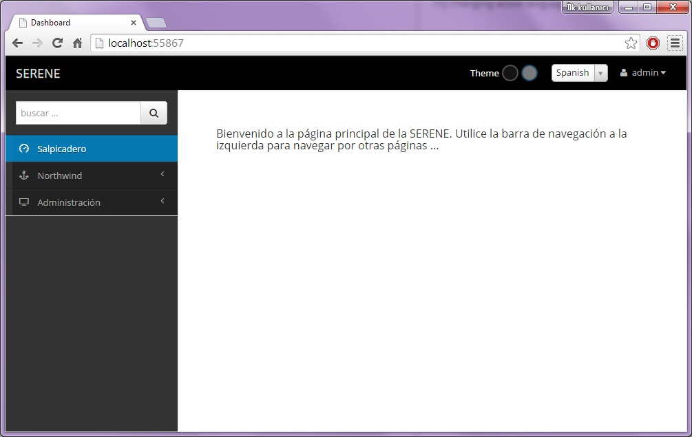

# Localization

Serene allows you to change the active language by a dropdown on top right.

Try changing active language to Spanish.



> I don't speak Spanish and used machine translation, so sorry for errors...

When you changed the language, page is reloaded, unlike the theme selection where no page reload is required.

Serene, also added a cookie, *"LanguagePreference"* with content *"es"* to your browser, so next time you visit the site, it will remember your last selection and start with Spanish.

When you launched Serene first time, you might have seen the site in English, but it is also possible that it started in Spanish, Turkish or Russian (these are currently available sample languages) if you have an operating system or browser of that language.

This is controlled by a web.config setting:

```xml
<globalization culture="en-US" uiCulture="auto:en-US" />
```

Here we set UI culture to automatic, while en-US is a fallback (if system can't determine your browser language).

It is also possible to set another language as fallback:

```xml
<globalization culture="en-US" uiCulture="auto:tr-TR" />
```

Or set a language as default, whatever visiting users browser language is:

```xml
<globalization culture="en-US" uiCulture="es" />
```

> If you don't want to let users to change UI language, you should remove the language selection dropdown.

> You may add more languages to the language selection dropdown by using Languages page under Administration menu.


## Localizing UI Texts

Serene includes ability to translate its text resources live.

Click *Administration* then *Translations* link in navigation.


Type *navigation* into top left search box to see list of texts related to navigation menu. Choose *English* as source language and *Spanish* as target language.

Type *Welcome Page* into line with *Navigation.Dashboard* local text key.

Click *Save Changes*.

When you switch to Spanish language, Dashboard menu item will be changed to *Welcome Page* instead of *Salpicadero*.


When you saved changes, Serene created a `user.texts.es.json` file in folder `Scripts/site/texts` with content like below:

```json
{
    "Navigation.Dashboard": "Welcome Page"
}
```

In the same folder, there are also other similar JSON files with default translations for Serene interface:

- site.texts.es.json
- site.texts.invariant.json
- site.texts.tr.json