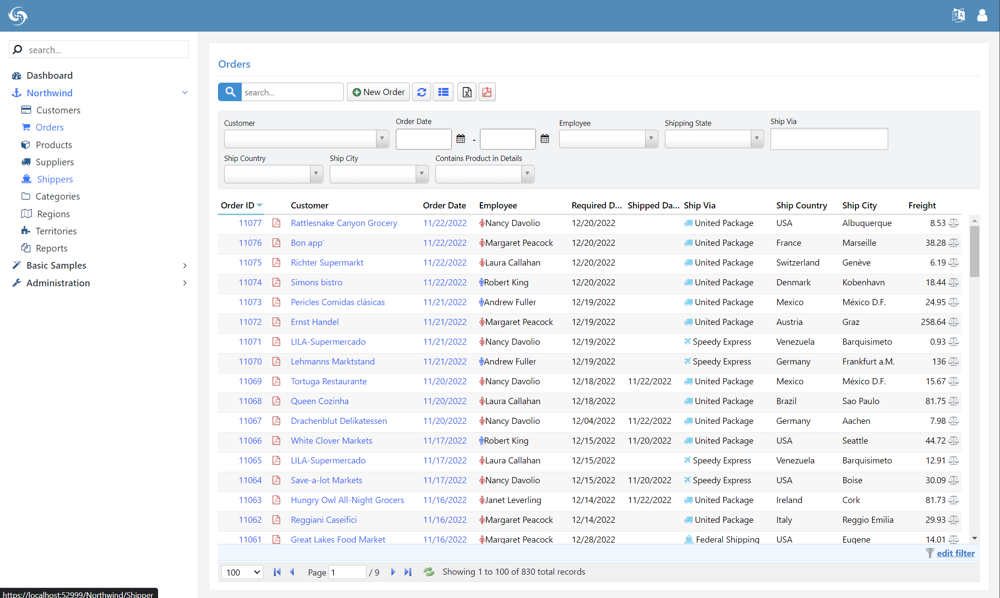
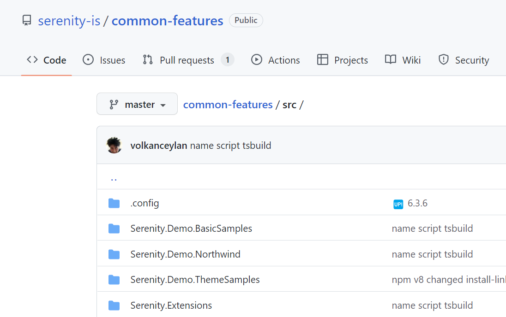

# Northwind Module

Northwind is a sample module based on the good old SQL Server Northwind sample database.



It contains several pages which demonstrate the basics of how to develop similar applications using the Serenity platform.

Some of the pages like Categories, Regions, etc. are simple definition screens for reference tables, while others like Customers and Orders contain more complex logic like quick filters, master-detail editing, notes, tabbed interface, etc.

Northwind module is installed in Serene as a NuGet package reference (`Serenity.Demo.Northwind`):

```xml
  <ItemGroup>
    <PackageReference Include="Serenity.Extensions" Version="6.3.6" />
    <PackageReference Include="Serenity.Demo.Northwind" Version="6.3.6" />
    <PackageReference Include="Serenity.Demo.BasicSamples" Version="6.3.6" />
  </ItemGroup>
```

Because of this, you can't see the source code for Northwind and other modules directly inside your Serene template-based project.

The source code for Northwind can be found in the `common-features` repository:

https://github.com/serenity-is/common-features/tree/master/src



We provide these modules as NuGet packages, to make them easier to update in your project, and remove them if desired.

They are also shared between Serene and StartSharp, which is our premium template with extra features.
