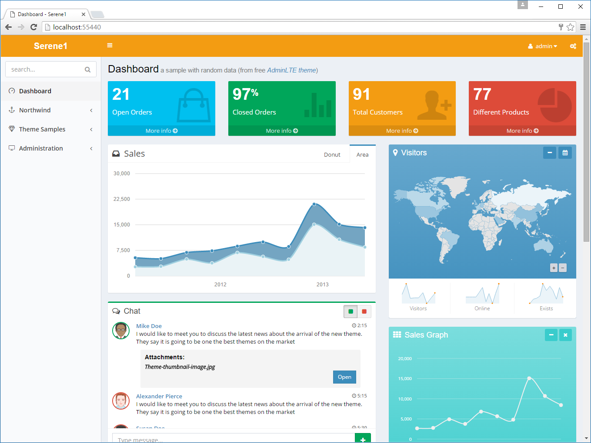

# Theming

Serene initially starts with a dark/blue theme. On top right of the screen, next to username, click the settings button  <i class="fa fa-gears"></i>  and change theme to another one.



This feature is implemented by replacing a body CSS class.

If you look at the source, you may spot a skin class like below inside `<body>` tag:

```html
<body id="s-DashboardPage" class="fixed sidebar-mini hold-transition skin-blue has-layout-event">
```

When you select the light yellow skin, it actually changes to this:

```html
<body id="s-DashboardPage" class="fixed sidebar-mini hold-transition skin-yellow-light has-layout-event">
```

This is done in memory so no page reload is required.

Also cookie, *"ThemePreference"*" with the content *"yellow-light"* is added to your browser. So next time you launch Serene, it will remember your preference and start with a light yellow theme.

These skin files are located under "Content/adminlte/skins/" of the Serene.Web project. If you look there you can see files with names:

```
_all-skins.less
skin.black-light.less
site.blue.less
site.yellow-light.less
site.yellow.less
```

We are using LESS for CSS generation so you should try editing LESS files, not CSS. Next time you build your project, LESS files will be compiled to CSS (using *Less.js* compiler for *Node*).

This operation is configured with a build step in Serene.Web.csproj file:

```xml
...
<Target Name="CompileSiteLess" AfterTargets="AfterBuild">
    <Exec Command="&quot;$(ProjectDir)tools\node\lessc.cmd&quot;
        &quot;$(ProjectDir)Content\site\site.less&quot; &gt;
        &quot;$(ProjectDir)Content\site\site.css&quot;">
    </Exec>
</Target>
...
```

Here *site.less* file is compiled to its corresponding css file in the same directory.

> See http://lesscss.org/ for more information on LESS compiler and its syntax.
