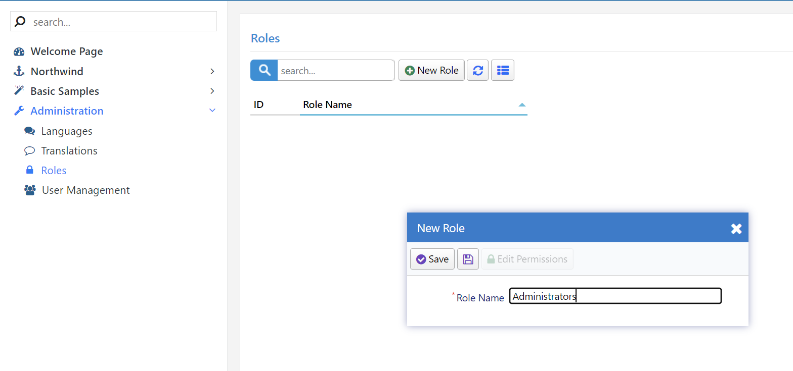
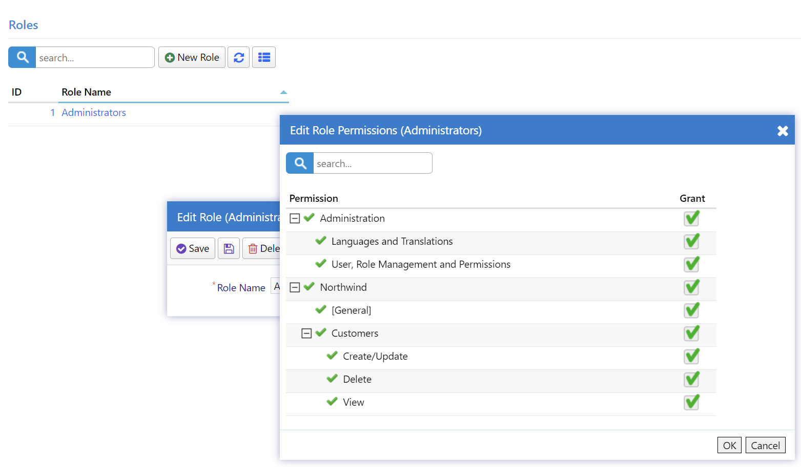
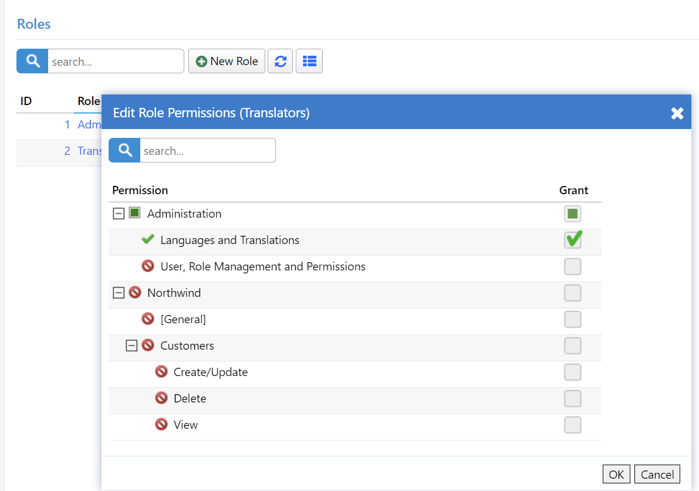
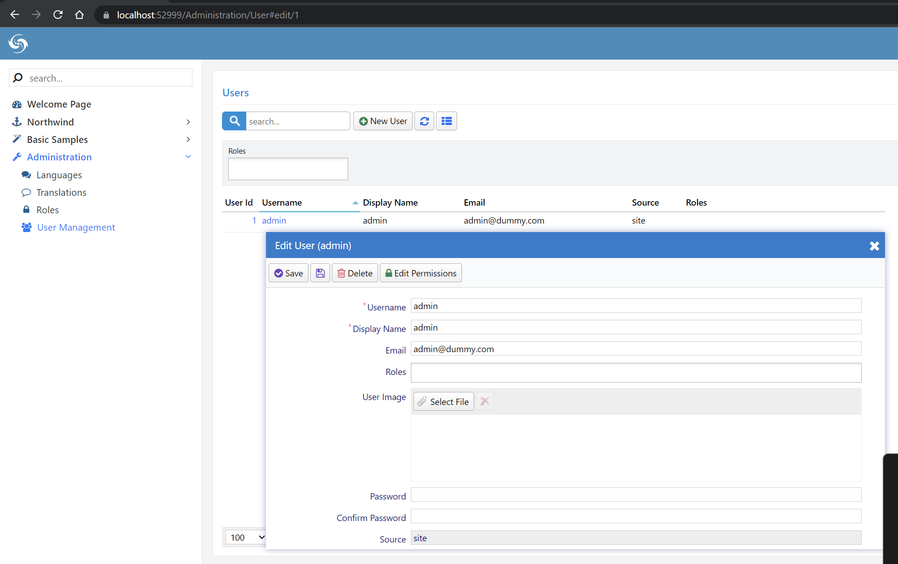
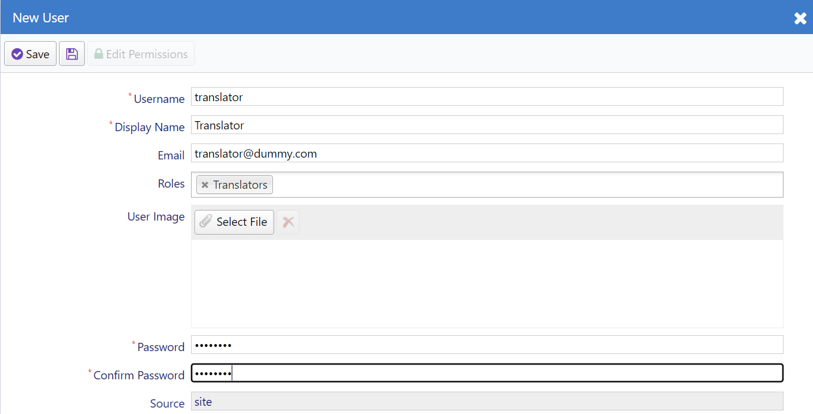
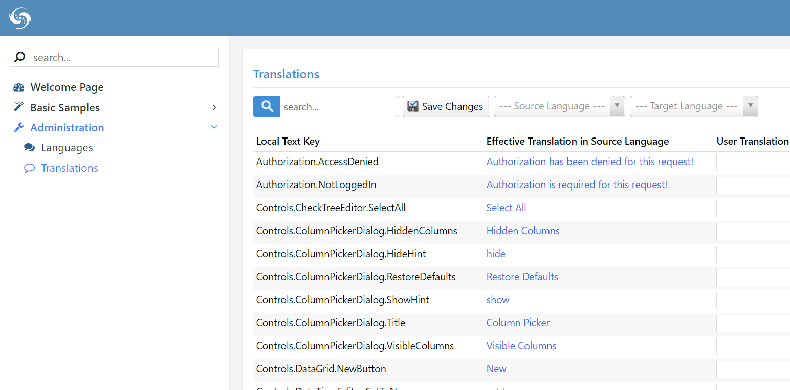

# User, Role, and Access Rights Management

Serene has built-in user, role, and access rights management.

> This feature is not embedded in Serenity itself. It is just a sample, so you can always implement and use your user management of choice. We'll take a look at how in following chapters.

Open Administration / Roles to create the roles of `Administrators` and `Translators`. 

Click `New Role` and type `Administrators`, then click Save.

Repeat it for *Translators*.

Then click role `Administrators` to re-open the edit form, and click the `Edit Permissions` button to modify its permissions. 

Check all boxes to grant every permission to this role, then click `OK`:

Repeat the same steps for the `Translators` role but this time grant only the *Administration: Languages and Translations* permission:

Navigate to `Administration / User Management` page to add more users.

Click the `admin` user to edit its details:

Here you can change admin details like username, display name, and e-mail.

You can also change its password (which is `serenity` by default) by typing into `Password` and `Confirm Password` inputs and clicking the `Save` button.

> You can also delete it but this would make your site unusable as you wouldn't be able to login.

`admin` is a special user in Serene, as it has all permissions even if none is explicitly granted to him.

Let's create another one and grant roles/permissions to it.

Close this dialog, click the `New User` button and type `translator` as the username, and select `Translators` in the `Roles` input. Fill in other fields as you'd like, then click *Save*.

> You may have noticed there is an *Apply Changes* button with a disk icon without title, next to *Save*. Unlike *Save*, when you use it, the form stays open, so you can see how your record looks like after saving, also you can edit roles and permissions before closing the form.

When you grant a role to a user, he gets all the permissions granted to the role automatically. By clicking Edit Permissions and you can also grant extra permissions explicitly. You can also revoke any of the role permission from a user explicitly.

Now close all dialogs and log out by clicking the user icon on the top right of page and clicking *Logout*. 

Try logging in with the *translator* user and the password you set.

The `Translator` user will only have access to the Dashboard, a few pages of the Basic Samples that do not use the Northwind module, in addition to the Languages and Translations pages.

