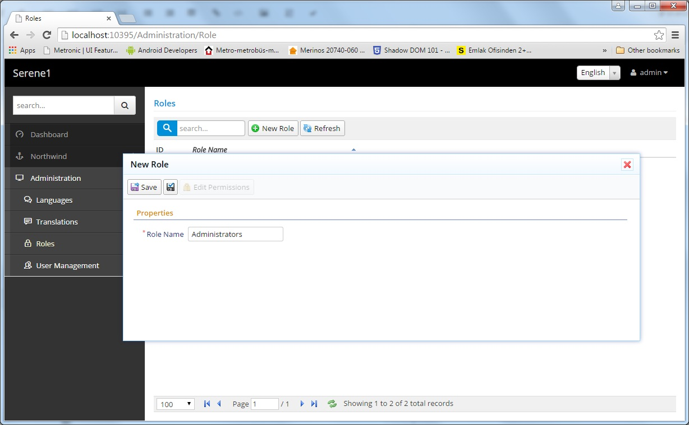
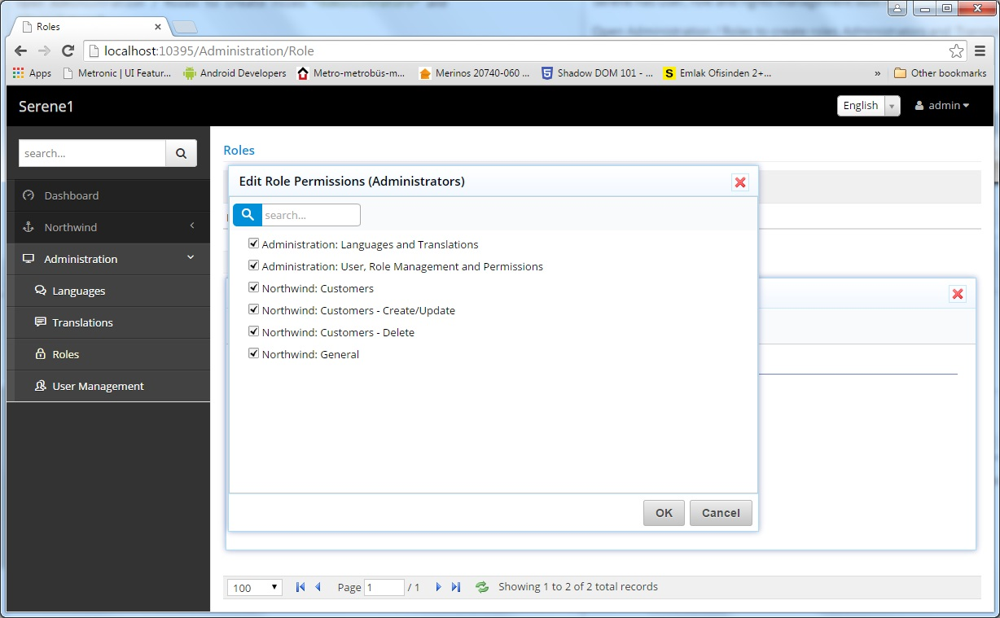
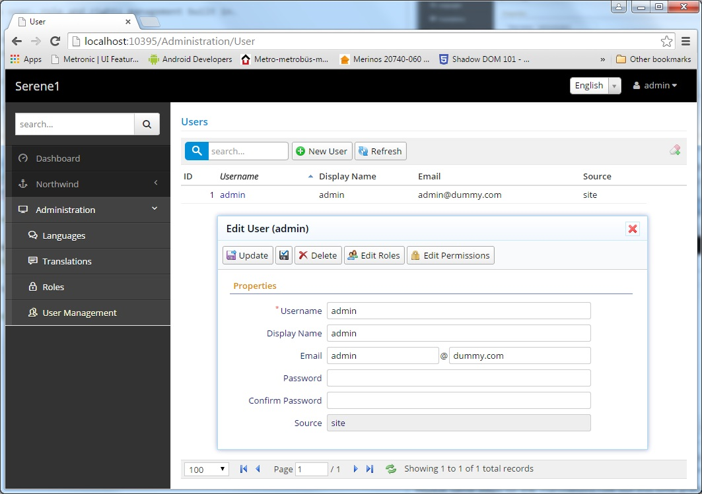

# User and Role Management

Serene has user, role and rights management built in.

Open Administration / Roles to create roles *Administrators* and *Translators*. 

Click *New Role* and  and type *Administrators*, then click Save.

Repeat it for *Translators*.

Then click role *Administrators* to open edit form, and click *Edit Permissons* button to modify its permissions. Check all boxes to grant every permisson to this role, then click *OK*.

Repeat same steps for the *Translations* role but this time grant only the *Administration: Languages and Translations* permission.

Navigate to *Administration / User Management* page to add more users.

Click *admin* user to edit its details.

Here you can change admin details like username, display name, email.

You can also change its password (which is *serenity* by default) by typing into *Password* and *Confirm Password* inputs and clicking *Update*.

> You can also delete it but this would make your site unusable as you wouldn't be able to login.

*admin* is a special user in Serene, as it has all permissions even if none is explicitly granted to him.

Lets create another one and grant roles / permissions to it.

Close this dialog, click new user and type *translator* as username. Fill in other fields as you'd like, then click *Update*.

[!Create Translator User](img/create_translator_user.jpg)

