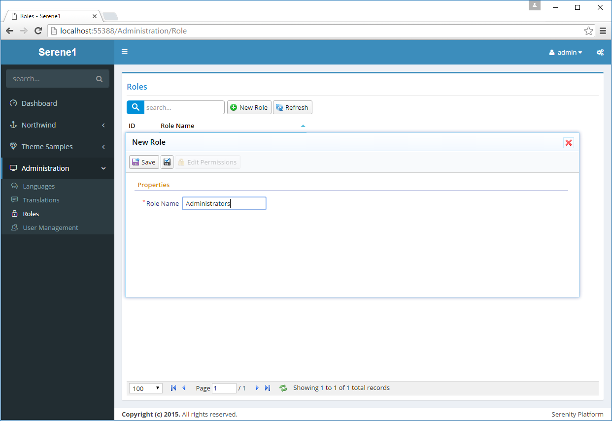
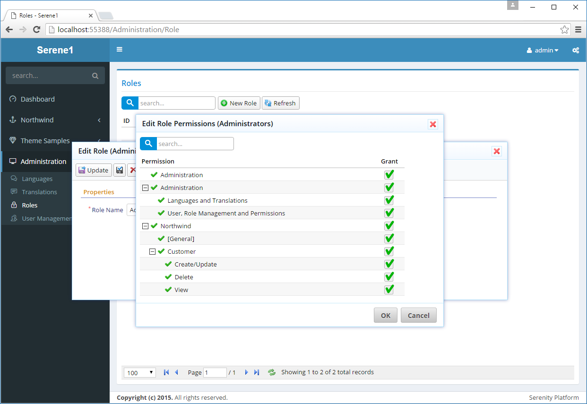
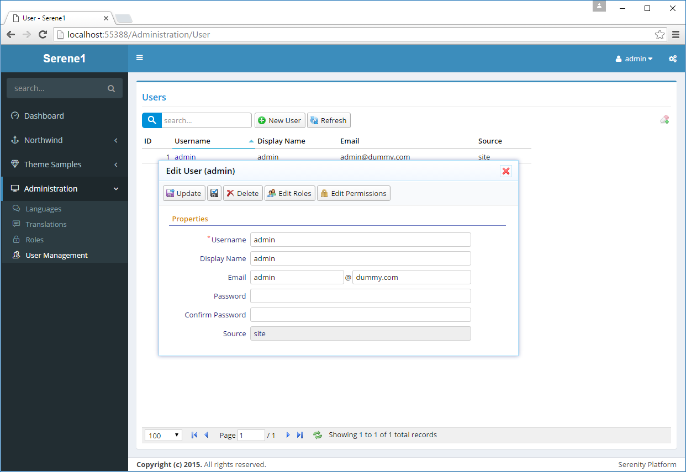
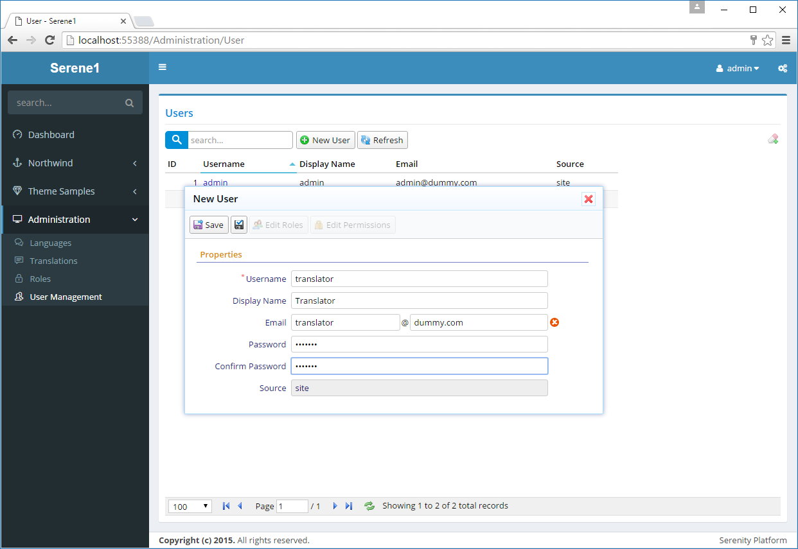
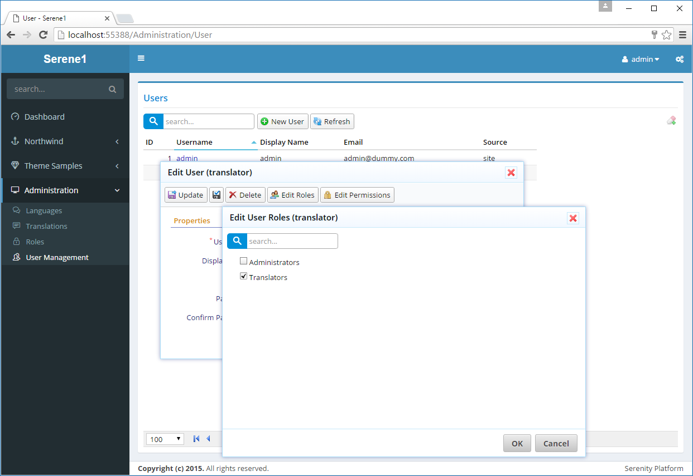
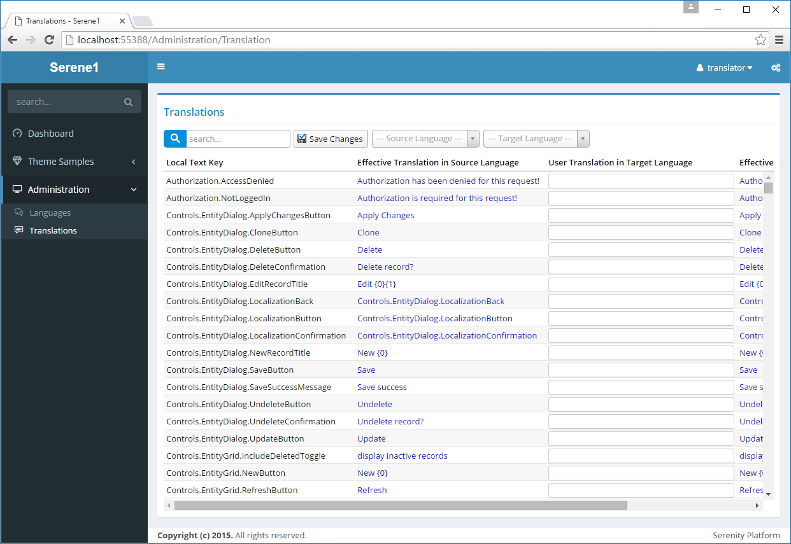

# 用户和角色管理 

Serene 内置用户、角色和权限管理。 

> 此功能并不是 Serenity 的内置功能，这里仅提供一个示例，所以你可以随时选择实现或使用你自己的用户管理方式。我们将在下面的章节介绍如何实现。

打开 系统管理 / 角色管理，并创建两个角色：*Administrators* 和 *Translators*。  

点击 *新增角色* 并输入 *Administrators*，然后点击保存。

重复相同的步骤创建 *Translators* 角色。

然后点击角色 *Administrators* 打开编辑窗体，再点击 *修改权限* 按钮修改角色权限，勾选所有复选框授予该角色所有操作的访问权限，然后点击 *OK* 按钮确认。 

用相同的方式给 *Translations* 角色授权，但只授予 *系统管理：语言和翻译管理* 权限。

导航到 *系统管理 / 用户管理* 页面添加更多的用户。

点击 *admin* 用户编辑其详细信息。

在这里你可以修改 admin 的用户名、显示名称、电子邮件等详细信息。

你也可以在 *密码* 和 *确认密码*输入框中输入密码，然后点击 *更新* 来修改密码（*serenity* 的默认密码）。

> 你也可以删除它，但这会使你无法登录而不能使用该系统。

*admin* 是 Serene 的特殊用户，因为它具有所有的操作权限，即使没有显式授予他。

让我们创建另外一个用户并添加角色和授予操作权限。

关闭当前窗口，点击 *新增用户* 并输入 *Translator* 作为用户名，并填写完其他信息，然后点击 *保存* 按钮确认。

> 你可能已经注意到 *保存* 按钮旁边有一个没有说明的黑色磁盘图标表示的 *应用更改* 按钮，不同于 *保存* 按钮，当你使用它时，窗体保持打开以便让你看到修改记录的保存结果，你也可以在关闭窗体之前修改角色和权限。

现在点击 *Translator* 的 *修改角色* 按钮打开编辑角色窗体，授予其 *翻译管理* 角色并点击 *OK* 按钮确认。

> 当你授予用户角色时，他自动获取授予角色的所有权限。通过单击 *修改权限* 按钮，你也可以显式授予额外的权限，同样地，你也可以显式撤销用户角色权限。

现在关闭弹出的所有窗体，并点击网站右上角用户名所在的下拉列表中的 *退出* 按钮注销登录。 

使用 *Translator* 用户的账号密码登录系统。

*Translator* 用户将只能访问 *控制面板*、*Theme Samples*、*翻译管理* 页面。

