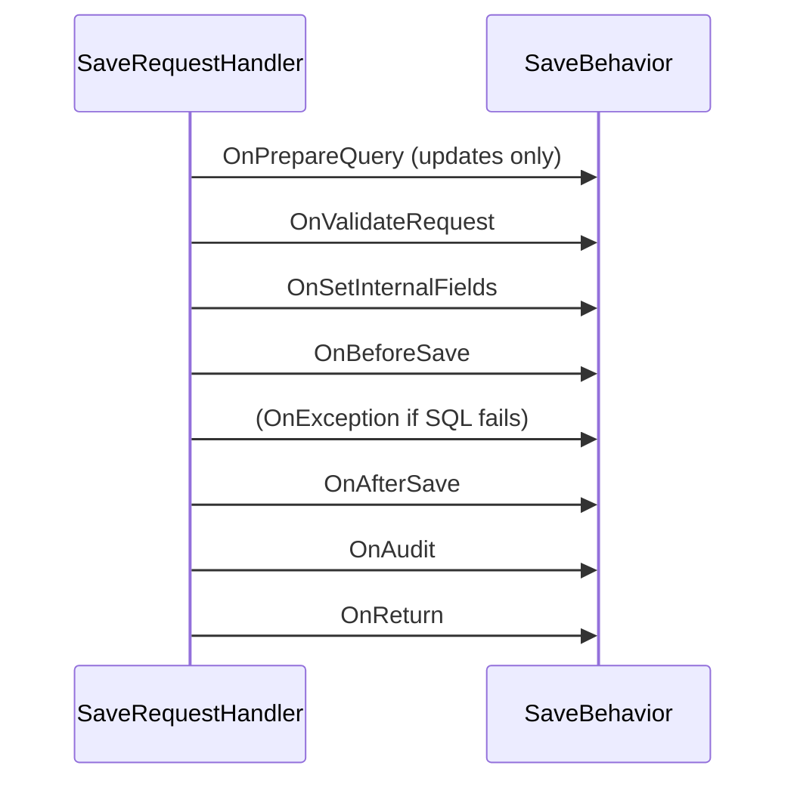

# Service Behaviors

Serenity request handlers expose their lifecycle through virtual methods you can override in a generated handler. But when the same logic must apply to many entities — audit logging, multi-tenancy, unique constraints, master–detail saving, row localization — repeating it in every handler is impractical.

**Behaviors** solve this. A behavior is a class that plugs into a handler's lifecycle and is activated based on the row type (or a field), so it runs automatically for every matching handler. They are the recommended way to add cross-cutting concerns to the service layer.

> The built-in features — capture log, insert/update log, localization, master–detail, linking set, unique constraints, and more — are all implemented as behaviors. See [Built-in Service Behaviors](built-in-behaviors.md).

## Behavior Interfaces

Each handler type has a matching behavior interface. A single behavior class can implement one or more of these interfaces to participate in the corresponding handlers:

| Interface | Handler it participates in | API reference |
| --- | --- | --- |
| [ISaveBehavior](../api/dotnet/Serenity.Net.Services/Serenity.Services/ISaveBehavior.md) | Save (Create / Update) | `ISaveBehavior` |
| [IListBehavior](../api/dotnet/Serenity.Net.Services/Serenity.Services/IListBehavior.md) | List | `IListBehavior` |
| [IDeleteBehavior](../api/dotnet/Serenity.Net.Services/Serenity.Services/IDeleteBehavior.md) | Delete | `IDeleteBehavior` |
| [IRetrieveBehavior](../api/dotnet/Serenity.Net.Services/Serenity.Services/IRetrieveBehavior.md) | Retrieve | `IRetrieveBehavior` |
| [IUndeleteBehavior](../api/dotnet/Serenity.Net.Services/Serenity.Services/IUndeleteBehavior.md) | Undelete | `IUndeleteBehavior` |
| [IListMapFieldExpressionBehavior](../api/dotnet/Serenity.Net.Services/Serenity.Services/IListMapFieldExpressionBehavior.md) | List (map a field to a custom SQL expression) | `IListMapFieldExpressionBehavior` |
| [IFieldBehavior](../api/dotnet/Serenity.Net.Services/Serenity.Services/IFieldBehavior.md) | Any (targets a single field) | `IFieldBehavior` |

There are also optional **exception** interfaces for handling errors raised during the operation:

- [ISaveExceptionBehavior](../api/dotnet/Serenity.Net.Services/Serenity.Services/ISaveExceptionBehavior.md)
- [IDeleteExceptionBehavior](../api/dotnet/Serenity.Net.Services/Serenity.Services/IDeleteExceptionBehavior.md)
- [IRetrieveExceptionBehavior](../api/dotnet/Serenity.Net.Services/Serenity.Services/IRetrieveExceptionBehavior.md)
- `IListExceptionBehavior`
- `IUndeleteExceptionBehavior`

These let a behavior inspect an exception raised by the database operation and, for example, translate a foreign-key or primary-key error into a friendlier validation message.

## Base Classes

Instead of implementing every method of an interface, derive from the corresponding base class which provides empty virtual methods:

- [BaseSaveBehavior](../api/dotnet/Serenity.Net.Services/Serenity.Services/BaseSaveBehavior.md) — implements `ISaveBehavior` and `ISaveExceptionBehavior`.
- [BaseSaveDeleteBehavior](../api/dotnet/Serenity.Net.Services/Serenity.Services/BaseSaveDeleteBehavior.md) — combines save and delete, for behaviors that need to act on both (e.g. audit logs, master–detail).
- [BaseListBehavior](../api/dotnet/Serenity.Net.Services/Serenity.Services/BaseListBehavior.md) — implements `IListBehavior`.
- [BaseDeleteBehavior](../api/dotnet/Serenity.Net.Services/Serenity.Services/BaseDeleteBehavior.md) — implements `IDeleteBehavior` and `IDeleteExceptionBehavior`.
- [BaseRetrieveBehavior](../api/dotnet/Serenity.Net.Services/Serenity.Services/BaseRetrieveBehavior.md) — implements `IRetrieveBehavior`.
- [BaseUndeleteBehavior](../api/dotnet/Serenity.Net.Services/Serenity.Services/BaseUndeleteBehavior.md) — implements `IUndeleteBehavior` and `IUndeleteExceptionBehavior`.

You then override only the methods you need.

## How Behaviors Are Attached

A behavior is attached to a row type in one of two ways: **implicitly** (the behavior decides which rows it applies to) or **explicitly** (the row or field declares it with an attribute).

### Implicit Behaviors (`IImplicitBehavior`)

Most behaviors implement [IImplicitBehavior](../api/dotnet/Serenity.Net.Services/Serenity.Services/IImplicitBehavior.md), which has a single method:

```cs
public interface IImplicitBehavior
{
    bool ActivateFor(IRow row);
}
```

`ActivateFor` returns `true` when the behavior should be used for the given row type. Because the behavior is a [singleton](../api/dotnet/Serenity.Net.Services/Serenity.Services/DefaultImplicitBehaviorRegistry.md) that is cached and reused across requests, it is called **once per handler type and row type**, and is a good place to read attribute/interface metadata and store it in private fields.

For example, the framework's capture-log behavior only activates for rows that have an id and are decorated with `[CaptureLog]`:

```cs
public class CaptureLogBehavior : BaseSaveDeleteBehavior, IImplicitBehavior, IUndeleteBehavior
{
    private CaptureLogAttribute captureLogAttr;

    public bool ActivateFor(IRow row)
    {
        if (row is not IIdRow)
            return false;

        captureLogAttr = row.GetType().GetCustomAttribute<CaptureLogAttribute>();
        return captureLogAttr != null;
    }
}
```

Because all `IImplicitBehavior` types are discovered through the type source, you never have to register them manually — `AddServiceBehaviors()` picks them up automatically.

### Explicitly Attaching a Behavior (`[AddBehavior]`)

The [AddBehavior](../api/dotnet/Serenity.Net.Services/Serenity.ComponentModel/AddBehaviorAttribute.md) attribute attaches a specific behavior type to a row class or a field property:

```cs
[AddBehavior(typeof(MyCustomBehavior))]
public sealed class MyRow : Row<MyRow.RowFields>, IIdRow
{
}
```

This is useful when a behavior should not be first-class (e.g. it is specific to one row) or when its activation must be declared rather than inferred.

### Field Behaviors (`IFieldBehavior`)

A behavior that implements [IFieldBehavior](../api/dotnet/Serenity.Net.Services/Serenity.Services/IFieldBehavior.md) is given a `Target` field before `ActivateFor` is called:

```cs
public interface IFieldBehavior
{
    Field Target { get; set; }
}
```

This lets a single implicit behavior instance work on a per-field basis. For example, the framework's `UniqueFieldSaveBehavior` and the `NotesBehavior` in the Northwind demo both use this to operate on whichever field they are applied to. When resolving a field behavior, the provider creates one instance per field and sets `Target` before checking `ActivateFor`.

### How Behaviors Are Resolved

Behaviors are resolved through [IBehaviorProvider](../api/dotnet/Serenity.Net.Services/Serenity.Services/IBehaviorProvider.md), which is available on the handler's `Context.Behaviors`:

```cs
public interface IRequestContext
{
    IBehaviorProvider Behaviors { get; }
    // ...
}
```

The default resolution logic (in [DefaultBehaviorProvider](../api/dotnet/Serenity.Net.Services/Serenity.Services/DefaultBehaviorProvider.md)) gathers, in order:

1. Every implicit behavior whose `ActivateFor(row)` returns `true` for the row type.
2. Every behavior explicitly attached to the row class via `[AddBehavior]`.
3. Every field behavior attached to a field via `[AddBehavior]`.

Behaviors are instantiated by [DefaultBehaviorFactory](../api/dotnet/Serenity.Net.Services/Serenity.Services/DefaultBehaviorFactory.md) using the DI container, so you can inject dependencies (e.g. `ITextLocalizer`, `ISqlConnections`, `IDefaultHandlerFactory`) into a behavior's constructor.

`IBehaviorProvider`, `IBehaviorFactory`, and `IImplicitBehaviorRegistry` are registered as singletons by [AddServiceBehaviors](../api/dotnet/Serenity.Net.Services/Serenity.Extensions.DependencyInjection/ServiceCollectionExtensions/AddServiceBehaviors.md), which is called by `AddServiceHandlers()` during startup. See [Auto-Registration of Request Handlers](handler_auto_registration.md).

## Behavior Lifecycle

A behavior's methods are called at specific points in the handler lifecycle. The base classes already wire this up, so implement only the hooks you need.

### Save (Create / Update)

For a save request, the handler:

1. Loads the old entity (only for updates) — calls **`OnPrepareQuery`** on each save behavior.
2. Validates the request — calls **`OnValidateRequest`**.
3. Sets internal fields — calls **`OnSetInternalFields`**.
4. Runs before the insert/update — calls **`OnBeforeSave`**.
5. Executes the SQL statement. On failure, calls **`OnException`** on save behaviors that implement `ISaveExceptionBehavior`.
6. Runs after the insert/update — calls **`OnAfterSave`**.
7. Performs auditing — calls **`OnAudit`**.
8. Returns the response — calls **`OnReturn`**.



### List

For a list request, the handler:

1. Validates the request — calls **`OnValidateRequest`**.
2. Builds the query — calls **`OnPrepareQuery`**.
3. Applies filters — calls **`OnApplyFilters`**.
4. Runs before the query is executed — calls **`OnBeforeExecuteQuery`**.
5. Executes the query. On failure, calls **`OnException`** on behaviors implementing `IListExceptionBehavior`.
6. Runs after the query is executed — calls **`OnAfterExecuteQuery`**.
7. Returns the response — calls **`OnReturn`**.

### Delete

For a delete request, the handler:

1. Loads the entity to delete — calls **`OnPrepareQuery`** (via `LoadEntity`).
2. Validates the request — calls **`OnValidateRequest`**.
3. Runs before the delete — calls **`OnBeforeDelete`**.
4. Executes the delete. On failure, calls **`OnException`** on behaviors implementing `IDeleteExceptionBehavior`.
5. Runs after the delete — calls **`OnAfterDelete`**.
6. Audits — calls **`OnAudit`**.
7. Returns the response — calls **`OnReturn`**.

### Retrieve

For a retrieve request, the handler:

1. Validates the request — calls **`OnValidateRequest`**.
2. Builds the query — calls **`OnPrepareQuery`**.
3. Runs before the query — calls **`OnBeforeExecuteQuery`**.
4. Executes the query. On failure, calls **`OnException`**.
5. Runs after the query — calls **`OnAfterExecuteQuery`**.
6. Returns the response — calls **`OnReturn`**.

### Undelete

For an undelete request, the handler:

1. Loads the entity — calls **`OnPrepareQuery`**.
2. Validates the request — calls **`OnValidateRequest`**.
3. Runs before the undelete — calls **`OnBeforeUndelete`**.
4. Executes the undelete. On failure, calls **`OnException`**.
5. Runs after the undelete — calls **`OnAfterUndelete`**.
6. Audits — calls **`OnAudit`**.
7. Returns the response — calls **`OnReturn`**.

## Writing a Behavior

The simplest behavior only needs to implement one hook and be activated implicitly.

### Example: Humanizing SQL Exceptions

StartSharp ships a `HumanizeSqlExceptionBehavior` in `StartSharp.Common` that translates raw SQL errors into friendly validation messages for save and delete:

```cs
using Microsoft.Data.SqlClient;

namespace StartSharp.Common;

public class HumanizeSqlExceptionBehavior : BaseSaveDeleteBehavior, IImplicitBehavior
{
    public bool ActivateFor(IRow row)
    {
        return true;
    }

    public override void OnException(ISaveRequestHandler handler, Exception exception)
    {
        if (exception is SqlException)
            SqlExceptionHelper.HandleSavePrimaryKeyException(exception, handler.Context?.Localizer,
                handler.Row?.IdField?.GetTitle(handler.Context?.Localizer));
    }

    public override void OnException(IDeleteRequestHandler handler, Exception exception)
    {
        if (exception is SqlException)
            SqlExceptionHelper.HandleDeleteForeignKeyException(exception, handler.Context?.Localizer);
    }
}
```

Because it derives from `BaseSaveDeleteBehavior`, it can override `OnException` for both save and delete. Since it implements `IImplicitBehavior` and `ActivateFor` always returns `true`, it applies to every row type, which is exactly what you want for a global exception handler.

### Example: Multi-Tenant Behavior

A common cross-cutting behavior is row-level multi-tenancy. The [Multi-Tenancy tutorial](../tutorials/multi_tenancy/using_serenity_service_behaviors.md) builds one that intercepts Retrieve, List, Save, and Delete for any row implementing an `IMultiTenantRow` interface:

```cs
public interface IMultiTenantRow
{
    Int32Field TenantIdField { get; }
}

public class MultiTenantBehavior : IImplicitBehavior,
    ISaveBehavior, IDeleteBehavior, IListBehavior, IRetrieveBehavior
{
    private Int32Field tenantIdField;

    public bool ActivateFor(IRow row)
    {
        if (row is not IMultiTenantRow mtRow)
            return false;

        tenantIdField = mtRow.TenantIdField;
        return true;
    }

    public void OnPrepareQuery(IRetrieveRequestHandler handler, SqlQuery query)
    {
        if (!handler.Context.Permissions.HasPermission(PermissionKeys.Tenants))
            query.Where(tenantIdField == handler.Context.User.GetTenantId());
    }

    public void OnPrepareQuery(IListRequestHandler handler, SqlQuery query)
    {
        if (!handler.Context.Permissions.HasPermission(PermissionKeys.Tenants))
            query.Where(tenantIdField == handler.Context.User.GetTenantId());
    }

    public void OnSetInternalFields(ISaveRequestHandler handler)
    {
        if (handler.IsCreate)
            tenantIdField[handler.Row] = handler.Context.User.GetTenantId();
    }

    public void OnValidateRequest(ISaveRequestHandler handler)
    {
        if (handler.IsUpdate && tenantIdField[handler.Old] != tenantIdField[handler.Row])
            handler.Context.Permissions.ValidatePermission(PermissionKeys.Tenants, handler.Context.Localizer);
    }

    public void OnValidateRequest(IDeleteRequestHandler handler)
    {
        if (tenantIdField[handler.Row] != handler.Context.User.GetTenantId())
            handler.Context.Permissions.ValidatePermission(PermissionKeys.Tenants, handler.Context.Localizer);
    }

    // other interface methods left empty
}
```

This lets the behavior replace the manual `RoleRepository` plumbing from the earlier part of the tutorial, and apply the same plan automatically to every row type that implements `IMultiTenantRow`.

## Important Notes

- **Behaviors are cached and reused across requests.** A single behavior instance is shared for all requests targeting the same row and handler type. Do not store per-request state in private fields — use the handler's `StateBag` (`handler.StateBag`) instead. All methods must be thread-safe.
- **`ActivateFor` runs once per handler type and row type.** It is a good place to read row/field metadata and cache it in private fields.
- **Constructor injection works.** Behaviors are created through the DI container, so you can inject services like `ITextLocalizer`, `ISqlConnections`, `IDefaultHandlerFactory`, or `IServiceResolver<T>`.
- **A behavior can implement multiple interfaces.** For example, `BaseSaveDeleteBehavior` covers both save and delete, and `CaptureLogBehavior` additionally implements `IUndeleteBehavior`.
- **Behaviors run for every handler of the matching type.** They are found through the type source, so you can add cross-cutting logic once instead of overriding methods in each handler.

## See Also

- [Built-in Service Behaviors](built-in-behaviors.md)
- [Save Request Handler](save_request_handler.md)
- [List Request Handler](list_request_handler.md)
- [Delete Request Handler](delete_request_handler.md)
- [Undelete Request Handler](undelete_request_handler.md)
- [Custom Request Handlers](custom_request_handlers.md)
- [Auto-Registration of Request Handlers](handler_auto_registration.md)
- [Generating Handler Interfaces](generate_interface.md)
- [Service Endpoints](service_endpoints.md)
- [Using Serenity Service Behaviors (Multi-Tenancy tutorial)](../tutorials/multi_tenancy/using_serenity_service_behaviors.md)
